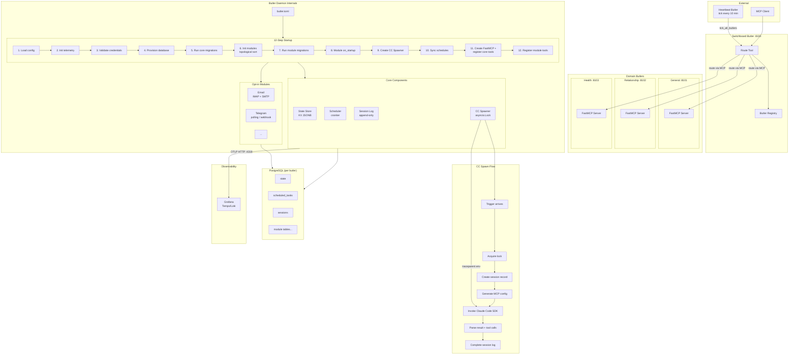

# Butlers

A personal AI agent framework where each **butler** is a long-running MCP server daemon that you interact with day-to-day. Butlers handle recurring tasks, manage integrations, and act on your behalf — powered by Claude Code under the hood.

## WARNING

This application is entirely vibe coded, borne out of my desire to experiment with the capabilities of Claude Code/Codex, combined with Steve Yegge's [beads](https://github.com/steveyegge/beads). This project is pretty far from being considered 'ready for usage' - play with it at your own risk!

## Motivation

I've always wanted to build a 'Jarvis' for myself - a system where I could offload the majority of 'mental toil' tasks while retaining the benefits of having kept them in mind. This has come closer and closer to true feasibility as LLMs have become more and more advanced; this project represents the first of my efforts to materialize the use cases and UX of a personal butler-like microservice.

## How It Works

Each butler runs as a persistent daemon with built-in infrastructure:

- **State store** — remembers things between sessions (key-value JSONB)
- **Task scheduler** — runs prompts on cron schedules (e.g., morning briefings, inbox triage)
- **Claude Code spawner** — spins up ephemeral Claude Code instances to reason and act
- **Session log** — tracks what happened and when

On top of that, butlers gain capabilities through **modules** — pluggable integrations like email, Telegram, calendar, Slack, and GitHub. Mix and match modules to build the butler you need.

## Example

A personal assistant butler configured in `butler.toml`:

```toml
[butler]
name = "assistant"
description = "Personal assistant with email and calendar"
port = 8101

[[butler.schedule]]
name = "morning-briefing"
cron = "0 8 * * *"
prompt = "Check my calendar for today, summarize meetings, and email me a briefing."

[[butler.schedule]]
name = "inbox-triage"
cron = "*/30 * * * *"
prompt = "Check for new emails. Flag anything urgent and draft replies for routine items."

[modules.email]
provider = "gmail"
address = "me@example.com"

[modules.calendar]
provider = "google"
calendar_id = "primary"
```

## Architecture

### System Overview

```
External Clients (MCP-compatible)
        │
        ▼
  Switchboard Butler ──── routes requests to the right butler
        │
   ┌────┼────┐
   ▼    ▼    ▼
Butler Butler Butler ──── each a persistent MCP server daemon
   │    │    │
   ▼    ▼    ▼
Claude Code instances ── ephemeral, locked-down, reason + act
```

- Each butler owns a **dedicated PostgreSQL database** (strict isolation)
- Butlers communicate only via MCP tools through the Switchboard
- A **Heartbeat Butler** calls `tick()` on every butler every 10 minutes, triggering scheduled tasks
- Butler configs are **git-based directories** with personality (`CLAUDE.md`), skills, and config (`butler.toml`)

### Detailed Architecture



### Trigger Sources

| Source            | How it fires                                     | `trigger_source` value |
| ----------------- | ------------------------------------------------ | ---------------------- |
| External MCP call | Client calls `trigger(prompt)` tool              | `trigger_tool`         |
| Scheduler         | Cron expression fires, dispatched by `tick()`    | `schedule`             |
| Heartbeat         | Heartbeat butler calls `tick_now()` every 10 min | `tick`                 |

### Module System

Modules implement the `Module` ABC and plug into the daemon lifecycle:

```
Module ABC
├── name              → unique identifier
├── config_schema     → Pydantic model for [modules.<name>] config
├── dependencies      → list of required module names (topological sort)
├── credentials_env   → env vars this module needs
├── register_tools()  → add MCP tools to the FastMCP server
├── migration_revisions() → Alembic branch label for DB tables
├── on_startup()      → post-migration initialization
└── on_shutdown()     → cleanup (reverse topological order)
```

## Getting Started

### Development

Start infrastructure in Docker, run butlers locally:

```bash
# Install dependencies
uv sync --dev

# Start PostgreSQL
docker compose up -d postgres

# Set your API key
export ANTHROPIC_API_KEY="sk-ant-..."

# Start all butlers
butlers up

# Or start a specific butler
butlers up --only switchboard --only general

# List discovered butlers
butlers list
```

Access points:
- Butler MCP servers on their configured ports (8100-8199)
- Dashboard API on port 8200
- Grafana Tempo for distributed tracing (external Alloy endpoint)

### Dashboard (Frontend)

The web dashboard provides real-time monitoring and management of all butlers. It requires the Dashboard API backend.

```bash
# 1. Start the Dashboard API (requires PostgreSQL)
uv run butlers dashboard --port 8200

# 2. Start the frontend dev server (in another terminal)
cd frontend && npm install && npm run dev
```

The dashboard will be available at `http://localhost:5173`.

Alternatively, use Docker Compose with the `dev` profile to run everything together:

```bash
docker compose --profile dev up
```

This starts PostgreSQL, the Dashboard API (port 8200), and the Vite dev server (port 5173).

### Production

All services run in Docker:

```bash
# Configure environment
cp .env.example .env
# Edit .env — set ANTHROPIC_API_KEY at minimum

# Start everything
docker compose up -d
```

The Dockerfile builds an image with Python 3.12, Node.js 22, the `claude-code` CLI, and `uv`. The entrypoint is:

```
uv run butlers run --config /app/butler-config/butler.toml
```

Each butler service mounts its config directory read-only from `butlers/<name>/`.

### Service Ports

| Service       | Port | Description                                            |
| ------------- | ---- | ------------------------------------------------------ |
| Switchboard   | 8100 | Message router — routes MCP requests to domain butlers |
| General       | 8101 | Catch-all assistant with collections/entities          |
| Relationship  | 8102 | Contacts, interactions, gifts, activity feed           |
| Health        | 8103 | Measurements, medications, conditions, symptoms        |
| Heartbeat     | 8199 | System monitor — ticks all butlers every 10 min        |
| Dashboard API | 8200 | Web UI backend for monitoring and managing butlers     |
| Frontend      | 5173 | Vite dev server (development only)                     |
| PostgreSQL    | 5432 | Shared database server (one DB per butler)             |

**Note:** OTLP HTTP traces (port 4318) are sent to an external Alloy instance (not exposed locally).

### CLI Reference

```
butlers up [--only NAME ...] [--dir PATH]    Start all (or filtered) butler daemons
butlers run --config PATH                    Start a single butler from config dir
butlers list [--dir PATH]                    List discovered butler configurations
butlers init NAME --port PORT [--dir PATH]   Scaffold a new butler config directory
```

### Scaffolding a New Butler

```bash
butlers init mybutler --port 8104
```

Creates:
```
butlers/mybutler/
├── butler.toml    # Identity, port, schedules, modules
├── CLAUDE.md      # System prompt / personality
├── AGENTS.md      # Runtime agent notes
└── skills/        # Skill definitions (future)
```

## Environment Variables

### Global Variables

These apply to all butler instances:

| Variable                      | Required | Default     | Description                                                                                              |
| ----------------------------- | -------- | ----------- | -------------------------------------------------------------------------------------------------------- |
| `ANTHROPIC_API_KEY`           | Yes      | —           | API key for Claude Code SDK. Checked at startup for every butler.                                        |
| `POSTGRES_HOST`               | No       | `localhost` | PostgreSQL server hostname                                                                               |
| `POSTGRES_PORT`               | No       | `5432`      | PostgreSQL server port                                                                                   |
| `POSTGRES_USER`               | No       | `postgres`  | PostgreSQL username                                                                                      |
| `POSTGRES_PASSWORD`           | No       | `postgres`  | PostgreSQL password                                                                                      |
| `OTEL_EXPORTER_OTLP_ENDPOINT` | No       | —           | OTLP HTTP endpoint for trace export (e.g., `http://alloy:4318/v1/traces`). When unset, tracing is no-op. |

### Butler-Specific Variables

Each butler can declare custom env vars in `butler.toml`:

```toml
[butler.env]
required = ["MY_CUSTOM_SECRET"]     # Startup fails if missing
optional = ["MY_OPTIONAL_CONFIG"]   # Warns if missing, continues
```

These are validated at startup by the credential checker and passed through to spawned Claude Code instances.

### Module Variables

Each module declares its own required credentials via `credentials_env`. These are validated at startup alongside global and butler-specific vars.

| Module     | Variable                | Description                                |
| ---------- | ----------------------- | ------------------------------------------ |
| `email`    | `SOURCE_EMAIL`          | Email address for IMAP/SMTP authentication |
| `email`    | `SOURCE_EMAIL_PASSWORD` | Email password or app-specific password    |
| `telegram` | `BUTLER_TELEGRAM_TOKEN` | Telegram Bot API token from @BotFather     |

Module credentials are only required when the module is enabled in `butler.toml`. They are scoped to the CC spawner — only declared credentials are forwarded to ephemeral Claude Code instances.

## Development

```bash
uv sync --dev       # Install dependencies
make check           # Lint + test
make test            # Run tests
make test-qg         # Quality-gate pytest scope (default parallel, -n auto)
make test-qg-serial  # Quality-gate pytest scope (serial fallback/debug)
make test-qg-parallel # Alias for explicit parallel quality-gate runs
make lint            # Lint
make format          # Format
```

### Marker-Based Test Runs

Tests are split by cost profile using pytest markers:

- `unit`: fast tests with no Docker/testcontainers dependency
- `integration`: Docker-backed tests (testcontainers/PostgreSQL)

```bash
uv run pytest -m unit -q          # unit-only
uv run pytest -m integration -q   # integration-only

# Or use Makefile shortcuts:
make test-unit
make test-integration
```

Recommended quality gates:

- Local dev loop: run `-m unit` for fast feedback.
- Default full quality-gate run: `make test-qg` (parallel, fastest full-scope path).
- Serial fallback/debug path: `make test-qg-serial` (use for order-dependent triage).
- CI or pre-merge (Docker available): run both `-m unit` and `-m integration`.

Quality-gate default rationale and scope contract:

- Benchmark outcome: `make test-qg` (`-n auto`) measured `126.42s` wall time vs `216.58s` serial baseline (~41.6% faster). See `docs/PYTEST_QG_ALTERNATIVES_QKX5.md`.
- Coverage expectation is unchanged: `make test-qg`, `make test-qg-serial`, and `make test-qg-parallel` all run the same `QG_PYTEST_ARGS` test selection (`tests/` excluding `tests/test_db.py` and `tests/test_migrations.py`). Only execution mode changes.

Docker flake triage under parallel quality gates:

- Startup-timeout class: `Error while fetching server API version ... Read timed out` occurs during `docker.from_env(version=\"auto\")` before container launch. Mitigation is bounded startup retry and/or reducing host contention.
- Teardown-race class: `did not receive an exit event` occurs during container removal and is handled by bounded teardown retry.
- Use `make test-qg-serial` as a diagnostic fallback when host contention is high and startup-timeout failures persist.

## Tech Stack

Python 3.12+ · FastMCP · Claude Code SDK · PostgreSQL · asyncpg · Docker · asyncio · OpenTelemetry · Alembic · Click · Pydantic

## Status

Early development. See `PROJECT_PLAN.md` for the full implementation roadmap.
