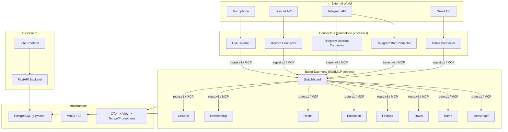

# Component Inventory

Every runtime piece in Butlers, what it owns, and its current stability.

---

## High-Level View

---

## 1. Core Daemon (`src/butlers/daemon.py`)

The ButlerDaemon is the process-level orchestrator for a single butler. Every
butler in the roster runs one daemon instance.

| Sub-component | Source | Responsibility | Stability |
|---|---|---|---|
| **Spawner** | `core/spawner.py` | Generates ephemeral MCP configs, invokes LLM CLI via runtime adapter, enforces per-butler and global concurrency caps, logs sessions. | Stable |
| **Scheduler** | `core/scheduler.py` | Cron-driven task dispatch. Syncs TOML schedule definitions to DB on startup. Internal asyncio tick loop fires due tasks. | Stable |
| **State Store** | `core/state.py` | Key-value JSONB store. Arbitrary per-butler state accessible via MCP tools. | Stable |
| **Session Log** | `core/sessions.py` | Append-only record of every LLM CLI invocation: trigger source, duration, token counts, cost, tool calls. | Stable |
| **Route Inbox** | `core/route_inbox.py` | Durable work queue for async route dispatch. Persists `route.execute` payloads before returning `accepted`. Background task processes; crash recovery re-dispatches stuck rows. | Stable |
| **Model Routing** | `core/model_routing.py` | Catalog-based dynamic model selection with per-butler overrides. Complexity tiers (trivial through discretion) map to model/runtime pairs. Token quota enforcement. | Maturing |
| **Runtime Adapters** | `core/runtimes/` | Pluggable adapters for Claude Code, Codex, Gemini, and OpenCode. Each adapter knows how to build CLI arguments, parse output, and extract cost data. | Maturing |
| **Self-Healing** | `core/healing/` | Crash fingerprinting, anonymized error tracking, automated dispatch of healing sessions using a dedicated complexity tier. | Evolving |
| **Buffer** | `core/buffer.py` | In-memory queue with durable cold-path scanner for backpressure management. Switchboard ingestion hot path. | Stable |
| **Telemetry** | `core/telemetry.py` | OpenTelemetry tracing initialization. Single TracerProvider shared across all butlers in-process. TRACEPARENT propagation to spawned LLM sessions. | Stable |
| **Metrics** | `core/metrics.py` | OTel metric instruments for spawner concurrency, buffer health, route accept/process latency, scheduler dispatch, and ingest outcomes. | Maturing |
| **Skills** | `core/skills.py` | Discovers skill directories under `roster/{butler}/.agents/skills/`, reads system prompts, and injects them into spawned sessions. | Stable |
| **Audit** | `core/audit.py` | Append-only audit trail for security-relevant operations (tool gating, credential access). | Evolving |

### What the daemon owns

- Its FastMCP SSE/HTTP server on the configured port
- Its asyncpg connection pool scoped to its database schema
- Its scheduler loop and liveness reporter
- MCP client connection to the Switchboard (non-switchboard butlers)
- Module lifecycle (startup in topological order, shutdown in reverse)

---

## 2. Modules (`src/butlers/modules/`)

Modules are opt-in capability units. Each implements the `Module` ABC from
`modules/base.py` and adds domain-specific MCP tools without touching core
infrastructure. Dependencies between modules are resolved via topological sort
at startup.

| Module | Source | Responsibility | Stability |
|---|---|---|---|
| **Email** | `modules/email.py` | IMAP/SMTP tools: send, search, read mail. | Stable |
| **Telegram** | `modules/telegram.py` | Telegram messaging tools: send messages, reply, react. | Stable |
| **Calendar** | `modules/calendar.py` | Google Calendar CRUD: list, create, update, delete events. Conflict detection. | Stable |
| **Memory** | `modules/memory/` | Tiered memory subsystem (Eden -> Mid-Term -> Long-Term). Vector search via pgvector. Consolidation jobs. Episode lifecycle management. | Maturing |
| **Contacts** | `modules/contacts/` | Contact management with Google Contacts sync. Links to shared identity tables. | Maturing |
| **Pipeline** | `modules/pipeline.py` | Message classification and routing pipeline. Connects input modules to Switchboard classify/route. Ingress deduplication. Conversation history loading. | Stable |
| **Approvals** | `modules/approvals/` | Human approval gates for sensitive tool calls. Risk tiering, expiry, rule-based policy. | Maturing |
| **Mailbox** | `modules/mailbox/` | Internal mailbox for inter-butler structured messages. | Evolving |
| **Metrics** | `modules/metrics/` | Per-butler metrics timeseries storage and query. | Evolving |
| **Self-Healing** | `modules/self_healing/` | Module-level crash recovery and session retry. | Evolving |
| **Registry** | `modules/registry.py` | Module discovery and registration. Scans both `src/butlers/modules/` and `roster/*/modules/` for concrete Module subclasses. Topological sort for dependency order. | Stable |

### Roster-specific modules

Butlers in the roster can define their own modules under `roster/{butler}/modules/`.
These are discovered at startup by the registry via synthetic module names
(`butlers.modules._roster_{butler}`).

---

## 3. Connectors (`src/butlers/connectors/`)

Connectors are standalone processes that bridge external event sources to the
Switchboard. They are transport-only adapters: they normalize events to the
`ingest.v1` envelope format and submit via MCP. They do not classify or route.

| Connector | Source | External Source | Health Port | Stability |
|---|---|---|---|---|
| **Gmail** | `connectors/gmail.py` | Gmail API (watch/history delta + optional Pub/Sub push) | 40082 | Stable |
| **Telegram Bot** | `connectors/telegram_bot.py` | Telegram Bot API (polling or webhook) | 40081 | Stable |
| **Telegram Userbot** | `connectors/telegram_user_client.py` | Telegram user account (Telethon) | -- | Evolving |
| **Discord** | `connectors/discord_user.py` | Discord Gateway WebSocket | 40084 | Draft |
| **Live Listener** | `connectors/live_listener/` | Microphone audio -> VAD -> transcription -> ingest | 40091 | Evolving |

### Shared connector infrastructure

| Component | Source | Responsibility |
|---|---|---|
| **CachedMCPClient** | `connectors/mcp_client.py` | Reusable MCP client with lazy connect, health-check, and retry. All connectors use this to reach the Switchboard. |
| **Heartbeat** | `connectors/heartbeat.py` | Background task reporting liveness and operational stats to the Switchboard connector registry. Stable instance_id, configurable interval. |
| **ConnectorMetrics** | `connectors/metrics.py` | Prometheus counters/histograms for connector-level observability. |
| **CursorStore** | `connectors/cursor_store.py` | Durable checkpoint persistence for restart-safe resume. |
| **Discretion** | `connectors/discretion.py` | LLM-based filter evaluating messages in sliding context window. Fail-open. Owner messages bypass. |
| **DiscretionDispatcher** | `connectors/discretion_dispatcher.py` | Dispatches discretion calls to the configured LLM backend. |
| **FilteredEventBuffer** | `connectors/filtered_event_buffer.py` | Buffering layer between connector poll loop and MCP submission. |
| **GmailPolicy** | `connectors/gmail_policy.py` | Gmail-specific ingestion policy (label filtering, sender rules). |
| **HealthSocket** | `connectors/health_socket.py` | HTTP health/readiness endpoint shared by all connectors. |

---

## 4. Switchboard (`roster/switchboard/`)

The Switchboard is a special butler that serves as the central ingress router.
It runs as a standard ButlerDaemon with additional Switchboard-specific tools.

| Sub-component | Source | Responsibility | Stability |
|---|---|---|---|
| **Ingestion API** | `tools/ingestion/ingest.py` | Accepts `ingest.v1` envelopes from connectors. Entry point for all external events. | Stable |
| **Triage / Thread Affinity** | `tools/triage/thread_affinity.py` | Assigns incoming messages to existing conversation threads or creates new ones. | Maturing |
| **Classifier** | `tools/routing/classify.py` | LLM-based message classification. Determines target butler using capability matching, intent detection, and regex heuristics. | Maturing |
| **Router** | `tools/routing/route.py` | Dispatches classified messages to target butler via MCP `route.execute` call. | Stable |
| **Contracts** | `tools/routing/contracts.py` | Pydantic models for `ingest.v1` and `route.v1` envelope schemas. Defines source channels, providers, notify channels, and policy tiers. | Stable |
| **Butler Registry** | `tools/registry/` | Tracks which butlers are online, their capabilities, and liveness state. Eligibility sweep job. | Maturing |
| **Connector Registry** | `tools/connector/` | Tracks connector instances, heartbeats, and health state. | Maturing |
| **Identity Resolution** | `tools/identity/` | Maps channel identifiers to known contacts before routing. | Stable |
| **Notification** | `tools/notification/` | Outbound message delivery (Telegram, email) via `notify()` tool. | Stable |
| **Dead Letter** | `tools/dead_letter/` | Captures unroutable or failed messages for later inspection. | Evolving |
| **Extraction** | `tools/extraction/` | Structured data extraction from ingested content. | Evolving |
| **Backfill** | `tools/backfill/` | Historical message ingestion replay. | Evolving |
| **Operator** | `tools/operator/` | Administrative tools for Switchboard management. | Evolving |

---

## 5. Dashboard

The Dashboard provides a web UI for monitoring and managing the butler fleet.

| Component | Source | Port | Stability |
|---|---|---|---|
| **FastAPI Backend** | `src/butlers/api/` | 41200 | Maturing |
| **Vite Frontend** | `frontend/` | 41173 (dev) | Maturing |

### Backend routers (`src/butlers/api/routers/`)

The backend exposes REST endpoints organized by domain: butlers, sessions,
schedules, memory, approvals, costs, healing, ingestion events, model settings,
modules, notifications, OAuth, provider settings, search, secrets, SSE (live
updates), state, and timeline.

### Auto-discovered butler routes

Each butler can define custom API routes in `roster/{butler}/api/router.py`.
These are auto-discovered at startup by `router_discovery.py` and mounted under
`/api/{butler}/`. Each must export a module-level `router` (APIRouter instance).

---

## 6. Identity Subsystem

Cross-butler identity resolution lives in the `public` PostgreSQL schema.

| Table | Responsibility |
|---|---|
| `public.entities` | Canonical entity registry. Each row represents a known person/actor with a `roles` array. |
| `public.contacts` | Contact records linked to entities. |
| `public.contact_info` | Per-channel identifiers (telegram_chat_id, email address, etc.). UNIQUE on `(type, value)`. |
| `public.model_catalog` | Global model catalog for dynamic model routing. |
| `public.butler_model_overrides` | Per-butler model selection overrides. |

Resolution flow: channel identifier -> `contact_info` -> `contacts` -> `entities` -> roles.

Source: `src/butlers/identity.py` (reverse-lookup utility used by Switchboard
ingestion, notify, and approval gates).

Stability: **Stable**.

---

## 7. Credential Management

| Component | Source | Responsibility | Stability |
|---|---|---|---|
| **CredentialStore** | `credential_store.py` | DB-first secret resolution (`butler_secrets` table) with env-var fallback. Dashboard secrets UI writes here. | Stable |
| **Credential Validation** | `credentials.py` | Startup-time validation of required secrets per module. | Stable |
| **Google OAuth** | `google_credentials.py`, `google_account_registry.py` | OAuth token management for Gmail and Calendar APIs. | Stable |
| **Startup Guard** | `startup_guard.py` | Pre-flight check for Google credentials before launching dependent components. | Stable |

---

## 8. Observability Stack

| Component | Role | Stability |
|---|---|---|
| **OpenTelemetry SDK** | In-process tracing and metrics instrumentation. | Stable |
| **Grafana Alloy** | OTLP receiver and pipeline (replaces standalone collector). | Stable (external) |
| **Tempo** | Distributed trace storage and query backend. | Stable (external) |
| **Prometheus** | Metrics scrape target for connector-level and butler-level metrics. | Stable (external) |

Trace context propagation: the Spawner injects `TRACEPARENT` into the environment
of spawned LLM CLI processes, creating a connected trace from ingestion through
classification, routing, and session execution.
