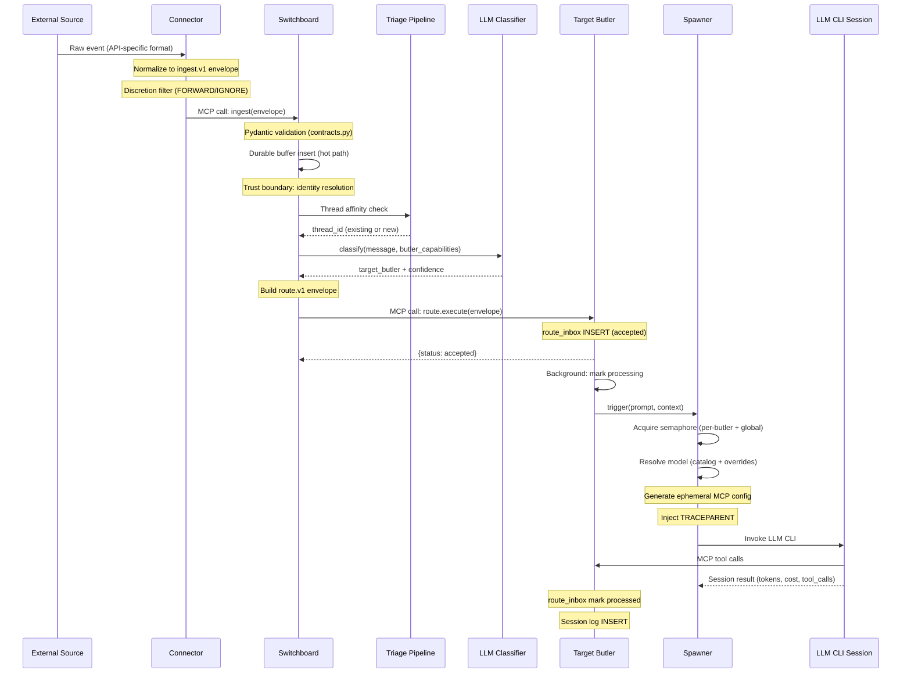
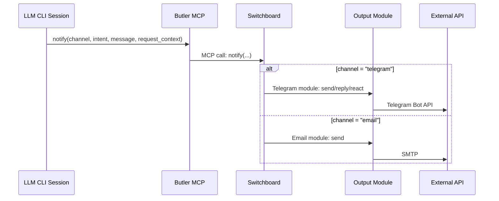
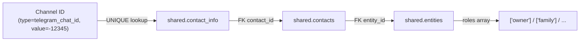
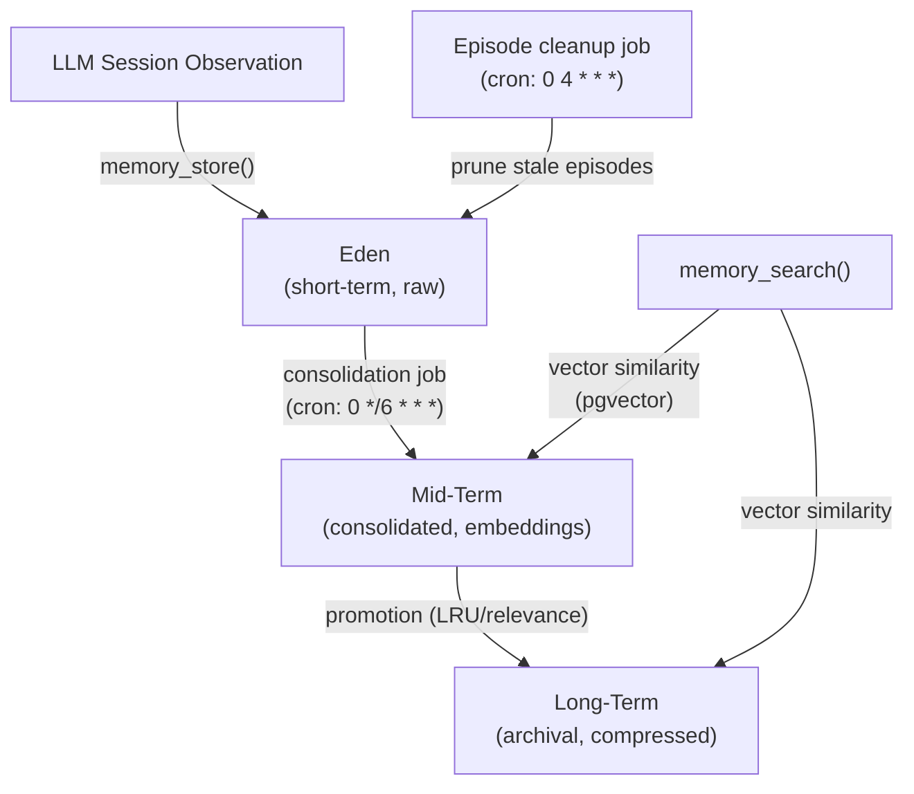
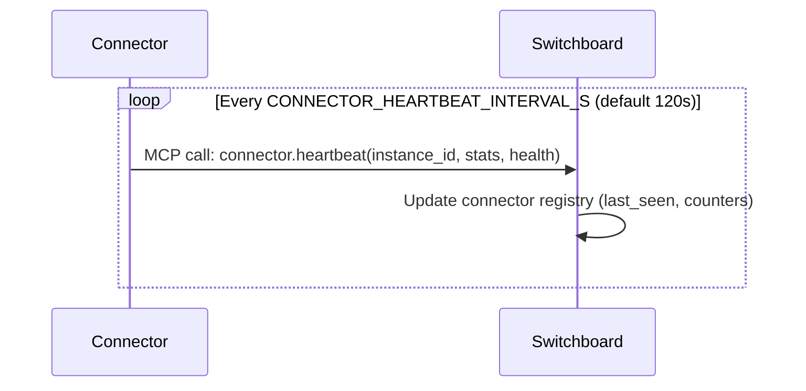
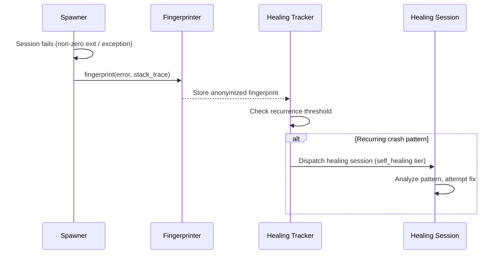

# Data Flow

Primary data paths through the Butlers system, with trust boundaries and
validation points marked.

---

## 1. Ingestion Flow (External Event to Butler Session)

This is the primary path for all externally-originated messages.



### Validation and trust boundaries

1. **Connector -> Switchboard**: The `ingest.v1` Pydantic model validates
   schema version, source channel, source provider, sender identity, and
   timestamp format. Invalid envelopes are rejected.

2. **Switchboard identity resolution**: Before routing, the Switchboard
   resolves the sender's channel identifier (e.g., telegram_chat_id) against
   `shared.contact_info` to inject identity context (contact_id, roles,
   entity_id). Owner messages get elevated trust.

3. **Switchboard -> Target Butler**: The `route.v1` envelope is validated by
   Pydantic models. The target butler checks `trusted_route_callers` to ensure
   only the Switchboard can submit routes.

4. **LLM session boundary**: The spawned LLM CLI receives a locked-down MCP
   config pointing exclusively at its own butler's MCP server. It cannot reach
   other butlers or infrastructure directly.

---

## 2. Scheduled Task Flow

Butlers execute scheduled tasks independently of external events.

```mermaid
sequenceDiagram
    participant Loop as Scheduler Loop
    participant DB as Schedule DB
    participant Spawner as Spawner
    participant CLI as LLM CLI Session
    participant Butler as Butler MCP

    Loop->>DB: tick(): query due tasks
    DB-->>Loop: Due task list (cron match)

    alt dispatch_mode = "prompt"
        Loop->>Spawner: trigger(prompt=task.prompt)
        Spawner->>CLI: Invoke LLM CLI
        CLI->>Butler: MCP tool calls
        CLI-->>Spawner: Session result
    else dispatch_mode = "job"
        Loop->>Loop: Execute job function directly
    end

    Note over Loop: Sleep tick_interval_seconds
    Note over Loop: Repeat
```

The scheduler loop runs as an asyncio task within each butler daemon. The
default tick interval is 60 seconds. Schedule definitions in `butler.toml` are
synced to the database on startup.

Job-mode tasks (`dispatch_mode = "job"`) execute Python functions directly
without spawning an LLM session. Examples: `memory_consolidation`,
`memory_episode_cleanup`, `eligibility_sweep`.

---

## 3. Response Flow (Outbound Delivery)

When an LLM session needs to communicate with the user, it calls the `notify()`
MCP tool.



### Notify intents

| Intent | Behavior |
|---|---|
| `send` | Proactive outbound message (scheduled tasks, no request_context needed) |
| `reply` | Contextual response to an ingested message (requires request_context) |
| `react` | Emoji reaction on the source message (Telegram only, requires request_context) |

---

## 4. Identity Resolution Flow

Maps a raw channel identifier to a known contact with roles.



This flow is invoked:
- **Switchboard ingestion**: Before routing, to inject sender identity preambles.
- **notify()**: To resolve outbound recipients from contact_id.
- **Approval gates**: To determine whether the caller has sufficient role for
  auto-approval.

Source: `src/butlers/identity.py::resolve_contact_by_channel()`

---

## 5. Memory Flow

The tiered memory subsystem manages observations from sessions.



Memory is per-butler. Each butler that enables the memory module gets its own
Eden, Mid-Term, and Long-Term stores within its database schema. Vector search
uses pgvector extensions.

Source: `src/butlers/modules/memory/`

---

## 6. Connector Heartbeat Flow

Connectors report liveness to the Switchboard for fleet visibility.



The Switchboard runs an `eligibility_sweep` job every 5 minutes to mark
connectors as stale when their last heartbeat exceeds the TTL.

---

## 7. Self-Healing Flow

When an LLM session crashes, the healing subsystem captures and diagnoses.



Source: `src/butlers/core/healing/`

---

## Data Path Summary

| Flow | Entry Point | Exit Point | Protocol | Durable? |
|---|---|---|---|---|
| Ingestion | Connector poll/webhook | route_inbox INSERT | ingest.v1 -> route.v1 (MCP) | Yes (durable buffer + route_inbox) |
| Scheduled | Scheduler tick | Session log INSERT | Internal (asyncio) | Yes (schedule DB) |
| Response | LLM session notify() | External API call | MCP -> module-specific | No (fire-and-forget) |
| Identity | Channel identifier | Resolved contact | SQL (shared schema) | N/A (read-only) |
| Memory | Session observation | Tiered storage | SQL + pgvector | Yes |
| Heartbeat | Connector loop | Registry update | MCP | No (ephemeral liveness) |
