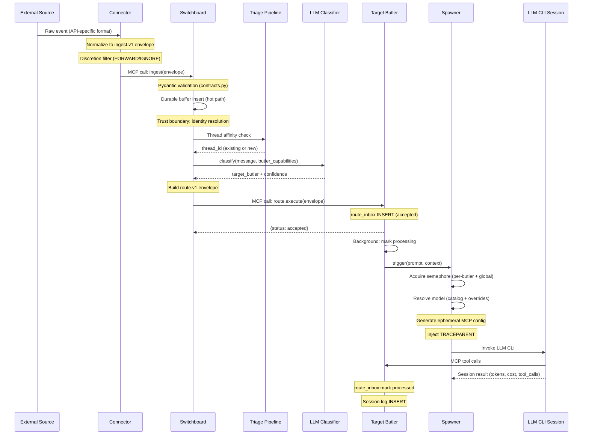
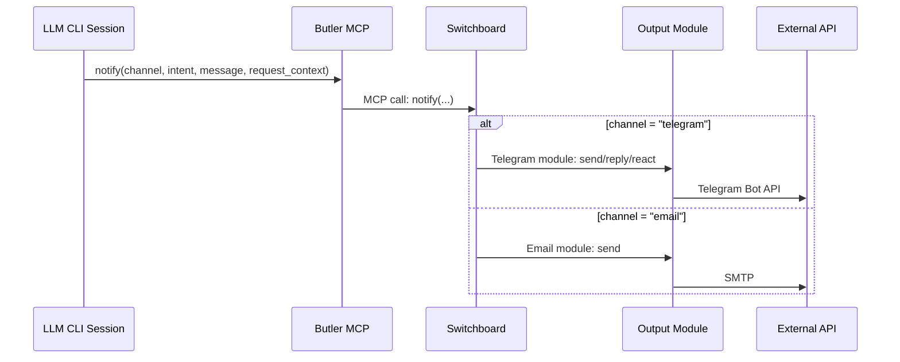
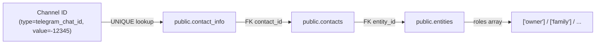
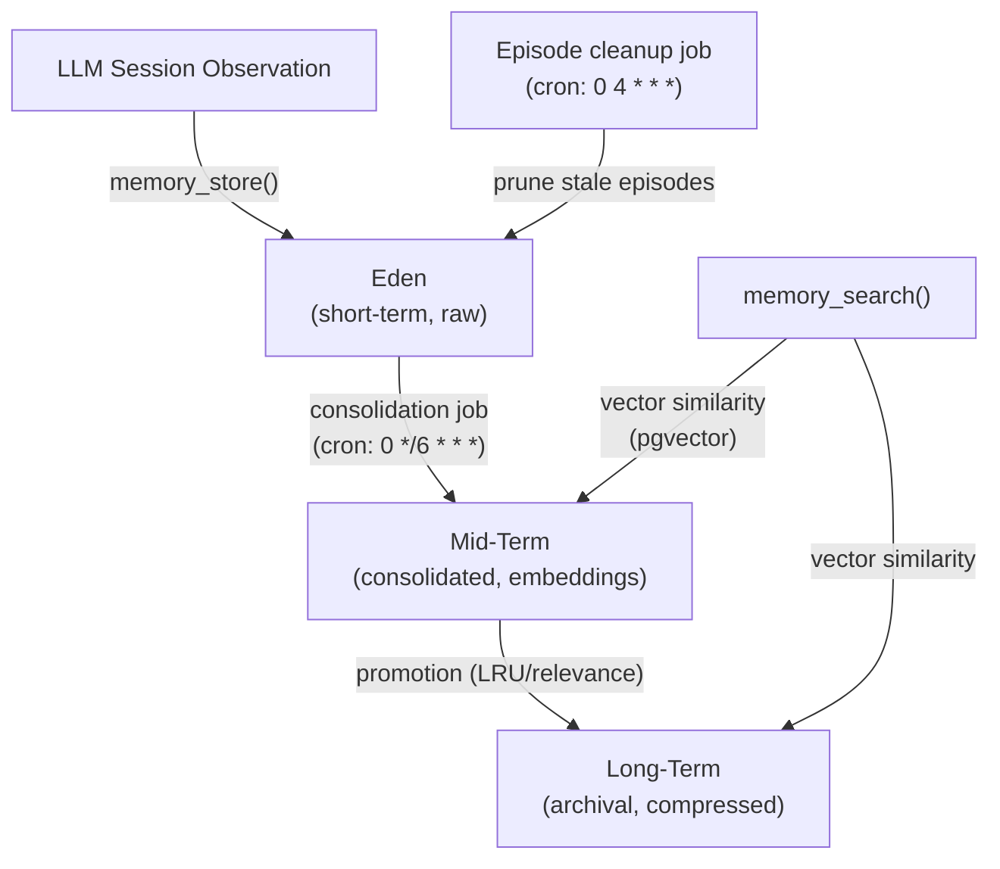
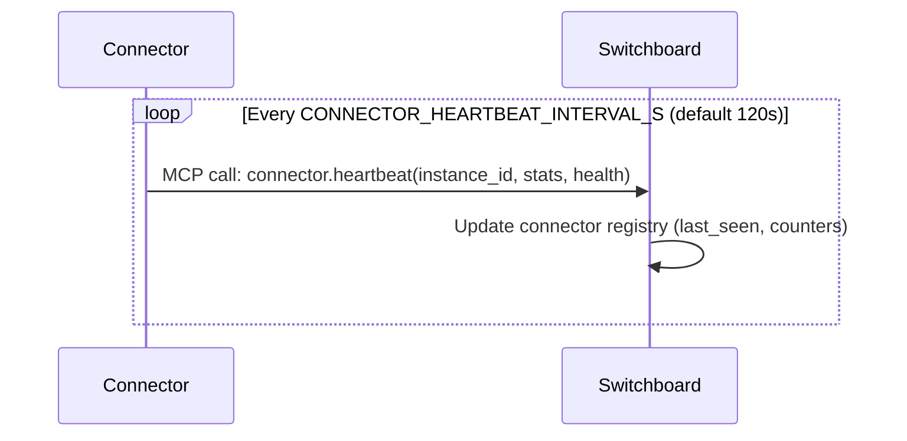
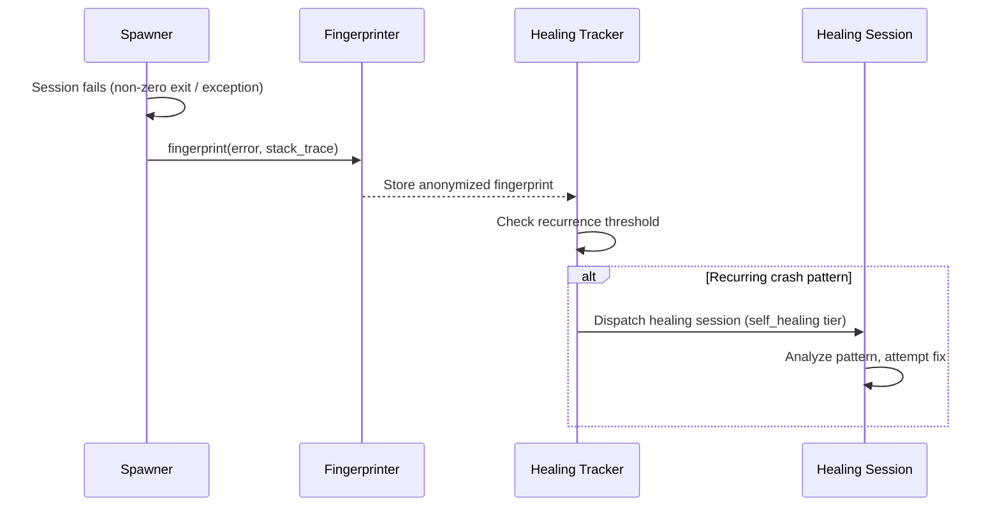
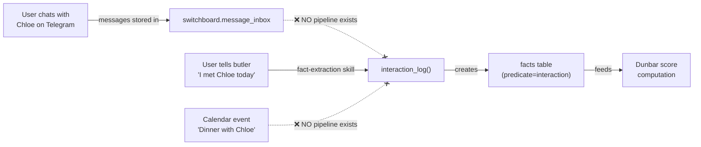

# Data Flow

Primary data paths through the Butlers system, with trust boundaries and
validation points marked.

---

## 1. Ingestion Flow (External Event to Butler Session)

This is the primary path for all externally-originated messages.



### Validation and trust boundaries

1. **Connector -> Switchboard**: The `ingest.v1` Pydantic model validates
   schema version, source channel, source provider, sender identity, and
   timestamp format. Invalid envelopes are rejected.

2. **Switchboard identity resolution**: Before routing, the Switchboard
   resolves the sender's channel identifier (e.g., telegram_chat_id) against
   `public.contact_info` to inject identity context (contact_id, roles,
   entity_id). Owner messages get elevated trust.

3. **Switchboard -> Target Butler**: The `route.v1` envelope is validated by
   Pydantic models. The target butler checks `trusted_route_callers` to ensure
   only the Switchboard can submit routes.

4. **LLM session boundary**: The spawned LLM CLI receives a locked-down MCP
   config pointing exclusively at its own butler's MCP server. It cannot reach
   other butlers or infrastructure directly.

---

## 2. Scheduled Task Flow

Butlers execute scheduled tasks independently of external events.

```mermaid
sequenceDiagram
    participant Loop as Scheduler Loop
    participant DB as Schedule DB
    participant Spawner as Spawner
    participant CLI as LLM CLI Session
    participant Butler as Butler MCP

    Loop->>DB: tick(): query due tasks
    DB-->>Loop: Due task list (cron match)

    alt dispatch_mode = "prompt"
        Loop->>Spawner: trigger(prompt=task.prompt)
        Spawner->>CLI: Invoke LLM CLI
        CLI->>Butler: MCP tool calls
        CLI-->>Spawner: Session result
    else dispatch_mode = "job"
        Loop->>Loop: Execute job function directly
    end

    Note over Loop: Sleep tick_interval_seconds
    Note over Loop: Repeat
```

The scheduler loop runs as an asyncio task within each butler daemon. The
default tick interval is 60 seconds. Schedule definitions in `butler.toml` are
synced to the database on startup.

Job-mode tasks (`dispatch_mode = "job"`) execute Python functions directly
without spawning an LLM session. Examples: `memory_consolidation`,
`memory_episode_cleanup`, `eligibility_sweep`.

---

## 3. Response Flow (Outbound Delivery)

When an LLM session needs to communicate with the user, it calls the `notify()`
MCP tool.



### Notify intents

| Intent | Behavior |
|---|---|
| `send` | Proactive outbound message (scheduled tasks, no request_context needed) |
| `reply` | Contextual response to an ingested message (requires request_context) |
| `react` | Emoji reaction on the source message (Telegram only, requires request_context) |

---

## 4. Identity Resolution Flow

Maps a raw channel identifier to a known contact with roles.



This flow is invoked:
- **Switchboard ingestion**: Before routing, to inject sender identity preambles.
- **notify()**: To resolve outbound recipients from contact_id.
- **Approval gates**: To determine whether the caller has sufficient role for
  auto-approval.

Source: `src/butlers/identity.py::resolve_contact_by_channel()`

---

## 5. Memory Flow

The tiered memory subsystem manages observations from sessions.



Memory is per-butler. Each butler that enables the memory module gets its own
Eden, Mid-Term, and Long-Term stores within its database schema. Vector search
uses pgvector extensions.

Source: `src/butlers/modules/memory/`

---

## 6. Connector Heartbeat Flow

Connectors report liveness to the Switchboard for fleet visibility.



The Switchboard runs an `eligibility_sweep` job every 5 minutes to mark
connectors as stale when their last heartbeat exceeds the TTL.

---

## 7. Self-Healing Flow

When an LLM session crashes, the healing subsystem captures and diagnoses.



Source: `src/butlers/core/healing/`

---

## 8. Relationship Interaction Flow (Dunbar Tier Computation)

The relationship butler computes Dunbar social tiers (5/15/50/150/500/1500)
dynamically from interaction facts using exponential decay scoring. Tiers are
**not** manually assigned — they emerge from communication frequency.

### Scoring engine

```
score(contact) = Σ exp(-λ × days_since_interaction_i)
λ = ln(2) / 30   (30-day half-life)
```

Contacts are ranked by score. Top 5 → tier 5, ranks 6-15 → tier 15, etc.
Contacts with score = 0.0 are hard-assigned to tier 1500. Downward hysteresis
prevents thrashing near tier boundaries.

Source: `roster/relationship/tools/dunbar.py`

### Interaction facts

The scoring engine queries only facts matching:
- `subject = 'contact:{contact_uuid}'`
- `predicate = 'interaction'`
- `scope = 'relationship'`
- `validity = 'active'`

These facts are created by `interaction_log()` in
`roster/relationship/tools/interactions.py`, which deduplicates by
(contact_id, type, date) when `occurred_at` is explicitly provided.

### Current gap: no passive interaction detection



**Today, interactions are only logged when the user explicitly narrates them**
via the fact-extraction pipeline ("I had coffee with Chloe"). Passive
communication (Telegram messages, WhatsApp chats, emails) and calendar events
(dinners with friends) are NOT detected.

This means a contact like a user's partner can have zero interaction facts
despite constant daily communication, leaving them stranded at tier 1500.

### Planned: passive interaction sync job

A background job (`interaction_sync`) owned by the relationship butler will:

1. **Scan `switchboard.message_inbox`** for recent messages on user-to-person
   channels (`telegram_user_client`, `whatsapp_user_client`, `email`)
2. **Scan `calendar_events`** for past social events with attendees
3. **Resolve identifiers → contact_id** via `public.contact_info` reverse-lookup
   (email, telegram_user_id, phone number)
4. **Call `interaction_log()`** with `occurred_at` set (enabling date-based dedup)
   to create the facts that feed Dunbar scoring

This closes the loop between communication data already in the system and the
relationship butler's tier computation.

---

## 6. Runtime Config Flow (Dashboard to Spawner)

Operational tuning (core_groups, concurrency) follows a seed-and-manage
pattern. The toml is the seed source; the DB table is the runtime source of
truth; the dashboard is the mutation interface. Model identity, runtime type,
per-session timeouts, and CLI args are owned by `public.model_catalog`
(resolved per spawn) — not by `runtime_config`.

```
butler.toml [butler.runtime_seed]
    |
    | seed_if_empty() on first boot
    v
{schema}.runtime_config (DB table)
    |
    |--- GET/PATCH /api/butlers/{name}/runtime-config (dashboard)
    |
    v
RuntimeConfigAccessor (TTL=30s cache)
    |
    +---> _register_core_tools (startup): core_groups                          [COLD]
    +---> Spawner constructor: max_concurrent, max_queued                      [COLD]

public.model_catalog (resolved per spawn via resolve_model)
    |
    +---> Spawner.trigger(): runtime_type, model, extra_args, session_timeout  [HOT]
```

**Write path:** Dashboard PATCH -> DB UPDATE -> accessor cache expires (30s) ->
next trigger reads updated values.

**Read path:** Spawner.trigger() -> accessor.get() -> cached or DB query ->
RuntimeConfig dataclass.

**Seed path:** Daemon start() -> accessor.seed_if_empty(toml_seed) ->
INSERT ... ON CONFLICT DO NOTHING -> read back effective row.

## Data Path Summary

| Flow | Entry Point | Exit Point | Protocol | Durable? |
|---|---|---|---|---|
| Ingestion | Connector poll/webhook | route_inbox INSERT | ingest.v1 -> route.v1 (MCP) | Yes (durable buffer + route_inbox) |
| Scheduled | Scheduler tick | Session log INSERT | Internal (asyncio) | Yes (schedule DB) |
| Response | LLM session notify() | External API call | MCP -> module-specific | No (fire-and-forget) |
| Identity | Channel identifier | Resolved contact | SQL (public schema) | N/A (read-only) |
| Memory | Session observation | Tiered storage | SQL + pgvector | Yes |
| Heartbeat | Connector loop | Registry update | MCP | No (ephemeral liveness) |
