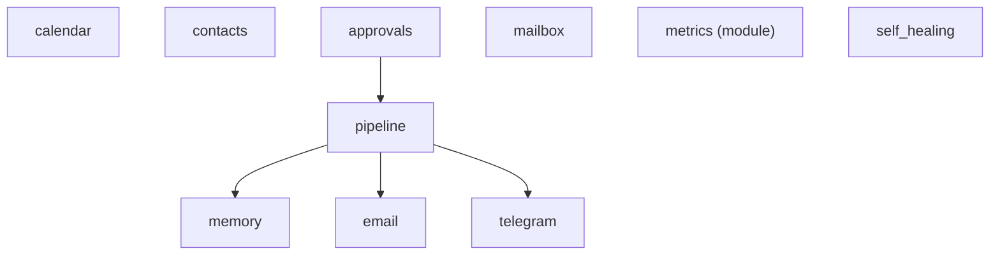
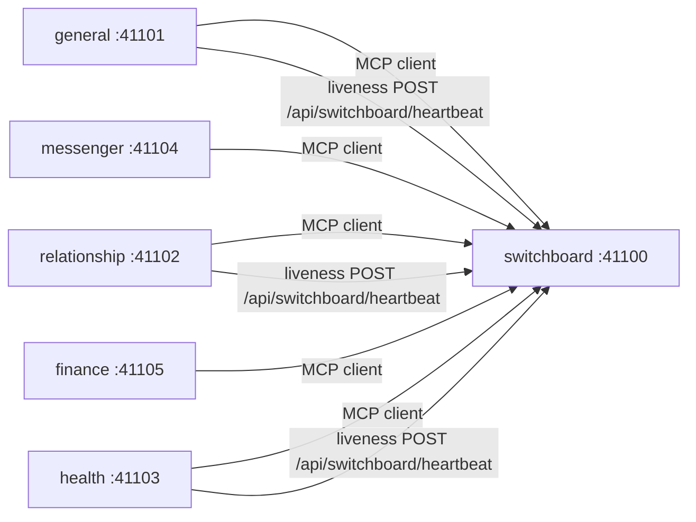
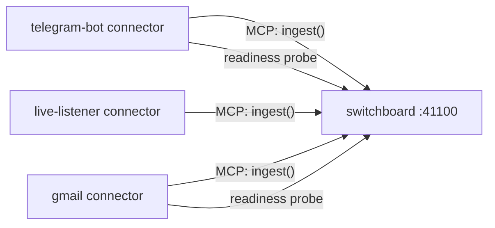
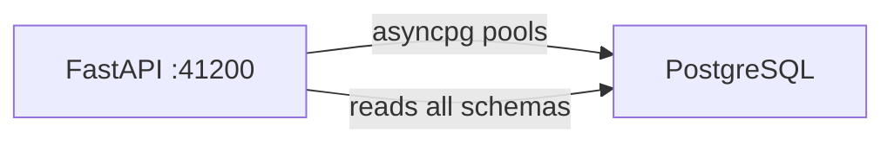

# Dependency Map

Internal and external dependencies, startup ordering constraints, and failure
blast radius analysis.

---

## Internal Dependency Graph

### Module Dependencies (topological sort at startup)



Module dependencies are declared via the `dependencies` property on each Module
subclass. The `ModuleRegistry` resolves them via topological sort before
calling `on_startup()`. Shutdown happens in reverse topological order.

Modules that declare no dependencies (memory, email, telegram, calendar,
contacts, mailbox, metrics, self_healing) can start in any order relative to
each other.

### Butler-to-Switchboard Dependency



Every non-switchboard butler:
1. Opens an MCP client connection to the Switchboard on startup (step 11b).
2. Launches a liveness reporter that periodically POSTs to the Switchboard
   heartbeat endpoint (step 17).

**Failure mode**: If the Switchboard is down, domain butlers cannot receive
routed messages. Their schedulers and direct MCP triggers still work.

### Connector-to-Switchboard Dependency



Connectors call `wait_for_switchboard_ready()` on startup, polling the
Switchboard health endpoint with exponential backoff (up to ~5 minutes).

**Failure mode**: If the Switchboard is unreachable, connectors block at startup
and cannot ingest events.

### Dashboard-to-Database Dependency



The dashboard backend creates connection pools to each butler's schema on
startup. It reads directly from butler databases -- it does not go through
butler MCP servers.

**Failure mode**: If PostgreSQL is down, the dashboard returns 500 errors.
Butler daemons also fail to start.

---

## Startup Order Constraints

The following must start before dependents can function:

```
1. PostgreSQL
   └── 2. MinIO (+ bucket setup)
       ├── 3. Switchboard butler
       │   ├── 4a. Domain butlers (general, relationship, health, ...)
       │   └── 4b. Connectors (telegram-bot, gmail, live-listener, ...)
       └── 3'. Dashboard API
```

PostgreSQL is the hard dependency for everything. MinIO / S3 is required for
blob storage, but butler daemons start without a usable blob store when the S3
configuration is absent or the configured endpoint/bucket fails validation
(blob operations fail at runtime). The Switchboard must be up before connectors
attempt ingestion, enforced by the readiness probe.

---

## External Dependencies

### Runtime Services (required)

| Dependency | Used By | Purpose | Failure Impact |
|---|---|---|---|
| **PostgreSQL** (pgvector/pg17) | All butlers, dashboard | Schema-isolated data storage, vector search | Total system failure -- nothing starts |
| **LLM API** (Anthropic/OpenAI/Google) | Spawner (all butlers) | LLM CLI session execution | Sessions cannot spawn; scheduled tasks queue indefinitely |

### Runtime Services (optional, degraded without)

| Dependency | Used By | Purpose | Failure Impact |
|---|---|---|---|
| **MinIO / S3** | Blob storage (attachments) | Attachment storage and retrieval | Attachment operations fail; non-blob daemon startup and core text messaging continue |
| **Grafana Alloy** | Telemetry | OTLP trace/metric collection | No observability; no-op tracer/meter used instead |
| **Tempo** | Trace queries | Trace storage backend | Cannot query traces; collection unaffected |
| **Prometheus** | Metric queries | Metric storage backend | Cannot query metrics; emission unaffected |

### External APIs (per-connector/module)

| Dependency | Used By | Purpose | Failure Impact |
|---|---|---|---|
| **Telegram Bot API** | telegram-bot connector, telegram module | Message polling/sending | Telegram ingestion and responses stop |
| **Telegram MTProto** | telegram-user-client connector | Userbot message access | Userbot ingestion stops |
| **Gmail API** | gmail connector | Watch/history delta email ingestion | Email ingestion stops |
| **Google Calendar API** | calendar module | Calendar CRUD | Calendar tools return errors |
| **Google Contacts API** | contacts module | Contact sync | Contact sync pauses |
| **Discord Gateway** | discord connector | WebSocket event stream | Discord ingestion stops (Draft status) |

### Build-Time Dependencies

| Dependency | Purpose |
|---|---|
| **Python 3.12+** | Runtime language |
| **uv** | Package management and virtual environments |
| **Node.js 22+** | Frontend build toolchain |
| **Docker** | Container runtime for infrastructure services |
| **Ruff** | Linting and formatting |
| **pytest** | Test execution with pytest-asyncio |
| **Alembic** | Database schema migrations |
| **Hatchling** | Python package build backend |

---

## Failure Blast Radius

### PostgreSQL down

Everything stops. No butler can start or continue operating. Dashboard returns
errors. Connectors cannot resolve credentials.

### Switchboard down

- Domain butlers continue running (schedulers work, direct MCP calls work).
- No new external messages are routed to domain butlers.
- Connectors block or fail at ingestion.
- Butler liveness reporting fails (butlers may be marked stale in registry).

### Single domain butler down

- Switchboard routes to that butler fail; messages enter dead letter.
- Other butlers are unaffected.
- Dashboard shows the butler as offline.

### Connector down

- The specific channel stops ingesting (e.g., no new Telegram messages).
- All other channels continue.
- Switchboard connector registry marks it stale after heartbeat TTL.

### LLM API down

- No new sessions can spawn across the fleet.
- Scheduled prompt-mode tasks queue behind the spawner semaphore.
- Job-mode scheduled tasks (Python functions) continue running.
- Existing data (state, memory, sessions) remains accessible via MCP tools.

### MinIO/S3 down

- Daemon startup continues with `daemon.blob_store = None` after the S3
  validation warning.
- Attachment upload/download fails at runtime.
- Core messaging continues for text-based ingestion and routing.
- Gmail connector attachment lazy-fetch fails.
