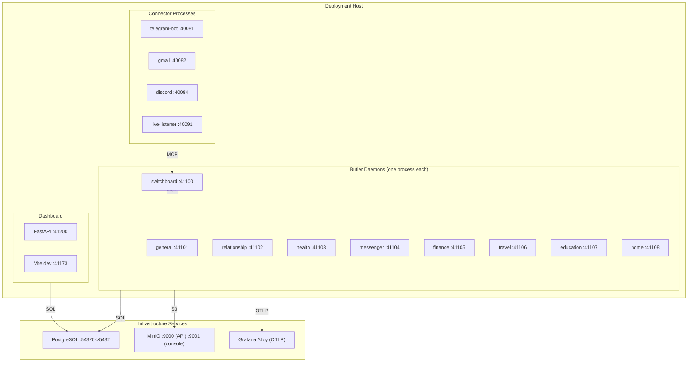

# Deployment Topology

How the Butlers system is deployed: processes, ports, infrastructure, and
environment configuration.

---

## Process Model



Each butler daemon is an independent process serving a FastMCP SSE/HTTP server
on its assigned port. Connectors are separate processes that run alongside the
butler fleet.

---

## Port Assignments

### Butler MCP Ports (41100-41108)

| Butler | Port | Status |
|---|---|---|
| switchboard | 41100 | Functional |
| general | 41101 | Functional |
| relationship | 41102 | Functional |
| health | 41103 | Functional |
| messenger | 41104 | Functional |
| finance | 41105 | Aspirational |
| travel | 41106 | Aspirational |
| education | 41107 | Aspirational |
| home | 41108 | Aspirational |

### Connector Health Ports (40081-40091)

| Connector | Port |
|---|---|
| telegram-bot | 40081 |
| gmail | 40082 |
| discord | 40084 |
| live-listener | 40091 |

### Infrastructure Ports

| Service | Port | Notes |
|---|---|---|
| Dashboard API | 41200 | FastAPI backend |
| Dashboard Frontend (dev) | 41173 | Vite dev server |
| PostgreSQL | 54320 (host) -> 5432 (container) | pgvector/pg17 |
| MinIO API | 9000 | S3-compatible blob storage |
| MinIO Console | 9001 | Web UI for MinIO |

---

## Docker Compose Topology

The `docker-compose.yml` defines the containerized deployment:

### Services

| Service | Image | Depends On | Profile |
|---|---|---|---|
| `postgres` | pgvector/pgvector:pg17 | -- | default |
| `minio` | minio/minio:latest | -- | default |
| `minio-setup` | minio/mc:latest | minio (healthy) | default |
| `switchboard` | Built from Dockerfile | postgres (healthy), minio-setup | default |
| `general` | Built from Dockerfile | postgres (healthy), minio-setup | default |
| `relationship` | Built from Dockerfile | postgres (healthy), minio-setup | default |
| `health` | Built from Dockerfile | postgres (healthy), minio-setup | default |
| `dashboard-api` | Built from Dockerfile | postgres (healthy) | default |
| `frontend-dev` | node:22-slim | dashboard-api | `dev` profile |

### Volumes

| Volume | Purpose |
|---|---|
| `butlers_postgres_data` | PostgreSQL data (external, persists across compose down) |
| `minio_data` | MinIO blob storage |
| `frontend_node_modules` | Node modules cache for frontend dev |

### Butler container pattern

Each butler container:
- Mounts its roster config directory as `/etc/butler:ro`
- Runs `butlers run --config /etc/butler`
- Receives database credentials and OTel endpoint via environment variables
- Waits for postgres healthcheck and minio-setup completion

---

## Database Topology

Single PostgreSQL instance (pgvector/pg17) with schema-based isolation.

```
butlers (database)
├── shared           -- Cross-butler identity, model catalog, secrets
├── switchboard      -- Switchboard-specific tables
├── general          -- General butler tables
├── relationship     -- Relationship butler tables
├── health           -- Health butler tables
├── messenger        -- Messenger butler tables
├── finance          -- Finance butler tables
├── travel           -- Travel butler tables
├── education        -- Education butler tables
└── home             -- Home butler tables
```

Each butler's `search_path` is set to `{butler_schema}, shared, public` so
queries resolve butler-local tables first, then shared identity tables, then
PostgreSQL built-ins.

Database provisioning (schema creation, Alembic migrations) happens automatically
during butler daemon startup.

---

## Environment Variables

### Database connectivity

| Variable | Default | Used by |
|---|---|---|
| `DATABASE_URL` | -- | All (libpq-style URL, alternative to POSTGRES_* vars) |
| `POSTGRES_HOST` | `localhost` | All |
| `POSTGRES_PORT` | `5432` | All |
| `POSTGRES_USER` | `butlers` | All |
| `POSTGRES_PASSWORD` | `butlers` | All |

### Observability

| Variable | Default | Purpose |
|---|---|---|
| `OTEL_EXPORTER_OTLP_ENDPOINT` | -- (no-op tracer if unset) | OTLP gRPC exporter endpoint |

### Runtime control

| Variable | Default | Purpose |
|---|---|---|
| `BUTLERS_MAX_GLOBAL_SESSIONS` | `3` | Process-wide cap on concurrent LLM sessions |
| `ANTHROPIC_API_KEY` | -- | Claude API authentication |

### Connector-specific

| Variable | Default | Used by |
|---|---|---|
| `SWITCHBOARD_MCP_URL` | -- | All connectors (Switchboard SSE endpoint) |
| `CONNECTOR_PROVIDER` | -- | All connectors (e.g., "telegram", "gmail") |
| `CONNECTOR_CHANNEL` | -- | All connectors (e.g., "telegram_bot", "email") |
| `CONNECTOR_MAX_INFLIGHT` | `8` | All connectors (concurrent ingest submissions) |
| `CONNECTOR_HEALTH_PORT` | Varies | All connectors |
| `CONNECTOR_HEARTBEAT_INTERVAL_S` | `120` | All connectors |
| `BUTLER_TELEGRAM_TOKEN` | -- | Telegram connector |
| `GMAIL_PUBSUB_ENABLED` | `false` | Gmail connector |
| `LIVE_LISTENER_DEVICES` | -- | Live listener (JSON device spec list) |

### Credential resolution

| Variable | Default | Purpose |
|---|---|---|
| `BUTLER_SHARED_DB_NAME` | `butlers` | Shared credentials database name |
| `BUTLER_SHARED_DB_SCHEMA` | `shared` | Shared credentials schema |
| `CONNECTOR_BUTLER_DB_NAME` | `butlers` | Per-connector butler DB for secret overrides |

---

## Development Environment

### Prerequisites

- Python 3.12+
- `uv` package manager
- Node.js 22+ (for frontend)
- Docker and Docker Compose (for infrastructure services)

### Setup

```bash
# Install Python dependencies
uv sync --dev

# Start infrastructure (DB + blob storage)
docker compose up -d postgres minio minio-setup

# Run butlers locally
butlers up

# Start dashboard
butlers dashboard --host 0.0.0.0 --port 41200

# Start frontend dev server
cd frontend && npm install && npm run dev
```

### Quality gates

```bash
make lint       # Ruff linter
make format     # Ruff formatter
make test       # Full test suite
make check      # Lint + test
```

---

## Deployment Modes

### Development (hybrid)

Infrastructure services (PostgreSQL, MinIO) run in Docker containers.
Butler daemons, connectors, and dashboard run as local processes.

```bash
docker compose up -d postgres minio minio-setup
butlers up
```

### Production (fully containerized)

All services run in Docker containers.

```bash
cp .env.example .env
# Edit .env with production secrets
docker compose up -d
```
