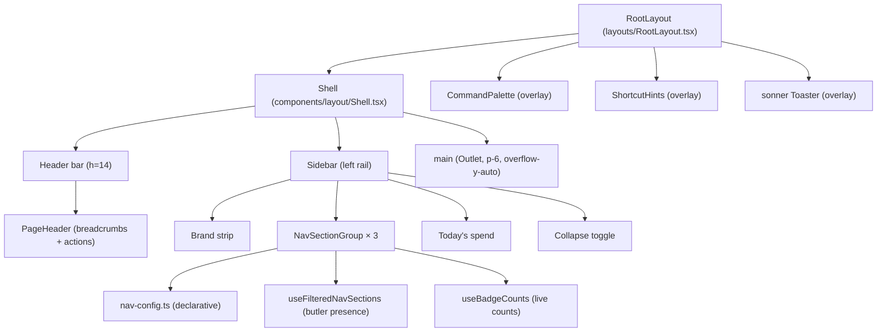
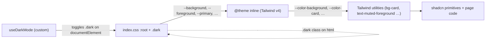

# Frontend Topology

> Status: **observational draft**, first-contact audit by a design
> consultant. This document inventories *where* the dashboard's design
> language is physically embodied today: the shell, the routing
> surface, the page archetypes, the component domains, and the
> token plumbing. The doctrine governing this surface lives in
> [`about/heart-and-soul/design-language.md`](../heart-and-soul/design-language.md).

The dashboard is a single Vite + React 18 SPA bundled into the FastAPI
backend (see `components.md` for the API container). The entry point is
`frontend/src/main.tsx` → `App.tsx` → `router.tsx` → `RootLayout.tsx`.
Everything below describes the layout from `RootLayout` outward.

---

## Composition: The Shell



### Shell layout (`components/layout/Shell.tsx`)
- `flex h-screen overflow-hidden bg-background` outer
- Mobile sidebar: Radix `Sheet` from the left, hidden ≥`md`
- Desktop sidebar: `<aside>` fixed at **56px** (`md:w-14`), full height,
  not collapsible. No width transition.
- Header: `h-14`, `border-b border-border`, `px-6`, contains hamburger
  (mobile) and `<PageHeader />`
- Main: `flex-1 overflow-y-auto p-6` (no left margin; rail and main are flex siblings, no underlap)

This is the only persistent chrome. Pages do not own anything outside
their `Outlet` rectangle.

### Sidebar geometry (56px icon rail)

The sidebar is a **fixed 56px-wide icon rail** running the full viewport
height. It is not collapsible; the rail is always 56px on desktop.

**Per-section glyph rules:**
- Main section items: first-letter fallback glyph (16px, centered in a
  40px hit target). Icons may be added in a later pass; the rail spec does
  not require lucide icons.
- Telemetry section items: same first-letter approach as Main.
- Dedicated Butlers section items: use `<ButlerMark name={...} tone="neutral">`
  (the canonical component from `components/ui/ButlerMark.tsx`) as the
  glyph for items with a `butler` association. Items without a butler field
  use the first-letter fallback.
- Relationships group: the group header glyph uses the first letter of
  "Relationships". Children (Contacts, Groups) appear as indented 32px-tall
  items below when the group is expanded.

**Tooltip floating contract:**
- On hover or `:focus-visible`, a tooltip floats at `left: 56px` (anchored
  to the right edge of the rail) showing the item label.
- Implemented via the Radix `Tooltip` primitive from `components/ui/tooltip.tsx`.
- The tooltip `delayDuration` is 0 (instant show) matching the existing
  Tooltip provider default.

**Active-state visual rule:**
- Active item: 2px left bar (`border-l-2 border-sidebar-primary`), plus
  a 6% white tint background fill in dark mode / 5% black tint in light
  mode (`bg-sidebar-primary/[0.06]` dark, `bg-sidebar-primary/[0.05]` light).
- Inactive item hover: `hover:bg-sidebar-accent/50`.

**Status dot:**
- A 6px circle rendered at the top-right of the icon area (absolute
  positioned, `top-1 right-1`).
- Color: `bg-destructive` for `error` status; amber (`bg-amber-500`) for
  `degraded` status.
- Ring stroke matches the rail background (`ring-2 ring-background`) to
  visually separate the dot from adjacent icons.
- Shown **only** when butler status is `degraded` or `error`. No dot for
  `ok` or any other status value.
- The `useButlers()` hook provides butler status. The Sidebar maps butler
  name to status to decide whether a dot is needed.

**Live badges:**
- Red circle badge (`bg-red-500 text-white`) for reauth count (Settings
  item). Badge driven by `badgeKey: 'reauth-count'` in nav-config.
- Amber circle badge (`bg-amber-500 text-white`) for pending approvals
  count (Approvals item). Badge driven by `badgeKey: 'approvals-pending'`
  in nav-config.
- Badge renders at top-right of the icon, ~10px diameter, `text-[8px]`.
- Color selection is driven by the `badgeVariant` field on `NavFlatItem`
  (values: `'red'` | `'amber'`; default falls back to primary).

**Group expand interaction (Relationships):**
- Chevron rendered at the bottom-right of the glyph area.
- Clicking the glyph toggles the group open/closed.
- When open, children appear as indented items immediately below the
  group header.
- Auto-expands when any child route is active.

**Footer summary:**
- A small row at the bottom of the rail.
- Renders a tiny dot (6px) whose color reflects the worst butler status
  present (red for error, amber for degraded, green for all ok).
- While the butlers query is loading or has failed, the dot is neutral/dim
  (`bg-muted-foreground/40`) rather than green, so the operator is not
  misled into thinking all systems are healthy when reality is unknown.
  The `title` attribute reads "Loading butlers" or "Butlers query failed"
  in those states.
- Full summary text ("1 degraded, 2 awaiting") is available via the HTML
  `title` attribute on the footer element for tooltip-on-hover.

**Mobile sheet behavior:**
- Unchanged. Mobile sidebar is a Radix `Sheet` from the left at `w-64`,
  closed on nav click. The mobile sheet renders a wider sidebar layout,
  not the icon rail.

### PageHeader (`components/layout/PageHeader.tsx`)
- Auto-generates breadcrumbs by splitting `location.pathname` on `/`
  and naive title-casing each segment (`Home / Qa / Investigations`).
- Optional `title` prop renders an h1 *but is never passed today*:
  `RootLayout` mounts `<PageHeader />` with no props. **Result:** every
  page renders its own H1 inline below the chrome, and the
  `PageHeader.title` slot is dead code.
- Right-aligned actions: command-palette button (`Search` icon,
  `Cmd/Ctrl+K`) and a dark-mode toggle. Both are `variant="ghost"`
  `size="sm"` `h-8 w-8 p-0`.

### Sidebar (`components/layout/Sidebar.tsx`)
- Fixed 56px icon rail (desktop). Not collapsible.
- Three sections, declared in `nav-config.ts`:
  - **Main**: Overview, Butlers, QA (badge), Ingestion, Approvals,
    Memory, Entities, Secrets, Settings
  - **Dedicated Butlers**: Relationships group (Contacts, Groups),
    Education, Health, Calendar, Chronicles
  - **Telemetry**: Timeline, Notifications, Issues, Sessions, Audit
    Log (collapsed by default)
- Items support a `butler` filter so absent butlers hide their nav
  entries (`useFilteredNavSections`).
- Items support a `badgeKey` for live counts (`useBadgeCounts`); QA,
  Approvals, and Settings wire badge keys.
- Item glyphs: Dedicated Butlers items with a `butler` field use
  `<ButlerMark>` (canonical component). All others use the first letter
  of the label.
- Tooltips float at `left: 56px` on hover/focus (Radix Tooltip).
- Status dots on butler-section items when butler status is `degraded`
  or `error`.
- Footer: tiny status dot summary with `title` attr for full text.

---

## Routing Surface

All routes are flat children of `RootLayout`, declared in
`router.tsx`. `<Outlet />` renders the active page. There are no
nested layouts.

| Domain | Route | Page component |
|---|---|---|
| Home | `/` | `DashboardPage` |
| Butlers | `/butlers`, `/butlers/:name` | `ButlersPage`, `ButlerDetailPage` |
| Sessions | `/sessions`, `/sessions/:id` | `SessionsPage`, `SessionDetailPage` |
| Telemetry | `/timeline` | `TimelinePage` |
| Telemetry | `/notifications` | `NotificationsPage` |
| Telemetry | `/issues` | `IssuesPage` |
| Telemetry | `/audit-log` | `AuditLogPage` |
| Approvals | `/approvals`, `/approvals/rules` | `ApprovalsPage`, `ApprovalRulesPage` |
| Calendar | `/calendar` | `CalendarWorkspacePage` |
| Relationships | `/contacts`, `/contacts/:contactId` | `ContactsPage`, `ContactDetailPage` |
| Relationships | `/groups` | `GroupsPage` |
| Relationships | `/butlers/relationship/entities/:entityId` | `RelationshipEntityDetailPage` |
| Health | `/health/measurements\|medications\|conditions\|symptoms\|meals\|research` | five pages |
| Costs | `/costs` | `CostsPage` |
| Memory | `/memory`, `/memory/facts/:factId`, `/memory/rules/:ruleId`, `/memory/episodes/:episodeId` | `MemoryPage`, three detail pages |
| Entities | `/entities`, `/entities/:entityId` | `EntitiesPage`, `EntityDetailPage` |
| Settings | `/settings`, `/secrets` | `SettingsPage`, `SecretsPage` |
| Education | `/education` | `EducationPage` |
| Chronicles | `/chronicles` | `ChroniclesPage` |
| QA | `/qa`, `/qa/patrols/:patrolId`, `/qa/investigations`, `/qa/investigations/:attemptId` | four pages |
| Ingestion | `/ingestion`, `/ingestion/connectors/:type/:identity` | `IngestionPage`, `ConnectorDetailPage` |
| Legacy | `/connectors`, `/connectors/:type/:identity` | redirects to `/ingestion` |

**Observed orphans:**
- `/sessions/:id` (`SessionDetailPage`): not in `nav-config.ts`; only
  reachable from inline links and the SessionDetailDrawer.
- `/butlers/relationship/entities/:entityId` (`RelationshipEntityDetailPage`):
  under-namespaced; not in nav.
- `/health/research` (`ResearchPage`): exists in router but no nav
  entry; the Health group only links to `/health/measurements`.

**Stability:** the routing surface is **Maturing**, paths are settling,
but there is unresolved namespace drift between
`/butlers/relationship/entities/:id` and `/entities/:id`, and the
`/connectors → /ingestion` redirect indicates an unfinished move.

---

## Page Archetypes

Pages today fall into roughly five archetypes. The shared `<Page>`
primitive (`components/ui/page.tsx`) enforces heading block, skeleton,
error/empty regions, and `space-y-6` rhythm. Pages not yet migrated
still compose the archetype by hand; see the Migration Checklist below.

### A. Overview / dashboard
Top-level multi-region surface. Hero chart → above-the-fold feed →
secondary cards → demoted stat strip. Example (post-vertical-D):
`DashboardPage`. `QaOverviewPage` and `CostsPage` still use the older
stats-grid + chart layout and are candidates for the same migration.

Post-vertical-D pattern in code (`DashboardPage`, shipped PRs
#1345, #1346, #1351, #1361):
```tsx
<Page archetype="overview" title="Overview">
  {/* Hero: SessionStripeChart — recharts stacked BarChart, butler-colored
      via --category-N deterministic tokens */}
  <Card><CardContent><SessionStripeChart butlers={butlers} /></CardContent></Card>

  {/* Above-the-fold list: RecentMoments feed */}
  {/* <Time mode="relative"> + butler glyph + prompt summary + session link */}
  <Card><CardContent><RecentMoments limit={7} /></CardContent></Card>

  {/* Secondary cards (grid lg:grid-cols-2) */}
  <div className="grid gap-6 lg:grid-cols-2">…</div>

  {/* QA widget — standalone Card (approval metrics + investigations) */}
  <QaWidget />

  {/* Demoted four-stat strip — no Card wrapper, border-t visual demotion */}
  <div className="flex flex-wrap items-center gap-x-6 gap-y-1 border-t border-border pt-3">
    <StatItem label="…" value={…} />  {/* text-sm font-medium, no Card */}
  </div>
</Page>
```

`StatItem` (defined inline in `DashboardPage`) replaces the old
`StatsCard` boilerplate. It uses `text-sm font-medium tabular-nums`
for the value and `text-xs text-muted-foreground` for the label,
no `Card` wrapper, intentionally demoted visual weight.
The topology graph lives at `/system`, not on `/`.

### B. List / index
Filterable table-of-things. Header + filter bar + table + manual
pagination. Examples: `ButlersPage`, `ContactsPage`, `EntitiesPage`,
`AuditLogPage`, `IngestionPage`, `NotificationsPage`,
`QaInvestigationsPage`.

There is no shared `<DataTable>` component. The shadcn `Table`
primitive is used directly, with each page wiring its own pagination
buttons and filter state.

### C. Detail / drilldown
One-thing-with-tabs. Examples: `ButlerDetailPage`,
`ContactDetailPage`, `EntityDetailPage`, `ConnectorDetailPage`,
`QaInvestigationDetailPage`, `RelationshipEntityDetailPage`,
`FactDetailPage`, `RuleDetailPage`, `EpisodeDetailPage`,
`QaPatrolDetailPage`.

These are the most divergent archetype: layout, header structure,
tab usage, and breadcrumbing all vary. Some use shadcn `Tabs`; some
flatten everything into stacked cards; some rely on side-drawer
context.

### D. Workspace / canvas
Stateful, time-aware, multi-region surface that combines a primary
visualization with scrubber/control affordances and secondary aggregations.
The user explores time and state interactively: scrubbing a timeline,
panning a map, adjusting a time window. Examples: `ChroniclesPage`
(scrubber + Gantt + map + aggregates with `MapPanContext`),
`CalendarWorkspacePage` (custom hour-grid via inline `style={height}`).

**Reference implementation:** `ChroniclesPage`.

**Required primitives:** `<Page archetype="workspace">`, `<Scrubber>`,
`<TimeWindowPicker>`, `MapPanContext.Provider` (when geographic exploration applies),
aggregation chart slot.

**When to use:** Pages where the user explores time and state interactively.
Current examples: ChroniclesPage, CalendarWorkspacePage; future candidates include
CostsPage (if upgraded with timeline scrubbing), SessionsPage (if upgraded to show
butler activity timelines).

These are *de facto* their own design language. The Chronicles page
in particular reads like a separate product.

### E. Editor / form
Settings, secrets, rule definitions. Examples: `SettingsPage`,
`SecretsPage`, `ApprovalRulesPage` (with `CreateRuleDialog`).

There is no shared form layout. Forms compose `Input`, `Label`,
`Button`, `Dialog`, `Select` directly.

---

## Component Domains

Components are organized by domain under `frontend/src/components/`,
with `ui/` for shadcn primitives and `layout/` for the shell.

### Primitives: `components/ui/` (shadcn)
| Component | File |
|---|---|
| AlertDialog | `alert-dialog.tsx` |
| AutoRefreshToggle | `auto-refresh-toggle.tsx` |
| Badge | `badge.tsx` |
| Breadcrumbs | `breadcrumbs.tsx` |
| Button | `button.tsx` |
| Card (+ Header/Title/Description/Action/Content/Footer) | `card.tsx` |
| Checkbox | `checkbox.tsx` |
| Dialog | `dialog.tsx` |
| DropdownMenu | `dropdown-menu.tsx` |
| EmptyState | `empty-state.tsx` |
| Input | `input.tsx` |
| Label | `label.tsx` |
| Select | `select.tsx` |
| Sheet | `sheet.tsx` |
| ShortcutHints | `shortcut-hints.tsx` |
| Skeleton | `skeleton.tsx` |
| Sonner (toaster wrapper) | `sonner.tsx` |
| Table | `table.tsx` |
| Tabs | `tabs.tsx` |
| Textarea | `textarea.tsx` |
| Toggle | `toggle.tsx` |
| Tooltip | `tooltip.tsx` |

The Button has six variants (`default`, `destructive`, `outline`,
`secondary`, `ghost`, `link`) and eight sizes including
`xs / sm / default / lg` plus four icon variants. Across the app
**`outline` is the default secondary** and **`ghost` is the default
tertiary**, but no rule is documented and the choice is page-author
discretion.

Stability: **Stable**. Shadcn primitives are well-tested upstream;
local additions (`empty-state`, `auto-refresh-toggle`,
`shortcut-hints`) are small.

### Shell: `components/layout/`
- `Shell.tsx`: outer frame
- `Sidebar.tsx` + `nav-config.ts`: left rail
- `PageHeader.tsx`: top-bar contents
- `CommandPalette.tsx`: Cmd/Ctrl+K palette (cmdk)

Stability: **Stable** for the shell, **Evolving** for nav config (new
butlers add entries here regularly).

### Domain components by butler and surface
| Domain | Folder | Notable components |
|---|---|---|
| QA dossier | `qa/` | `QaKpiStrip`, `CaseList`, `CaseDossierHeader`, `StateTrack`, `ClaimAnchoredBlurb`, `EvidenceLog`, `CounterEvidence`, `PRPanel`, `DiffPreview`, `PatrolJournal` |
| Butlers detail | `butler-detail/` | 13+ tab components |
| Notifications | `notifications/` | feed, stats bar |
| Memory | `memory/` | tier cards, browser, ConcentricCircles dialog |
| Health | `health/` | measurements, medications, conditions, symptoms, meals |
| Relationships | `relationship/` | contacts, groups, entity views |
| Chronicles | `chronicles/` | Gantt, map, scrubber, aggregations (lazy) |
| Approvals | `approvals/` | actions, rules, metrics |
| Ingestion | `ingestion/` | connectors, timeline, filters, backfill |
| Audit | `audit/` | log table |
| Costs | `costs/` | breakdown, chart |
| Issues | `issues/` | issues panel |
| Sessions | `sessions/` | detail drawer |
| Timeline | `timeline/` | unified timeline |
| Schedules | `schedules/` | schedule table, form |
| Topology | `topology/` | topology graph (xyflow) |
| Skeletons | `skeletons/` | per-domain loading skeletons |
| State | `state/` | state editor |
| Switchboard | `switchboard/` | (small) |
| Activity | `activity/` | (small) |
| Education | `education/` | (small) |
| General | `general/` | (small) |
| Settings | `settings/` | (small) |
| Chat | `chat/` | (small) |
| Secrets | `secrets/` | (small, has top-level table test) |

The `frontend/src/components/qa/` directory hosts the QA dossier surface introduced by the `redesign-qa-dossier` OpenSpec change. It renders each investigation as a living case record rather than a status-and-pipeline dashboard: a 320 px `CaseList` rail of severity-tagged cases, a `CaseDossierHeader` + `StateTrack` state pipe (`detect — diagnose — pr — landed`), a `ClaimAnchoredBlurb` driven by `InvestigationNotes.blurb_segments`, an `EvidenceLog` whose rows highlight on claim hover, a `CounterEvidence` mono table, a `PRPanel` with `DiffPreview` rendering `diff_snapshot[]`, and a full-width `PatrolJournal` for the `qa_investigation_events` timeline. A `QaKpiStrip` at the top of the page shows `prs landed · 24h`, `mttr · 24h`, `self-resolved · 7d`, and `active cases · now`, consuming the `/api/qa/summary` KPI block. All components consume Dispatch design tokens already present in `frontend/src/index.css` and do not introduce new palette entries.

Stability: **Maturing** overall. The list grows with the roster, and
the shapes of "tab", "detail", "list" components are not yet
codified, so each new butler reinvents them.

---

## Design Token Plumbing



### Sources of truth
- `frontend/src/index.css` declares `:root` with all light-mode oklch
  values plus `--radius` and `--chart-1..5`. The `.dark` selector
  overrides them. The `@theme inline` block exposes them as
  `--color-*` and `--radius-*` for Tailwind v4.
- `frontend/components.json` configures shadcn: style `new-york`,
  base color `neutral`, no prefix, lucide icons.
- `frontend/src/App.css` is essentially empty (one orphan `.app`
  class, never used).
- Dark-mode toggling is handled by a hand-rolled
  `hooks/useDarkMode.ts`.

**Theme commitment:** The project has committed to
dark-primary. `useDarkMode` defaults to `'dark'` on a cold load with no
localStorage entry. System `prefers-color-scheme` is not consulted as a
default; the dashboard opens dark regardless of OS preference. Light is a
supported fallback, selectable via the theme toggle, but it is not the
primary design target. See
[`about/heart-and-soul/design-language.md`](../heart-and-soul/design-language.md)
under "Theme commitment" for the full rationale.

### Token leaks (specific evidence)
- `pages/EntitiesPage.tsx:102-113`: six hex codes for entity tier
  colors.
- `pages/EntityDetailPage.tsx:313,316`: `#7c3aed`, `#f59e0b` inline.
- `pages/SymptomsPage.tsx`: three hex codes for severity.
- `pages/GroupsPage.tsx:121`: array of hex codes used as a category
  palette.
- `pages/FactDetailPage.tsx:101`, `pages/RuleDetailPage.tsx:97`:
  inline `style={{ width: \`${pct}%\` }}` for progress bars.
- `pages/CalendarWorkspacePage.tsx:188`:
  `style={{ height: 24 * HOUR_HEIGHT_PX }}` for the day grid.
- `pages/memory/ConcentricCirclesDialog.tsx`: multiple inline
  `style={{ ... }}` for cursor and visibility (could be tailwind
  classes).

These should be either named tokens (`--severity-low`,
`--severity-high`) or chart-palette references (`--chart-1..5`),
not literals.

---

## Cross-Cutting Patterns

### Data fetching
- TanStack Query, with hooks colocated in `frontend/src/hooks/`
  (`use-butlers`, `use-spend`, `use-issues`, `use-notifications`,
  `use-sessions`, `use-qa`, etc.).
- Most pages drive their own loading/error/empty states inline;
  there is no `<QueryBoundary>` wrapper.

### Loading states
- Per-page bespoke skeletons in `components/skeletons/`.
- Some pages use the shadcn `Skeleton` primitive, some hand-roll
  `<div className="h-4 w-2/3 animate-pulse rounded bg-muted" />`.
- No shared "page-level skeleton" matching the page archetype.

### Empty states
- Shared `EmptyState` component exists (`components/ui/empty-state.tsx`)
  but is used inconsistently; some pages render their own inline
  empty markup.

### Error states
- `ErrorBoundary` wraps `<Outlet />` in `RootLayout`.
- Per-page errors are rendered as inline text with `text-destructive`
  or as a `Card` with destructive copy. No shared `<ErrorState>`
  primitive.

### Toasts and confirmations
- `sonner` is mounted once in `RootLayout`; `toast.success / .error`
  is the canonical pattern.
- Confirmations use Radix `AlertDialog`; `window.confirm` is not
  used.

### Modals vs Sheets vs Drawers
- Radix `Dialog` for modals (Create rule, Detail dialogs).
- Radix `Sheet` for side-drawers (`SessionDetailDrawer`,
  `EpisodeDrawer`).
- No custom `Drawer` wrapper. Used as-is.

---

## Inconsistencies Worth Tracking

| Concern | Where it shows up | Note |
|---|---|---|
| H1 size varies | `text-2xl` (CostsPage) vs `text-3xl` (ButlersPage:124, ChroniclesPage:208) | `<Page>` enforces `text-3xl`; remaining `text-2xl` pages pre-date migration |
| `StatsCard` reimplemented | CostsPage:20, QaOverviewPage:149 | `DashboardPage` migrated to `StatItem` (no-Card strip). Remaining pages are candidates for the same pattern |
| Date formatters disagree | `toLocaleString` (EpisodeDetailPage:140), `toISOString().slice(0,10)` (EntitiesPage:196), `format(...)` from date-fns (GroupsPage:155) | `<Time>` primitive shipped; `DashboardPage` already uses `<Time mode="relative">` |
| Hex literals | EntitiesPage:102-113, EntityDetailPage:313/316, SymptomsPage, GroupsPage:121 | Need named tokens |
| Inline `style={{...}}` | FactDetailPage:101, RuleDetailPage:97, CalendarWorkspacePage:188, ConcentricCirclesDialog | Tailwind arbitrary values |
| Button variant for "secondary" action | `outline` (33 sites) vs `ghost` (7 sites) | No documented rule |
| Empty-state pattern | Shared `EmptyState` vs inline div | Adopt the shared one or replace it |
| `PageHeader.title` slot is dead code | `RootLayout.tsx:15` mounts with no title | Either use it or remove the prop |
| Breadcrumb autobuilder mangles names | `/qa` → "Qa", `/audit-log` → "Audit-log" | Either fix or have pages own crumbs |

Stability of the design language overall: **Maturing**. Every part
works, several parts disagree, none of the disagreements are
load-bearing yet. The right time to consolidate is *before* the next
major surface (e.g. another butler with workspace-grade UI like
Chronicles) arrives.

---

## What This Document Does Not Cover

- **Backend topology**: see [`components.md`](components.md) and
  [`integration.md`](integration.md).
- **Capability requirements**: see `openspec/`.
- **API contracts**: see `about/legends-and-lore/rfcs/`.
- **Engineering standards**: see `about/craft-and-care/` (when it
  exists).

This document covers the dashboard's surface. It is the map an
`/impeccable` redesign will be drawn over.

---

## `<Page>` Primitive Contract

> Status: **shipped**. This section documents the contract as implemented in
> `components/ui/page.tsx`.

### Motivation

Every page today re-invents its heading region, loading skeleton, empty state,
and error region by hand. The result is documented in the "Inconsistencies
Worth Tracking" table above: H1 sizes vary (`text-2xl` in `CostsPage` vs
`text-3xl` in `EntitiesPage:657`, `SymptomsPage:108`, `ChroniclesPage:195`),
action placement varies, and the shared `EmptyState` component is used
inconsistently. A single `<Page>` wrapper makes these decisions once.
`DashboardPage` has been migrated to `<Page archetype="overview">` and uses
`text-3xl font-bold tracking-tight` via the `<Page>` heading block.

The `<Page>` primitive does not replace the shell (`Shell.tsx`, `PageHeader.tsx`).
It wraps the `<main>` outlet content only.

---

### Props Contract

```ts
interface Breadcrumb {
  label: string;
  href?: string;         // omit for the current (final) crumb
  // NOTE: PageHeader uses `path?` internally; <Page> maps `href` to `path`
  // when passing crumbs to PageHeader, and passes `href` directly to
  // <Breadcrumbs> (components/ui/breadcrumbs.tsx). One canonical field name.
}

interface EmptyStateProps {
  title: string;
  description: string;
  icon?: React.ReactNode;
  action?: React.ReactNode;
}

interface PageProps {
  // --- identity ---
  title: string;
  description?: string;
  breadcrumbs?: Breadcrumb[];   // if omitted, defer to PageHeader auto-builder

  // --- chrome ---
  actions?: React.ReactNode;    // action bar: right-aligned, top of page

  // --- async state ---
  loading?: boolean;            // true = render skeleton for the archetype
  error?: unknown | null;       // non-null = render error region; <Page> extracts
                                // the message via `error instanceof Error ? error.message : String(error)`
  empty?: EmptyStateProps | null; // non-null and !loading = render EmptyState
  onRetry?: () => void;         // if set, error region shows a retry button
                                // (e.g. () => query.refetch() from TanStack Query)

  // --- layout ---
  archetype: 'overview' | 'list' | 'detail' | 'workspace' | 'editor';
  skeletonSectionCount?: number; // editor archetype only: number of CardSkeleton
                                 // placeholders to render (default 2)

  children: React.ReactNode;
}
```

**Prop rules:**

- `title` is required. It becomes the page `<h1>` (rendered at
  `text-3xl font-bold tracking-tight`). `text-3xl` is the canonical
  operator-tool H1 size (not `text-2xl`). The `<Page>` `HeadingBlock` uses
  `text-3xl`.
  Pages not yet migrated to `<Page>` that use `text-2xl` (e.g. `CostsPage`)
  will adopt `text-3xl` when they migrate.
  It is also used for `<title>` via a `useEffect` if there is no other title
  manager.
- `description` renders as `text-muted-foreground mt-1` below the title.
- `breadcrumbs`, when supplied, are rendered as a secondary row inside `<Page>`
  (above the `<h1>`, below the shell header line) using the shared `<Breadcrumbs>`
  component (`components/ui/breadcrumbs.tsx`). When `breadcrumbs` is provided,
  `PageHeader` must suppress its URL-segment auto-builder (see Open Question 1
  for the wiring approach). The `Breadcrumb.href` field maps to `BreadcrumbItem.href`
  in the `<Breadcrumbs>` component and to `Breadcrumb.path` in `PageHeader`.
- `actions` is a `ReactNode` placed at the end of the title row (right-aligned).
  Buttons here follow the existing pattern: `variant="outline"` for secondary
  actions, `variant="default"` for the single primary action if one exists.
- `loading`, `error`, and `empty` are mutually exclusive in intent but not
  enforced. Priority: `loading` first, then `error`, then `empty`. Children
  render only when all three are falsy.
- `archetype` controls max-width, content padding, and skeleton shape. It is a
  required discriminant. Pages that do not fit the five archetypes are
  workspaces by default -- see open questions.

---

### Per-Archetype Layout Rules

#### A. Overview (`archetype="overview"`)

Reference page: `DashboardPage` (post-vertical-D, uses `<Page archetype="overview">`),
`QaOverviewPage`.

- Max content width: unrestricted (fills `<main>` which has `p-6` from the
  shell). No additional horizontal constraint.
- Content padding: inherited from shell (`p-6`). `<Page>` adds `space-y-6`
  between its internal regions (heading block, children).
- Heading block: a flex row (`items-start justify-between gap-4`) containing
  two children: (left) a vertical stack of `<h1 text-3xl font-bold tracking-tight>`
  + optional `<p text-muted-foreground mt-1>`, and (right) the `actions` node.
  This is the `EntitiesPage:655-665` canonical pattern -- title and description
  stack vertically inside a `<div>`, not side-by-side with actions.
- Section rhythm: `space-y-6` between sections within `children`. Authors are
  responsible for their own section spacing inside `children`.
- Post-vertical-D region order for `DashboardPage` (canonical overview):
  1. **Hero**: `SessionStripeChart` inside a `<Card>` (recharts stacked BarChart,
     butler-colored via `--category-N` deterministic CSS tokens)
  2. **Above-the-fold feed**: `RecentMoments` inside a `<Card>` (`<Time mode="relative">`
     + butler glyph + prompt summary + session detail link)
  3. **Secondary cards**: `grid gap-6 lg:grid-cols-2` of `<Card>` widgets
     (Failed Notifications + IssuesPanel)
  4. **QA widget**: standalone `<QaWidget>` `<Card>` (approval metrics + active
     investigations summary)
  5. **Demoted stat strip**: `flex flex-wrap border-t border-border pt-3` row of
     `<StatItem>` entries (`text-sm font-medium tabular-nums`); no `<Card>` wrapper
- Rationale: `DashboardPage` uses `<Page>`. The topology graph lives at
  `/system`, not on `/`.

#### B. List (`archetype="list"`)

Reference pages: `EntitiesPage` (line 653 root div `space-y-6`),
`SymptomsPage` (line 106).

- Max content width: unrestricted.
- Content padding: inherited from shell.
- Heading block: same as overview. `EntitiesPage` line 655--665 shows the
  canonical form: title + description left, actions right, `items-start`.
- Section rhythm: heading block + one `<Card>` containing filters + table +
  pagination, with `space-y-6` between them. Pagination lives outside the
  card (both `EntitiesPage:957--982` and `SymptomsPage:231--256` follow this
  pattern).
- Filter bar: inside `<CardContent>`, `flex flex-wrap items-center gap-3`
  before the table. This is the documented position; authors must not move
  filters into `<CardHeader>`.

#### C. Detail (`archetype="detail"`)

Reference pages: `EntityDetailPage`, `ButlerDetailPage` (tabs pattern).

- Max content width: `max-w-5xl` (64rem / 1024px). Detail pages benefit from a
  constrained reading width. This is a new constraint: no existing detail page
  enforces it today, which is a known drift. The value is a proposal for the
  reviewer to confirm or adjust. (Note: Tailwind default scale is `max-w-5xl =
  64rem`, `max-w-6xl = 72rem`, `max-w-7xl = 80rem`. The 80rem citation in Open
  Question 2 below was incorrect and has been corrected here.)
- Content padding: inherited from shell.
- Heading block: title + optional metadata strip (badges, secondary labels)
  left, actions right. A `<Breadcrumbs>` component (`components/ui/breadcrumbs.tsx`)
  renders above the `<h1>` when `breadcrumbs` is supplied.
  (`EntityDetailPage` imports `Breadcrumbs` at line 36 -- it already uses the
  shared primitive; this archetype formalizes that pattern.)
- Section rhythm: `space-y-6` between sections. Tab regions (`<Tabs>`) are
  the canonical body for multi-section details (`ButlerDetailPage` pattern).
  Tabs live as a direct child, spanning full content width.
- No nested cards: a detail page uses one level of `<Card>` containers per
  section. Cards inside tab panels may not contain further `<Card>` wrappers.

#### D. Workspace (`archetype="workspace"`)

Reference page: `ChroniclesPage` (line 191--286), `CalendarWorkspacePage`.

- Max content width: unrestricted. Workspace pages are canvas-grade and own
  their own internal layout.
- Content padding: inherited from shell (`p-6`), but workspace pages may
  override with additional `pb-*` clearance for floating elements (e.g.,
  `ChroniclesPage` uses `pb-72` for the floating minimap -- this belongs inside
  `children`, not in `<Page>`).
- Heading block: same structure as overview, but `description` is typically a
  single short sentence (see `ChroniclesPage:198--199`: "Retrospective view of
  lived past time reconstructed from butler evidence.").
- Section rhythm: workspace pages own their own `<section aria-label="...">` regions.
  The `<Page>` wrapper provides only the heading block and the `space-y-6` root gap.
  Workspace `<section>` regions use `rounded-lg border bg-card p-6` as seen in
  `ChroniclesPage:220,234,255`.
- `loading` prop renders a single full-width skeleton block; there is no
  per-widget skeleton at the `<Page>` level for workspaces.

#### E. Editor (`archetype="editor"`)

Reference pages: `SettingsPage`, `SecretsPage`, `ApprovalRulesPage`.

- Max content width: `max-w-2xl` (42rem). Form pages have a narrow optimal
  reading width.
- Content padding: inherited from shell.
- Heading block: same as overview.
- Section rhythm: `space-y-6` between form sections. Each section is either a
  `<Card>` with a labeled `<CardHeader>` or a flat `<fieldset>` block. No
  mixing within one page.
- The `actions` prop in editors typically holds a single "Save" button
  (`variant="default"`).

---

### Loading Skeleton Contract

`<Page>` renders a skeleton matched to the archetype when `loading={true}`.
Authors do not need to write their own skeleton unless they need widget-level
fidelity inside a workspace.

| Archetype | Skeleton shape |
|---|---|
| `overview` | Heading block skeleton (one `h-8 w-48` title bar, one `h-4 w-64` description bar) + `StatsSkeleton` (4-column grid, from `components/skeletons/stats-skeleton.tsx`) + two `CardSkeleton` placeholders |
| `list` | Heading block skeleton + one `Card` containing `TableSkeleton` (5 rows, column widths proportional to a typical list -- use `TableSkeleton` from `components/skeletons/table-skeleton.tsx`) |
| `detail` | Heading block skeleton + `CardSkeleton` for the metadata strip + one tab-strip skeleton (`h-10 w-full`) + one content region skeleton |
| `workspace` | Heading block skeleton + one full-width `h-96 animate-pulse rounded-lg bg-muted` placeholder (workspace internals are too varied for a generic skeleton) |
| `editor` | Heading block skeleton + `CardSkeleton` per expected form section (authors may pass `skeletonSectionCount?: number` to hint the count; default 2) |

Heading block skeleton (shared across all archetypes):
```tsx
<div className="space-y-2">
  <div className="h-8 w-48 animate-pulse rounded bg-muted" />
  <div className="h-4 w-64 animate-pulse rounded bg-muted" />
</div>
```

---

### Empty / Error Rendering Rules

**Empty state:**

- Rendered when `empty` is non-null and `loading` is false.
- Uses the shared `EmptyState` component from `components/ui/empty-state.tsx`
  (already exported: `title`, `description`, `icon?`, `action?`).
- `<Page>` renders `children` when `empty` is `null` (or unset). There is no
  bypass mechanism -- "bypassing" simply means passing `empty={null}`, which
  is the correct pattern for workspace and list pages that handle their own
  per-region empty states.
- For list pages, `empty` should appear inside the `<Card>` body, not as a
  full-page takeover. This means list pages must pass `empty={null}` to
  `<Page>` and handle empty inline (as `SymptomsPage:64-70` already does).
  Open question: whether `<Page>` should support an `emptyInCard` variant.
  See "Open Questions".

**Error state:**

- Rendered when `error` is non-null and `loading` is false.
- `<Page>` renders the heading block (so the user knows which page failed)
  plus an error region: a `<Card>` with `border-destructive` and
  `text-destructive` copy, a retry `<Button variant="outline">` if the page
  passes a `onRetry` callback (open question: add `onRetry?: () => void` to
  `PageProps`).
- Partial errors (some sections loaded, one failed) are the page's
  responsibility. Per-section error handling should use the existing inline
  pattern (`text-destructive text-sm` inside the card body), not the
  page-level `error` prop.
- The `ErrorBoundary` in `RootLayout` catches JS errors; the `error` prop is
  for async query errors only.

**Priority (when multiple props are set):**

```
loading=true  -> skeleton (always wins)
error non-null -> error region + heading block
empty non-null -> EmptyState
else           -> children
```

---

### Migration Checklist

For converting an existing page to the `<Page>` primitive:

1. **Identify the archetype.** Match the page to A-E above. If it does not fit,
   note it as a workspace (D) and document why in a comment.
2. **Extract the heading block.** Remove the inline `<div className="flex items-start justify-between gap-4">` + `<h1>` + `<p>` group (present in every page). Pass `title`, `description`, `breadcrumbs`, and `actions` as props.
3. **Thread loading state.** Replace bespoke per-page skeleton with
   `loading={isLoading}` on `<Page>`. Remove the inline skeleton render block.
   Exception: workspace pages with widget-level skeletons keep those inside
   `children`.
4. **Thread error state.** Replace inline `text-destructive` error banners at
   the page root with `error={queryError ?? null}`. Keep per-section inline
   errors where appropriate.
5. **Thread empty state.** For overview and detail pages, pass
   `empty={items.length === 0 && !isLoading ? { title: ..., description: ... } : null}`.
   For list pages, keep empty handling inside the `<Card>` body and pass
   `empty={null}`.
6. **Remove `space-y-6` from the page root div.** `<Page>` applies this.
7. **Verify token discipline.** Migration is the right moment to replace hex
   literals (see "Token leaks" above) with named tokens or `--chart-*`
   references.
8. **Run tests.** Pages with `.test.tsx` files (e.g. `EntityDetailPage.test.tsx`)
   must pass before the migration commit lands.

Migration order (rough priority by blast radius and visitor frequency):
1. `SymptomsPage` -- small, clean, easy reference implementation
2. `EntitiesPage` -- list archetype canonical case
3. `DashboardPage` -- overview canonical case, **already migrated**
4. Detail pages in dependency order (start with `FactDetailPage`, least tangled)
5. `ChroniclesPage` last -- workspace archetype needs the least from `<Page>`

---

### Open Questions for Reviewer

1. **`breadcrumbs` wiring.** `PageHeader` lives inside the shell header, above
   `<main>`. `<Page>` lives inside `<main>`. For `<Page>` to override the
   breadcrumbs in `PageHeader`, either: (a) a React context must bridge the
   boundary, or (b) each page continues to own its crumbs via a `useEffect`
   that sets a context value, or (c) breadcrumbs are rendered as a secondary
   row inside `<Page>` itself (below the shell header line, above the `<h1>`).
   Option (c) is the simplest to implement but means two breadcrumb rows could
   appear if the auto-builder is not disabled. Which approach does the owner
   prefer?

   **Reviewer answer:** Use option (c) -- render breadcrumbs as a secondary row
   inside `<Page>`, above the `<h1>`. The `PageHeader` auto-builder already
   produces a "dumb" URL-segment crumb row that is functionally redundant when a
   page supplies explicit crumbs. The implementation should suppress the
   auto-builder's crumb row when `breadcrumbs` is supplied (expose a
   `hideBreadcrumbs` boolean on `PageHeader`, or pass a sentinel to tell the
   auto-builder to render nothing). This keeps `<Page>` entirely inside `<main>`
   with no context or lifting required. Detail archetype pages are the primary
   consumers; they already render `<Breadcrumbs>` inline today -- this just
   formalizes that pattern inside `<Page>`.

2. **`max-w-5xl` for detail archetype.** No existing detail page enforces a
   max width today. Proposing `max-w-5xl` (64rem / 1024px) as the detail cap.
   Is this too narrow for `EntityDetailPage` which has wide tab panels? An
   alternative is `max-w-6xl` (72rem) or no cap (letting the shell `p-6` +
   sidebar handle it).

   **Reviewer answer:** Keep `max-w-5xl` (64rem). `EntityDetailPage` is the
   widest detail page in the roster and its tab panels are readable at 64rem
   on a typical laptop viewport (1280px wide with the 256px sidebar leaves
   roughly 1024px of usable main width -- a perfect fit). Unconstrained detail
   pages feel poorly composed on wide monitors. If a future detail page
   genuinely needs more horizontal space, override locally rather than
   widening the default.

3. **Empty state placement for list pages.** The spec says list pages handle
   empty inline (inside the `<Card>`). Should `<Page>` expose an
   `emptyInCard?: EmptyStateProps` prop variant that renders `EmptyState`
   inside a wrapping `<Card>` automatically? This would let list pages remove
   their inline empty logic while preserving the card-contained visual.

   **Reviewer answer:** No -- do not add `emptyInCard`. The `<Page>` empty prop
   is for full-page empty states (overview and detail archetypes). List pages
   have one `<Card>` containing both filters and the table; placing the empty
   state inside that card is a structural decision the list page owns. Hiding
   that behind a `<Page>` variant makes `<Page>` aware of list internals,
   which is the wrong abstraction boundary. List pages should continue to pass
   `empty={null}` and handle empty states inline (as `SymptomsPage:64-70`
   already does). The migration checklist step 5 already documents this
   correctly.

4. **`onRetry` prop.** Should the error region include a retry callback?
   If yes, the signature becomes `onRetry?: () => void` on `PageProps`.
   Pages using TanStack Query would pass `() => query.refetch()`.

   **Reviewer answer:** Yes -- include `onRetry`. An error region with no
   recovery path is a dead end for the operator. The prop is optional, so pages
   that genuinely cannot retry (e.g. a static config page) omit it and the
   error card renders without the retry button. `onRetry` has been added to
   `PageProps` in the interface above.

5. **Workspace `loading` skeleton.** The proposed full-width `h-96` placeholder
   is intentionally coarse. Is it acceptable for `ChroniclesPage` during
   initial load, or should workspace pages always handle their own loading UI
   and `loading` prop be disallowed (or ignored) for `archetype="workspace"`?

   **Reviewer answer:** Allow `loading` for workspace but keep the coarse
   placeholder. `ChroniclesPage` already has its own per-widget skeleton logic
   inside its timeline, scrubber, and map sections; the `<Page>`-level `loading`
   prop is a fallback for the case where the entire workspace data fetch fails
   before any widget can render at all. The `h-96` placeholder is acceptable
   for that edge case. Workspace pages that want finer loading fidelity simply
   do not pass `loading` to `<Page>` and manage skeletons inside `children`
   instead -- this is the normal case for Chronicles today.

6. **`<title>` management.** The spec proposes a `useEffect` on `<Page>` to
   set `document.title`. Does the project want this behavior, or is the page
   title managed elsewhere (e.g. React Router's `<meta>` or a future SEO layer)?
   If title management is out of scope for `<Page>`, remove the `useEffect`.

   **Reviewer answer:** Yes -- let `<Page>` manage `document.title` via
   `useEffect`. This is a single-tenant personal dashboard, not a marketing
   site; there is no SEO layer, no React Router `<meta>` management, and no
   other title manager in the codebase today. Setting
   `document.title = \`${title} | Butlers\`` inside `<Page>` is the right
   place: centralized, automatic, and removes per-page boilerplate. The prop
   rule note ("used for `<title>` via a `useEffect` if there is no other title
   manager") is correct as written.

7. **`skeletonSectionCount` for editor.** The proposal includes an optional
   `skeletonSectionCount` hint. If editors are always two sections (e.g.
   settings + save), hardcode 2 and drop the prop.

   **Reviewer answer:** Keep the prop but make it optional with a default of 2.
   `SettingsPage` has two form sections, `SecretsPage` has one, and future
   editor pages may vary. A hardcoded 2 would render an extra skeleton section
   for `SecretsPage`. The prop's default-2 behavior satisfies the common case
   with zero boilerplate; pages that differ from the default pass an explicit
   value. The prop has been added to `PageProps` as `skeletonSectionCount?:
   number` in the interface above.

---

## Type tokens

> Status: **Draft** (font tokens declared, type scale documented; the
> editorial archetype is the first consumer). Companion to
> [`about/heart-and-soul/design-language.md`](../heart-and-soul/design-language.md)
> §Type system, which owns the principles. This section owns the
> token names, the scale, and the load path.

### Family stack

The dashboard uses three font families. Each family resolves through
a CSS variable declared in `frontend/src/index.css` `:root`:

| Token          | Family             | Fallback stack                                         |
|----------------|--------------------|--------------------------------------------------------|
| `--font-sans`  | Inter Tight        | `ui-sans-serif, system-ui, sans-serif`                 |
| `--font-serif` | Source Serif 4     | `ui-serif, Georgia, serif`                             |
| `--font-mono`  | JetBrains Mono     | `ui-monospace, SFMono-Regular, Menlo, monospace`       |

The variables are declared but **not retroactively applied**. The
existing `:root { font-family: system-ui, ... }` rule in `index.css`
remains the body default; opt-in consumers (the editorial archetype,
the Voice surface, mono-rendered numerals) reference `var(--font-sans)`,
`var(--font-serif)`, or `var(--font-mono)` directly. Pages migrate as
they adopt the editorial archetype, not in a sweep.

### Scale

The scale below is the topology side of the doctrine three-family
split. Sizes are absolute pixels (not rem) so the editorial archetype
holds its proportions independent of the browser-default 16px setting.

| Role        | Family                  | Size  | Weight | Tracking | Leading | Notes |
|-------------|-------------------------|-------|--------|----------|---------|-------|
| Display     | sans (`--font-sans`)    | 44px  | 500    | -0.025em | 1.08    | Editorial archetype only (Non-negotiable rule 2). |
| Title (H1)  | sans (`--font-sans`)    | 24px (`text-2xl`) | 700 (`font-bold`) | tight (`tracking-tight`) | 1.2 | Standard archetype default for non-editorial pages. |
| Body        | sans (`--font-sans`)    | 14px  | 400    | normal   | 1.5     | |
| Body small  | sans (`--font-sans`)    | 13px  | 400    | normal   | 1.5     | |
| Voice       | serif (`--font-serif`)  | 16px  | 400    | normal   | 1.6     | LLM prose. Italic for empty states; roman for briefings. |
| Eyebrow     | mono (`--font-mono`)    | 10px  | 400    | 0.14em   | 1.0     | Uppercase. Section header substitute. Color: `--muted-foreground`. |
| Mono inline | mono (`--font-mono`)    | 11px  | 400    | normal   | 1.4     | Inline IDs, file paths, deltas. |

### Numeral rendering

Tabular numerals are exposed as a single utility class in
`frontend/src/index.css`:

```css
.tnum { font-variant-numeric: tabular-nums; }
```

Apply `.tnum` to every numeric element: cost figures, count badges,
delta values, KPI mega-numbers, mono-rendered timestamps, table
columns containing numbers. The doctrine treats this as
non-negotiable.

### Font load path

Fonts load via Google Fonts in `frontend/index.html`:

```html
<link rel="preconnect" href="https://fonts.googleapis.com">
<link rel="preconnect" href="https://fonts.gstatic.com" crossorigin>
<link href="https://fonts.googleapis.com/css2?family=Inter+Tight:wght@400;500;600;700&family=Source+Serif+4:ital,wght@0,400;0,500;1,400&family=JetBrains+Mono:wght@400;500&display=swap" rel="stylesheet">
```

Weights loaded:

- **Inter Tight**: 400 (body), 500 (Display, mega-numbers), 600, 700 (H1).
- **Source Serif 4**: 400 roman (briefing prose), 400 italic (empty
  states), 500 roman (occasional emphasis).
- **JetBrains Mono**: 400 (eyebrows, inline mono, deltas), 500
  (numeric weight where 400 looks thin).

`display=swap` is intentional: the system font fallback paints
immediately, the web font swaps in when ready. The dashboard never
holds the page on font load.

### See also

- Doctrine: [`about/heart-and-soul/design-language.md`](../heart-and-soul/design-language.md)
  §Type system, §Non-negotiable rule 2 (Display tier carve-out).
- Consumers: the editorial archetype layout below.

---

## Editorial archetype layout

> Status: **Draft** (the OpenSpec change `dashboard-overview-briefing`
> is the first consumer; `frontend/src/components/overview/` is the
> destination for the components that embody this layout). Companion
> to [`about/heart-and-soul/design-language.md`](../heart-and-soul/design-language.md)
> §Editorial archetype, which owns the principles. This section owns
> the layout values, the row anatomies, the motion durations, and the
> source files.

### Page frame

The editorial archetype renders inside `<Page archetype="editorial">`
(once the archetype is added to the `<Page>` discriminant union; today
the Overview is the only page that needs it). The frame:

- `display: grid`, `grid-template-columns: 1.4fr 1fr`, `gap: 56px`.
- `max-width: 1280px`, page padding `48px 56px` on the
  outermost wrapper.
- Left column carries the narrative: date eyebrow + briefing status
  pill, Display headline, Voice paragraph, attention list, KPI strip.
- Right column carries the index: eyebrow-titled lists (Butlers, Next).

### Reading widths

- **Display headline**: `max-width: 14ch`. The constraint forces the
  dramatic line break that gives the page its shape.
- **Voice paragraph**: `max-width: 50ch`. Readable measure for prose.
- **Lists** span the full width of their column (no measure cap).

### Row anatomies

The attention list is a CSS grid of `mark / 1fr title+detail / meta`
separated by hairline borders, no card chrome. Three row variants:

| Row                  | Mark column         | Title + detail        | Meta column                | Vertical padding |
|----------------------|---------------------|-----------------------|----------------------------|-----------------|
| Attention            | 24px severity glyph | sans title + serif detail | auto action arrow      | 18px            |
| Butler index         | 8px status dot      | sans butler name      | auto sessions + auto cost  | 10px            |
| Next (scheduled)     | 50px mono time      | sans label            | auto kind tag              | 10px            |

Empty state for the attention list: `Nothing waiting.` rendered in
`var(--font-serif)` italic, color `--muted-foreground`, no period of
explanation, no illustration.

### KPI strip

Four-column grid divided by hairline borders (`border-right` on each
cell except the last; no fills, no card chrome). Each cell stacks:

```
mono eyebrow   (10px, --font-mono, --muted-foreground, uppercase, 0.14em letter-spacing)
mega number    (32px, --font-sans, weight 500, tracking -0.03em, .tnum)
mono delta     (10px, --font-mono, --muted-foreground)
```

Deltas line up vertically across columns because every numeric cell
is tabular.

### Status pill

`9px` mono pill with three slots: status dot + label + ↻ icon. Three
states for the briefing pill:

| State            | Dot color  | Label               | Icon behaviour      |
|------------------|-----------|----------------------|---------------------|
| `composing…`     | amber     | `composing…`         | rotating (in-flight) |
| `llm · cached 5m`| green     | `llm · cached 5m`    | static              |
| `templated`      | dim       | `templated`          | static              |

Click triggers refresh.

### Motion budget

The editorial archetype obeys the Motion contract above. The two
motion events the briefing introduces:

- **Voice paragraph cross-fade** on briefing refresh:
  `transition-[opacity] duration-base ease-out-quart` (200ms).
  Opacity-only, no transform. Old paragraph fades to 0, new
  paragraph fades from 0.
- **Status pill icon rotation** while loading:
  `transition-[transform]` continuous (CSS `@keyframes spin` is fine),
  `ease-out-quart`. Transform-only, never animates a layout
  property.

No staggered entries, no count-up animations, no scale-in.

### Butler letter-mark

The butler hue from `--category-1..8` resolves only onto the butler
letter-mark. The canonical component is
`frontend/src/components/ui/ButlerMark.tsx`.

`ButlerMark` exports:
- `<ButlerMark name="..." tone="fill|neutral" />`: 16px squircle with
  butler initial. `fill` = solid hue background + white initial (active
  state). `neutral` = transparent background + hue initial + hairline
  border (default).
- `butlerHueVar(name)`: returns `var(--category-N)` for chart code
  (recharts, stripe charts) that needs the raw CSS variable string.
- `categoryHueVar(name)`: same hash algorithm, no roster-index lookup.
  Use for non-butler entities (contact labels, tags) where positional
  slot stability is not required.
- `KNOWN_BUTLERS`: the canonical roster order that determines permanent
  color slots for known butlers.

All consumers use this module:
- `frontend/src/components/dashboard/RecentMoments.tsx`: uses `<ButlerMark tone="fill" />`
- `frontend/src/components/dashboard/SessionStripeChart.tsx`: uses `butlerHueVar()`
- `frontend/src/components/relationship/ContactTable.tsx`: uses `categoryHueVar()` for label badges
- `frontend/src/components/relationship/ContactDetailView.tsx`: uses `categoryHueVar()` for label badges
- `frontend/src/components/costs/CostStripeChart.tsx`: uses `butlerHueVar()`
- `frontend/src/pages/GroupsPage.tsx`: uses `categoryHueVar()` for label badges

### Source files

The editorial archetype components are expected to land under
`frontend/src/components/overview/` per the
`openspec/changes/dashboard-overview-briefing/` change. As of this
section's authoring the directory is empty; the Overview page still
renders via the older `DashboardPage` overview archetype.

### See also

- Doctrine: [`about/heart-and-soul/design-language.md`](../heart-and-soul/design-language.md)
  §Editorial archetype, §Type system, §Voice and Copy.
- Capability spec: `openspec/changes/dashboard-overview-briefing/specs/dashboard-briefing/spec.md`
  for the briefing wire contract that the Voice surface renders.
