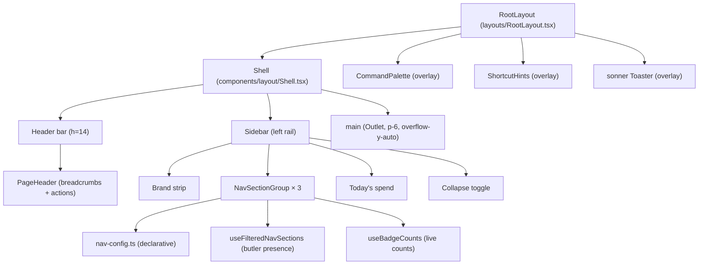
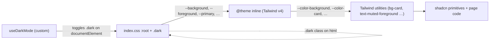

# Frontend Topology

> Status: **observational draft** — first-contact audit by a design
> consultant. This document inventories *where* the dashboard's design
> language is physically embodied today: the shell, the routing
> surface, the page archetypes, the component domains, and the
> token plumbing. The doctrine governing this surface lives in
> [`about/heart-and-soul/design-language.md`](../heart-and-soul/design-language.md).

The dashboard is a single Vite + React 18 SPA bundled into the FastAPI
backend (see `components.md` for the API container). The entry point is
`frontend/src/main.tsx` → `App.tsx` → `router.tsx` → `RootLayout.tsx`.
Everything below describes the layout from `RootLayout` outward.

---

## Composition: The Shell



### Shell layout (`components/layout/Shell.tsx`)
- `flex h-screen overflow-hidden bg-background` outer
- Mobile sidebar: Radix `Sheet` from the left, hidden ≥`md`
- Desktop sidebar: `<aside>` with `md:w-64` (or `md:w-16` collapsed),
  width transition 200ms
- Header: `h-14`, `border-b border-border`, `px-6`, contains hamburger
  (mobile) and `<PageHeader />`
- Main: `flex-1 overflow-y-auto p-6`

This is the only persistent chrome. Pages do not own anything outside
their `Outlet` rectangle.

### PageHeader (`components/layout/PageHeader.tsx`)
- Auto-generates breadcrumbs by splitting `location.pathname` on `/`
  and naive title-casing each segment (`Home / Qa / Investigations`).
- Optional `title` prop renders an h1 *but is never passed today* —
  `RootLayout` mounts `<PageHeader />` with no props. **Result:** every
  page renders its own H1 inline below the chrome, and the
  `PageHeader.title` slot is dead code.
- Right-aligned actions: command-palette button (`Search` icon,
  `Cmd/Ctrl+K`) and a dark-mode toggle. Both are `variant="ghost"`
  `size="sm"` `h-8 w-8 p-0`.

### Sidebar (`components/layout/Sidebar.tsx`)
- Brand: "Butlers" (collapses to "B")
- Three sections, declared in `nav-config.ts`:
  - **Main** — Overview, Butlers, QA (badge), Ingestion, Approvals,
    Memory, Entities, Secrets, Settings
  - **Dedicated Butlers** — Relationships group (Contacts, Groups),
    Education, Health, Calendar, Chronicles
  - **Telemetry** — Timeline, Notifications, Issues, Sessions, Audit
    Log (collapsed by default)
- Items support a `butler` filter so absent butlers hide their nav
  entries (`useFilteredNavSections`).
- Items support a `badgeKey` for live counts (`useBadgeCounts`); only
  QA wires this in today.
- Item glyphs are **the first letter of the label in a 24×24 muted
  square**, not real icons. This was a deliberate "honest cheap"
  choice; it is not currently using `lucide-react` for nav.
- Footer: today's spend (live, via `useCostSummary("today")`).

---

## Routing Surface

All routes are flat children of `RootLayout`, declared in
`router.tsx`. `<Outlet />` renders the active page. There are no
nested layouts.

| Domain | Route | Page component |
|---|---|---|
| Home | `/` | `DashboardPage` |
| Butlers | `/butlers`, `/butlers/:name` | `ButlersPage`, `ButlerDetailPage` |
| Sessions | `/sessions`, `/sessions/:id` | `SessionsPage`, `SessionDetailPage` |
| Telemetry | `/timeline` | `TimelinePage` |
| Telemetry | `/notifications` | `NotificationsPage` |
| Telemetry | `/issues` | `IssuesPage` |
| Telemetry | `/audit-log` | `AuditLogPage` |
| Approvals | `/approvals`, `/approvals/rules` | `ApprovalsPage`, `ApprovalRulesPage` |
| Calendar | `/calendar` | `CalendarWorkspacePage` |
| Relationships | `/contacts`, `/contacts/:contactId` | `ContactsPage`, `ContactDetailPage` |
| Relationships | `/groups` | `GroupsPage` |
| Relationships | `/butlers/relationship/entities/:entityId` | `RelationshipEntityDetailPage` |
| Health | `/health/measurements\|medications\|conditions\|symptoms\|meals\|research` | five pages |
| Costs | `/costs` | `CostsPage` |
| Memory | `/memory`, `/memory/facts/:factId`, `/memory/rules/:ruleId`, `/memory/episodes/:episodeId` | `MemoryPage`, three detail pages |
| Entities | `/entities`, `/entities/:entityId` | `EntitiesPage`, `EntityDetailPage` |
| Settings | `/settings`, `/secrets` | `SettingsPage`, `SecretsPage` |
| Education | `/education` | `EducationPage` |
| Chronicles | `/chronicles` | `ChroniclesPage` |
| QA | `/qa`, `/qa/patrols/:patrolId`, `/qa/investigations`, `/qa/investigations/:attemptId` | four pages |
| Ingestion | `/ingestion`, `/ingestion/connectors/:type/:identity` | `IngestionPage`, `ConnectorDetailPage` |
| Legacy | `/connectors`, `/connectors/:type/:identity` | redirects to `/ingestion` |

**Observed orphans:**
- `/sessions/:id` (`SessionDetailPage`) — not in `nav-config.ts`; only
  reachable from inline links and the SessionDetailDrawer.
- `/butlers/relationship/entities/:entityId` (`RelationshipEntityDetailPage`)
  — under-namespaced; not in nav.
- `/health/research` (`ResearchPage`) — exists in router but no nav
  entry; the Health group only links to `/health/measurements`.

**Stability:** the routing surface is **Maturing** — paths are settling,
but there is unresolved namespace drift between
`/butlers/relationship/entities/:id` and `/entities/:id`, and the
`/connectors → /ingestion` redirect indicates an unfinished move.

---

## Page Archetypes

Pages today fall into roughly five archetypes. There is no shared
`<Page>` wrapper enforcing them, so each page composes the archetype
by hand.

### A. Overview / dashboard
Top-level multi-region surface. Stats bar → primary visualization
→ secondary cards. Examples: `DashboardPage`, `QaOverviewPage`,
`CostsPage`.

Pattern in code:
```tsx
<div className="space-y-6">
  <h1 className="text-2xl|3xl font-bold tracking-tight">…</h1>
  <StatsBar />            // grid grid-cols-2|4 of StatsCard
  <PrimaryRegion />       // topology, chart, kanban, etc.
  <SecondaryGrid />       // grid lg:grid-cols-2 of cards
</div>
```

`StatsCard` is **defined inline in each page** with the same
`Card / CardHeader pb-2 / CardTitle text-sm / CardContent`
boilerplate. There is no shared component. (See doctrine drift #3.)

### B. List / index
Filterable table-of-things. Header + filter bar + table + manual
pagination. Examples: `ButlersPage`, `ContactsPage`, `EntitiesPage`,
`AuditLogPage`, `IngestionPage`, `NotificationsPage`,
`QaInvestigationsPage`.

There is no shared `<DataTable>` component. The shadcn `Table`
primitive is used directly, with each page wiring its own pagination
buttons and filter state.

### C. Detail / drilldown
One-thing-with-tabs. Examples: `ButlerDetailPage`,
`ContactDetailPage`, `EntityDetailPage`, `ConnectorDetailPage`,
`QaInvestigationDetailPage`, `RelationshipEntityDetailPage`,
`FactDetailPage`, `RuleDetailPage`, `EpisodeDetailPage`,
`QaPatrolDetailPage`.

These are the most divergent archetype: layout, header structure,
tab usage, and breadcrumbing all vary. Some use shadcn `Tabs`; some
flatten everything into stacked cards; some rely on side-drawer
context.

### D. Workspace / canvas
Heavy, persistent, stateful. Examples: `ChroniclesPage` (scrubber +
Gantt + map + aggregates with `MapPanContext`),
`CalendarWorkspacePage` (custom hour-grid via inline `style={height}`).

These are *de facto* their own design language. The Chronicles page
in particular reads like a separate product.

### E. Editor / form
Settings, secrets, rule definitions. Examples: `SettingsPage`,
`SecretsPage`, `ApprovalRulesPage` (with `CreateRuleDialog`).

There is no shared form layout. Forms compose `Input`, `Label`,
`Button`, `Dialog`, `Select` directly.

---

## Component Domains

Components are organized by domain under `frontend/src/components/`,
with `ui/` for shadcn primitives and `layout/` for the shell.

### Primitives — `components/ui/` (shadcn)
| Component | File |
|---|---|
| AlertDialog | `alert-dialog.tsx` |
| AutoRefreshToggle | `auto-refresh-toggle.tsx` |
| Badge | `badge.tsx` |
| Breadcrumbs | `breadcrumbs.tsx` |
| Button | `button.tsx` |
| Card (+ Header/Title/Description/Action/Content/Footer) | `card.tsx` |
| Checkbox | `checkbox.tsx` |
| Dialog | `dialog.tsx` |
| DropdownMenu | `dropdown-menu.tsx` |
| EmptyState | `empty-state.tsx` |
| Input | `input.tsx` |
| Label | `label.tsx` |
| Select | `select.tsx` |
| Sheet | `sheet.tsx` |
| ShortcutHints | `shortcut-hints.tsx` |
| Skeleton | `skeleton.tsx` |
| Sonner (toaster wrapper) | `sonner.tsx` |
| Table | `table.tsx` |
| Tabs | `tabs.tsx` |
| Textarea | `textarea.tsx` |
| Toggle | `toggle.tsx` |
| Tooltip | `tooltip.tsx` |

The Button has six variants (`default`, `destructive`, `outline`,
`secondary`, `ghost`, `link`) and eight sizes including
`xs / sm / default / lg` plus four icon variants. Across the app
**`outline` is the default secondary** and **`ghost` is the default
tertiary**, but no rule is documented and the choice is page-author
discretion.

Stability: **Stable** — shadcn primitives are well-tested upstream;
local additions (`empty-state`, `auto-refresh-toggle`,
`shortcut-hints`) are small.

### Shell — `components/layout/`
- `Shell.tsx` — outer frame
- `Sidebar.tsx` + `nav-config.ts` — left rail
- `PageHeader.tsx` — top-bar contents
- `CommandPalette.tsx` — Cmd/Ctrl+K palette (cmdk)

Stability: **Stable** for the shell, **Evolving** for nav config (new
butlers add entries here regularly).

### Domain components — by butler / surface
| Domain | Folder | Notable components |
|---|---|---|
| Butlers detail | `butler-detail/` | 13+ tab components |
| Notifications | `notifications/` | feed, stats bar |
| Memory | `memory/` | tier cards, browser, ConcentricCircles dialog |
| Health | `health/` | measurements, medications, conditions, symptoms, meals |
| Relationships | `relationship/` | contacts, groups, entity views |
| Chronicles | `chronicles/` | Gantt, map, scrubber, aggregations (lazy) |
| Approvals | `approvals/` | actions, rules, metrics |
| Ingestion | `ingestion/` | connectors, timeline, filters, backfill |
| Audit | `audit/` | log table |
| Costs | `costs/` | breakdown, chart |
| Issues | `issues/` | issues panel |
| Sessions | `sessions/` | detail drawer |
| Timeline | `timeline/` | unified timeline |
| Schedules | `schedules/` | schedule table, form |
| Topology | `topology/` | topology graph (xyflow) |
| Skeletons | `skeletons/` | per-domain loading skeletons |
| State | `state/` | state editor |
| Switchboard | `switchboard/` | (small) |
| Activity | `activity/` | (small) |
| Education | `education/` | (small) |
| General | `general/` | (small) |
| Settings | `settings/` | (small) |
| Chat | `chat/` | (small) |
| Secrets | `secrets/` | (small, has top-level table test) |

Stability: **Maturing** overall. The list grows with the roster, and
the shapes of "tab", "detail", "list" components are not yet
codified, so each new butler reinvents them.

---

## Design Token Plumbing



### Sources of truth
- `frontend/src/index.css` declares `:root` with all light-mode oklch
  values plus `--radius` and `--chart-1..5`. The `.dark` selector
  overrides them. The `@theme inline` block exposes them as
  `--color-*` and `--radius-*` for Tailwind v4.
- `frontend/components.json` configures shadcn: style `new-york`,
  base color `neutral`, no prefix, lucide icons.
- `frontend/src/App.css` is essentially empty (one orphan `.app`
  class, never used).
- Dark-mode toggling is handled by a hand-rolled
  `hooks/useDarkMode.ts`, not `next-themes` (despite `next-themes`
  being a declared dependency — it is unused).

### Token leaks (specific evidence)
- `pages/EntitiesPage.tsx:102-113` — six hex codes for entity tier
  colors.
- `pages/EntityDetailPage.tsx:313,316` — `#7c3aed`, `#f59e0b` inline.
- `pages/SymptomsPage.tsx` — three hex codes for severity.
- `pages/GroupsPage.tsx:121` — array of hex codes used as a category
  palette.
- `pages/FactDetailPage.tsx:101`, `pages/RuleDetailPage.tsx:97` —
  inline `style={{ width: \`${pct}%\` }}` for progress bars.
- `pages/CalendarWorkspacePage.tsx:188` —
  `style={{ height: 24 * HOUR_HEIGHT_PX }}` for the day grid.
- `pages/memory/ConcentricCirclesDialog.tsx` — multiple inline
  `style={{ ... }}` for cursor and visibility (could be tailwind
  classes).

These should be either named tokens (`--severity-low`,
`--severity-high`) or chart-palette references (`--chart-1..5`),
not literals.

---

## Cross-Cutting Patterns

### Data fetching
- TanStack Query, with hooks colocated in `frontend/src/hooks/`
  (`use-butlers`, `use-costs`, `use-issues`, `use-notifications`,
  `use-sessions`, `use-qa`, etc.).
- Most pages drive their own loading/error/empty states inline;
  there is no `<QueryBoundary>` wrapper.

### Loading states
- Per-page bespoke skeletons in `components/skeletons/`.
- Some pages use the shadcn `Skeleton` primitive, some hand-roll
  `<div className="h-4 w-2/3 animate-pulse rounded bg-muted" />`.
- No shared "page-level skeleton" matching the page archetype.

### Empty states
- Shared `EmptyState` component exists (`components/ui/empty-state.tsx`)
  but is used inconsistently; some pages render their own inline
  empty markup.

### Error states
- `ErrorBoundary` wraps `<Outlet />` in `RootLayout`.
- Per-page errors are rendered as inline text with `text-destructive`
  or as a `Card` with destructive copy. No shared `<ErrorState>`
  primitive.

### Toasts and confirmations
- `sonner` is mounted once in `RootLayout`; `toast.success / .error`
  is the canonical pattern.
- Confirmations use Radix `AlertDialog`; `window.confirm` is not
  used.

### Modals vs Sheets vs Drawers
- Radix `Dialog` for modals (Create rule, Detail dialogs).
- Radix `Sheet` for side-drawers (`SessionDetailDrawer`,
  `EpisodeDrawer`).
- No custom `Drawer` wrapper. Used as-is.

---

## Inconsistencies Worth Tracking

| Concern | Where it shows up | Note |
|---|---|---|
| H1 size varies | `text-2xl` (DashboardPage:165, CostsPage) vs `text-3xl` (ButlersPage:124, ChroniclesPage:208) | No `<Page>` enforces |
| `StatsCard` reimplemented | DashboardPage:25, CostsPage:20, QaOverviewPage:149 | Candidate for shared `<Stat>` |
| Date formatters disagree | `toLocaleString` (DashboardPage:84, EpisodeDetailPage:140), `toISOString().slice(0,10)` (EntitiesPage:196), `format(...)` from date-fns (GroupsPage:155) | Need `<Time>` primitive |
| Hex literals | EntitiesPage:102-113, EntityDetailPage:313/316, SymptomsPage, GroupsPage:121 | Need named tokens |
| Inline `style={{...}}` | FactDetailPage:101, RuleDetailPage:97, CalendarWorkspacePage:188, ConcentricCirclesDialog | Tailwind arbitrary values |
| Button variant for "secondary" action | `outline` (33 sites) vs `ghost` (7 sites) | No documented rule |
| Empty-state pattern | Shared `EmptyState` vs inline div | Adopt the shared one or replace it |
| `PageHeader.title` slot is dead code | `RootLayout.tsx:15` mounts with no title | Either use it or remove the prop |
| Breadcrumb autobuilder mangles names | `/qa` → "Qa", `/audit-log` → "Audit-log" | Either fix or have pages own crumbs |

Stability of the design language overall: **Maturing** — every part
works, several parts disagree, none of the disagreements are
load-bearing yet. The right time to consolidate is *before* the next
major surface (e.g. another butler with workspace-grade UI like
Chronicles) arrives.

---

## What This Document Does Not Cover

- **Backend topology** — see [`components.md`](components.md) and
  [`integration.md`](integration.md).
- **Capability requirements** — see `openspec/`.
- **API contracts** — see `about/legends-and-lore/rfcs/`.
- **Engineering standards** — see `about/craft-and-care/` (when it
  exists).

This document covers the dashboard's surface. It is the map an
`/impeccable` redesign will be drawn over.

---

## `<Page>` Primitive Contract

> Status: **design spec** (written for bead bu-yo4bt.1). No implementation
> exists yet. This section is the contract for the downstream implementation bead.

### Motivation

Every page today re-invents its heading region, loading skeleton, empty state,
and error region by hand. The result is documented in the "Inconsistencies
Worth Tracking" table above: H1 sizes vary (`text-2xl` in `DashboardPage:165`,
`text-3xl` in `EntitiesPage:657`, `SymptomsPage:108`, `ChroniclesPage:195`),
action placement varies, and the shared `EmptyState` component is used
inconsistently. A single `<Page>` wrapper makes these decisions once.

The `<Page>` primitive does not replace the shell (`Shell.tsx`, `PageHeader.tsx`).
It wraps the `<main>` outlet content only.

---

### Props Contract

```ts
interface Breadcrumb {
  label: string;
  path?: string;         // omit for the current (final) crumb
}

interface EmptyStateProps {
  title: string;
  description: string;
  icon?: React.ReactNode;
  action?: React.ReactNode;
}

interface PageProps {
  // --- identity ---
  title: string;
  description?: string;
  breadcrumbs?: Breadcrumb[];   // if omitted, defer to PageHeader auto-builder

  // --- chrome ---
  actions?: React.ReactNode;    // action bar: right-aligned, top of page

  // --- async state ---
  loading?: boolean;            // true = render skeleton for the archetype
  error?: Error | null;         // non-null = render error region
  empty?: EmptyStateProps | null; // non-null and !loading = render EmptyState

  // --- layout ---
  archetype: 'overview' | 'list' | 'detail' | 'workspace' | 'editor';

  children: React.ReactNode;
}
```

**Prop rules:**

- `title` is required. It becomes the page `<h1>` (rendered at
  `text-3xl font-bold tracking-tight`, matching the majority of existing pages).
  It is also used for `<title>` via a `useEffect` if there is no other title
  manager.
- `description` renders as `text-muted-foreground mt-1` below the title.
- `breadcrumbs`, when supplied, are passed to `PageHeader` instead of the
  auto-generated crumbs. Open question: whether `<Page>` should write directly
  to the `PageHeader` slot (requires context or lifting state) or whether it
  renders a secondary breadcrumb row below the shell header. See "Open
  Questions" below.
- `actions` is a `ReactNode` placed at the end of the title row (right-aligned).
  Buttons here follow the existing pattern: `variant="outline"` for secondary
  actions, `variant="default"` for the single primary action if one exists.
- `loading`, `error`, and `empty` are mutually exclusive in intent but not
  enforced. Priority: `loading` first, then `error`, then `empty`. Children
  render only when all three are falsy.
- `archetype` controls max-width, content padding, and skeleton shape. It is a
  required discriminant. Pages that do not fit the five archetypes are
  workspaces by default -- see open questions.

---

### Per-Archetype Layout Rules

#### A. Overview (`archetype="overview"`)

Reference page: `DashboardPage` (line 165 heading, `space-y-6` root div),
`QaOverviewPage`.

- Max content width: unrestricted (fills `<main>` which has `p-6` from the
  shell). No additional horizontal constraint.
- Content padding: inherited from shell (`p-6`). `<Page>` adds `space-y-6`
  between its internal regions (heading block, children).
- Heading block: `<h1 text-3xl font-bold tracking-tight>` + optional
  `<p text-muted-foreground mt-1>` + right-aligned `actions`. Flex row,
  `items-start justify-between gap-4`.
- Section rhythm: `space-y-6` between sections within `children`. Authors are
  responsible for their own section spacing inside `children`.
- Rationale: `DashboardPage` uses `space-y-6` consistently (line 160 root
  wrapper). `QaOverviewPage` matches. `ChroniclesPage` (line 191) also uses
  `space-y-6 pb-72` -- the `pb-72` is workspace-specific (floating minimap
  clearance) and belongs inside children, not in `<Page>`.

#### B. List (`archetype="list"`)

Reference pages: `EntitiesPage` (line 653 root div `space-y-6`),
`SymptomsPage` (line 106).

- Max content width: unrestricted.
- Content padding: inherited from shell.
- Heading block: same as overview. `EntitiesPage` line 655--665 shows the
  canonical form: title + description left, actions right, `items-start`.
- Section rhythm: heading block + one `<Card>` containing filters + table +
  pagination, with `space-y-6` between them. Pagination lives outside the
  card (both `EntitiesPage:957--982` and `SymptomsPage:231--256` follow this
  pattern).
- Filter bar: inside `<CardContent>`, `flex flex-wrap items-center gap-3`
  before the table. This is the documented position; authors must not move
  filters into `<CardHeader>`.

#### C. Detail (`archetype="detail"`)

Reference pages: `EntityDetailPage`, `ButlerDetailPage` (tabs pattern).

- Max content width: `max-w-5xl` (80rem). Detail pages benefit from a
  constrained reading width. This is a new constraint: no existing detail page
  enforces it today, which is a known drift. The value is a proposal for the
  reviewer to confirm or adjust.
- Content padding: inherited from shell.
- Heading block: title + optional metadata strip (badges, secondary labels)
  left, actions right. A `<Breadcrumbs>` component (`components/ui/breadcrumbs.tsx`)
  renders above the `<h1>` when `breadcrumbs` is supplied.
  (`EntityDetailPage` imports `Breadcrumbs` at line 36 -- it already uses the
  shared primitive; this archetype formalizes that pattern.)
- Section rhythm: `space-y-6` between sections. Tab regions (`<Tabs>`) are
  the canonical body for multi-section details (`ButlerDetailPage` pattern).
  Tabs live as a direct child, spanning full content width.
- No nested cards: a detail page uses one level of `<Card>` containers per
  section. Cards inside tab panels may not contain further `<Card>` wrappers.

#### D. Workspace (`archetype="workspace"`)

Reference page: `ChroniclesPage` (line 191--286), `CalendarWorkspacePage`.

- Max content width: unrestricted. Workspace pages are canvas-grade and own
  their own internal layout.
- Content padding: inherited from shell (`p-6`), but workspace pages may
  override with additional `pb-*` clearance for floating elements (e.g.,
  `ChroniclesPage` uses `pb-72` for the floating minimap -- this belongs inside
  `children`, not in `<Page>`).
- Heading block: same structure as overview, but `description` is typically a
  single short sentence (see `ChroniclesPage:198--199`: "Retrospective view of
  lived past time reconstructed from butler evidence.").
- Section rhythm: workspace pages own their own `<section aria-label="...">` regions.
  The `<Page>` wrapper provides only the heading block and the `space-y-6` root gap.
  Workspace `<section>` regions use `rounded-lg border bg-card p-6` as seen in
  `ChroniclesPage:220,234,255`.
- `loading` prop renders a single full-width skeleton block; there is no
  per-widget skeleton at the `<Page>` level for workspaces.

#### E. Editor (`archetype="editor"`)

Reference pages: `SettingsPage`, `SecretsPage`, `ApprovalRulesPage`.

- Max content width: `max-w-2xl` (42rem). Form pages have a narrow optimal
  reading width.
- Content padding: inherited from shell.
- Heading block: same as overview.
- Section rhythm: `space-y-6` between form sections. Each section is either a
  `<Card>` with a labeled `<CardHeader>` or a flat `<fieldset>` block. No
  mixing within one page.
- The `actions` prop in editors typically holds a single "Save" button
  (`variant="default"`).

---

### Loading Skeleton Contract

`<Page>` renders a skeleton matched to the archetype when `loading={true}`.
Authors do not need to write their own skeleton unless they need widget-level
fidelity inside a workspace.

| Archetype | Skeleton shape |
|---|---|
| `overview` | Heading block skeleton (one `h-8 w-48` title bar, one `h-4 w-64` description bar) + `StatsSkeleton` (4-column grid, from `components/skeletons/stats-skeleton.tsx`) + two `CardSkeleton` placeholders |
| `list` | Heading block skeleton + one `Card` containing `TableSkeleton` (5 rows, column widths proportional to a typical list -- use `TableSkeleton` from `components/skeletons/table-skeleton.tsx`) |
| `detail` | Heading block skeleton + `CardSkeleton` for the metadata strip + one tab-strip skeleton (`h-10 w-full`) + one content region skeleton |
| `workspace` | Heading block skeleton + one full-width `h-96 animate-pulse rounded-lg bg-muted` placeholder (workspace internals are too varied for a generic skeleton) |
| `editor` | Heading block skeleton + `CardSkeleton` per expected form section (authors may pass `skeletonSectionCount?: number` to hint the count; default 2) |

Heading block skeleton (shared across all archetypes):
```tsx
<div className="space-y-2">
  <div className="h-8 w-48 animate-pulse rounded bg-muted" />
  <div className="h-4 w-64 animate-pulse rounded bg-muted" />
</div>
```

---

### Empty / Error Rendering Rules

**Empty state:**

- Rendered when `empty` is non-null and `loading` is false.
- Uses the shared `EmptyState` component from `components/ui/empty-state.tsx`
  (already exported: `title`, `description`, `icon?`, `action?`).
- `<Page>` renders `children` if `empty` is null or if children explicitly
  bypass it (workspace pages handle their own per-region empty states and
  should pass `empty={null}` to `<Page>`).
- For list pages, `empty` should appear inside the `<Card>` body, not as a
  full-page takeover. This means list pages must pass `empty={null}` to
  `<Page>` and handle empty inline (as `SymptomsPage:64-70` already does).
  Open question: whether `<Page>` should support an `emptyInCard` variant.
  See "Open Questions".

**Error state:**

- Rendered when `error` is non-null and `loading` is false.
- `<Page>` renders the heading block (so the user knows which page failed)
  plus an error region: a `<Card>` with `border-destructive` and
  `text-destructive` copy, a retry `<Button variant="outline">` if the page
  passes a `onRetry` callback (open question: add `onRetry?: () => void` to
  `PageProps`).
- Partial errors (some sections loaded, one failed) are the page's
  responsibility. Per-section error handling should use the existing inline
  pattern (`text-destructive text-sm` inside the card body), not the
  page-level `error` prop.
- The `ErrorBoundary` in `RootLayout` catches JS errors; the `error` prop is
  for async query errors only.

**Priority (when multiple props are set):**

```
loading=true  -> skeleton (always wins)
error non-null -> error region + heading block
empty non-null -> EmptyState
else           -> children
```

---

### Migration Checklist

For converting an existing page to the `<Page>` primitive:

1. **Identify the archetype.** Match the page to A-E above. If it does not fit,
   note it as a workspace (D) and document why in a comment.
2. **Extract the heading block.** Remove the inline `<div className="flex items-start justify-between gap-4">` + `<h1>` + `<p>` group (present in every page). Pass `title`, `description`, `breadcrumbs`, and `actions` as props.
3. **Thread loading state.** Replace bespoke per-page skeleton with
   `loading={isLoading}` on `<Page>`. Remove the inline skeleton render block.
   Exception: workspace pages with widget-level skeletons keep those inside
   `children`.
4. **Thread error state.** Replace inline `text-destructive` error banners at
   the page root with `error={queryError ?? null}`. Keep per-section inline
   errors where appropriate.
5. **Thread empty state.** For overview and detail pages, pass
   `empty={items.length === 0 && !isLoading ? { title: ..., description: ... } : null}`.
   For list pages, keep empty handling inside the `<Card>` body and pass
   `empty={null}`.
6. **Remove `space-y-6` from the page root div.** `<Page>` applies this.
7. **Verify token discipline.** Migration is the right moment to replace hex
   literals (see "Token leaks" above) with named tokens or `--chart-*`
   references.
8. **Run tests.** Pages with `.test.tsx` files (e.g. `EntityDetailPage.test.tsx`)
   must pass before the migration commit lands.

Migration order (rough priority by blast radius and visitor frequency):
1. `SymptomsPage` -- small, clean, easy reference implementation
2. `EntitiesPage` -- list archetype canonical case
3. `DashboardPage` -- overview canonical case
4. Detail pages in dependency order (start with `FactDetailPage`, least tangled)
5. `ChroniclesPage` last -- workspace archetype needs the least from `<Page>`

---

### Open Questions for Reviewer

1. **`breadcrumbs` wiring.** `PageHeader` lives inside the shell header, above
   `<main>`. `<Page>` lives inside `<main>`. For `<Page>` to override the
   breadcrumbs in `PageHeader`, either: (a) a React context must bridge the
   boundary, or (b) each page continues to own its crumbs via a `useEffect`
   that sets a context value, or (c) breadcrumbs are rendered as a secondary
   row inside `<Page>` itself (below the shell header line, above the `<h1>`).
   Option (c) is the simplest to implement but means two breadcrumb rows could
   appear if the auto-builder is not disabled. Which approach does the owner
   prefer?

2. **`max-w-5xl` for detail archetype.** No existing detail page enforces a
   max width today. Proposing `max-w-5xl` (80rem) as the detail cap. Is this
   too narrow for `EntityDetailPage` which has wide tab panels? An alternative
   is `max-w-6xl` or no cap (letting the shell `p-6` + sidebar handle it).

3. **Empty state placement for list pages.** The spec says list pages handle
   empty inline (inside the `<Card>`). Should `<Page>` expose an
   `emptyInCard?: EmptyStateProps` prop variant that renders `EmptyState`
   inside a wrapping `<Card>` automatically? This would let list pages remove
   their inline empty logic while preserving the card-contained visual.

4. **`onRetry` prop.** Should the error region include a retry callback?
   If yes, the signature becomes `onRetry?: () => void` on `PageProps`.
   Pages using TanStack Query would pass `() => query.refetch()`.

5. **Workspace `loading` skeleton.** The proposed full-width `h-96` placeholder
   is intentionally coarse. Is it acceptable for `ChroniclesPage` during
   initial load, or should workspace pages always handle their own loading UI
   and `loading` prop be disallowed (or ignored) for `archetype="workspace"`?

6. **`<title>` management.** The spec proposes a `useEffect` on `<Page>` to
   set `document.title`. Does the project want this behavior, or is the page
   title managed elsewhere (e.g. React Router's `<meta>` or a future SEO layer)?
   If title management is out of scope for `<Page>`, remove the `useEffect`.

7. **`skeletonSectionCount` for editor.** The proposal includes an optional
   `skeletonSectionCount` hint. If editors are always two sections (e.g.
   settings + save), hardcode 2 and drop the prop.
