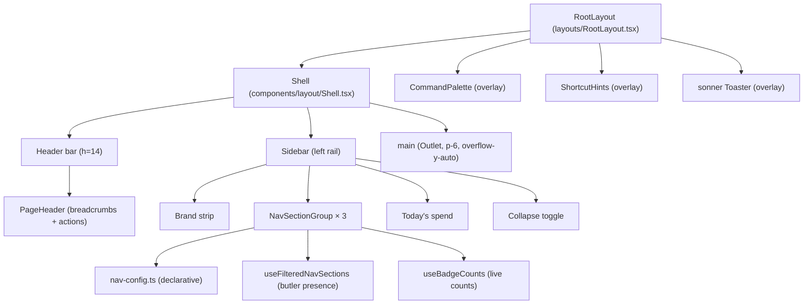
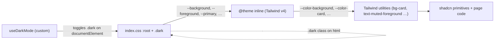

# Frontend Topology

> Status: **observational draft** — first-contact audit by a design
> consultant. This document inventories *where* the dashboard's design
> language is physically embodied today: the shell, the routing
> surface, the page archetypes, the component domains, and the
> token plumbing. The doctrine governing this surface lives in
> [`about/heart-and-soul/design-language.md`](../heart-and-soul/design-language.md).

The dashboard is a single Vite + React 18 SPA bundled into the FastAPI
backend (see `components.md` for the API container). The entry point is
`frontend/src/main.tsx` → `App.tsx` → `router.tsx` → `RootLayout.tsx`.
Everything below describes the layout from `RootLayout` outward.

---

## Composition: The Shell



### Shell layout (`components/layout/Shell.tsx`)
- `flex h-screen overflow-hidden bg-background` outer
- Mobile sidebar: Radix `Sheet` from the left, hidden ≥`md`
- Desktop sidebar: `<aside>` with `md:w-64` (or `md:w-16` collapsed),
  width transition 200ms
- Header: `h-14`, `border-b border-border`, `px-6`, contains hamburger
  (mobile) and `<PageHeader />`
- Main: `flex-1 overflow-y-auto p-6`

This is the only persistent chrome. Pages do not own anything outside
their `Outlet` rectangle.

### PageHeader (`components/layout/PageHeader.tsx`)
- Auto-generates breadcrumbs by splitting `location.pathname` on `/`
  and naive title-casing each segment (`Home / Qa / Investigations`).
- Optional `title` prop renders an h1 *but is never passed today* —
  `RootLayout` mounts `<PageHeader />` with no props. **Result:** every
  page renders its own H1 inline below the chrome, and the
  `PageHeader.title` slot is dead code.
- Right-aligned actions: command-palette button (`Search` icon,
  `Cmd/Ctrl+K`) and a dark-mode toggle. Both are `variant="ghost"`
  `size="sm"` `h-8 w-8 p-0`.

### Sidebar (`components/layout/Sidebar.tsx`)
- Brand: "Butlers" (collapses to "B")
- Three sections, declared in `nav-config.ts`:
  - **Main** — Overview, Butlers, QA (badge), Ingestion, Approvals,
    Memory, Entities, Secrets, Settings
  - **Dedicated Butlers** — Relationships group (Contacts, Groups),
    Education, Health, Calendar, Chronicles
  - **Telemetry** — Timeline, Notifications, Issues, Sessions, Audit
    Log (collapsed by default)
- Items support a `butler` filter so absent butlers hide their nav
  entries (`useFilteredNavSections`).
- Items support a `badgeKey` for live counts (`useBadgeCounts`); only
  QA wires this in today.
- Item glyphs are **the first letter of the label in a 24×24 muted
  square**, not real icons. This was a deliberate "honest cheap"
  choice; it is not currently using `lucide-react` for nav.
- Footer: today's spend (live, via `useCostSummary("today")`).

---

## Routing Surface

All routes are flat children of `RootLayout`, declared in
`router.tsx`. `<Outlet />` renders the active page. There are no
nested layouts.

| Domain | Route | Page component |
|---|---|---|
| Home | `/` | `DashboardPage` |
| Butlers | `/butlers`, `/butlers/:name` | `ButlersPage`, `ButlerDetailPage` |
| Sessions | `/sessions`, `/sessions/:id` | `SessionsPage`, `SessionDetailPage` |
| Telemetry | `/timeline` | `TimelinePage` |
| Telemetry | `/notifications` | `NotificationsPage` |
| Telemetry | `/issues` | `IssuesPage` |
| Telemetry | `/audit-log` | `AuditLogPage` |
| Approvals | `/approvals`, `/approvals/rules` | `ApprovalsPage`, `ApprovalRulesPage` |
| Calendar | `/calendar` | `CalendarWorkspacePage` |
| Relationships | `/contacts`, `/contacts/:contactId` | `ContactsPage`, `ContactDetailPage` |
| Relationships | `/groups` | `GroupsPage` |
| Relationships | `/butlers/relationship/entities/:entityId` | `RelationshipEntityDetailPage` |
| Health | `/health/measurements\|medications\|conditions\|symptoms\|meals\|research` | five pages |
| Costs | `/costs` | `CostsPage` |
| Memory | `/memory`, `/memory/facts/:factId`, `/memory/rules/:ruleId`, `/memory/episodes/:episodeId` | `MemoryPage`, three detail pages |
| Entities | `/entities`, `/entities/:entityId` | `EntitiesPage`, `EntityDetailPage` |
| Settings | `/settings`, `/secrets` | `SettingsPage`, `SecretsPage` |
| Education | `/education` | `EducationPage` |
| Chronicles | `/chronicles` | `ChroniclesPage` |
| QA | `/qa`, `/qa/patrols/:patrolId`, `/qa/investigations`, `/qa/investigations/:attemptId` | four pages |
| Ingestion | `/ingestion`, `/ingestion/connectors/:type/:identity` | `IngestionPage`, `ConnectorDetailPage` |
| Legacy | `/connectors`, `/connectors/:type/:identity` | redirects to `/ingestion` |

**Observed orphans:**
- `/sessions/:id` (`SessionDetailPage`) — not in `nav-config.ts`; only
  reachable from inline links and the SessionDetailDrawer.
- `/butlers/relationship/entities/:entityId` (`RelationshipEntityDetailPage`)
  — under-namespaced; not in nav.
- `/health/research` (`ResearchPage`) — exists in router but no nav
  entry; the Health group only links to `/health/measurements`.

**Stability:** the routing surface is **Maturing** — paths are settling,
but there is unresolved namespace drift between
`/butlers/relationship/entities/:id` and `/entities/:id`, and the
`/connectors → /ingestion` redirect indicates an unfinished move.

---

## Page Archetypes

Pages today fall into roughly five archetypes. There is no shared
`<Page>` wrapper enforcing them, so each page composes the archetype
by hand.

### A. Overview / dashboard
Top-level multi-region surface. Stats bar → primary visualization
→ secondary cards. Examples: `DashboardPage`, `QaOverviewPage`,
`CostsPage`.

Pattern in code:
```tsx
<div className="space-y-6">
  <h1 className="text-2xl|3xl font-bold tracking-tight">…</h1>
  <StatsBar />            // grid grid-cols-2|4 of StatsCard
  <PrimaryRegion />       // topology, chart, kanban, etc.
  <SecondaryGrid />       // grid lg:grid-cols-2 of cards
</div>
```

`StatsCard` is **defined inline in each page** with the same
`Card / CardHeader pb-2 / CardTitle text-sm / CardContent`
boilerplate. There is no shared component. (See doctrine drift #3.)

### B. List / index
Filterable table-of-things. Header + filter bar + table + manual
pagination. Examples: `ButlersPage`, `ContactsPage`, `EntitiesPage`,
`AuditLogPage`, `IngestionPage`, `NotificationsPage`,
`QaInvestigationsPage`.

There is no shared `<DataTable>` component. The shadcn `Table`
primitive is used directly, with each page wiring its own pagination
buttons and filter state.

### C. Detail / drilldown
One-thing-with-tabs. Examples: `ButlerDetailPage`,
`ContactDetailPage`, `EntityDetailPage`, `ConnectorDetailPage`,
`QaInvestigationDetailPage`, `RelationshipEntityDetailPage`,
`FactDetailPage`, `RuleDetailPage`, `EpisodeDetailPage`,
`QaPatrolDetailPage`.

These are the most divergent archetype: layout, header structure,
tab usage, and breadcrumbing all vary. Some use shadcn `Tabs`; some
flatten everything into stacked cards; some rely on side-drawer
context.

### D. Workspace / canvas
Heavy, persistent, stateful. Examples: `ChroniclesPage` (scrubber +
Gantt + map + aggregates with `MapPanContext`),
`CalendarWorkspacePage` (custom hour-grid via inline `style={height}`).

These are *de facto* their own design language. The Chronicles page
in particular reads like a separate product.

### E. Editor / form
Settings, secrets, rule definitions. Examples: `SettingsPage`,
`SecretsPage`, `ApprovalRulesPage` (with `CreateRuleDialog`).

There is no shared form layout. Forms compose `Input`, `Label`,
`Button`, `Dialog`, `Select` directly.

---

## Component Domains

Components are organized by domain under `frontend/src/components/`,
with `ui/` for shadcn primitives and `layout/` for the shell.

### Primitives — `components/ui/` (shadcn)
| Component | File |
|---|---|
| AlertDialog | `alert-dialog.tsx` |
| AutoRefreshToggle | `auto-refresh-toggle.tsx` |
| Badge | `badge.tsx` |
| Breadcrumbs | `breadcrumbs.tsx` |
| Button | `button.tsx` |
| Card (+ Header/Title/Description/Action/Content/Footer) | `card.tsx` |
| Checkbox | `checkbox.tsx` |
| Dialog | `dialog.tsx` |
| DropdownMenu | `dropdown-menu.tsx` |
| EmptyState | `empty-state.tsx` |
| Input | `input.tsx` |
| Label | `label.tsx` |
| Select | `select.tsx` |
| Sheet | `sheet.tsx` |
| ShortcutHints | `shortcut-hints.tsx` |
| Skeleton | `skeleton.tsx` |
| Sonner (toaster wrapper) | `sonner.tsx` |
| Table | `table.tsx` |
| Tabs | `tabs.tsx` |
| Textarea | `textarea.tsx` |
| Toggle | `toggle.tsx` |
| Tooltip | `tooltip.tsx` |

The Button has six variants (`default`, `destructive`, `outline`,
`secondary`, `ghost`, `link`) and eight sizes including
`xs / sm / default / lg` plus four icon variants. Across the app
**`outline` is the default secondary** and **`ghost` is the default
tertiary**, but no rule is documented and the choice is page-author
discretion.

Stability: **Stable** — shadcn primitives are well-tested upstream;
local additions (`empty-state`, `auto-refresh-toggle`,
`shortcut-hints`) are small.

### Shell — `components/layout/`
- `Shell.tsx` — outer frame
- `Sidebar.tsx` + `nav-config.ts` — left rail
- `PageHeader.tsx` — top-bar contents
- `CommandPalette.tsx` — Cmd/Ctrl+K palette (cmdk)

Stability: **Stable** for the shell, **Evolving** for nav config (new
butlers add entries here regularly).

### Domain components — by butler / surface
| Domain | Folder | Notable components |
|---|---|---|
| Butlers detail | `butler-detail/` | 13+ tab components |
| Notifications | `notifications/` | feed, stats bar |
| Memory | `memory/` | tier cards, browser, ConcentricCircles dialog |
| Health | `health/` | measurements, medications, conditions, symptoms, meals |
| Relationships | `relationship/` | contacts, groups, entity views |
| Chronicles | `chronicles/` | Gantt, map, scrubber, aggregations (lazy) |
| Approvals | `approvals/` | actions, rules, metrics |
| Ingestion | `ingestion/` | connectors, timeline, filters, backfill |
| Audit | `audit/` | log table |
| Costs | `costs/` | breakdown, chart |
| Issues | `issues/` | issues panel |
| Sessions | `sessions/` | detail drawer |
| Timeline | `timeline/` | unified timeline |
| Schedules | `schedules/` | schedule table, form |
| Topology | `topology/` | topology graph (xyflow) |
| Skeletons | `skeletons/` | per-domain loading skeletons |
| State | `state/` | state editor |
| Switchboard | `switchboard/` | (small) |
| Activity | `activity/` | (small) |
| Education | `education/` | (small) |
| General | `general/` | (small) |
| Settings | `settings/` | (small) |
| Chat | `chat/` | (small) |
| Secrets | `secrets/` | (small, has top-level table test) |

Stability: **Maturing** overall. The list grows with the roster, and
the shapes of "tab", "detail", "list" components are not yet
codified, so each new butler reinvents them.

---

## Design Token Plumbing



### Sources of truth
- `frontend/src/index.css` declares `:root` with all light-mode oklch
  values plus `--radius` and `--chart-1..5`. The `.dark` selector
  overrides them. The `@theme inline` block exposes them as
  `--color-*` and `--radius-*` for Tailwind v4.
- `frontend/components.json` configures shadcn: style `new-york`,
  base color `neutral`, no prefix, lucide icons.
- `frontend/src/App.css` is essentially empty (one orphan `.app`
  class, never used).
- Dark-mode toggling is handled by a hand-rolled
  `hooks/useDarkMode.ts`, not `next-themes` (despite `next-themes`
  being a declared dependency — it is unused).

### Token leaks (specific evidence)
- `pages/EntitiesPage.tsx:102-113` — six hex codes for entity tier
  colors.
- `pages/EntityDetailPage.tsx:313,316` — `#7c3aed`, `#f59e0b` inline.
- `pages/SymptomsPage.tsx` — three hex codes for severity.
- `pages/GroupsPage.tsx:121` — array of hex codes used as a category
  palette.
- `pages/FactDetailPage.tsx:101`, `pages/RuleDetailPage.tsx:97` —
  inline `style={{ width: \`${pct}%\` }}` for progress bars.
- `pages/CalendarWorkspacePage.tsx:188` —
  `style={{ height: 24 * HOUR_HEIGHT_PX }}` for the day grid.
- `pages/memory/ConcentricCirclesDialog.tsx` — multiple inline
  `style={{ ... }}` for cursor and visibility (could be tailwind
  classes).

These should be either named tokens (`--severity-low`,
`--severity-high`) or chart-palette references (`--chart-1..5`),
not literals.

---

## Cross-Cutting Patterns

### Data fetching
- TanStack Query, with hooks colocated in `frontend/src/hooks/`
  (`use-butlers`, `use-costs`, `use-issues`, `use-notifications`,
  `use-sessions`, `use-qa`, etc.).
- Most pages drive their own loading/error/empty states inline;
  there is no `<QueryBoundary>` wrapper.

### Loading states
- Per-page bespoke skeletons in `components/skeletons/`.
- Some pages use the shadcn `Skeleton` primitive, some hand-roll
  `<div className="h-4 w-2/3 animate-pulse rounded bg-muted" />`.
- No shared "page-level skeleton" matching the page archetype.

### Empty states
- Shared `EmptyState` component exists (`components/ui/empty-state.tsx`)
  but is used inconsistently; some pages render their own inline
  empty markup.

### Error states
- `ErrorBoundary` wraps `<Outlet />` in `RootLayout`.
- Per-page errors are rendered as inline text with `text-destructive`
  or as a `Card` with destructive copy. No shared `<ErrorState>`
  primitive.

### Toasts and confirmations
- `sonner` is mounted once in `RootLayout`; `toast.success / .error`
  is the canonical pattern.
- Confirmations use Radix `AlertDialog`; `window.confirm` is not
  used.

### Modals vs Sheets vs Drawers
- Radix `Dialog` for modals (Create rule, Detail dialogs).
- Radix `Sheet` for side-drawers (`SessionDetailDrawer`,
  `EpisodeDrawer`).
- No custom `Drawer` wrapper. Used as-is.

---

## Inconsistencies Worth Tracking

| Concern | Where it shows up | Note |
|---|---|---|
| H1 size varies | `text-2xl` (DashboardPage:165, CostsPage) vs `text-3xl` (ButlersPage:124, ChroniclesPage:208) | No `<Page>` enforces |
| `StatsCard` reimplemented | DashboardPage:25, CostsPage:20, QaOverviewPage:149 | Candidate for shared `<Stat>` |
| Date formatters disagree | `toLocaleString` (DashboardPage:84, EpisodeDetailPage:140), `toISOString().slice(0,10)` (EntitiesPage:196), `format(...)` from date-fns (GroupsPage:155) | Need `<Time>` primitive |
| Hex literals | EntitiesPage:102-113, EntityDetailPage:313/316, SymptomsPage, GroupsPage:121 | Need named tokens |
| Inline `style={{...}}` | FactDetailPage:101, RuleDetailPage:97, CalendarWorkspacePage:188, ConcentricCirclesDialog | Tailwind arbitrary values |
| Button variant for "secondary" action | `outline` (33 sites) vs `ghost` (7 sites) | No documented rule |
| Empty-state pattern | Shared `EmptyState` vs inline div | Adopt the shared one or replace it |
| `PageHeader.title` slot is dead code | `RootLayout.tsx:15` mounts with no title | Either use it or remove the prop |
| Breadcrumb autobuilder mangles names | `/qa` → "Qa", `/audit-log` → "Audit-log" | Either fix or have pages own crumbs |

Stability of the design language overall: **Maturing** — every part
works, several parts disagree, none of the disagreements are
load-bearing yet. The right time to consolidate is *before* the next
major surface (e.g. another butler with workspace-grade UI like
Chronicles) arrives.

---

## What This Document Does Not Cover

- **Backend topology** — see [`components.md`](components.md) and
  [`integration.md`](integration.md).
- **Capability requirements** — see `openspec/`.
- **API contracts** — see `about/legends-and-lore/rfcs/`.
- **Engineering standards** — see `about/craft-and-care/` (when it
  exists).

This document covers the dashboard's surface. It is the map an
`/impeccable` redesign will be drawn over.
