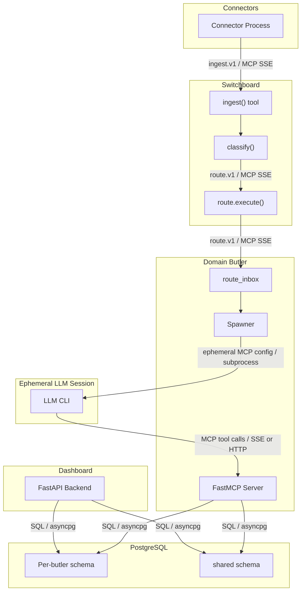

# Integration Points

How subsystems connect at their boundaries: wire protocols, envelope schemas,
and transport details.

---

## Overview

---

## 1. Connector to Switchboard: `ingest.v1`

**Transport**: MCP tool call over SSE (via `CachedMCPClient`)

**Endpoint**: Switchboard's `ingest()` MCP tool

**Envelope schema** (`ingest.v1`, defined in `roster/switchboard/tools/routing/contracts.py`):

| Field | Type | Required | Description |
|---|---|---|---|
| `schema_version` | `"ingest.v1"` | Yes | Fixed version string |
| `source_channel` | SourceChannel enum | Yes | `telegram_bot`, `telegram_user_client`, `email`, `voice`, `api`, `mcp`, `slack` |
| `source_provider` | SourceProvider enum | Yes | `telegram`, `gmail`, `imap`, `internal`, `live-listener`, `slack` |
| `source_endpoint_identity` | string | Yes | Connector instance identity (e.g., bot username) |
| `source_sender_identity` | string | Yes | Sender identifier within the channel |
| `source_thread_identity` | string | No | Thread/conversation identifier for reply targeting |
| `received_at` | RFC3339 datetime | Yes | Timestamp of event reception |
| `content` | string | Yes | Normalized message content |
| `content_type` | string | No | MIME type hint |
| `metadata` | dict | No | Channel-specific metadata |
| `attachments` | list | No | Attachment descriptors |
| `ingestion_tier` | `"full"` / `"metadata"` | No | Ingestion depth |
| `policy_tier` | `"default"` / `"interactive"` / `"high_priority"` | No | Processing priority |

**Validation**: Pydantic model enforces channel-provider compatibility (e.g.,
`telegram_bot` channel requires `telegram` provider).

**Readiness**: Connectors call `wait_for_switchboard_ready()` before entering
their main loop, polling `GET /health` with exponential backoff.

---

## 2. Switchboard to Domain Butler: `route.v1`

**Transport**: MCP tool call over SSE (Switchboard acts as MCP client to the
target butler's MCP server)

**Endpoint**: Target butler's `route.execute()` MCP tool

**Envelope schema** (`route.v1`):

| Field | Type | Required | Description |
|---|---|---|---|
| `schema_version` | `"route.v1"` | Yes | Fixed version string |
| `request_id` | UUID | Yes | Unique request identifier |
| `source_channel` | SourceChannel | Yes | Preserved from ingest envelope |
| `source_endpoint_identity` | string | Yes | Preserved from ingest envelope |
| `source_sender_identity` | string | Yes | Preserved from ingest envelope |
| `source_thread_identity` | string | No | Preserved from ingest envelope |
| `target_butler` | string | Yes | Target butler name |
| `prompt` | string | Yes | Classified message content |
| `conversation_history` | string | No | Recent conversation context |
| `input_context` | dict/string | No | Additional routing context |
| `attachments` | list | No | Attachment references |

**Authorization**: The target butler checks `trusted_route_callers` (default:
`["switchboard"]`) to verify the caller identity. Untrusted callers are
rejected.

**Durability**: On acceptance, the target butler inserts the envelope into
`route_inbox` before returning `{"status": "accepted"}`. Processing happens
asynchronously. Crash recovery re-dispatches `accepted`-state rows on startup.

---

## 3. Spawner to LLM CLI: Ephemeral MCP Config

**Transport**: Subprocess invocation with environment injection

**Mechanism**:

1. Spawner generates a temporary MCP config (JSON) pointing exclusively at
   this butler's MCP endpoint URL.
2. Spawner selects a runtime adapter (Claude Code, Codex, Gemini, OpenCode)
   based on model catalog resolution.
3. Spawner builds CLI arguments via the adapter's `build_args()` method.
4. Spawner injects environment variables:
   - `TRACEPARENT` -- OpenTelemetry trace context propagation
   - Declared credentials from the butler's `env_required`/`env_optional` lists
   - Model-specific API keys
5. Spawner invokes the CLI as a subprocess.

**MCP endpoint URL**: `http://localhost:{port}/mcp` (streamable HTTP) or
`http://localhost:{port}/sse` (legacy SSE).

**Concurrency control**: Two-level semaphore.
- Per-butler: `max_concurrent_sessions` (from `butler.toml`, default 1).
- Global: `BUTLERS_MAX_GLOBAL_SESSIONS` (default 3, across all butlers in-process).

**Session lifecycle**:
- `session_create()` -- DB INSERT before CLI invocation.
- CLI runs, calls MCP tools, returns.
- `session_complete()` -- DB UPDATE with exit code, token counts, cost, tool
  calls, and duration.

---

## 4. LLM Session to Butler: MCP Tool Calls

**Transport**: MCP over streamable HTTP (`/mcp`) or SSE (`/sse`)

**Server**: Butler's FastMCP server (created during daemon startup step 12)

**Available tools**: Core tools (status, trigger, state_*, schedule_*,
sessions_*, notify, remind, get_attachment, module.states, module.set_enabled)
plus all tools registered by enabled modules.

**Approval gating**: Configured tools pass through the approvals module gate
before execution. The gate checks existing approval rules, risk tiers, and
expiry. If no valid approval exists, the tool call is blocked pending human
approval.

**Tool call capture**: All tool calls during a session are captured via
`ContextVar`-based tracking and persisted in the session log.

---

## 5. Dashboard to Database: Direct SQL

**Transport**: asyncpg connection pools (one pool per butler schema)

**Manager**: `src/butlers/api/db.py::DatabaseManager` -- initialized at FastAPI
startup, creates pools for each discovered butler config.

**Access pattern**: The dashboard reads directly from butler databases. It does
not proxy through butler MCP servers. This means:
- Dashboard queries can span multiple butler schemas in a single request.
- Dashboard has read access to shared identity tables.
- Dashboard writes are limited to admin operations (secrets, model catalog,
  provider settings).

**Auto-wiring**: `wire_db_dependencies()` patches FastAPI dependency injection
so butler-specific routers (from `roster/{butler}/api/router.py`) receive the
correct DatabaseManager instance.

---

## 6. Butler to Butler: MCP via Switchboard

**Rule**: Butlers never communicate directly. All inter-butler communication
flows through the Switchboard.

**Mechanism**: A butler's LLM session can call `notify()` which routes through
the Switchboard's notification tools. There is no direct MCP client connection
between domain butlers.

**Exception**: The Switchboard itself holds MCP client connections to all
registered domain butlers for route dispatch.

---

## 7. Non-Switchboard Butler to Switchboard: Registration

**Transport**: MCP client connection + HTTP POST

On startup, each non-switchboard butler:
1. Opens an MCP client to `{switchboard_url}/mcp` (step 11b in daemon startup).
2. Launches a liveness reporter that POSTs to
   `{switchboard_url}/api/switchboard/heartbeat` every
   `heartbeat_interval_seconds` (default 120s).

The Switchboard uses this to maintain a butler registry with liveness state,
capability declarations, and last-seen timestamps.

---

## 8. Connector Heartbeat: Liveness Reporting

**Transport**: MCP tool call (`connector.heartbeat`)

**Payload**:
- `instance_id` -- stable UUID generated at process startup
- `connector_type` -- e.g., `telegram_bot`, `gmail`
- `endpoint_identity` -- e.g., bot username, email address
- `version` -- connector version string
- `counters` -- current metric values (messages ingested, errors, etc.)
- `health` -- derived health state

**Interval**: `CONNECTOR_HEARTBEAT_INTERVAL_S` (default 120s, min 30s, max 300s)

**Failure behavior**: Heartbeat failures are logged but never crash or block
ingestion.

---

## 9. Observability: Trace Propagation

**Protocol**: W3C Trace Context (`TRACEPARENT` header/env var)

**Propagation path**:
1. Connector creates a root span for each ingested event.
2. Switchboard receives the trace context via MCP call metadata.
3. Switchboard creates child spans for triage, classification, and routing.
4. Route dispatch to target butler carries trace context.
5. Target butler's route.execute creates a linked span.
6. Spawner injects `TRACEPARENT` into the LLM CLI subprocess environment.
7. The LLM CLI (if instrumented) joins the trace.

This produces an end-to-end trace from external event arrival through
classification, routing, and session execution.

---

## Protocol Summary

| Boundary | Protocol | Envelope | Transport |
|---|---|---|---|
| Connector -> Switchboard | MCP | `ingest.v1` | SSE |
| Switchboard -> Domain Butler | MCP | `route.v1` | SSE |
| Spawner -> LLM CLI | Subprocess | Ephemeral MCP config + env vars | stdin/env |
| LLM CLI -> Butler | MCP | Tool calls | Streamable HTTP or SSE |
| Dashboard -> Database | SQL | asyncpg queries | TCP |
| Butler -> Database | SQL | asyncpg queries | TCP |
| Connector -> Switchboard (heartbeat) | MCP | `connector.heartbeat` | SSE |
| Butler -> Switchboard (liveness) | HTTP POST | JSON heartbeat | HTTP |
| All -> OTel | OTLP | Traces + metrics | gRPC |
