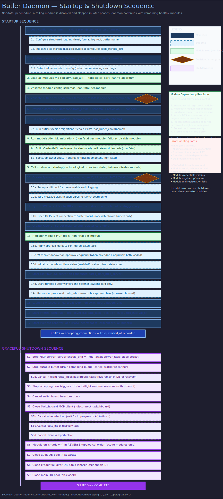

# Butler Daemon Internals

> **Purpose:** Describes the internal architecture of the butler daemon — the central orchestrator for every butler instance.
> **Audience:** Developers extending butlers, operators debugging startup failures, architects understanding the lifecycle.
> **Prerequisites:** [System Topology](system-topology.md), [Database Design](database-design.md).

## Overview

Every butler in the system is a long-running Python process managed by the `ButlerDaemon` class (`src/butlers/daemon.py`). The daemon owns the full lifecycle of a butler: loading configuration, provisioning infrastructure, wiring modules, and serving MCP tools over an SSE transport. It is the single entry point for both `butlers run --config` (single butler) and `butlers up` (multi-butler) execution modes.

## Startup Sequence

The daemon follows a deterministic multi-phase startup. Each phase depends on the successful completion of the previous one. If any phase fails, already-initialized modules receive their `on_shutdown()` call before the process exits.

### Phase 1: Load and Validate Config

The daemon reads `butler.toml` from the config directory and parses it into a `ButlerConfig` dataclass. Required fields (`name`, `port`) are validated. Environment variable references (`${VAR_NAME}`) in config values are resolved; unresolved required references are startup-blocking errors.

### Phase 2: Initialize Telemetry

`init_telemetry(service_name)` and `init_metrics(service_name)` are called to set up the global OpenTelemetry `TracerProvider` and `MeterProvider`. When `OTEL_EXPORTER_OTLP_ENDPOINT` is not set, both fall back to no-op providers. A guard flag prevents duplicate provider installation when multiple butlers run in the same process.

### Phase 3: Initialize Modules (Topological Order)

The daemon resolves enabled modules from the `[modules.*]` sections in `butler.toml` using the `ModuleRegistry`. Module dependencies are sorted topologically — cycles are startup-blocking errors. Unknown module names also block startup. Each module's `config_schema` (a Pydantic model) is validated against the TOML config section.

### Phase 4: Validate Credentials

Butler-level `[butler.env].required` and `[butler.env].optional` variables are checked. Missing required variables block startup. Module-scoped credential env declarations (e.g., `token_env` for Telegram) are also validated. This phase performs fast-fail env-only checks before any database work.

### Phase 5: Provision Database

The `Database` class connects to the PostgreSQL `postgres` maintenance database and creates the butler's target database if it doesn't exist. For the target-state one-db/multi-schema topology, a single database named `butlers` is shared by all butler instances; each butler operates within its own schema, with `shared` and `public` included in the search path.

### Phase 6: Run Core Migrations

Alembic migrations are run programmatically via `run_migrations(db_url, chain="core", schema=...)`. The core chain creates the three mandatory tables present in every butler schema: `state`, `scheduled_tasks`, and `sessions`. The `session_process_logs` table is also created here for ephemeral process diagnostics.

### Phase 7: Run Module Migrations

Each enabled module may declare migration chains via `migration_revisions()`. Module chains are discovered from `src/butlers/modules/<name>/migrations/` and `roster/<name>/migrations/`. All chains are upgraded to head in sequence.

### Phase 8: Create CredentialStore and Module on_startup

A `CredentialStore` is created for DB-first credential resolution (with env-var fallback). Module credentials are validated asynchronously via the store. Then each module's `on_startup(config, db)` is called in topological order. This is where modules open connections to external services, start background tasks, or initialize caches.

### Phase 9: Create Spawner

The `Spawner` is initialized with the butler's config, config directory, connection pool, module credential mappings, and a `RuntimeAdapter` (defaulting to `ClaudeCodeAdapter`). The spawner verifies that the configured runtime binary (e.g., `claude`, `codex`, `gemini`) is on `PATH` and fails fast if missing.

### Phase 10: Sync Schedules

`sync_schedules()` reads `[[butler.schedule]]` entries from `butler.toml` and upserts them into the `scheduled_tasks` table. New tasks are inserted with `source='toml'`. Changed tasks (cron or prompt modified) are updated. Tasks present in the DB but removed from TOML are disabled. Each task's `next_run_at` is computed via `croniter` with deterministic staggering.

### Phase 11: Create FastMCP and Register Tools

A `FastMCP` server is created and core MCP tools are registered: `status`, `trigger`, `route.execute`, `tick`, state tools (`state_get`, `state_set`, `state_delete`, `state_list`), schedule tools, session tools, `notify`, and `remind`. Module tools are then registered via each module's `register_tools(mcp, config, db)` method. If an approvals module is configured, approval gates are applied to designated gated tools.

### Phase 12: Start Server and Background Tasks

The FastMCP SSE server starts on the configured port via uvicorn. For non-switchboard butlers, a heartbeat task registers with the Switchboard and a liveness reporter sends periodic health pings. An internal scheduler loop calls `tick()` at a configurable interval (default 60 seconds). For switchboard butlers, the message classification pipeline is wired up.

## Core Components

### State Store

A key-value store backed by the `state` table (JSONB values). Provides `state_get`, `state_set`, `state_delete`, and `state_list` operations. Used by both the daemon itself (e.g., tracking disambiguation notifications) and by LLM runtime instances through MCP tools.

### Scheduler

Cron-driven task dispatch. The scheduler maintains a `scheduled_tasks` table with cron expressions evaluated by `croniter`. On each `tick()`, due tasks are dispatched through the spawner. Tasks support two dispatch modes: `prompt` (sends text to the LLM CLI) and `job` (sends structured job name + arguments). See [Scheduler Execution](../runtime/scheduler-execution.md) for runtime behavior details.

### Session Log

An append-only record of LLM CLI invocations. Each session row is created before the runtime is invoked and completed when it returns. Fields include prompt, trigger source, model, duration, token counts, tool calls, and outcome. The only mutation after creation is `session_complete`. See [Session Lifecycle](../runtime/session-lifecycle.md).

### Spawner

The component that invokes ephemeral AI runtime instances. Controlled by an `asyncio.Semaphore` for per-butler concurrency limiting (default 1 = serial dispatch) and a process-wide global semaphore (default 3 max concurrent sessions across all butlers). See [Spawner](../runtime/spawner.md).

## Module Loading

Modules implement the `Module` abstract base class. The loading process:

1. The `ModuleRegistry` maps module names to their implementation classes.
2. Enabled modules are read from `butler.toml` `[modules.*]` sections.
3. Dependencies declared by each module (via the `dependencies` property) are resolved into a topological order using a deterministic sort.
4. Circular dependencies are detected and reported as startup errors.
5. Modules are initialized, started, and their tools registered in dependency order.
6. On shutdown, modules are torn down in reverse topological order.

Each module has a well-defined lifecycle: `config_schema` validation, `migration_revisions()` for DB setup, `on_startup()` for initialization, `register_tools()` for MCP tool registration, and `on_shutdown()` for cleanup.

## Graceful Shutdown

The shutdown sequence is the inverse of startup:

1. Stop the MCP server (stop accepting new connections).
2. Stop accepting new triggers on the spawner.
3. Drain in-flight runtime sessions within the configurable timeout (`[butler.shutdown].timeout_s`).
4. Cancel the switchboard heartbeat task.
5. Close the Switchboard MCP client connection.
6. Cancel the scheduler loop (waits for any in-progress `tick()` to complete).
7. Cancel the liveness reporter loop.
8. Shut down modules in reverse topological order via `on_shutdown()`.
9. Close the database connection pool.

## Related Pages

- [System Topology](system-topology.md) — how butlers fit into the overall service architecture
- [Database Design](database-design.md) — schema isolation and migration strategy
- [Observability](observability.md) — telemetry initialization details
- [Spawner](../runtime/spawner.md) — the runtime invocation component
- [Scheduler Execution](../runtime/scheduler-execution.md) — cron-driven task dispatch behavior
