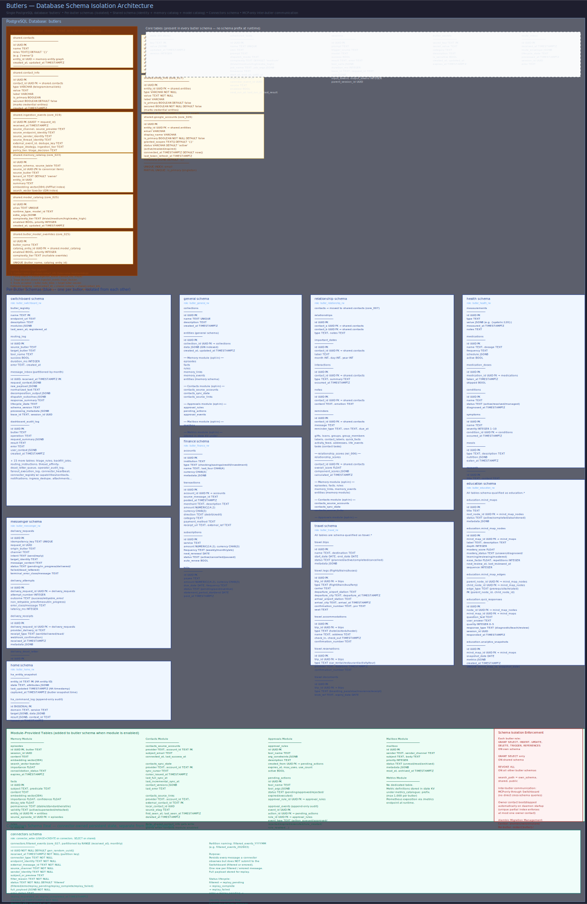

# Database Design

> **Purpose:** Describes the PostgreSQL database architecture — schema isolation, shared tables, JSONB patterns, and migration strategy.
> **Audience:** Developers adding tables or migrations, operators managing the database, architects evaluating the data model.
> **Prerequisites:** [System Topology](system-topology.md).

## Overview



Butlers uses a single PostgreSQL database with per-butler schema isolation. Each butler operates within its own schema, with access to the `public` schema for cross-butler data (contacts, model catalog, credentials) and the `public` schema as a fallback. This design provides strong data boundaries between butlers while allowing shared identity and configuration data through a controlled surface.

## Schema Isolation Model

### Per-Butler Schemas

Each butler gets its own PostgreSQL schema (e.g., `switchboard`, `general`, `relationship`, `health`, `messenger`). The `Database` class in `src/butlers/db.py` configures the connection pool's `search_path` to `<butler_schema>, public` at connection time:

```python
def schema_search_path(schema: str | None) -> str | None:
    search_path: list[str] = []
    for part in (normalized, "public"):
        if part not in search_path:
            search_path.append(part)
    return ",".join(search_path)
```

This means unqualified table references in SQL queries resolve first to the butler's own schema, then to `public`, then to `public`. Butler code never needs to qualify table names with schema prefixes for its own tables or shared tables.

### Cross-Butler Tables (in `public`)

The `public` schema contains cross-butler data that must be accessible to all butlers:

**`public.contacts`** — The canonical contact registry. One row per known person/actor. Includes a `roles` array (e.g., `['owner']`) and optional `entity_id` foreign key to the memory butler's entity graph. Bootstraps with an "Owner" contact on first startup.

**`public.contact_info`** — Per-channel identifiers linked to contacts (e.g., Telegram chat ID, email address). UNIQUE on `(type, value)`. Entries with `secured=true` hold credential data (email passwords, API keys) and are masked in API list responses.

**`public.model_catalog`** — The model catalog for dynamic model routing. Contains runtime types, model IDs, complexity tiers, priority rankings, and extra CLI arguments.

**`public.butler_model_overrides`** — Per-butler overrides for model catalog entries. Allows individual butlers to remap enabled state, priority, and complexity tier without duplicating catalog rows.

**`public.token_limits`** — Token budget configuration per model catalog entry, with 24-hour and 30-day rolling windows.

**`public.token_usage_ledger`** — Token usage records for quota enforcement. Best-effort writes that never block session execution.

**`public.provider_config`** — Provider-specific configuration (e.g., Ollama base URL) for runtime adapters.

### Isolation Invariants

- Each butler can only access its own schema plus `public`
- Direct cross-butler schema access is prohibited
- Inter-butler communication happens exclusively via MCP tool calls through the Switchboard
- Cross-butler foreign keys are never created

## Core Tables

Every butler schema contains three mandatory core tables, created by the `core` migration chain:

### `state`

A key-value store with JSONB values. Used by the `state_get`, `state_set`, `state_delete`, and `state_list` MCP tools. Keys are text strings; values are arbitrary JSON.

### `scheduled_tasks`

The scheduler's task registry. Contains cron expressions, dispatch mode (`prompt` or `job`), execution metadata (last run, next run, last result), source tracking (`toml` vs `db`), and optional calendar projection fields. See [Scheduler Execution](../runtime/scheduler-execution.md) for details.

### `sessions`

An append-only log of LLM CLI invocations. Each row represents one ephemeral runtime session. Created before invocation, completed after. Fields include prompt, trigger source, model, duration, token counts (input/output), tool calls (JSONB), cost data, and outcome. The only mutation after creation is `session_complete`.

### `session_process_logs`

Ephemeral process-level diagnostics (stderr, exit code, PID, command) from runtime adapter invocations. Stored in a separate table because process logs have a TTL (default 14 days) and are periodically cleaned up, unlike the append-only session log. Stderr is capped at 32 KiB per row.

## JSONB Patterns

The database makes heavy use of PostgreSQL JSONB columns for flexible, schema-light storage:

- **State store values** — arbitrary JSON stored as JSONB, enabling dynamic key-value storage without schema changes.
- **Tool calls** — session tool call records are stored as JSONB arrays, capturing the full call graph of each LLM session.
- **Cost data** — token usage and cost breakdowns stored as JSONB objects on session rows.
- **Last result** — scheduler task outcomes (success result or error object) stored as JSONB.
- **Job args** — structured arguments for `job`-mode scheduled tasks stored as JSONB objects.
- **Triage rule conditions** — pre-classification rule matching conditions stored as JSONB with type-specific schemas (sender_domain, sender_address, header_condition, mime_type).
- **Route envelopes** — full routing envelopes stored as JSONB in the route_inbox for crash recovery and audit.

JSONB columns are validated at the application layer (Pydantic models, explicit type checks) before insertion. Indexes use GIN where query patterns warrant it (e.g., triage rule conditions).

## Database Provisioning

The `Database` class (`src/butlers/db.py`) handles both provisioning and connection pool management:

1. **Provisioning** connects to the `postgres` maintenance database and creates the target database if it doesn't exist. Template collation versions are refreshed to handle OS/container updates.
2. **Connection pool** creation uses `asyncpg.create_pool()` with configurable min/max sizes (default 2-10) and optional SSL mode. The `server_settings` parameter sets the `search_path` for schema isolation.
3. **SSL handling** includes automatic retry with `ssl=disable` when an SSL upgrade connection loss is detected (common in containerized environments).

Connection parameters are resolved from environment variables: `DATABASE_URL` (libpq-style) takes precedence, with individual `POSTGRES_*` variables as fallback.

## Migration Strategy

Migrations are managed by Alembic, run programmatically at startup (no CLI shelling). The migration runner (`src/butlers/migrations.py`) supports three chain types:

### Core Chain

Lives in `alembic/versions/core/`. Contains migrations for the three mandatory core tables. Always runs first. Targets the butler's own schema.

### Module Chains

Discovered from `src/butlers/modules/<name>/migrations/`. Each module with persistent data provides its own migration chain. Module chains are discovered automatically by scanning for `.py` files in migration directories.

### Butler-Specific Chains

Discovered from `roster/<name>/migrations/`. Individual butlers can define role-specific migrations for domain tables (e.g., the Switchboard's `routing_log`, `ingestion_events`, `triage_rules`).

### Execution

All chains are resolved and their version locations registered with Alembic so cross-chain revision references resolve correctly. Chains are upgraded in sequence: core first, then modules, then butler-specific. Each chain is upgraded to its head revision. Schema targeting ensures migrations create tables in the correct schema via the `butlers.target_schema` Alembic option.

## Verification

To confirm the database design described here matches the live schema:

```bash
# 1. Shared public tables exist with expected columns
psql -h localhost -U butlers -d butlers -c \
  "SELECT table_name FROM information_schema.tables WHERE table_schema = 'public' ORDER BY table_name;"
# Expected: contacts, contact_info, model_catalog, butler_model_overrides,
#           token_limits, token_usage_ledger, provider_config present

# 2. Per-butler schema isolation is enforced
# The general butler should see its own tables but not the switchboard's
psql -h localhost -U butlers -d butlers \
  -c "SET search_path TO general,public; SELECT table_name FROM information_schema.tables WHERE table_schema='general';"
# Expected: state, scheduled_tasks, sessions, session_process_logs — NO switchboard tables

# 3. Core tables present in every butler schema
psql -h localhost -U butlers -d butlers -c \
  "SELECT schemaname, tablename FROM pg_tables
   WHERE tablename IN ('state','scheduled_tasks','sessions')
   ORDER BY schemaname, tablename;"
# Expected: each active butler schema (general, relationship, health, messenger, switchboard)
#           has all three core tables

# 4. JSONB value pattern works for state store
psql -h localhost -U butlers -d butlers -c \
  "SELECT key, jsonb_typeof(value) AS value_type FROM general.state LIMIT 5;"
# Expected: rows return without error; value_type is a valid JSONB type (object, string, etc.)

# 5. Alembic migration chains are at head for all active butlers
# Run alembic heads check (no upgrade needed means schema is current)
uv run alembic -c alembic.ini heads
# Expected: output lists heads for core, module, and butler-specific chains
```

## Related Pages

- [System Topology](system-topology.md) — how the database fits into the overall architecture
- [Butler Daemon](butler-daemon.md) — database provisioning and migration during startup
- [Session Lifecycle](../runtime/session-lifecycle.md) — how session records are created and completed
- [Model Routing](../runtime/model-routing.md) — the shared model catalog tables
