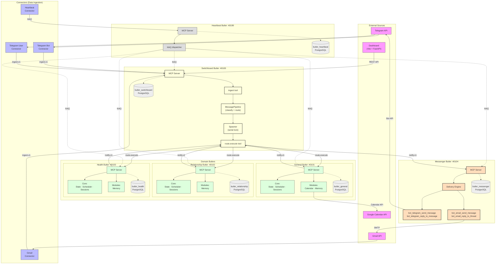
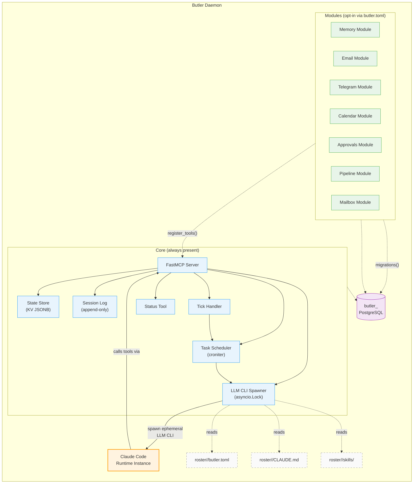
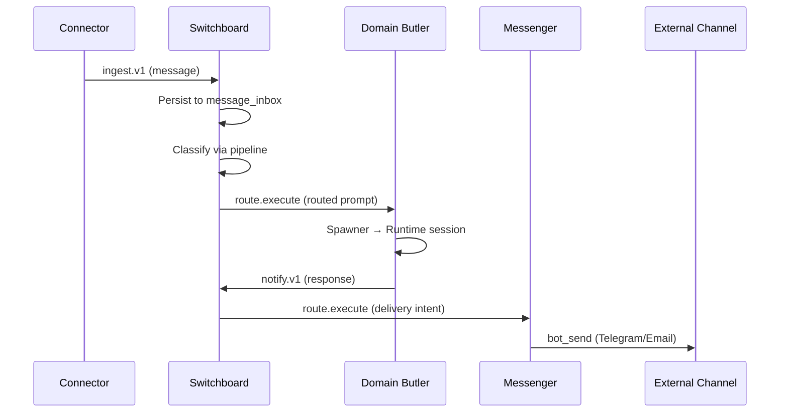
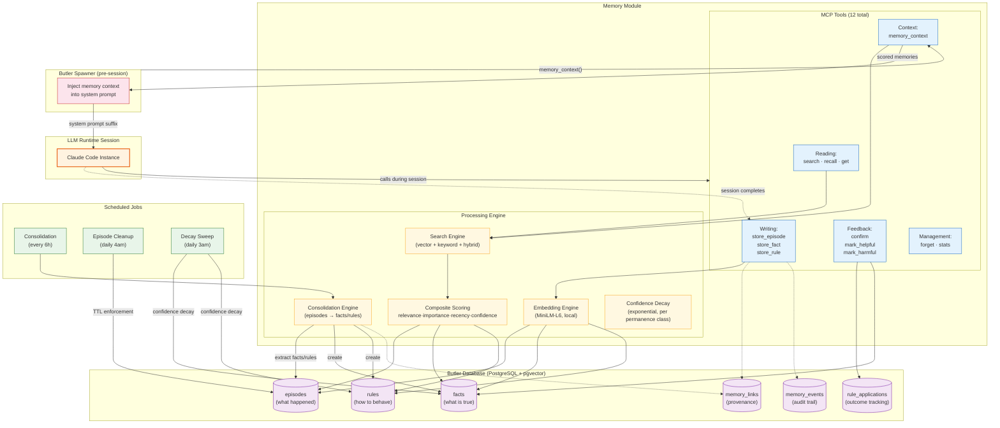
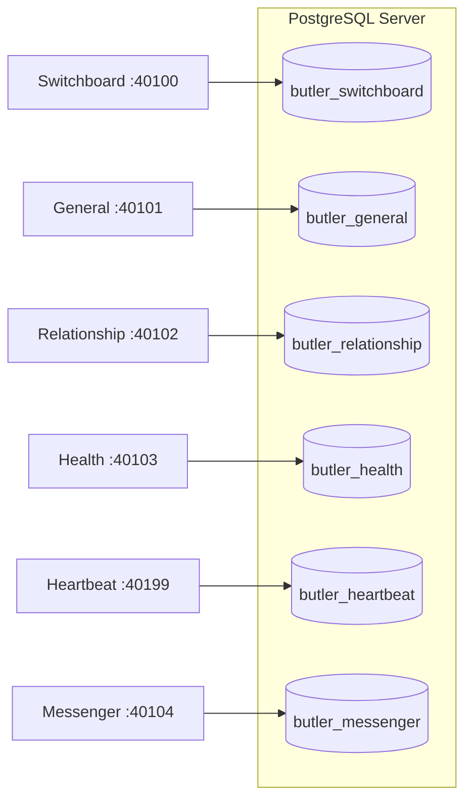

# System Architecture

Status: Normative
Last updated: 2026-02-18

## 1. Overview

Butlers is a multi-agent system where each **butler** is a long-running MCP server daemon with isolated state, opt-in modules, and ephemeral LLM runtime sessions. Butlers communicate exclusively through MCP tool calls routed by a central **Switchboard**.

---

## 2. System Topology



### Key constraints

- **Database isolation**: Each butler owns a dedicated PostgreSQL database. No cross-butler DB access.
- **MCP-only communication**: Butlers interact exclusively through MCP tool calls routed via the Switchboard.
- **Serial dispatch**: Each butler processes one LLM session at a time (configurable concurrency planned).
- **Channel egress ownership**: Only the Messenger butler holds bot-scoped send/reply tools.

---

## 3. Butler Internal Architecture

Every butler shares the same two-layer design: **core** (always present) and **modules** (opt-in).



### Trigger flow

```
1. Trigger arrives (MCP call, cron task, or heartbeat tick)
2. Spawner acquires lock (serial dispatch)
3. Creates session record
4. Loads config + personality (CLAUDE.md) + skills
5. Fetches memory context (if memory module enabled)
6. Generates locked-down MCP config (this butler only)
7. Spawns ephemeral Claude Code instance via SDK
8. Runtime instance calls butler's MCP tools
9. Session completes → stores episode (if memory enabled)
10. Logs session, releases lock
```

---

## 4. Ingress and Egress

### Ingress paths (data enters the system)

| Source | Connector | Entry Point | Protocol |
|--------|-----------|-------------|----------|
| Telegram messages | `telegram_bot.py` | Switchboard `ingest` | `ingest.v1` via MCP |
| Telegram (user account) | `telegram_user_client.py` | Switchboard `ingest` | `ingest.v1` via MCP |
| Gmail | `gmail.py` | Switchboard `ingest` | `ingest.v1` via MCP |
| Heartbeat | `heartbeat.py` | Each butler `tick()` | MCP tool call |
| Dashboard | Vite frontend | FastAPI REST API | HTTP |
| External MCP clients | Direct | Butler `trigger()` tool | MCP |

Connectors are semaphore-bounded (default 8 concurrent fetches). The Switchboard accepts and persists messages in <10ms, then classifies asynchronously.

### Egress paths (data leaves the system)

| Destination | Owner | Tools | Protocol |
|-------------|-------|-------|----------|
| Telegram (bot sends) | Messenger | `bot_telegram_send_message`, `bot_telegram_reply_to_message` | Bot API |
| Email (bot sends) | Messenger | `bot_email_send_message`, `bot_email_reply_to_thread` | SMTP |
| Google Calendar | General | `calendar_create_event`, `calendar_update_event` | Calendar API |

All user-facing egress flows through the Messenger butler via the `notify.v1` contract. Domain butlers call `notify()` which routes through the Switchboard to the Messenger for delivery. This ensures a single egress control plane with audit, approval gates, and identity-scoped tooling.

### Module internet access

Modules can access external services directly using their configured credentials:

- **Calendar module**: Google Calendar API (list, create, update events)
- **Email module**: IMAP/SMTP for inbox reads (ingress is via connector, but runtime search tools also access IMAP)
- **Telegram module**: Telegram API for get_updates calls during runtime sessions

These are read-oriented or bidirectional operations. Outbound **sending** of messages is exclusively owned by the Messenger butler.

---

## 5. Inter-Butler Communication



### Routing rules

The Switchboard's `MessagePipeline` classifies messages by domain:

| Domain | Keywords / Signals | Target |
|--------|-------------------|--------|
| Relationship | person, contact, gift, social | `relationship` butler |
| Health | medication, symptoms, exercise, diet | `health` butler |
| General | ambiguous or unclassifiable | `general` butler |

Multi-domain messages are decomposed into focused sub-prompts, each routed to the appropriate specialist.

### `route.execute` contract

```
Request:  schema_version, request_context, input, target, source, trace
Response: status (success|error), output, tool_calls, delivery_ids
Errors:   validation_error, target_unavailable, timeout, overload_rejected, internal_error
Retry:    Only target_unavailable, timeout, overload_rejected are retryable
```

---

## 6. Memory System

The memory module is a reusable module loaded by each butler that enables it. Memory data lives in the butler's own database — there is no shared memory service.



### Three memory types

| Type | Purpose | Lifecycle | Retention |
|------|---------|-----------|-----------|
| **Episodes** | Raw session observations ("what happened") | Created → TTL expiry | Default 7 days, max 10K entries |
| **Facts** | Distilled knowledge ("what is true") | `active → fading → expired` or `superseded`/`retracted` | Confidence-decay based |
| **Rules** | Procedural guidance ("how to behave") | `candidate → established → proven` or `anti_pattern` | Effectiveness-based maturity |

### Confidence decay

```
effective_confidence = confidence × exp(−decay_rate × days_since_last_confirmed)
```

| Permanence Class | Half-life | Use Case |
|------------------|-----------|----------|
| `permanent` | Never decays | Identity, biographical constants |
| `stable` | ~1 year | Long-term preferences |
| `standard` | ~3 months | Ongoing interests, projects |
| `volatile` | ~weeks | Temporary states, plans |
| `ephemeral` | ~days | Transient observations |

### Context assembly (pre-session)

Before each LLM session, the spawner calls `memory_context()` which:

1. Runs hybrid search (vector + keyword) against the trigger prompt
2. Scores results: `0.4×relevance + 0.3×importance + 0.2×recency + 0.1×confidence`
3. Applies section quotas (facts, rules, episodes)
4. Token-budgets the output (default 3000 tokens)
5. Injects the result as a system prompt suffix after `CLAUDE.md`

### Consolidation pipeline

Every 6 hours, the consolidation engine processes unconsolidated episodes:

```
episodes (batch) → LLM extraction → candidate facts/rules
  → dedup against existing facts (supersession if conflict)
  → persist with provenance links back to source episodes
  → mark episodes as consolidated
```

---

## 7. Database Architecture

Each butler has a dedicated PostgreSQL database. There is no shared database or cross-butler queries.



### Shared schema (core tables, all butlers)

| Table | Purpose |
|-------|---------|
| `state` | Key-value JSONB store |
| `scheduled_tasks` | Cron-driven task definitions |
| `sessions` | Append-only session audit log |

### Module-specific tables (present when module enabled)

| Module | Tables |
|--------|--------|
| Memory | `episodes`, `facts`, `rules`, `memory_links`, `memory_events`, `rule_applications`, `embedding_versions` |
| Approvals | `approval_rules`, `approval_events`, `approval_constraints` |
| Mailbox | `message_inbox` (Switchboard only) |
| Pipeline | Uses `message_inbox` + routing metadata |

### Connection management

- **Pool**: asyncpg, min 2 / max 10 connections per butler
- **Provisioning**: `Database.provision()` creates the DB if absent
- **Migrations**: Alembic with multi-chain architecture (core + module chains)
- **SSL**: Configurable (`disable`, `prefer`, `require`, `verify-ca`, `verify-full`)

---

## 8. Module System

Modules are pluggable units that add MCP tools to a butler. They implement the `Module` abstract base class and are registered via topological sort based on declared dependencies.

### Module lifecycle

```
1. Load butler.toml → identify enabled modules
2. Resolve dependencies (topological sort)
3. Run module migrations (per-module Alembic chains)
4. Call on_startup() for each module
5. Call register_tools() → adds tools to FastMCP server
6. Apply approval gates (if approvals module enabled)
7. Butler serves requests...
8. Call on_shutdown() on teardown
```

### Identity-scoped I/O

Channel modules (Telegram, Email) expose tools with explicit identity prefixes:

- **`user_*` tools**: Act through the user's personal account (e.g., user's Gmail). Send/reply tools are approval-gated by default.
- **`bot_*` tools**: Act through butler-owned service accounts. Approval is policy-configurable.

This ensures clear identity accountability, audit clarity, and safety-by-default for user impersonation.

---

## 9. Related Documents

- [Concurrency Architecture](concurrency.md) — Spawner serialization, backpressure, planned concurrency pool
- [Memory Project Plan](../MEMORY_PROJECT_PLAN.md) — Full memory module design, schemas, milestones
- [Module I/O Model](../modules/io_model.md) — Identity-scoped tooling contract
- [Connector Interface](../connectors/interface.md) — `ingest.v1` contract
- [Switchboard Operator Runbook](../operations/switchboard_operator_runbook.md)
- [Messenger Butler Role](../roles/messenger_butler.md) — `notify.v1` delivery contract
