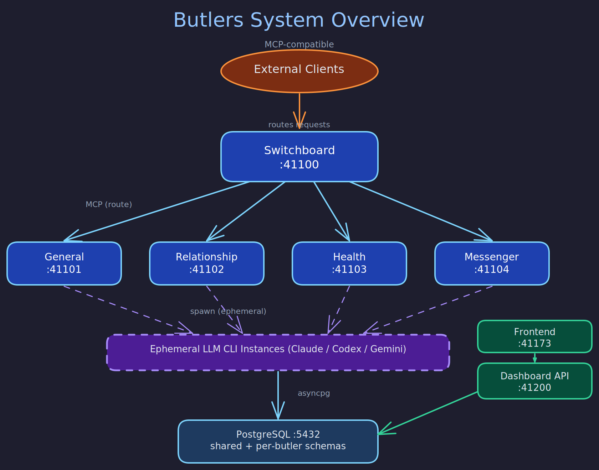

# System Topology

> **Purpose:** Describes the overall system architecture — services, ports, communication patterns, and deployment topology.
> **Audience:** New developers onboarding, operators deploying the system, architects evaluating the design.
> **Prerequisites:** None (this is a good starting point for understanding the system).

## Overview



Butlers is a personal AI agent system where each butler is a long-running MCP (Model Context Protocol) server daemon. The system follows a hub-and-spoke architecture: a central Switchboard routes requests to domain-specific butlers, each running as an independent service. All services share a single PostgreSQL database with per-butler schema isolation, and communicate exclusively via MCP over SSE transport.

## Service Map

| Service | Port | Role |
|---|---|---|
| **Switchboard** | 41100 | Message router — single ingress point for all channels. Routes MCP requests to domain butlers via LLM-based classification. |
| **General** | 41101 | Catch-all assistant with collections, entities, and freeform data. Handles requests that don't map to a specialist. |
| **Relationship** | 41102 | Personal CRM — contacts, interactions, gifts, activity feed, important dates. |
| **Health** | 41103 | Health tracking — measurements, medications, conditions, symptoms, care routines. |
| **Messenger** | 41104 | Delivery relay — Telegram bot, Telegram user-client, and email channel outputs. All external user-facing messages route through here. |
| **Dashboard API** | 41200 | Web UI backend — monitoring, management, configuration, and butler control. |
| **Frontend** | 41173 | Vite dev server (development only) — serves the React dashboard. |
| **PostgreSQL** | 5432 | Shared database server — one database, per-butler schemas plus `public`. |

OTLP HTTP traces are sent to an external Alloy instance on port 4318 (not exposed locally).

## Communication Patterns

### MCP over SSE

All inter-service communication between butlers uses the Model Context Protocol over Server-Sent Events (SSE) transport. Each butler runs a FastMCP server that exposes its tools as MCP endpoints.

The Switchboard connects to domain butlers as an MCP client, calling their `route.execute` tool to dispatch classified requests. Domain butlers similarly connect to the Switchboard to register themselves and participate in the routing registry.

### Request Flow

```
External Client
      |
      v
Switchboard (:41100)
      |
      +---> General (:41101)
      |
      +---> Relationship (:41102)
      |
      +---> Health (:41103)
      |
      +---> Messenger (:41104) ---> Telegram / Email
```

1. An external trigger arrives at the Switchboard (from a Telegram connector, email connector, or direct MCP call).
2. The Switchboard assigns canonical request context (UUID7 request_id, source metadata).
3. Pre-classification triage rules are evaluated for deterministic routing.
4. If needed, an LLM classification session determines the target butler(s).
5. The Switchboard dispatches via `route.execute` on the target butler's MCP server.
6. The target butler processes the request through its spawner (invoking an ephemeral LLM CLI instance).
7. If the butler needs to send a message to the user, it calls `notify`, which the Switchboard routes to the Messenger butler for delivery.

### Database Access

All butlers connect to the same PostgreSQL database. Schema isolation is enforced at the connection level — each butler's connection pool sets `search_path` to `<butler_schema>, public`. Butlers never access each other's schemas directly; inter-butler data exchange happens exclusively through MCP tool calls.

### Observability Pipeline

```
Butler Daemon
      |
      | (OTLP HTTP)
      v
External Alloy (:4318)
      |
      v
Grafana Tempo (traces)
```

OpenTelemetry traces and metrics are exported via OTLP HTTP to an external Grafana Alloy instance. Trace context propagation crosses service boundaries via `traceparent` environment variables passed to spawned LLM CLI instances. This connects the butler daemon's orchestration spans with the tool execution spans inside runtime sessions.

## Deployment Modes

### Development

The `./scripts/dev.sh` script starts the full environment in tmux panes:

- PostgreSQL via Docker Compose
- All butler daemons via `butlers up`
- Telegram and email connectors
- Dashboard API and Vite frontend dev server

Alternatively, services can be started individually with `butlers run --config <path>` or selectively with `butlers up --only <name>`.

### Production

All services run in Docker containers. The Dockerfile builds an image with Python 3.12, Node.js 22, the `claude` CLI, and `uv`. Each butler service mounts its config directory read-only:

```
uv run butlers run --config /app/butler-config/butler.toml
```

Docker Compose orchestrates the full stack including PostgreSQL, all butler services, the Dashboard API, and the frontend.

## Butler Configuration

Each butler is defined by a git-backed config directory under `roster/`:

```
roster/<butler-name>/
  butler.toml       # Identity, port, schedules, modules config
  CLAUDE.md         # System prompt / personality
  MANIFESTO.md      # Public-facing identity and purpose
  AGENTS.md         # Runtime agent notes
  .agents/skills/   # Skill definitions
  .claude -> .agents  # Claude Code compatibility symlink
  api/              # Optional dashboard API routes
  migrations/       # Optional butler-specific DB migrations
```

The `butler.toml` file is the canonical configuration source, declaring the butler's name, port, database target, runtime type, enabled modules, scheduled tasks, environment variable requirements, and shutdown timeouts.

## Registry and Liveness

Non-switchboard butlers register with the Switchboard on startup and send periodic heartbeat pings (default every 30 seconds). The Switchboard maintains a registry of active butlers with their endpoints, capabilities, and last-seen timestamps. This registry drives routing decisions — only registered, live butlers receive dispatched requests.

## Verification

To confirm the service topology described here matches what is actually running:

```bash
# 1. All butler services are listening on their documented ports
for port in 41100 41101 41102 41103 41104 41200; do
  ss -tlnp | grep ":$port " && echo "port $port: OK" || echo "port $port: MISSING"
done
# Expected: all six ports show LISTEN; 41200 is the Dashboard API

# 2. Butler registry shows all domain butlers as registered and live
curl -s http://localhost:41200/api/butlers | python3 -m json.tool | grep -E "name|status|port"
# Expected: general, relationship, health, messenger each appear with status=running

# 3. Database has one schema per active butler plus public
psql -h localhost -U butlers -d butlers -c \
  "SELECT schema_name FROM information_schema.schemata
   WHERE schema_name NOT IN ('information_schema','pg_catalog','pg_toast','pg_temp_1')
   ORDER BY schema_name;"
# Expected: general, health, messenger, public, relationship, switchboard

# 4. Heartbeat pings are flowing (last-seen within the last minute)
psql -h localhost -U butlers -d butlers -c \
  "SELECT butler_name, last_seen_at, NOW() - last_seen_at AS age
   FROM switchboard.butler_registry ORDER BY butler_name;"
# Expected: age < 60 seconds for all registered butlers

# 5. OTLP trace export target is reachable (when configured)
curl -s -o /dev/null -w "%{http_code}" http://localhost:4318/v1/traces || echo "no alloy"
# Expected: 200 or 405 (server reachable); "no alloy" is acceptable in dev without observability
```

## Related Pages

- [Butler Daemon](butler-daemon.md) — internal daemon architecture and startup sequence
- [Routing Architecture](routing.md) — how requests flow through the Switchboard
- [Database Design](database-design.md) — schema isolation and migration strategy
- [Observability](observability.md) — tracing and metrics infrastructure
