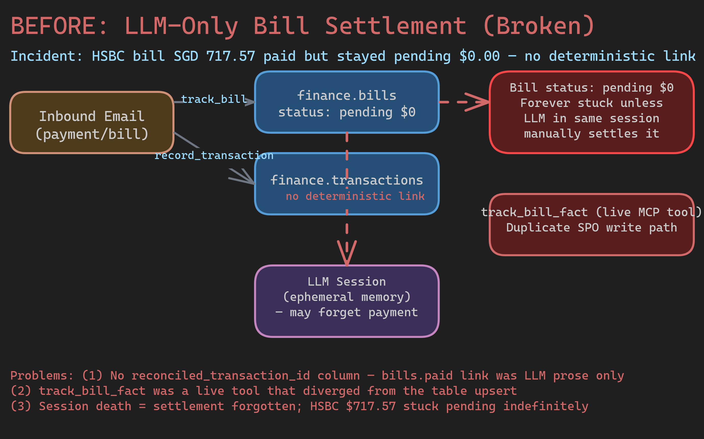
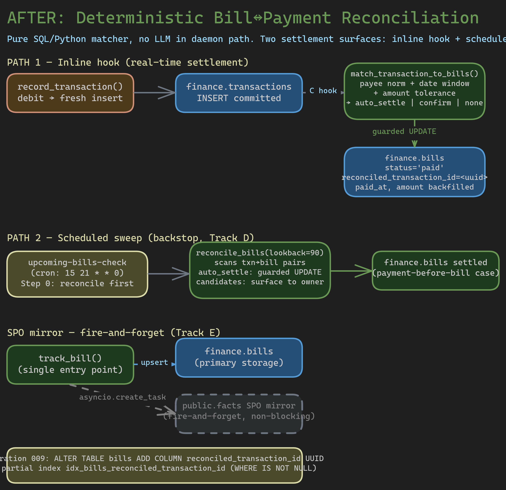

# Epic Report: Finance bill↔payment reconciliation (deterministic settlement)

**Epic ID**: `bu-hpmgo`
**Date**: 2026-06-21
**Status**: 7/8 children closed (open: bu-3opos — this report)
**Priority**: P1 (High)
**Spec coverage**: `openspec/specs/butler-finance/spec.md` — Deterministic bill↔payment reconciliation; Settlement on payment via `record_transaction`; Scheduled reconciliation sweep; Settlement-state integrity; CRUD-to-SPO migration (bills table-primary + SPO mirror); `track_bill_fact` removal.

---

## Summary

This epic fixes a real production incident: a paid HSBC bill (SGD 717.57) stayed
`pending $0.00` indefinitely because there was no deterministic link between a recorded
debit transaction and the bill row it settled. Settlement was LLM-only — an ephemeral
session had to *remember* to call `track_bill(status="paid")` in the same conversation
where the payment was recorded. If the session ended first, the bill was stuck.

The fix is a two-surface deterministic settlement engine: an **inline hook** inside
`record_transaction` that attempts to match-and-settle in real time, and a **scheduled
sweep** (`reconcile_bills`) that catches any bills the inline hook missed — including the
payment-before-bill case. Matching is pure SQL/Python (Rule 4: deterministic daemon),
no LLM in the critical path. Settlement uses a `guarded UPDATE` (`WHERE status <> 'paid'
AND reconciled_transaction_id IS NULL`) that is idempotent and concurrent-safe.

Three related spec-drift issues were resolved in parallel: the `bills` table gained a
`reconciled_transaction_id UUID` column (migration 009) to anchor the link durably;
`track_bill` was extended with a fire-and-forget SPO mirror so bills are reflected in the
memory graph; and the standalone `track_bill_fact` tool — a stale duplicate write path —
was removed entirely. AGENTS.md and the `upcoming-bills-check` skill were updated to
reflect the new system semantics, including the correct placeholder-bill UX (a `$0.00`
pending bill is not overdue; it auto-settles on the matching payment).

Current state: all implementation tracks merged and archived into
`openspec/specs/butler-finance/spec.md`. The deterministic engine is live. One minor gap
remains in the spec reconciliation audit (see §6 and §7).

---

## Architecture

### Before: LLM-Only Settlement (Broken)



The pre-epic architecture had no `reconciled_transaction_id` column on `bills` — the
transaction↔bill link existed only as LLM prose inside an ephemeral session. If the
session ended before the LLM called `track_bill(status="paid")`, the bill stayed
`pending` forever. A secondary problem was `track_bill_fact`, a live MCP tool that
created a parallel SPO write path that could diverge from the table write in `track_bill`.

### After: Deterministic Reconciliation Engine



The new architecture has two surfaces and a single-entry-point SPO mirror:

- **Path 1 (inline hook)**: `record_transaction` runs `match_transaction_to_bills` in-process
  after every fresh debit insert. On `auto_settle`, `_settle_bill` applies the guarded UPDATE
  and returns `bill_reconciliation.auto_settled` in the response. On `confirm`, it returns
  candidates without mutating the bill.
- **Path 2 (scheduled sweep)**: `upcoming-bills-check` calls `reconcile_bills(lookback_days=90)`
  first — before composing the digest — as a weekly backstop for any bills the inline hook
  missed (including debit-before-bill cases).
- **SPO mirror**: `track_bill` fires `_mirror_bill_to_spo` via `asyncio.create_task`; failure
  never rolls back the primary `finance.bills` upsert.
- **Migration 009**: adds `reconciled_transaction_id UUID` and a partial index for reverse-lookup.

---

## Implementation Walkthrough

### Track A — finance.bills.reconciled_transaction_id migration (`bu-64kfu`)
**Status**: Closed — PR #2529  
**Spec section**: CRUD-to-SPO migration — bill tools as dedicated table primary

**What was done**: Added `reconciled_transaction_id UUID NULL` to `finance.bills` via migration
009. No FK constraint is enforced — the spec explicitly forbids it to prevent cascading deletes
from disrupting settled bill records. Added a partial index (`WHERE IS NOT NULL`) to accelerate
the reverse-lookup query `WHERE reconciled_transaction_id = $1`.

**Key code locations**:
- `roster/finance/migrations/009_bills_reconciled_transaction_id.py:40-50` — `UPGRADE_SQL`: `ADD COLUMN` + partial index
- `roster/finance/migrations/009_bills_reconciled_transaction_id.py:52-57` — `DOWNGRADE_SQL`: `DROP INDEX` + `DROP COLUMN`
- `tests/migrations/test_finance_migrations.py` — column presence and nullability coverage

**Design decisions**:
- No FK constraint: explicit spec requirement (`design.md`) — keeps reconciliation logic in the
  application layer, prevents cascade-delete interference with settled bills.
- Partial index rather than full index: `reconciled_transaction_id IS NULL` is the default for
  almost all rows; a full index would bloat on unreconciled rows.
- Module-level `UPGRADE_SQL`/`DOWNGRADE_SQL` tuples: test files import them directly to avoid
  drift between migration and test DDL.

**Caveats**: `test_integration.py` uses hand-rolled DDL (`_provision_all_tables`) that must be
kept in sync with migrations manually — see AGENTS.md note about schema changes needing two
updates.

---

### Track B — deterministic matcher + `reconcile_bills` tool (`bu-fo2uv`)
**Status**: Closed — PR #2533  
**Spec section**: Deterministic bill↔payment reconciliation

**What was done**: Created `roster/finance/tools/reconciliation.py` with the full matcher engine.
Implemented payee normalization, amount tolerance, date-window logic, and confidence
classification. Registered `reconcile_bills` as an MCP tool in the `bills` group. Wrote a
TDD-first reproducer test (`test_paid_hsbc_bill_stays_pending_without_reconciliation`) that was
red before B and green after.

**Key code locations**:
- `roster/finance/tools/reconciliation.py:30-33` — spec constants: `LOOKBACK_DAYS=45`, `GRACE_DAYS=7`, tolerance floor `$1.00`
- `roster/finance/tools/reconciliation.py:41-109` — `_normalize_payee()` + `_payee_match()` (exact vs. fuzzy tiers)
- `roster/finance/tools/reconciliation.py:117-133` — `_amount_compatible()` (`max($1.00, 1%)` tolerance + placeholder detection)
- `roster/finance/tools/reconciliation.py:141-302` — `match_transaction_to_bills()`: standalone path (C hook) and batch path (`bills=` param)
- `roster/finance/tools/reconciliation.py:310-377` — `_settle_bill()`: guarded `UPDATE` with `WHERE status <> 'paid' AND reconciled_transaction_id IS NULL`
- `roster/finance/tools/reconciliation.py:385-568` — `reconcile_bills()`: N+1-free batch sweep with in-memory per-run `settled_bill_ids` guard
- `roster/finance/tests/test_reconciliation.py:156` — reproducer: `test_paid_hsbc_bill_stays_pending_without_reconciliation`

**Design decisions**:
- Two invocation paths in `match_transaction_to_bills`: the `bills=None` standalone path (used by the C hook) fetches bills from the DB and runs an "already used" guard; the `bills=[...]` batch path (used by `reconcile_bills`) filters an in-memory pre-fetched list by currency, avoiding per-transaction DB round-trips.
- `settled_bill_ids` set: in-run de-dup guard to prevent double-settlement when multiple transactions match the same bill across sweep iterations.
- `anchor = statement_period_end if set else due_date`: statement-period-end is a better date reference for credit cards where the due date is after the statement close.

**Caveats**: The matcher uses whole-token subset matching as the fuzzy fallback — this could produce false positives for very short payee names (e.g. "VISA"). Fallback: multi-candidate → confirm tier, so the worst outcome is a human prompt, not a wrong auto-settle.

---

### Track C — settlement on payment (`record_transaction` hook) (`bu-y6gpw`)
**Status**: Closed — PR #2536  
**Spec section**: Settlement on payment via `record_transaction`

**What was done**: Added the bill reconciliation hook at the end of `record_transaction` in
`roster/finance/tools/transactions.py`. The hook runs synchronously (in-process) for fresh debit
inserts only; any reconciliation failure is caught and logged without propagating to the caller.
The response gains a `bill_reconciliation` field carrying `auto_settled` or `candidates`.

**Key code locations**:
- `roster/finance/tools/transactions.py:672-750` — hook body: `is_fresh_insert and effective_direction == "debit"` guard, `match_transaction_to_bills`, `_settle_bill`, response population
- `roster/finance/tools/transactions.py:686-689` — defensive tz-aware guard: ensures `posted_at` is timezone-aware before passing to matcher
- `roster/finance/tests/test_track_c_hook.py` — integration tests for the C hook (386 lines)

**Design decisions**:
- `try/except Exception` wrapping the entire hook: the primary insert is the source of truth; reconciliation is best-effort. Failure is logged and the caller still receives the inserted transaction.
- `is_fresh_insert` guard: deduplication re-paths return the existing transaction; the hook must not run on those (would double-count settlement).
- `payment_method` from the transaction is propagated to the bill on auto-settle — fills the common case where bills arrive without a payment method.

---

### Track D — scheduled reconciliation sweep (`bu-th0ph`)
**Status**: Closed — PR #2542  
**Spec section**: Scheduled reconciliation sweep

**What was done**: Updated `roster/finance/.agents/skills/upcoming-bills-check/SKILL.md`
(version bumped to 2.0.0) to run `reconcile_bills(lookback_days=90)` as Step 0 before
composing the bills digest. The digest now leads with `auto_settled` and `candidates`
from the sweep, then `needs_action` bills, then autopay/predictions as quiet context.
Added an early-exit rule: send nothing if all buckets are empty.

**Key code locations**:
- `roster/finance/.agents/skills/upcoming-bills-check/SKILL.md:1-100` — Step 0 (reconcile first), step 1 (upcoming_bills + predict_bills), step 2 (early exit), step 3 (compose digest), step 5 (single notify call)

**Design decisions**:
- Skill update rather than daemon code: the LLM runtime reads the skill at invocation time; no daemon restart needed.
- Compose-then-notify contract: SKILL.md is explicit that `notify()` is called exactly once with the fully-composed message — prevents draft+correction double-sends.
- `suppressed_placeholders` bucket in `upcoming_bills`: $0 placeholder bills are hidden from the digest so they never appear as overdue alarms.

---

### Track E — bills storage spec-drift fix (`bu-np87t`)
**Status**: Closed — PR #2535  
**Spec section**: CRUD-to-SPO migration — bill tools; `track_bill_fact` removal

**What was done**: Added `_mirror_bill_to_spo()` fire-and-forget helper to
`roster/finance/tools/bills.py` and wired it into `track_bill` via `asyncio.create_task`.
Removed the standalone `track_bill_fact` tool entirely: its `@_tool('facts')` registration,
implementation in `tools/facts.py`, exports from `tools/__init__.py` and `modules/__init__.py`,
and its test class from `tests/test_facts.py`.

**Key code locations**:
- `roster/finance/tools/bills.py:57-112` — `_mirror_bill_to_spo()`: swallows all exceptions, passes canonical metadata set including `reconciled_transaction_id`
- `roster/finance/tools/bills.py:117+` — `track_bill()`: `asyncio.create_task(_mirror_bill_to_spo(...))` near the end

**Design decisions**:
- Fire-and-forget via `asyncio.create_task`: SPO mirror failure must never roll back the primary upsert. The task is referenced in `_background_tasks` to prevent GC.
- Canonical metadata set includes `reconciled_transaction_id`: even if reconciliation happened before the SPO mirror, the mirror reflects the final settled state on the next `track_bill` call.
- `track_bill_fact` removed (not deprecated): Rule 4 + the butlers project's "prefer cruft cleanup over compat" principle — no shim, no re-export.

**Caveats**: The SPO mirror is eventually consistent with the bills table. During the lag window between auto-settlement (Track C/B) and the next `track_bill` call, the memory graph may show the bill as pending. For the typical interactive flow (user records debit → system auto-settles → user asks about bills) the lag is negligible. The sweep (`reconcile_bills`) does not currently trigger a SPO mirror update.

---

### Track F — AGENTS.md + bill-reminder prompting fixes (`bu-1adjy`)
**Status**: Closed — PR #2532  
**Spec section**: Settlement-state integrity in runtime behavior

**What was done**: Updated `roster/finance/AGENTS.md` with three changes: (1) Example 6 now
describes the `$0.00` placeholder as awaiting reconciliation, not a terminal unpaid obligation;
(2) added a behavioral guideline for reading `bill_reconciliation` after `record_transaction`;
(3) added the integrity rule: never write settlement state as metadata prose without the
structured `status` column change.

**Key code locations**:
- `roster/finance/AGENTS.md:166-185` — "Bill reconciliation on `record_transaction`" behavioral section (added)
- `roster/finance/AGENTS.md:210-225` — Example 6: placeholder-bill semantics callout (updated)

**Design decisions**:
- Integrity rule expressed as "NEVER" with bold emphasis: this was the exact observed bug — LLM
  writing `status="paid"` into JSONB prose without changing the `status` column.
- `bill-reminder` skill updated to reflect that bills may already be auto-settled before the skill runs.

---

### Track G — archive OpenSpec change into butler-finance spec (`bu-v2atl`)
**Status**: Closed — PR #2559  
**Spec section**: Reconciliation + spec archive

**What was done**: Bidirectional spec↔code audit using `/reconcile-spec-to-project`. Confirmed
all 15 WHEN/THEN scenarios against implementing code and passing tests. Constants
(`LOOKBACK_DAYS=45`, `GRACE_DAYS=7`, `max($1.00, 1%)`, UTC truncation, guarded UPDATE
predicate) verified against `reconciliation.py`. Archived the OpenSpec change into
`openspec/specs/butler-finance/spec.md`. Removed `openspec/changes/finance-bill-payment-reconciliation/`
from active changes. No dangling refs to `track_bill_fact` remained.

---

## Spec Compliance Matrix

Scenarios from `openspec/specs/butler-finance/spec.md` (reconciliation requirements).

| Spec Scenario | Status | Evidence | Notes |
|---|---|---|---|
| Tool inventory includes `reconcile_bills`; excludes `track_bill_fact` | **Implemented** | `tools/reconciliation.py:385`; Track E removed `track_bill_fact` | Verified post-archive by bu-v2atl |
| Bill tools: `track_bill` upserts `finance.bills` as primary + SPO mirror | **Implemented** | `tools/bills.py:57-112` (`_mirror_bill_to_spo`); migration 009 | |
| `reconcile_bills` scans pending/overdue bills, auto-settles, returns candidates | **Implemented** | `tools/reconciliation.py:385-568` | N+1-free batch sweep |
| High-confidence auto-settle: single candidate + exact payee + window + tolerance → `status='paid'`, backfill amount, `paid_at`, `reconciled_transaction_id`, metadata `reconciliation:"auto"` | **Implemented** | `_settle_bill()` at `reconciliation.py:310-377`; `test_auto_settle_sets_status_paid`, `test_auto_settle_links_transaction`, `test_placeholder_amount_backfilled` | |
| Ambiguous match (multiple candidates / fuzzy payee / amount OOT) → `confirm` tier, no mutation | **Implemented** | `reconciliation.py:280-301`; `test_two_in_window_candidates_yields_confirm`, `test_substring_payee_yields_confirm`, `test_outside_tolerance_yields_none` | |
| Credits never settle bills | **Implemented** | `reconciliation.py:179-181` (direction guard); `test_credit_txn_not_matched` | |
| Multiple same-payee bills in window → `confirm`; one in-window → closest-anchor auto-settle | **Implemented** | `reconciliation.py:281-295`; `test_two_same_payee_both_in_window_yields_confirm`, `test_one_in_window_auto_settles_closest_anchor` | |
| `record_transaction` returns `bill_reconciliation.auto_settled` on high-confidence match | **Implemented** | `transactions.py:716-724`; `test_track_c_hook.py` integration test | |
| `record_transaction` returns `bill_reconciliation.candidates` on ambiguous; no mutation | **Implemented** | `transactions.py:728-742`; `test_track_c_hook.py` | |
| `record_transaction` reconciliation is deterministic, no LLM | **Implemented** | Entire `match_transaction_to_bills` is pure SQL/Python; no LLM import in daemon path | |
| `upcoming-bills-check` runs `reconcile_bills` before digest; surfaces auto-settled + candidates | **Implemented** | `upcoming-bills-check/SKILL.md` Step 0 (version 2.0.0) | |
| Payment recorded before bill → `reconcile_bills` sweep catches it | **Implemented** | `reconciliation.py:386-466` (scans all unlinked debits); `test_payment_before_bill_settled_by_sweep` | |
| Settlement-state integrity: no metadata-prose-only settlement | **Implemented** | `AGENTS.md` integrity rule + guarded UPDATE as the only write path | Behavioral enforcement via AGENTS.md; structural enforcement via guarded UPDATE |
| `$0.00` placeholder bill: backfill amount from transaction on auto-settle | **Implemented** | `_settle_bill()` `CASE WHEN amount = 0 THEN $3` at `reconciliation.py:357`; `test_placeholder_amount_backfilled` | |
| Reconciliation idempotent: already-paid bills and already-linked transactions skipped | **Implemented** | Guarded UPDATE `WHERE status <> 'paid' AND reconciled_transaction_id IS NULL`; `test_reconcile_bills_idempotent_on_rerun`, `test_guarded_update_zero_rows_when_already_settled` | |

---

## Test Coverage

### New/changed test files

| File | Tests | What it covers |
|---|---|---|
| `roster/finance/tests/test_reconciliation.py` | ~45 tests (1125 lines) | Full matcher matrix: exact, placeholder, multi-candidate, fuzzy, OOT, currency mismatch, credit, window boundaries (UTC), idempotency, concurrent guarded UPDATE, same-payee dup bills, payment-before-bill, payee filter, overdue bills, `bills=` batch param |
| `roster/finance/tests/test_track_c_hook.py` | ~12 tests (386 lines) | Track C inline hook: debit auto-settle, debit ambiguous, non-debit no-op, fresh-insert-only guard, TZ-aware posted_at, hook failure doesn't break primary insert |
| `tests/migrations/test_finance_migrations.py` | Updated (~441 lines) | Migration 009: column presence, nullable, default null; upgrade/downgrade |

### Coverage gaps

| Area | Why untested | Risk | Follow-up? |
|---|---|---|---|
| SPO mirror content fidelity | `_mirror_bill_to_spo` is fire-and-forget; tests verify it's called but not what's written to `public.facts` | Low — SPO is secondary to the table | Flag for future SPO integrity audit |
| `reconcile_bills` + concurrent calls from two sessions | No multi-process test harness for concurrent guarded UPDATEs | Low — guarded UPDATE is proven idempotent at DB level; `test_guarded_update_zero_rows_when_already_settled` covers the single-process case | No |
| `upcoming-bills-check` skill end-to-end (reconcile → notify flow) | Skill is an LLM-runtime artifact; no integration test harness for skill execution | Medium — early-exit and compose logic live in the skill, not code | Worth a skill-level integration test (see §6) |

### Test confidence

High confidence on the matcher and settlement engine — the 45-test matrix in `test_reconciliation.py`
covers the full confidence-tier decision tree including edge cases (window boundaries, duplicate bills,
payment-before-bill). The Track C integration tests verify the hook contract end-to-end through the
real `record_transaction` function. Migration coverage is complete. The main gap is at the skill
layer where LLM runtime behavior is difficult to test automatically.

---

## Subsequent Work

### Open beads

None — all implementation children (A–G) are closed.

### Follow-up TODOs identified during report generation

The following gaps were identified while writing this report. These are listed for the coordinator
to materialize as beads — **do not create them directly**.

| # | Title | Type | Priority | Rationale |
|---|---|---|---|---|
| 1 | SPO mirror: reconcile_bills auto-settle does not trigger SPO update | bug/task | P3 | When `reconcile_bills` auto-settles a bill, `finance.bills.status` updates but `public.facts` (SPO mirror) still shows `pending`. The next `track_bill` call fixes it, but the memory graph is stale in between. Fix: call `_mirror_bill_to_spo` after `_settle_bill` returns True inside `reconcile_bills`. |
| 2 | Skill integration test for `upcoming-bills-check` reconcile→notify flow | task | P3 | No automated test for the Step 0 → digest → notify path. A mock-based skill integration test would catch future regressions in the early-exit or compose logic. |
| 3 | `_normalize_payee` false positive risk for very short payee names | task | P4 | Token-subset matching could match "VISA" against "VISA Reward Program" and "VISA Debit" simultaneously, yielding ambiguous confirm — acceptable but worth a dedicated test. |
| 4 | `reconcile_bills` does not apply optional payee filter to sweep's pre-fetch query | task | P4 | The `payee` parameter to `reconcile_bills` filters the output in-memory after matching, but the SQL pre-fetch for `all_bills` does not push the filter down. At scale with many bills, this wastes DB bytes. Low urgency. |

### Deferred decisions

| Decision | Context | Revisit when |
|---|---|---|
| FK enforcement on `reconciled_transaction_id` | Spec explicitly forbids it to prevent cascade deletes. Only soft reference exists. | If transaction deletion becomes a supported operation with settlement audit trail requirements |
| `LOOKBACK_DAYS=45` / `GRACE_DAYS=7` constants hardcoded | Spec-defined; no per-butler overrides. | If an owner reports false negatives (paid bills not matched) due to unusual payment timing patterns |

---

## Risks & Notes for Reviewer

### Known risks

| Risk | Severity | Mitigation | Evidence |
|---|---|---|---|
| SPO mirror stale after `reconcile_bills` auto-settle | Low | Memory graph is eventually consistent; next `track_bill` call corrects it. The table is canonical. | `_mirror_bill_to_spo` not called from `_settle_bill` |
| Token-subset matching fuzzy false positives | Low | Multi-candidate → `confirm` tier caps damage to a human prompt, not a wrong auto-settle | `reconciliation.py:92-108` |
| `test_integration.py` DDL drift | Medium | The hand-rolled DDL in `_provision_all_tables` must track migration columns manually. AGENTS.md documents this. | AGENTS.md note re: schema changes needing two updates |
| Skill-layer behavior untested | Medium | `upcoming-bills-check` v2.0.0 compose+notify logic is readable but not mechanically verified | No skill integration test harness |

### Questions for reviewer

1. **SPO mirror gap (TODO #1)**: Should `_settle_bill` call `_mirror_bill_to_spo` directly, or should `reconcile_bills` do a batch SPO update after its sweep loop? The batch approach is more efficient; the in-`_settle_bill` approach is simpler.
2. **`upcoming-bills-check` early-exit rule**: The skill sends nothing if all buckets are empty. Is "nothing to report" the right behavior, or should there be a weekly "all clear" message for peace of mind?

### What to look at first

1. `roster/finance/tools/reconciliation.py` — the core matcher; verify confidence-tier logic at lines 280-301
2. `roster/finance/tools/transactions.py:672-750` — the Track C hook; verify the `is_fresh_insert` guard and `try/except` scope
3. `roster/finance/tests/test_reconciliation.py:775-865` — same-payee multiple-bills and payment-before-bill tests (most complex cases)
4. `roster/finance/AGENTS.md` — behavioral guideline and integrity rule (lines 166-185)

---

## Appendix

### A. Commits referencing this epic

```
fa8e95f3a chore(finance): remove standalone track_bill_fact tool + archive reconciliation spec [bu-v2atl, bu-z0nzz] (#2559)
097a0ce3f feat(finance): scheduled reconciliation sweep in upcoming-bills-check (Track D) [bu-th0ph] (#2542)
5f6b1dac9 feat(finance): post-record_transaction bill settlement hook (Track C) [bu-y6gpw] (#2536)
c05658a83 feat(finance): fire-and-forget SPO mirror in track_bill [bu-np87t] (#2535)
4ad3ac622 feat(finance): deterministic bill↔payment reconciliation (bu-fo2uv Track B) (#2533)
315d59922 docs(finance): fix $0.00 pending bill UX — placeholder, not terminal [bu-1adjy] (#2532)
df467e1b8 feat(finance): migration 009 — bills.reconciled_transaction_id [bu-64kfu] (#2529)
fba5194b8 docs(finance): spec bill↔payment reconciliation [bu-hpmgo]
```

### B. Files changed

Key files modified across all tracks:

```
roster/finance/migrations/009_bills_reconciled_transaction_id.py   (new — Track A)
roster/finance/tools/reconciliation.py                              (new — Track B)
roster/finance/tools/transactions.py                                (modified — Track C hook)
roster/finance/tools/bills.py                                       (modified — Track E SPO mirror)
roster/finance/tools/facts.py                                       (modified — Track E track_bill_fact removed)
roster/finance/tools/__init__.py                                    (modified — Track E exports)
roster/finance/modules/__init__.py                                  (modified — Track E exports)
roster/finance/tests/test_reconciliation.py                         (new — Track B tests)
roster/finance/tests/test_track_c_hook.py                           (new — Track C tests)
roster/finance/tests/test_facts.py                                  (modified — Track E test class removed)
roster/finance/.agents/skills/upcoming-bills-check/SKILL.md         (modified — Track D v2.0.0)
roster/finance/AGENTS.md                                            (modified — Track F)
tests/migrations/test_finance_migrations.py                         (modified — Track A tests)
openspec/specs/butler-finance/spec.md                               (modified — Track G archive)
```

### C. Diagram source files

| Diagram | Source | Rendered |
|---|---|---|
| Before: LLM-Only Settlement | `diagrams/bu-hpmgo-before.excalidraw` | `diagrams/bu-hpmgo-before.png` |
| After: Deterministic Reconciliation | `diagrams/bu-hpmgo-after.excalidraw` | `diagrams/bu-hpmgo-after.png` |
