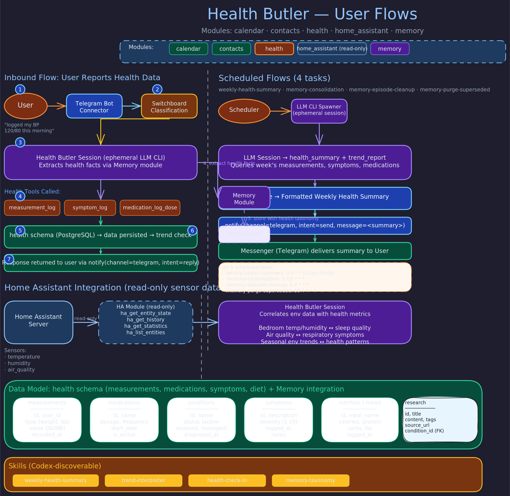

# Health Butler

> **Purpose:** Health tracking assistant for measurements, medications, conditions, symptoms, nutrition, and environmental health correlation.
> **Audience:** Contributors and operators.
> **Prerequisites:** [Concepts](../concepts/butler-lifecycle.md), [Architecture](../architecture/butler-daemon.md).

## Overview



The Health Butler tracks the full picture of a user's wellbeing over time. It records measurements (weight, blood pressure, glucose, temperature), manages medication schedules and adherence, tracks active health conditions, logs symptoms with severity ratings, monitors meals and nutrition, and saves health research for future reference.

The butler's philosophy is continuity: health decisions happen across seasons, and the value comes from patterns that emerge over weeks and months. When the user's doctor asks "How have you been feeling?", the Health Butler has the answer -- not a vague memory, but the data.

The Health Butler also has read-only access to Home Assistant sensor data, enabling correlation between environmental conditions (bedroom temperature, air quality, humidity) and health outcomes.

## Profile

| Property | Value |
|----------|-------|
| **Port** | 41103 |
| **Schema** | `health` |
| **Modules** | calendar, contacts, health, home_assistant (read-only), memory |
| **Runtime** | codex (gpt-5.4-mini) |

## Schedule

| Task | Cron | Description |
|------|------|-------------|
| `weekly-health-summary` | `0 9 * * 0` | Generate a comprehensive weekly health summary covering weight trends, medication adherence, symptom patterns, and notable changes. Delivered via Telegram. |
| `memory_consolidation` | `0 */6 * * *` | Consolidate episodic memory into durable facts |
| `memory_episode_cleanup` | `0 4 * * *` | Prune expired episodic memory entries |
| `memory_purge_superseded` | `10 4 * * *` | Purge facts that have been superseded by newer data |

## Tools

**Measurements**
- `measurement_log / history / latest` -- Track any numeric health metric (weight, blood pressure, glucose, etc.). Supports compound JSONB values (e.g., blood pressure as `{"systolic": 120, "diastolic": 80}`).
- `trend_report` -- Analyze measurement trends over configurable time windows.

**Medications**
- `medication_add / list` -- Register medications with dosage and frequency.
- `medication_log_dose / history` -- Track individual doses and calculate adherence rates based on expected frequency (daily, twice daily, etc.).

**Conditions and Symptoms**
- `condition_add / list / update` -- Track active health conditions with status: active, resolved, or managed.
- `symptom_log / history / search` -- Log symptoms with severity ratings (1-10 scale) and search for patterns over time.

**Nutrition**
- `meal_log / history` -- Track meals with nutritional content.
- `nutrition_summary` -- Aggregate calorie and nutrient intake over date ranges.

**Research**
- `research_save / search` -- Save and search health articles, studies, or advice for future reference.

**Health Overview**
- `health_summary` -- Snapshot of current health status across all tracked domains.

**Home Assistant Sensors (Read-Only)**
- `ha_get_entity_state` -- Current value of a sensor (e.g., `sensor.bedroom_temperature`).
- `ha_list_entities` -- Discover available sensors filtered by domain or area.
- `ha_get_history / ha_get_statistics` -- Historical data and aggregated stats for environmental trend analysis.
- `ha_render_template` -- Compute derived values via Jinja2 templates on the HA instance.

**Calendar** -- Used for medical appointments, screenings, medication follow-ups, and health-related scheduling.

## Key Behaviors

**Environmental Health Correlation.** With read-only Home Assistant access, the Health Butler can correlate bedroom temperature and humidity with sleep quality, indoor air quality with respiratory symptoms, and seasonal environmental patterns with health trends.

**Pattern Detection.** The butler spots trends the user might miss: a symptom that only occurs on Mondays, measurements that drift slowly upward, medication adherence that falters before the user catches it.

**Non-Judgmental Tracking.** The butler is patient and non-judgmental. It exists to listen, remember, and help the user see what they might otherwise miss. It is a companion, not a doctor.

## Interaction Patterns

**Conversational logging.** Users say things like "I've been feeling tired" or "Logged my morning meds" via Telegram, and the butler records the data with appropriate tools. Interactive responses range from quick emoji acknowledgments to proactive observations about trends.

**Weekly health summary.** Every Sunday at 09:00, the butler compiles weight trends, medication adherence rates, symptom patterns, and notable changes into a structured summary delivered via Telegram.

**Question answering.** Users can ask "What was my blood pressure yesterday?" or "How has my weight been this month?" and get data-backed answers from measurement history and trend analysis.

## Verification

To confirm the Health Butler's schema, tools, and Home Assistant integration are operational:

```bash
# 1. Confirm the butler is listening on the expected port
curl -s http://localhost:41103/health | python3 -m json.tool
# Expected: {"status": "ok", ...} with no error fields

# 2. Verify health domain tables exist in the health schema
psql -h localhost -U butlers -d butlers -c \
  "SELECT table_name FROM information_schema.tables
   WHERE table_schema = 'health'
   ORDER BY table_name;"
# Expected: measurements (or equivalent), medications, conditions, symptoms, meals, research_items present

# 3. Confirm compound JSONB measurement values are stored correctly (e.g. blood pressure)
psql -h localhost -U butlers -d butlers -c \
  "SELECT metric, value, recorded_at FROM health.measurements
   WHERE value @> '{\"systolic\": null}'
   ORDER BY recorded_at DESC LIMIT 3;"
# Expected: rows with JSON objects like {"systolic": 120, "diastolic": 80} -- not flat numeric values

# 4. Verify the weekly-health-summary task is seeded from butler.toml
psql -h localhost -U butlers -d butlers -c \
  "SELECT name, cron, source, enabled FROM health.scheduled_tasks
   WHERE name = 'weekly-health-summary';"
# Expected: cron = '0 9 * * 0', source = 'toml', enabled = true

# 5. Confirm memory consolidation tasks are present
psql -h localhost -U butlers -d butlers -c \
  "SELECT name, cron FROM health.scheduled_tasks
   WHERE name LIKE 'memory%' ORDER BY name;"
# Expected: memory_consolidation, memory_episode_cleanup, memory_purge_superseded

# 6. Verify Home Assistant integration is read-only (no write service tools in list)
curl -s http://localhost:41103/sse 2>/dev/null | head -5 || \
  echo "Check tool list via MCP: ha_get_entity_state, ha_list_entities, ha_get_history should be present"
# Expected: HA tools are present but only read (ha_get_*, ha_list_*, ha_render_template) --
# ha_call_service should NOT appear on the Health Butler (it belongs to Home Butler only)
```

## Related Pages

- [Home Butler](home.md) -- owns the Home Assistant integration; Health Butler has read-only sensor access
- [Switchboard Butler](switchboard.md) -- routes health-related messages here
- [Messenger Butler](messenger.md) -- delivers health summaries and alerts
