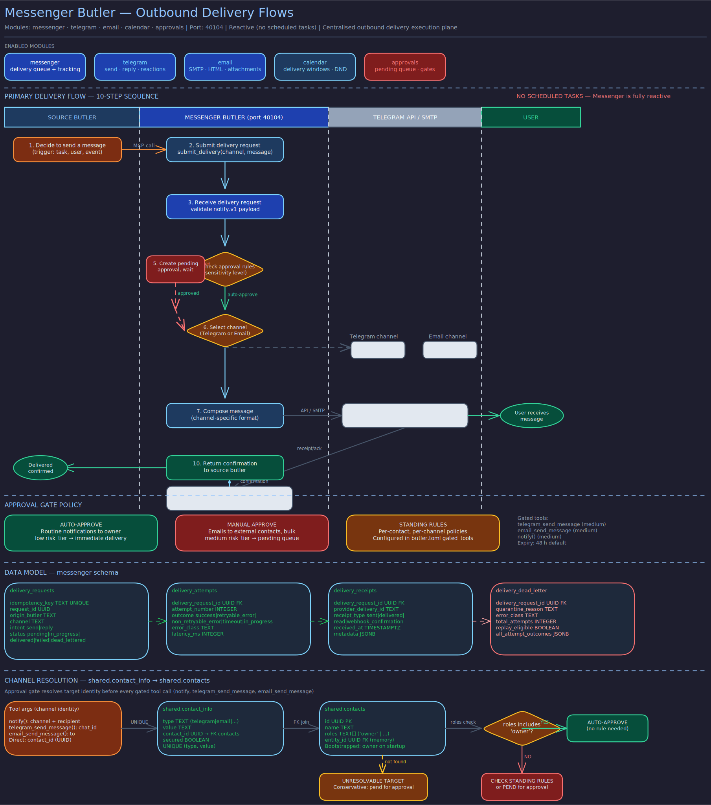

# Messenger Butler

> **Purpose:** Single outbound delivery execution plane for all user-channel communication via Telegram and email.
> **Audience:** Contributors and operators.
> **Prerequisites:** [Concepts](../concepts/butler-lifecycle.md), [Architecture](../architecture/butler-daemon.md).

## Overview



The Messenger Butler is infrastructure, not a domain specialist. It is the single butler responsible for executing outbound delivery to user-facing channels (Telegram and email). When any other butler needs to communicate with the user, it calls `notify()`, which Switchboard dispatches to Messenger for execution.

Messenger exists because outbound communication should have one owner. When every specialist butler sends messages directly, behavior drifts: inconsistent formatting, mixed retry logic, duplicated failure handling, and weak auditability. Messenger centralizes those concerns so specialist butlers can focus on domain decisions while delivery stays reliable, deterministic, and policy-driven.

## Profile

| Property | Value |
|----------|-------|
| **Port** | 41104 |
| **Schema** | `messenger` |
| **Modules** | calendar, telegram, email, approvals, messenger |
| **Runtime** | codex (gpt-5.4-mini) |

## Schedule

Messenger has no scheduled tasks. It operates purely on demand, executing delivery requests as they arrive from Switchboard.

## Tools

**Channel Delivery Tools**
- `telegram_send_message` -- Send a new message via the Telegram bot.
- `telegram_reply_to_message` -- Reply to an existing Telegram message.
- `telegram_react_to_message` -- React to a Telegram message with an emoji.
- `email_send_message` -- Send a new email.
- `email_reply_to_thread` -- Reply to an existing email thread.
- `notify` -- Messenger is the termination point for `notify.v1` envelopes. Unlike other butlers, Messenger executes delivery directly rather than routing through Switchboard.

**Target-State Operational Tools** (defined in role spec, not yet implemented)
- `messenger_delivery_status / search / attempts / trace` -- Query delivery state, history, and full request lineage.
- `messenger_dead_letter_list / inspect / replay / discard` -- Manage deliveries that exhausted retries.
- `messenger_validate_notify / dry_run` -- Pre-flight validation without side effects.
- `messenger_circuit_status / rate_limit_status / queue_depth / delivery_stats` -- Runtime health introspection.

## Approval Gating

Messenger uses the approvals module to gate outbound delivery. The following tools are approval-gated with their configured risk tiers:

| Tool | Risk Tier |
|------|-----------|
| `telegram_send_message` | medium |
| `telegram_reply_to_message` | medium |
| `telegram_react_to_message` | low |
| `email_send_message` | medium |
| `email_reply_to_thread` | medium |
| `notify` | medium |

Default approval expiry is 48 hours.

## Key Behaviors

**Delivery Ownership Invariant.** User-channel side effects must have exactly one execution owner: Messenger. Non-messenger butlers must not expose direct outbound delivery tools and must request delivery through `notify.v1`.

**Target Resolution.** For `send` intent: resolve recipient from `contact_id` (via `public.contact_info`), explicit `delivery.recipient`, or fall back to the owner contact's channel identifier. For `reply` intent: destination derives from request context lineage.

**Identity Presentation.** Outbound content includes user-visible origin identity. Email subjects include a `[origin_butler]` token. Non-subject channels prefix messages with the origin butler name.

**Idempotency.** Delivery is side-effecting and must be idempotent across retries and replays. Canonical idempotency keys are derived from request ID, origin butler, intent, channel, target identity, and content hash.

**Deterministic Failure Handling.** All failures map to canonical error classes: `validation_error`, `target_unavailable`, `timeout`, `overload_rejected`, `internal_error`. Each includes an explicit `retryable` flag.

**Caller Authentication.** The `route.execute` entrypoint enforces `trusted_route_callers` (default: `["switchboard"]`) before any delivery side effects. Unknown callers receive a deterministic `validation_error`.

## Interaction Patterns

**Messenger never interacts with users directly.** It only executes delivery on behalf of other butlers. Users experience Messenger's work as Telegram messages or emails from their specialist butlers.

**Specialist butlers call `notify()`**, which Switchboard validates and dispatches to Messenger. Messenger executes the channel delivery and returns a `notify_response.v1` envelope with the delivery outcome.

**Delivery contract.** Messenger accepts `notify.v1` envelopes via Switchboard-dispatched `route.v1` transport. It validates the envelope, resolves the target, executes delivery, and returns a canonical response with a stable `delivery_id` on success or a typed error with `retryable` flag on failure.

## Verification

To confirm the Messenger Butler's delivery infrastructure, approval gating, and caller authentication are operating as described:

```bash
# 1. Confirm the butler is listening on the expected port
curl -s http://localhost:41104/health | python3 -m json.tool
# Expected: {"status": "ok", ...} with no scheduled task entries (Messenger has none)

# 2. Verify approval gates are configured for outbound delivery tools
psql -h localhost -U butlers -d butlers -c \
  "SELECT tool_name, risk_tier, expiry_hours
   FROM messenger.approval_gates
   ORDER BY tool_name;"
# Expected: telegram_send_message and email_send_message at 'medium' tier;
# telegram_react_to_message at 'low' tier; default expiry = 48h

# 3. Confirm Messenger has no scheduled tasks (it is demand-driven only)
psql -h localhost -U butlers -d butlers -c \
  "SELECT COUNT(*) FROM messenger.scheduled_tasks;"
# Expected: 0 rows

# 4. Verify caller authentication: unknown callers are rejected
# The trusted_route_callers list should only contain 'switchboard'
psql -h localhost -U butlers -d butlers -c \
  "SELECT key, value FROM messenger.state
   WHERE key LIKE '%trusted%' OR key LIKE '%caller%';"
# Expected: trusted_route_callers setting present with value including 'switchboard'

# 5. Confirm delivery record tables exist for idempotency tracking
psql -h localhost -U butlers -d butlers -c \
  "SELECT table_name FROM information_schema.tables
   WHERE table_schema = 'messenger'
   ORDER BY table_name;"
# Expected: messenger schema tables including delivery tracking (e.g., deliveries or delivery_log)

# 6. Verify a recent notify.v1 envelope was dispatched successfully
psql -h localhost -U butlers -d butlers -c \
  "SELECT delivery_id, channel, status, created_at
   FROM messenger.deliveries
   ORDER BY created_at DESC LIMIT 5;"
# Expected: rows with status='delivered' and populated delivery_id values
```

## Related Pages

- [Switchboard Butler](switchboard.md) -- dispatches `notify.v1` envelopes to Messenger
- [Architecture: Routing](../architecture/routing.md) -- the routing pipeline that delivers work to Messenger
