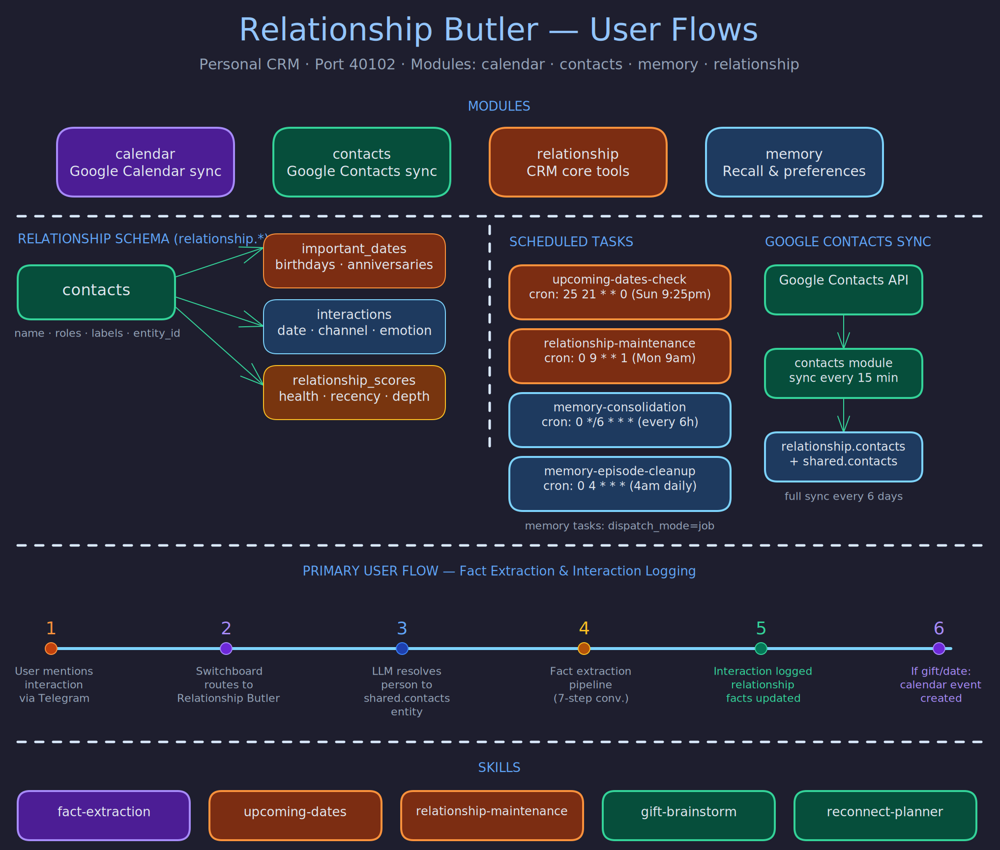

# Relationship Butler

> **Purpose:** Personal CRM that manages contacts, relationships, important dates, interactions, gifts, loans, and reminders so the user never forgets what matters about the people in their life.
> **Audience:** Contributors and operators.
> **Prerequisites:** [Concepts](../concepts/butler-lifecycle.md), [Architecture](../architecture/butler-daemon.md).

## Overview

The Relationship Butler is the system's personal CRM -- an external memory for the people the user cares about. It tracks contacts with full context (interests, preferences, history), logs interactions with type, direction, and emotion, manages gift pipelines from idea through delivery, tracks important dates with proactive reminders, and monitors stay-in-touch cadences to flag relationships that need attention.

The design philosophy centers on three principles: **thoughtfulness** (never miss what matters), **richness** (capture the full texture of relationships, not just facts), and **connection** (reduce cognitive overhead so the user can focus on being present).

## Profile

| Property | Value |
|----------|-------|
| **Port** | 41102 |
| **Schema** | `relationship` |
| **Modules** | calendar, contacts, memory, relationship |
| **Runtime** | codex (gpt-5.1) |

## Schedule

| Task | Cron | Description |
|------|------|-------------|
| `upcoming-dates-check` | `25 21 * * 0` | Check for birthdays and anniversaries in the next 7 days and send Telegram reminders |
| `relationship-maintenance` | `0 9 * * 1` | Review contacts not interacted with in 30+ days, suggest 3 people to reach out to this week with context |
| `memory_consolidation` | `0 */6 * * *` | Consolidate episodic memory into durable facts |
| `memory_episode_cleanup` | `0 4 * * *` | Prune expired episodic memory entries |

## Tools

The Relationship Butler has a rich tool surface organized by domain:

**Entity and Contact Management**
- `entity_resolve / get / update / neighbors` -- Entity graph operations for identity resolution.
- `contact_create / get / update / search / resolve` -- Full contact lifecycle. `contact_create` automatically creates a linked entity.
- `fact_set / list` -- Store and retrieve structured key-value facts on contacts (stored on the linked entity).

**Relationships and Groups**
- `relationship_add / list / remove` -- Bidirectional typed relationships between contacts. Seeded with 15 types across Love, Family, Friend, Work, and Custom categories.
- `group_create / add_member / list / members` -- Contact groups (family, couple, friends, team, custom).
- `label_create / assign` and `contact_search_by_label` -- Flexible tagging and filtering.

**Interactions and Notes**
- `interaction_log / list` -- Log calls, meetings, meals, messages, video calls, and events with direction, duration, and emotion metadata.
- `note_create / list / search` -- Freeform notes with emotion tagging and full-text search.

**Dates and Reminders**
- `date_add / list` and `upcoming_dates` -- Track birthdays, anniversaries, and custom milestones. Year is optional.
- `reminder_create / list / dismiss` -- One-time or recurring reminders, optionally scoped to a contact.

**Gifts and Loans**
- `gift_add / update_status / list` -- Gift pipeline: idea, purchased, wrapped, given, thanked.
- `loan_create / settle / list` -- Track loans between user and contacts in either direction.

**Calendar** -- Used for relationship-related scheduling: birthday dinners, catch-up meetings, follow-ups. Events go to the shared butler calendar, not the user's primary calendar.

## Data Model

The data hierarchy follows an entity-first pattern:

1. **Entity** (top level) -- A person, organization, or place in the shared memory graph. Facts and relationships attach here.
2. **Contact** (child of entity) -- A CRM record with name fields, linked to exactly one entity via `entity_id`.
3. **Contact details** -- Phone numbers, email addresses, physical addresses attached to a contact.

Key invariant: every contact must link to an entity, and facts must be stored on entities (not contacts directly). The contacts module syncs with Google and Telegram contacts every 15 minutes.

## Interaction Patterns

**Natural language capture.** Most data enters through conversational messages routed from Switchboard. The user says "Had coffee with Sarah today, she got promoted" and the butler logs the interaction, updates the contact, and stores the promotion fact.

**Weekly maintenance suggestions.** Every Monday at 09:00, the butler reviews contacts that have gone quiet and suggests three people to reach out to, with context on the last interaction and any upcoming dates.

**Important date reminders.** Every Sunday evening, the butler checks for birthdays and anniversaries in the coming week and sends proactive reminders via Telegram.

## Related Pages

- [Switchboard Butler](switchboard.md) -- routes people-related messages here
- [General Butler](general.md) -- handles freeform data that is not contact-specific
- [Messenger Butler](messenger.md) -- delivers the butler's notifications to the user
