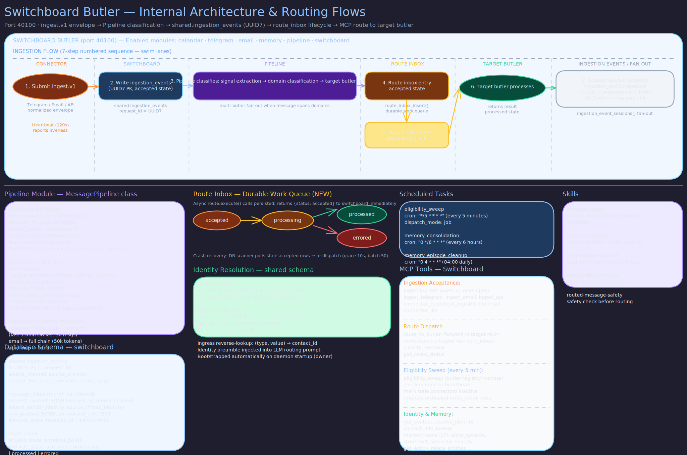

# Switchboard Butler

> **Purpose:** Single ingress and routing control plane that receives all incoming messages and dispatches them to the correct specialist butler.
> **Audience:** Contributors and operators.
> **Prerequisites:** [Concepts](../concepts/butler-lifecycle.md), [Architecture](../architecture/butler-daemon.md).

## Overview

The Switchboard Butler is the front door of the entire butler system. Every external interaction -- whether it arrives via Telegram, email, or a direct MCP call -- enters the system through Switchboard. It assigns canonical request context, uses an LLM runtime for message classification and decomposition, fans out work to one or more downstream specialist butlers, and records the full request lifecycle for audit and debugging.

Switchboard never handles domain logic itself. It classifies, routes, and tracks. If routing fails or the classifier is uncertain, the request falls through to the General butler as a safe default.

## Profile

| Property | Value |
|----------|-------|
| **Port** | 41100 |
| **Schema** | `switchboard` |
| **Modules** | calendar, telegram, memory, email, pipeline, switchboard |
| **Runtime** | codex (gpt-5.1) |

## Schedule

| Task | Cron | Description |
|------|------|-------------|
| `memory_consolidation` | `0 */6 * * *` | Consolidate episodic memory into durable facts |
| `memory_episode_cleanup` | `0 4 * * *` | Prune expired episodic memory entries |
| `eligibility_sweep` | `*/5 * * * *` | Butler registry liveness sweep -- checks downstream butler health and updates routing eligibility |

## Tools

Switchboard exposes the standard core tool surface plus routing-specific tools:

- **`route`** -- Dispatch a classified message segment to a downstream butler via its `route.execute` entrypoint. Injects request context and trace metadata before dispatch.
- **Ingress connectors** -- Telegram bot and email bot connectors that normalize incoming messages into canonical request context before classification.
- **Registry management** -- Maintains the butler registry with liveness TTLs and route contract version negotiation. The eligibility sweep runs every 5 minutes to confirm downstream butlers are reachable.
- **Pipeline tools** -- Ingress deduplication to prevent the same message from being processed twice.

## Key Behaviors

**Request Context Assignment.** Every ingress message receives a UUID7 `request_id`, UTC timestamp, source channel identifier, endpoint identity, and sender identity before any routing decision. This context propagates to all downstream butlers unchanged.

**LLM-Driven Routing.** Switchboard uses a lightweight LLM runtime (Codex) to classify incoming messages and decide which specialist butler should handle them. A single message can be decomposed into multiple segments routed to different butlers (e.g., "Call Mom for her birthday and log my weight" splits into relationship and health segments).

**Prompt Injection Safety.** User content is passed as isolated data, never as executable instructions. The router prompt explicitly forbids obeying instructions inside user content. Output is validated against registry-known butlers only.

**Safe Fallback.** On parse failure, validation failure, or runtime error, the full request routes to the General butler. No message is silently dropped.

**Ingestion and Retention.** Switchboard persists all ingress payloads, routing decisions, and downstream outcomes in month-partitioned PostgreSQL tables. Hot data is retained for one month.

## Interaction Patterns

**Users interact with Switchboard indirectly.** They send messages via Telegram or email, and Switchboard routes them transparently. Users never need to specify which butler should handle their request.

**Other butlers interact with Switchboard through `notify`.** When a specialist butler needs to send a message to the user, it calls `notify()` which Switchboard receives, validates as a `notify.v1` envelope, and dispatches to the Messenger butler for delivery.

**Buffer system.** Switchboard uses a buffer queue (capacity 100, 3 workers) with a scanner that processes messages in batches of 50 every 30 seconds, providing backpressure when the system is under load.

## Related Pages

- [Architecture: Routing](../architecture/routing.md) -- routing pipeline internals
- [Messenger Butler](messenger.md) -- the delivery execution plane that Switchboard dispatches to
- [General Butler](general.md) -- fallback routing target
