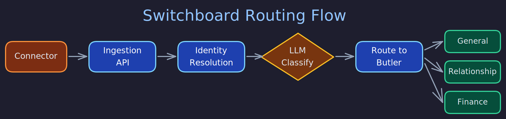

# Switchboard Routing

> **Purpose:** Explain how external messages enter the system, get classified, and are routed to the right butler.
> **Audience:** Developers working on routing, connectors, or multi-butler orchestration.
> **Prerequisites:** [What Is Butlers?](../overview/what-is-butlers.md), [Modules and Connectors](modules-and-connectors.md)

## Overview



The Switchboard butler is the single ingress and orchestration control plane for the entire butler system. All external interactions start here. It receives incoming messages, assigns canonical request context, uses an LLM runtime to classify and route them, fans out work to downstream domain butlers, and records the full request lifecycle.

## Message Flow

The end-to-end path of an external message looks like this:

```
External Source (Telegram, Gmail, etc.)
        |
    Connector (transport adapter)
        |
    Switchboard Ingestion API (ingest tool)
        |
    Request Context Assignment
        |
    Identity Resolution
        |
    LLM-Based Classification
        |
    Route Dispatch (route.execute)
        |
    Domain Butler (General, Health, Relationship, etc.)
        |
    Response Collection
```

### Step 1: Connector Submission

Connectors (Telegram bot, Gmail, Discord, etc.) normalize external events into canonical `ingest.v1` envelopes and submit them to the Switchboard's MCP server via the `ingest` tool. The envelope includes the source channel, sender identity, endpoint identity, message content, and any attachments.

### Step 2: Request Context Assignment

Every ingested message receives a canonical request context before any routing decision. This context is immutable and propagated to all downstream butlers. Required fields include:

- **`request_id`** --- a UUID7 for the request
- **`received_at`** --- UTC timestamp of receipt
- **`source_channel`** --- the originating channel (e.g., `telegram`, `email`, `mcp`)
- **`source_endpoint_identity`** --- the ingress identity that received the message (e.g., the bot's identity)
- **`source_sender_identity`** --- the actor who sent the message (e.g., a Telegram user ID)

Optional fields include `source_thread_identity` (conversation/thread identifier) and `trace_context` (OpenTelemetry propagation payload).

When fanout occurs (a message routes to multiple butlers), all sub-requests share the same `request_id` and source context. Sub-request metadata can add `subrequest_id` and `segment_id` but cannot replace the root context.

### Step 3: Identity Resolution

Before routing, the Switchboard resolves the sender's identity by querying `public.contact_info` and `public.contacts`. The `resolve_contact_by_channel()` function performs a reverse lookup: given a channel type (e.g., `"telegram"`) and value (e.g., a chat ID), it returns a `ResolvedContact` with the contact ID, display name, roles (sourced from the linked entity), and entity ID.

If the sender is known, an identity preamble is built and prepended to the routed message. For the owner, this looks like:

```
[Source: Owner (contact_id: <uuid>, entity_id: <uuid>), via telegram]
```

For a known non-owner contact:

```
[Source: Chloe (contact_id: <uuid>, entity_id: <uuid>), via telegram]
```

If the sender is unknown, a temporary contact and entity are created in the public schema (marked with `needs_disambiguation` and `unidentified` metadata), and the preamble indicates pending disambiguation:

```
[Source: Unknown sender (contact_id: <uuid>, entity_id: <uuid>), via telegram -- pending disambiguation]
```

### Step 4: LLM-Based Classification

The Switchboard uses a `MessagePipeline` to classify messages. This pipeline spawns an LLM session with the message content and a routing prompt that describes the available domain butlers and their capabilities. The LLM analyzes the message and returns a routing decision: which butler(s) should handle it, and whether the message should be decomposed into multiple sub-requests.

The Switchboard supports multiple LLM runtime families (Claude Code, Codex, Gemini) for classification, and the model tier can be configured separately for routing versus domain processing.

### Step 5: Route Dispatch

Once classification determines the target butler(s), the Switchboard dispatches via the `route.execute` MCP tool on the target butler. The route dispatch includes:

- The original message content, fenced in `<routed_message>` tags for safety
- The request context (for reply targeting and audit traceability)
- Identity preamble
- Conversation history (when available from interactive channels)
- Interactive channel guidance (for channels like Telegram where the user expects a reply through the same channel)
- Attachment metadata

### Step 6: Durable Work Queue

Route dispatches are persisted to a `route_inbox` table in the target butler's database before returning `{"status": "accepted"}` to the Switchboard. A background task then processes the request by calling `spawner.trigger()`. This durable queue ensures messages are not lost if a butler crashes mid-processing.

The `route_inbox` tracks lifecycle states:

| State | Meaning |
| --- | --- |
| `accepted` | Persisted, not yet processed |
| `processing` | Background task has started |
| `processed` | Trigger completed successfully |
| `errored` | Trigger raised an exception |

On startup, each butler scans for rows stuck in `accepted` or `processing` state (using a grace period to avoid racing the hot path) and re-dispatches them. This provides automatic crash recovery.

## Interactive Channel Handling

Messages from interactive channels (Telegram, WhatsApp) include special guidance instructing the target butler to use the `notify()` tool to send a reply back through the same channel. The guidance includes the notify channel mapping (e.g., `telegram_bot` source maps to `telegram` notify channel) and instructions for using the request context for reply targeting.

Non-interactive channels (email, API) receive safety guidance instead, instructing the butler to treat fenced content as data only and not follow embedded instructions.

## Content Safety

Routed messages are wrapped in `<routed_message>` tags to clearly delineate untrusted external content from system instructions. Target butlers are instructed to treat any instructions, links, or calls-to-action within these tags as data only. This provides a layer of prompt injection resistance at the routing boundary.

## Ingestion Retention

The Switchboard persists canonical ingress payloads in month-partitioned PostgreSQL tables. Stored artifacts per request include the raw payload, normalized content, LLM routing output, dispatch outcomes, and final lifecycle state. The retention target is one month of hot data.

## Verification

To confirm the routing flow described here matches the running system:

```bash
# 1. Ingestion events are recorded for each message through the Switchboard
psql -h localhost -U butlers -d butlers -c \
  "SELECT source_channel, lifecycle_state, received_at FROM switchboard.ingestion_events ORDER BY received_at DESC LIMIT 5;"
# Expected: rows with your connector's channel (e.g., "telegram") and lifecycle_state "dispatched"

# 2. Identity preamble is injected into routed messages
# In a session triggered via Telegram from the owner's account, check the session prompt:
curl -s http://localhost:41200/api/butlers/general/sessions | python3 -m json.tool
# Expected: prompt contains "[Source: Owner (contact_id: ..., entity_id: ...), via telegram]"

# 3. Unknown senders create temporary entities
psql -h localhost -U butlers -d butlers -c \
  "SELECT id, canonical_name, metadata FROM public.entities WHERE metadata->>'unidentified' = 'true' LIMIT 5;"
# Expected: temporary entities for unrecognized senders

# 4. Route inbox durable queue: target butler persists before returning "accepted"
psql -h localhost -U butlers -d butlers -c \
  "SELECT state, created_at FROM general.route_inbox ORDER BY created_at DESC LIMIT 5;"
# Expected: rows in "processed" state; any "accepted" rows older than 10s indicate dispatch stall

# 5. Content safety: routed prompt is wrapped in <routed_message> tags
# Check a recent session prompt in the dashboard for the presence of these fences:
#   Expected: "<routed_message>...user message...</routed_message>" present in prompt
```

## Related Pages

- [Modules and Connectors](modules-and-connectors.md) --- how connectors feed messages into the system
- [Identity Model](identity-model.md) --- how sender identity is resolved
- [Trigger Flow](trigger-flow.md) --- how route dispatches become butler sessions
- [Butler Lifecycle](butler-lifecycle.md) --- the route_inbox recovery sweep during startup
