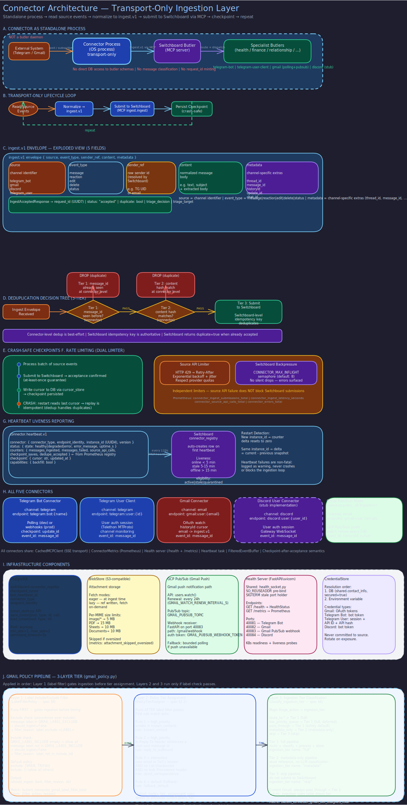

# Connector Architecture Overview

> **Purpose:** Explain what connectors are, their responsibilities, transport model, and how they submit events to the Switchboard.
> **Audience:** Developers building or operating connectors.
> **Prerequisites:** Familiarity with the [Switchboard butler role](../architecture/routing.md).

## Overview



Connectors are transport adapters that bridge external messaging systems (Telegram, Gmail, audio devices, etc.) into the Butlers ecosystem. They read events from source APIs, normalize them into a canonical envelope format, and submit them to the Switchboard's ingestion API. Connectors are deliberately thin -- they own the transport layer and nothing else.

## What Connectors Are

A connector is an independent process (or co-located daemon) that:

1. Reads source events or messages from an external system.
2. Normalizes source payloads into the `ingest.v1` envelope format.
3. Submits envelopes to the Switchboard via MCP tool call (`ingest`).
4. Persists a resume cursor so it can restart safely after crashes.
5. Sends periodic heartbeats to report liveness and operational statistics.

Connectors run independently from the Switchboard daemon lifecycle. The preferred deployment model is one process per connector type, though in-process connectors are allowed as long as they use the same canonical ingest path.

## Connector Responsibilities

### Connectors MUST

- Read source events/messages from an external system (Telegram, email, webhook, audio, etc.).
- Normalize source payloads into `ingest.v1` envelopes.
- Submit to the canonical Switchboard ingest API via MCP tool call.
- Persist connector-local resume state (cursor/offset/high-water mark) in the database via the `cursor_store` module.
- Enforce source-side rate limiting (provider quotas, 429 handling, jittered backoff).
- Enforce ingest-side backpressure (bounded in-flight requests, retry policy).
- Send periodic heartbeats to the Switchboard (every 2 minutes by default).
- Implement crash-safe, restart-safe behavior with at-least-once delivery.

### Connectors MUST NOT

- Classify messages (that is a Switchboard responsibility).
- Route directly to specialist butlers.
- Mint canonical `request_id` values (Switchboard assigns these at ingest acceptance).
- Bypass Switchboard ingestion with direct target-butler calls.

## Transport Model

Connectors submit envelopes via **MCP tool call** (`ingest`) to the Switchboard MCP server. Transport is SSE-based MCP (`fastmcp.Client`), not HTTP POST. The MCP server endpoint is configured via the `SWITCHBOARD_MCP_URL` environment variable.

The Switchboard responds with `202 Accepted` semantics: ingest is accepted for async processing, and the response includes a canonical request reference. Duplicate submissions for the same dedupe identity return the same canonical request reference and are treated as success, not error.

### Submission Flow

```
External Source --> Connector --> [normalize to ingest.v1] --> MCP tool call (ingest) --> Switchboard
                                                                                            |
                                                                         request_id assigned <--
                                                                         classification + routing -->
```

## Data Source Modes

Connectors support two source models:

- **Push/webhook connectors:** The source pushes events to the connector (e.g., Telegram webhooks, Gmail Pub/Sub), which forwards them to the Switchboard.
- **Pull/poll connectors:** The connector periodically fetches new events from the source API (e.g., Telegram `getUpdates`, Gmail history polling), then forwards each to the Switchboard.

Each newly observed source message/event is ingested as one canonical ingress record.

## Endpoint Identity Auto-Resolution

Connectors auto-resolve their endpoint identity at startup from the source API. No environment variable is needed:

| Connector | Resolution method | Example identity |
|---|---|---|
| Telegram bot | `getMe()` | `telegram:bot:@mybot` |
| Telegram user client | `get_me()` | `telegram:user:@username` |
| Gmail | `google_accounts.email` | `gmail:user:alice@gmail.com` |
| Live listener | Device config | `live-listener:connector` |

## Idempotency and Deduplication

Connectors must always send stable source identity fields (`channel`, `endpoint_identity`, `external_event_id`). The Switchboard owns the deduplication decision at the ingest boundary. Connectors must treat duplicate acceptance as success.

Canonical dedupe key guidance per provider:

- **Telegram:** `update_id` + receiving bot identity
- **Email:** RFC `Message-ID` + receiving mailbox identity
- **API/MCP:** caller idempotency key or deterministic payload hash + source identity + bounded time window

## Checkpoint Persistence

All connectors persist their resume cursor in the database via the `cursor_store` module (`butlers.connectors.cursor_store`). The canonical storage location is the `switchboard.connector_registry` table, keyed by `(connector_type, endpoint_identity)`.

Startup flow:

1. Create an asyncpg pool via `create_cursor_pool_from_env()`.
2. Call `load_cursor(pool, connector_type, endpoint_identity)`.
3. If a cursor exists, resume from that position.
4. If `None` (first run), initialize from the source API and write the baseline via `save_cursor()`.

No file-based cursor storage is used. All checkpoint state lives in the database.

## Self-Registration via Heartbeat

Connectors self-register on their first heartbeat -- no manual pre-configuration is required. The Switchboard creates a `connector_registry` row and begins tracking liveness. See [Heartbeat Protocol](heartbeat.md) for details.

## Environment Variables (Common)

| Variable | Required | Description |
|---|---|---|
| `SWITCHBOARD_MCP_URL` | Yes | SSE endpoint URL for Switchboard MCP server |
| `CONNECTOR_PROVIDER` | Yes | Provider name (`telegram`, `gmail`, etc.) |
| `CONNECTOR_CHANNEL` | Yes | Canonical channel (`telegram`, `email`, `voice`, etc.) |
| `CONNECTOR_POLL_INTERVAL_S` | For poll connectors | Poll interval in seconds |
| `CONNECTOR_MAX_INFLIGHT` | No (default: 8) | Ingest concurrency cap |
| `CONNECTOR_HEARTBEAT_INTERVAL_S` | No (default: 120) | Heartbeat interval in seconds |
| `CONNECTOR_HEARTBEAT_ENABLED` | No (default: true) | Disable for dev/testing |

Provider-specific credentials must come from environment or secret manager, never committed config.

## Authentication

Connector authentication uses bearer tokens issued by the Switchboard. Token scope must match the connector's source identity (`channel`, `provider`, `endpoint_identity`). See [API Authentication](../identity_and_secrets/cli-runtime-auth.md) for token lifecycle details.

## Available Connectors

- [Telegram Bot](telegram-bot.md) -- Bot API polling/webhook connector
- [Telegram User Client](telegram-user-client.md) -- MTProto user-client live stream
- [Gmail](gmail.md) -- Gmail API history polling and Pub/Sub push
- [Live Listener](live-listener.md) -- Ambient audio capture, VAD, and transcription
- [Heartbeat Protocol](heartbeat.md) -- Liveness reporting (all connectors)
- [Attachment Handling](attachment-handling.md) -- Gmail attachment fetch policy
- [Gmail Ingestion Policy](gmail-ingestion-policy.md) -- Tiered email processing
- [Metrics](metrics.md) -- Connector statistics and dashboard visibility

## Related Pages

- [Connector Interface Contract](interface.md) -- Full normative spec including `ingest.v1` envelope schema
- [Switchboard Butler Role](../architecture/routing.md) -- Ingestion authority
- [API Authentication](../identity_and_secrets/cli-runtime-auth.md) -- Token lifecycle
