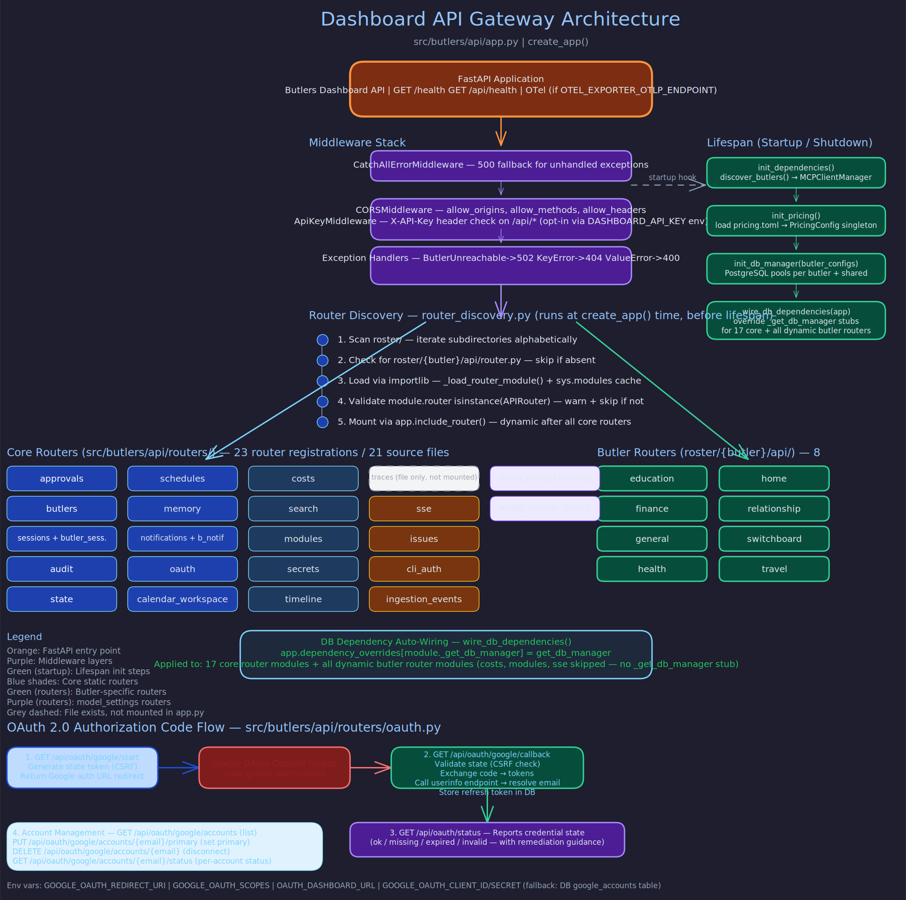

# Frontend Documentation

> **Purpose:** Index of all frontend specification pages for the Butlers dashboard.
> **Audience:** Frontend developers, designers, anyone working on or integrating with the dashboard UI.
> **Prerequisites:** [Dashboard API](../api_and_protocols/dashboard-api.md).

## Overview



The Butlers dashboard is a React single-page application that serves as the operational single-pane-of-glass for the entire butler infrastructure. It provides monitoring, management, and configuration capabilities across all butlers, connectors, modules, and system health. The frontend specs in this directory are the canonical source of truth for current dashboard behavior.

## Specification Pages

### [Purpose and Single Pane of Glass](purpose-and-single-pane.md)

Defines the dashboard's role and why it exists. The dashboard is the operator's primary interface for monitoring butler health, reviewing session activity, managing schedules, approving sensitive actions, and configuring the system. It consolidates information that would otherwise require CLI access, database queries, or log parsing.

### [Information Architecture](information-architecture.md)

Covers the global navigation structure, route map, and tab organization. Documents the sidebar navigation hierarchy, how butler detail pages are structured with 10+ tabs, and how the Switchboard's specialized views (registry, routing log, triage, backfill) integrate into the navigation.

### [Feature Inventory](feature-inventory.md)

Comprehensive inventory of all implemented dashboard features, including current gaps and placeholders. Covers butler management, session views, schedule CRUD, approval decisions, connector fleet monitoring, secret management (16 templates), OAuth flows, cost tracking, memory tier health, search, and more.

### [Data Access and Refresh](data-access-and-refresh.md)

Documents the API access patterns, polling/refresh behavior, and write-operation surfaces. Covers TanStack Query patterns for data fetching, auto-refresh tiers (real-time SSE for status, periodic polling for lists, on-demand for heavy queries), and how the frontend handles optimistic updates.

### [Backend API Contract](backend-api-contract.md)

The normative target-state specification for backend endpoints and payload contracts required by the frontend. This is authoritative for expected backend behavior -- not a best-effort snapshot. Documents the 80+ endpoints across 18 domain groups that the frontend consumes.

## Source of Truth

These specs follow a clear precedence model:

1. **`docs/frontend/` (this directory)** -- Authoritative for current behavior.
2. **`docs/FRONTEND_PROJECT_PLAN.md`** -- Planning and history context only.
3. **`frontend/src/**`** -- Actual implemented behavior (code is ground truth for bugs vs. spec gaps).

## Update Rule

When frontend behavior changes -- routes, tabs, capabilities, or operator workflows -- the corresponding spec page in this directory must be updated in the same change. This prevents documentation drift and ensures the specs remain useful for both contributors and AI agents.

## Tech Stack

The dashboard is built with:

- **React** with TypeScript
- **Vite** for development and build
- **shadcn/ui** component library
- **OKLCH** design system for color management
- **TanStack Query** for server state management
- **Recharts** for data visualization (health charts, cost tracking)

## Development

The frontend dev server runs on port `41173` and proxies API requests to the dashboard backend on port `41200`:

```bash
# Standalone
cd frontend && npm install && npm run dev

# Via Docker Compose
docker compose --profile dev up frontend-dev
```

## Related Pages

- [Dashboard API](../api_and_protocols/dashboard-api.md) -- Backend REST API documentation
- [Environment Config](../operations/environment-config.md) -- Frontend environment variables
- [Docker Deployment](../operations/docker-deployment.md) -- Frontend container setup
