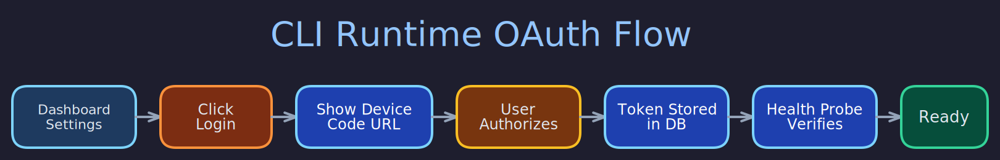

# OAuth Flows

> **Purpose:** Document the Google OAuth device-code flow, credential storage split, and multi-account support.
> **Audience:** Operators bootstrapping Google integrations, developers extending OAuth.
> **Prerequisites:** [Credential Store](../data_and_storage/credential-store.md), [Owner Identity](owner-identity.md).

## Overview



Butlers integrates with Google services (Calendar, Contacts, Gmail) via OAuth 2.0. The OAuth flow is bootstrapped through the dashboard UI and credentials are stored in a split model: app credentials in `butler_secrets`, refresh tokens in `shared.entity_info` on companion entities. Multi-account Google support is fully implemented.

## Credential Storage Split

Google OAuth credentials are stored in two locations:

### App Credentials (in `butler_secrets`)

| Key | Category | Sensitive | Description |
|-----|----------|-----------|-------------|
| `GOOGLE_OAUTH_CLIENT_ID` | `google` | No | OAuth client ID |
| `GOOGLE_OAUTH_CLIENT_SECRET` | `google` | Yes | OAuth client secret |
| `GOOGLE_OAUTH_SCOPES` | `google` | No | Granted OAuth scopes |

These are shared across all Google accounts and stored via the `CredentialStore`.

### Refresh Tokens (in `shared.entity_info`)

Each Google account has a **companion entity** in `shared.entities` with `roles = ['google_account']`. The refresh token is stored as an `entity_info` row:

```
shared.entity_info:
  entity_id = <companion_entity_uuid>
  type = "google_oauth_refresh"
  value = "1//0abc..."
  secured = true
  is_primary = true
```

This per-entity storage enables multi-account Google support -- each account has its own companion entity and its own refresh token.

## Google Account Registry

The `shared.google_accounts` table tracks connected Google accounts:

| Column | Type | Description |
|--------|------|-------------|
| `id` | UUID | Account primary key |
| `entity_id` | UUID (FK) | Companion entity in `shared.entities` |
| `email` | TEXT | Google email address |
| `display_name` | TEXT | Google profile display name |
| `is_primary` | BOOLEAN | Whether this is the active primary account |
| `granted_scopes` | TEXT[] | OAuth scopes granted at last connect |
| `status` | TEXT | `active`, `revoked`, or `expired` |
| `connected_at` | TIMESTAMPTZ | When the account was first connected |

A partial unique index enforces at most one primary account at the database level.

### Account Lifecycle

- **`create_google_account()`** -- Registers a new account after OAuth callback. Creates a companion entity, inserts the account row, and optionally stores the refresh token. First account is automatically primary.
- **`set_primary_account()`** -- Atomically swaps the primary flag using a single transaction.
- **`disconnect_account()`** -- Full disconnect flow: fetch refresh token, attempt Google revocation, delete entity_info, mark status as `revoked`. If disconnected account was primary, auto-promotes the oldest remaining active account.
- **`list_google_accounts()`** / **`get_google_account()`** -- Query by email, UUID, or get the primary.

### Account Limit

A soft limit of 10 active accounts (configurable via `GOOGLE_MAX_ACCOUNTS` env var) prevents unbounded growth.

## OAuth Bootstrap Flow

The dashboard provides a web-based OAuth bootstrap:

1. User navigates to `GET /api/oauth/google/start` in the dashboard.
2. The dashboard initiates the OAuth authorization code flow with Google.
3. User authorizes in the browser and Google redirects back with an authorization code.
4. The callback endpoint exchanges the code for tokens.
5. App credentials (client_id, client_secret) are stored in `butler_secrets` via the shared credential store.
6. The refresh token is stored in `shared.entity_info` on the companion entity.
7. A `shared.google_accounts` row is created (or updated) with the granted scopes.

### Scope Grants

Different modules require different OAuth scopes:

- **Calendar** -- `https://www.googleapis.com/auth/calendar`
- **Contacts** -- `https://www.googleapis.com/auth/contacts.readonly`
- **Gmail** -- `https://www.googleapis.com/auth/gmail.readonly` (or `.modify`)

The `granted_scopes` array on the Google account record tracks which scopes were authorized. Modules validate scope availability at startup (e.g., the contacts module checks for a contacts scope).

## Loading Credentials

At module startup, credentials are loaded via `load_google_credentials()` or `resolve_google_credentials()`:

```python
from butlers.google_credentials import resolve_google_credentials

creds = await resolve_google_credentials(
    store, pool=shared_pool, caller="calendar", account="work@gmail.com"
)
# creds.client_id, creds.client_secret, creds.refresh_token
```

Resolution:
1. App credentials from `butler_secrets` via `CredentialStore.load()`.
2. Refresh token from `shared.entity_info` via the companion entity lookup.
3. Account selector: `None` = primary account, `str` = email, `UUID` = account ID.

`MissingGoogleCredentialsError` is raised if credentials are incomplete, with a safe-to-log message naming missing fields (never values).

## Credential Safety

- `GoogleCredentials.__repr__()` redacts `client_secret` and `refresh_token`.
- `GoogleCredentials.__str__()` is aliased to `__repr__()` to prevent Pydantic's default from exposing values.
- Log messages never include secret material.

## Related Pages

- [Credential Store](../data_and_storage/credential-store.md) -- `butler_secrets` table
- [Owner Identity](owner-identity.md) -- Entity-based credential storage
- [Contact System](contact-system.md) -- Google Contacts provider integration
