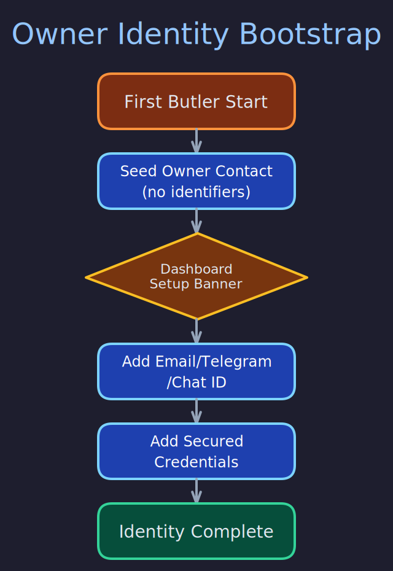

# Owner Identity

> **Purpose:** Explain how the owner contact is bootstrapped, how identity fields are configured, and how secured credentials are managed.
> **Audience:** Users setting up Butlers for the first time, developers extending identity resolution.
> **Prerequisites:** [Schema Topology](../data_and_storage/schema-topology.md), [Contact System](contact-system.md).

## Overview



When Butlers starts for the first time, it seeds an **Owner contact** in the `shared.contacts` table with the `owner` role on its linked entity. This contact has no channel identifiers initially -- the user must configure their identity through the dashboard so butlers can recognize them across channels (Telegram, email) and prevent duplicate contacts during sync.

## Bootstrap Flow

On first startup, the daemon:

1. Checks `shared.entities` for an entity with `'owner' = ANY(roles)`.
2. If none exists, creates an owner entity in `shared.entities` with `roles = ['owner']`.
3. Creates a corresponding `shared.contacts` row linked via `entity_id`.
4. The owner contact starts with no `contact_info` entries.

This ensures exactly one owner entity exists across the system. Subsequent butler startups detect the existing owner and skip creation.

## Configuring Identity

Navigate to the owner contact's detail page in the dashboard (linked from the setup banner on the contacts page). Use the "Add contact info" form to add:

### Standard Identity Fields

- **Email** -- Your primary email address. Used for email identity resolution and contact sync deduplication.
- **Telegram handle** -- Your `@username`. Used for Telegram contact matching.
- **Telegram chat ID** -- Numeric ID for direct message delivery. Send `/start` to `@userinfobot` on Telegram to find yours.

### Secured Credentials

For butlers that act on your behalf (sending emails, connecting to Telegram as your user account):

- **Email password** -- App password for SMTP/IMAP access. Stored as `secured=true` in `shared.entity_info`.
- **Telegram API ID** -- From [my.telegram.org](https://my.telegram.org). Required for user-client (MTProto) connections.
- **Telegram API hash** -- From [my.telegram.org](https://my.telegram.org). Paired with the API ID.
- **Telegram user session** -- MTProto session string for the Telegram user-client connector.

Secured entries are stored in PostgreSQL with `secured=true` and masked in the dashboard API. List responses exclude raw values; a "Reveal" button provides on-demand access.

## Setup Banner

A one-time setup banner appears on the contacts page when identity fields are missing. It links to the owner contact detail page where all fields can be managed. The banner checks for the presence of key `contact_info` entries and disappears once the essential fields are configured.

## Identity Resolution

The owner identity is used in several critical paths:

### Switchboard Routing

When a message arrives (e.g., from Telegram), the Switchboard calls `resolve_contact_by_channel(pool, "telegram", chat_id)` to identify the sender. If the sender matches the owner's contact_info, the identity preamble includes `[Source: Owner (contact_id: ..., entity_id: ...), via telegram]`. This allows butler prompts to understand they are interacting with the owner.

### Contact Sync Deduplication

When the contacts module syncs from Google or Telegram, it matches incoming contacts against existing `contact_info` entries. The owner's email and Telegram handle prevent the sync engine from creating a duplicate contact for the owner.

### Credential Resolution

Module startup code resolves credentials from the owner entity's `entity_info`:

```python
from butlers.credential_store import resolve_owner_entity_info

api_id = await resolve_owner_entity_info(pool, "telegram_api_id")
api_hash = await resolve_owner_entity_info(pool, "telegram_api_hash")
session = await resolve_owner_entity_info(pool, "telegram_user_session")
```

The function queries `shared.entities` for the owner, then fetches the matching `entity_info` row, preferring primary entries.

## Security Model

Since Butlers is a user-federated platform (each user owns their instance), the security model is straightforward:

- Credentials are stored in PostgreSQL in the `shared.entity_info` table.
- The user controls the database directly.
- API-level masking prevents accidental exposure in dashboard responses.
- No encryption at rest (the user owns the infrastructure).

## Entity Structure

```
shared.entities
├── id: UUID
├── canonical_name: "Owner"
├── entity_type: "person"
├── roles: ["owner"]
└── tenant_id: "shared"

shared.entity_info (for the owner entity)
├── (entity_id, "email") -> "user@example.com"
├── (entity_id, "telegram") -> "@username"
├── (entity_id, "telegram_chat_id") -> "123456789"
├── (entity_id, "telegram_api_id") -> "12345" (secured)
├── (entity_id, "telegram_api_hash") -> "abc..." (secured)
├── (entity_id, "google_oauth_refresh") -> "1//..." (secured)
└── ...
```

## Related Pages

- [Contact System](contact-system.md) -- Full contact model
- [Credential Store](../data_and_storage/credential-store.md) -- DB-first secret resolution
- [OAuth Flows](oauth-flows.md) -- Google OAuth credential storage
