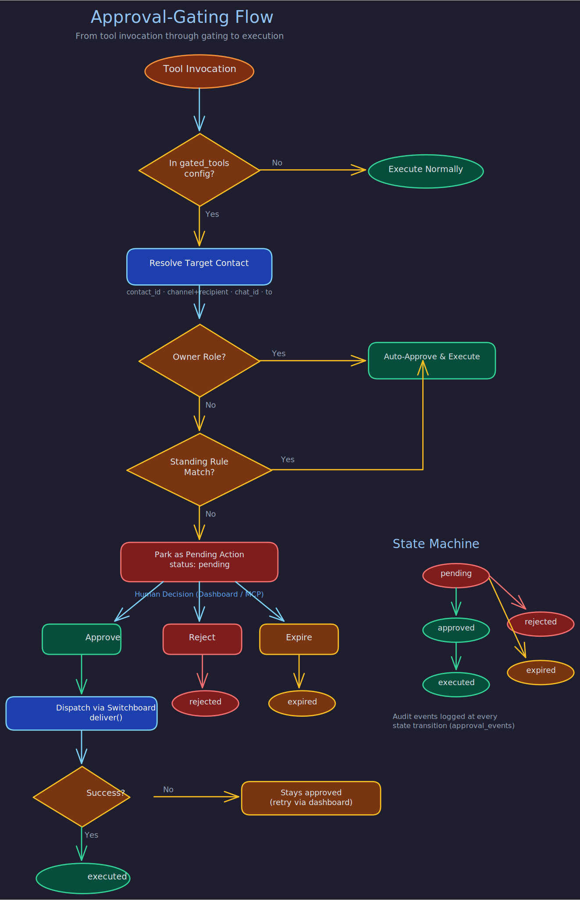

# Approvals Module

> **Purpose:** Human-in-the-loop approval mechanism that intercepts high-impact tool invocations, parks them for review, and supports standing rules for auto-approval.
> **Audience:** Contributors and module developers.
> **Prerequisites:** [Module System](module-system.md).

## Overview



The Approvals module is an execution-control module that butlers load locally. It intercepts configured high-impact tool invocations before execution, parks unapproved invocations as durable pending actions, and supports manual approve/reject/expire workflows plus standing approval rules for auto-approval of repeatable safe patterns.

This is how the system ensures that butlers cannot send emails to strangers, post messages to non-owner contacts, or execute other sensitive operations without explicit human authorization.

Source: `src/butlers/modules/approvals/` -- `module.py` (tools), `gate.py` (interception), `executor.py` (execution), `rules.py` (matching), `events.py` (audit), `redaction.py`, `retention.py`, `sensitivity.py`.

## Configuration

Enable in `butler.toml`:

```toml
[modules.approvals]
enabled = true
default_expiry_hours = 48
default_risk_tier = "medium"    # low | medium | high | critical

[modules.approvals.gated_tools]
email_send_message = {}
email_reply_to_thread = { expiry_hours = 24, risk_tier = "high" }
telegram_send_message = {}
telegram_reply_to_message = {}
```

Only tools listed in `gated_tools` are intercepted. Tools are gated strictly by config -- there are no implicit defaults based on tool name patterns.

## Two-Layer Gating

The approval gate operates at two independent layers, both enforcing gating:

**Layer 1 -- MCP tool wrapping** (`gate.py`): Intercepts gated tool calls at the MCP boundary. Primary gate for direct LLM tool invocations.

**Layer 2 -- `route.execute` inline gate** (`daemon.py`): The Messenger butler's `route.execute` handler calls channel module methods directly, bypassing MCP tool wrappers. An inline gate re-enforces role-based gating at this layer.

### Role-Based Auto-Approval

1. **Owner-targeted**: Actions targeting the owner contact are auto-approved immediately (owners are pre-trusted).
2. **Known non-owner**: Standing rules are checked. Match -> auto-approve and execute. No match -> park as `pending`.
3. **Unresolvable target**: Parked as `pending` (conservative default).

## Tools Provided

The module registers 13 MCP tools:

| Tool | Category | Description |
|------|----------|-------------|
| `list_pending_actions` | Queue | List actions with optional status filter |
| `show_pending_action` | Queue | Show full details for a single action |
| `approve_action` | Queue | Approve and execute a pending action |
| `reject_action` | Queue | Reject with optional reason |
| `pending_action_count` | Queue | Count of pending actions |
| `expire_stale_actions` | Queue | Mark expired actions past their `expires_at` |
| `list_executed_actions` | Queue | Query executed actions for audit review |
| `create_approval_rule` | Rules | Create a new standing approval rule |
| `create_rule_from_action` | Rules | Create a rule from a pending action with smart constraint defaults |
| `list_approval_rules` | Rules | List standing approval rules |
| `show_approval_rule` | Rules | Show full rule details with use count |
| `revoke_approval_rule` | Rules | Deactivate a standing approval rule |
| `suggest_rule_constraints` | Rules | Preview suggested constraints for a pending action |

## Standing Rules

Standing rules auto-approve matching invocations. A rule matches when all of these hold:

- Tool name matches.
- Rule is active and not expired.
- `use_count < max_uses` when bounded.
- Argument constraints match (typed: `exact`, `pattern`, `any`; legacy: `"*"` wildcard).

Matching precedence is deterministic: constraint specificity (descending) -> bounded scope before unbounded -> newer rule before older -> lexical rule ID tiebreaker.

### Constraint Suggestions

`suggest_rule_constraints` and `create_rule_from_action` use sensitivity classification:

1. Module-declared tool metadata (`ToolMeta.arg_sensitivities`) -- checked first.
2. Heuristic sensitive argument names (`to`, `recipient`, `email`, `url`, `amount`, etc.).
3. Default: non-sensitive.

Sensitive args get `{"type": "exact", "value": ...}`; non-sensitive args get `{"type": "any"}`.

## Action Lifecycle

Valid status transitions:

```
pending -> approved | rejected | expired
approved -> executed
rejected, expired, executed -> (terminal)
```

Both auto-approved and manually approved actions execute through the shared `execute_approved_action()` path, which normalizes return values, persists execution results, and increments rule use counts.

## Risk Tiers

Tools and actions are classified into risk tiers: `low`, `medium`, `high`, `critical`. Higher tiers (`high`, `critical`) require narrower constraints (at least one `exact` or `pattern`) and bounded scope (`expires_at` or `max_uses`) for standing rules.

## Database Tables

The module owns tables in the hosting butler's schema (Alembic branch: `approvals`):

- `pending_actions` -- durable queue and audit log for gated invocations
- `approval_rules` -- standing rules for auto-approval
- `approval_events` -- append-only immutable audit log (never updated or deleted)

## Dependencies

None. The approvals module is a leaf module. Other modules interact with it indirectly through the daemon's gate-wiring mechanism.

## Related Pages

- [Module System](module-system.md)
- [Calendar Module](calendar.md) -- uses approval integration for overlap overrides
- [Email Module](email.md) -- tools gated by approvals
- [Telegram Module](telegram.md) -- tools gated by approvals
