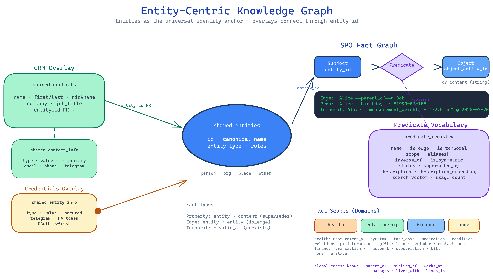
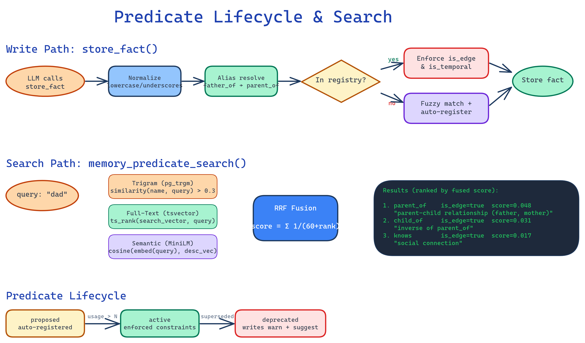

# Knowledge Base: Entity-Centric Data Model

The Butlers knowledge graph uses **entities as the universal identity anchor**. Every piece of knowledge — facts, relationships, credentials, contact details — attaches to an entity via `entity_id`. This document describes the data model, the predicate vocabulary system, and how domain-specific "overlays" layer onto the shared entity graph.



---

## Core: shared.entities

The `shared.entities` table is the single source of identity across all butlers. Every person, organization, place, or device in the system is an entity.

| Column | Type | Purpose |
|--------|------|---------|
| `id` | UUID PK | Universal identifier |
| `canonical_name` | VARCHAR | Display name |
| `entity_type` | VARCHAR | `person`, `organization`, `place`, `other` |
| `aliases` | TEXT[] | Alternative names for resolution |
| `roles` | TEXT[] | Identity roles (e.g., `['owner']`) |
| `metadata` | JSONB | Extensible; includes lifecycle (`merged_into`, `deleted_at`, `unidentified`) |
| `tenant_id` | TEXT | Multi-tenant isolation |

**Entity resolution** uses a 5-tier waterfall: role match → exact name → exact alias → prefix/substring → fuzzy (edit distance ≤ 2). Context boosting from graph neighborhood and domain hints refines scoring.

**Lifecycle**: Entities are never hard-deleted. Merging sets `metadata.merged_into`; soft-delete sets `metadata.deleted_at`. A partial unique index allows name reuse after tombstoning.

---

## The SPO Fact Graph

Knowledge is stored as **Subject/Predicate/Object** facts in per-butler `facts` tables. The entity is always the subject; the object can be another entity (edge-fact) or a content string (property-fact).

### Three fact types

| Type | entity_id | object_entity_id | valid_at | Behavior |
|------|-----------|-------------------|----------|----------|
| **Property** | Set | NULL | NULL | Latest supersedes previous |
| **Edge** | Set | Set | NULL | Links two entities; supersedes by full key |
| **Temporal** | Set | Optional | Set | Coexists with others at different timestamps |

**Uniqueness keys:**
- Property: `(tenant_id, entity_id, scope, predicate)` where `valid_at IS NULL`
- Edge: `(tenant_id, entity_id, object_entity_id, scope, predicate)` where `valid_at IS NULL`
- Temporal: idempotency key (SHA-256 of canonical tuple) prevents duplicates; no supersession

### Fact scoping

Facts are namespaced by `scope` to isolate domains:

| Scope | Butler | Example predicates |
|-------|--------|-------------------|
| `health` | Health | `measurement_weight`, `symptom`, `took_dose`, `medication`, `condition` |
| `relationship` | Relationship | `interaction`, `gift`, `loan`, `reminder`, `contact_note` |
| `finance` | Finance | `transaction_debit`, `transaction_credit`, `account`, `subscription` |
| `home` | Home | `ha_state` |
| `global` | Any | `knows`, `parent_of`, `birthday`, `preference` |

---



## Predicate Vocabulary

The `predicate_registry` table governs which predicates are valid, what constraints they carry, and how they're discovered. It transitions from advisory documentation to an enforced contract (see `openspec/changes/predicate-registry-enforcement/`).

### Registry schema

| Column | Type | Purpose |
|--------|------|---------|
| `name` | TEXT PK | Canonical predicate identifier |
| `is_edge` | BOOLEAN | Requires `object_entity_id` at write time |
| `is_temporal` | BOOLEAN | Requires `valid_at` at write time |
| `scope` | TEXT | Domain namespace (global, health, relationship, etc.) |
| `aliases` | TEXT[] | Synonym list for deterministic resolution |
| `inverse_of` | TEXT FK | Bidirectional pair (e.g., `parent_of` ↔ `child_of`) |
| `is_symmetric` | BOOLEAN | Self-inverse (e.g., `knows`, `sibling_of`) |
| `status` | TEXT | `active`, `deprecated`, `proposed` |
| `superseded_by` | TEXT FK | Replacement when deprecated |
| `expected_subject_type` | TEXT | Suggested entity_type for subject |
| `expected_object_type` | TEXT | Suggested entity_type for object |
| `description` | TEXT | Rich text with synonyms for semantic search |
| `description_embedding` | vector(384) | Semantic search via MiniLM |
| `search_vector` | tsvector | Full-text search on name + description |
| `usage_count` | INTEGER | Popularity ranking signal |
| `example_json` | JSONB | Sample `{"content": "...", "metadata": {...}}` payload |

### Predicate lifecycle

```
proposed → active → deprecated (superseded_by → replacement)
```

- **Auto-registered** predicates start as `proposed` with inferred `is_edge`/`is_temporal` flags
- Migration-seeded predicates are `active` with rich descriptions
- Deprecated predicates still accept writes but return warnings with replacement suggestions

### Write-time enforcement

When a predicate exists in the registry:
- `is_edge = true` → `object_entity_id` required (else ValueError)
- `is_temporal = true` → `valid_at` required (else ValueError)

Unregistered predicates are stored freely (no enforcement), then auto-registered.

### Predicate search (hybrid retrieval)

The `memory_predicate_search` MCP tool uses three-signal hybrid retrieval fused via Reciprocal Rank Fusion (RRF):

1. **Trigram** (pg_trgm): Fuzzy name matching — catches typos ("parnet_of" → `parent_of`)
2. **Full-text** (tsvector): Stemmed description search — handles multi-word queries
3. **Semantic** (vector cosine): Conceptual matching — "dad" finds `parent_of`

Fusion: `score = Σ 1/(60 + rank_i)` across all three signal lists.

### Predicate normalization

Incoming predicates from LLM callers are normalized before storage and registry lookup:
- Lowercase: `Birthday` → `birthday`
- Hyphens/spaces → underscores: `job-title` → `job_title`
- Strip `is_` prefix: `is_parent_of` → `parent_of`

### Inverse predicates

Edge predicates can declare bidirectional pairs:

| Predicate | Inverse | Symmetric? |
|-----------|---------|------------|
| `parent_of` | `child_of` | No |
| `manages` | `reports_to` | No |
| `works_at` | `employs` | No |
| `knows` | — | Yes |
| `sibling_of` | — | Yes |
| `lives_with` | — | Yes |

Inverse resolution is virtual (read-path only) — no duplicate facts stored. When querying entity Bob, a fact `parent_of(Alice, Bob)` is presented as `child_of(Bob, Alice)`.

### Domain/range type validation

When a predicate specifies `expected_subject_type` (e.g., `parent_of` expects `person`) or `expected_object_type`, `store_fact()` checks the actual entity types. Mismatches produce **warnings, not errors** — the fact is still stored. This follows Wikidata's philosophy: constraints are guidance for editors, not enforcement gates.

Example: `works_at(Alice[person], Bob[person])` produces a warning because `expected_object_type = 'organization'` but Bob is a person. The fact is stored, and the LLM learns from the warning.

### Example payloads

Each seeded predicate carries an `example_json` JSONB field with a realistic sample payload:

```json
// measurement_weight
{"content": "Weight: 72.5 kg", "metadata": {"value": "72.5", "unit": "kg"}}

// gift
{"content": "Noise-cancelling headphones", "metadata": {"occasion": "birthday", "status": "idea"}}

// transaction_debit
{"content": "Whole Foods 47.32 USD", "metadata": {"merchant": "Whole Foods", "amount": "47.32", "currency": "USD"}}
```

The `memory_predicate_search` tool returns these examples alongside results, giving the LLM a concrete template to follow when creating facts. Auto-registered predicates have `example_json = NULL`.

---

## Overlays: Sub-Data Models

Overlays are domain-specific data models that attach to entities via foreign keys. They add richness without polluting the core entity graph.

### Contacts overlay (CRM)

`shared.contacts` is a CRM sub-model linked via `contacts.entity_id → entities.id`:

| Table | Purpose |
|-------|---------|
| `shared.contacts` | Name variants, company, job_title, metadata |
| `shared.contact_info` | Multi-channel identifiers: email, phone, telegram, etc. |

**Resolution**: Contact creation auto-creates or resolves an entity. The relationship butler's `contact_resolve()` uses salience scoring (relationship weights: spouse=50, parent=30, friend=10, acquaintance=2) with graph context boosting.

### Credentials overlay

`shared.entity_info` stores credentials and identifiers per entity:

| Column | Purpose |
|--------|---------|
| `type` | Identifier type (telegram, HA token, OAuth refresh, etc.) |
| `value` | The credential value |
| `secured` | True = value is masked in API responses |
| `is_primary` | True = preferred identifier for this type |

### Home Assistant overlay

HA devices map to entities with `entity_type = 'other'` and `metadata.entity_class = 'ha_device'`. State is stored as `ha_state` property facts with supersession on each polling cycle.

### Health/Finance overlays

Health and finance data attaches to the **owner entity** (resolved via `roles = ['owner']`). All health measurements, conditions, medications, transactions, accounts, and subscriptions are facts scoped to their domain.

---

## Schema isolation

| Schema | Visibility | Purpose |
|--------|-----------|---------|
| `shared` | All butlers (read); selective write | Entities, contacts, contact_info, entity_info |
| Per-butler (e.g., `relationship`) | Butler-specific | Facts, episodes, rules, domain tables |

Inter-butler communication is MCP-only through the Switchboard. The shared schema provides identity resolution without violating butler isolation.

---

## Key design principles

1. **Entity-first**: All knowledge attaches to entities, not contacts or bare strings
2. **Overlays, not monoliths**: Contacts, credentials, facts are separate models linked by `entity_id`
3. **Predicate governance**: Registry enforces `is_edge`/`is_temporal`, aliases prevent proliferation, inverses enable bidirectional traversal
4. **Temporal safety**: Temporal predicates require `valid_at` to prevent supersession from destroying historical data
5. **Soft lifecycle**: Entities and predicates are tombstoned/deprecated, never deleted
6. **Scope isolation**: Facts are namespaced by domain; predicates are scoped for search relevance
