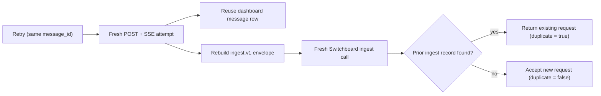

# Chat Send Retry Semantics

**Status:** Current implementation boundary · **Date:** 2026-07-17

**Related:** [Dashboard chat widget design](2026-07-03-dashboard-chat-widget-design.md), [Dashboard conversations specification](../../openspec/specs/dashboard-conversations/spec.md), [Ingestion envelope protocol](../api_and_protocols/ingestion-envelope.md)

## Decision

The dashboard chat **Retry** control starts a new message-submission attempt after
`SWITCHBOARD_UNAVAILABLE` or a generic send error. It retains the failed
message's client-generated `message_id`, but it does **not** replay the original
HTTP request, SSE stream, or exact `ingest.v1` envelope.

Put differently: retry safely resubmits the same *logical message*; it does not
resume the original request.

## What remains stable, and what is new

The chat surfaces retain the `message_id` in the retryable error state and pass
it back into `sendText`. The initial send creates that UUID; a retry supplies it
instead of generating another one. The conversation endpoints use that identity
to reuse the existing user-message row, and the envelope builder places it in
`event.external_event_id`.

That stable identity is intentionally narrower than an API-level replay
guarantee:

| Stable across a retry | Newly created or evaluated on a retry |
| --- | --- |
| Logical message identity (`message_id`) | Dashboard POST and its SSE stream |
| Existing dashboard user-message row (or the original initial conversation) | Client abort controller and optimistic UI attempt |
| Switchboard event identity (`external_event_id`) | `ingest.v1` envelope, including a fresh `observed_at` value |
| A matching Switchboard dedupe key, when the first ingest reached Switchboard | MCP `ingest` invocation and its acceptance result |

For follow-ups, the API reads conversation history before it rebuilds the
envelope. The floating widget also captures page context at send time. A retry
therefore must not be interpreted as reusing an immutable copy of the first
envelope.

## Observed consequence and current boundary

The retry button is appropriate when the user wants to submit the logical
message again, including after an uncertain failure. It does not promise that
the first submission's request lifecycle or stream will be resumed.

- If the first attempt never reached Switchboard, the new ingest call creates
  the request for that logical message.
- If the first attempt reached Switchboard but the dashboard did not receive a
  usable response, the new ingest call can be recognized as a duplicate and
  return the existing request reference rather than route the message again.
- A generic send error is a UI retry state, not a claim that every underlying
  error is recoverable. For example, a deterministic envelope rejection may
  fail again when submitted unchanged.

The acceptable current contract is therefore **at-least-once dashboard
submission with stable message identity, local message persistence
idempotency, and Switchboard ingest-boundary deduplication**. It is not an
exactly-once dashboard request or a replay/resume contract. In particular,
callers cannot rely on retry to preserve the original envelope bytes,
`observed_at`, page context, request ID, SSE position, or partial response.

This boundary keeps the user-message record and downstream ingestion safe from
the common duplicate case without claiming recovery semantics that the current
interfaces do not store or expose.

## What an explicit idempotent-retry contract would require

This is a requirements list, not a proposed endpoint or runtime change. A
future contract that promised replay rather than resubmission would need to
define all of the following:

1. A durable submission identity and attempt record created before dispatch,
   with a clear owner and retention window.
2. An immutable canonical request representation, or an explicitly defined
   semantic equivalent, plus a conflict rule when the same identity is reused
   with different content or routing inputs.
3. Persisted lifecycle state that distinguishes unaccepted, accepted, running,
   completed, and terminally failed work and exposes the original request
   reference when one exists.
4. A way to resume or retrieve the original result/stream without re-invoking
   routing or execution, including behavior for concurrent retries and
   cancellation.
5. Defined timeout, failure, authorization, and data-retention behavior so a
   caller can tell when retry is safe, pending, rejected, or no longer
   recoverable.

Until such a contract exists, documentation and callers should describe Retry
as a fresh submission that reuses a logical-message identity, not as an
idempotent replay of an original envelope or request.

## Implementation evidence

| Concern | Current interface or source location |
| --- | --- |
| Retryable error classification and retained message identity | [`classifySendError`](../../frontend/src/components/chat/send-error-utils.ts) and [`SendErrorBanner`](../../frontend/src/components/chat/send-error.tsx) |
| Full-page chat submission and retry callback | [`ChatContent.sendText`](../../frontend/src/components/chat/ChatPanel.tsx) |
| Floating-widget submission, fresh page-context capture, and retry callback | [`WidgetPanel.sendText`](../../frontend/src/components/chat/FloatingChatWidget.tsx) |
| Fresh initial/follow-up POST handlers and SSE response | [`create_conversation` and `send_message`](../../src/butlers/api/routers/conversations.py) |
| Fresh MCP `ingest` submission | [`_submit_to_switchboard`](../../src/butlers/api/routers/conversations.py) |
| Stable external event identity and freshly built timestamp/context | [`build_dashboard_envelope`](../../src/butlers/api/conversation_envelope.py) |
| Reuse-or-conflict behavior for a dashboard message row | [`message_create_idempotent`](../../src/butlers/api/conversations.py) |
| Ingest-boundary dedupe and duplicate acceptance | [`_compute_dedupe_key` and `ingest_v1`](../../roster/switchboard/tools/ingestion/ingest.py) |
| Retry regression coverage | [`test_create_conversation_retry_reuses_original_conversation_for_message_id`](../../tests/api/test_conversations.py), [`FloatingChatWidget` retry test](../../frontend/src/components/chat/FloatingChatWidget.test.tsx), and [`ChatPanel` retry test](../../frontend/src/components/chat/ChatPanel.test.tsx) |
