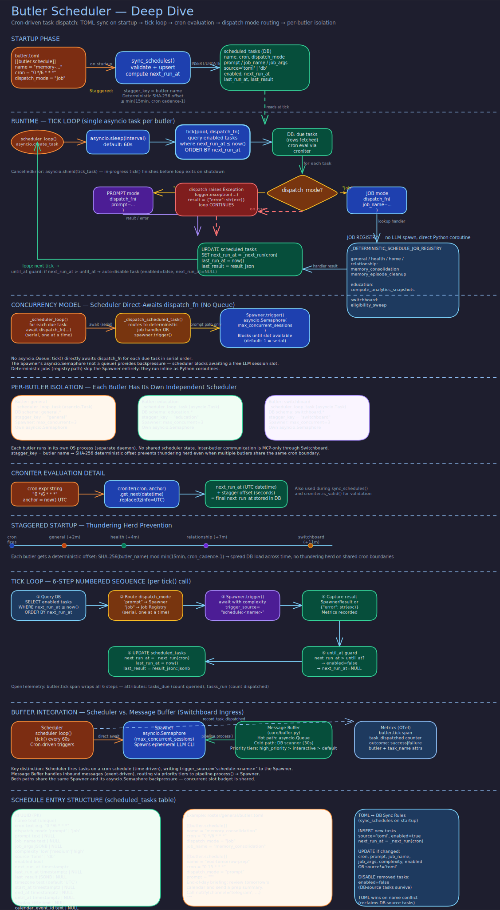

# Scheduler Execution

> **Purpose:** Describe the cron-driven task scheduler: tick loop, TOML-to-DB sync, staggering, dispatch modes, and task lifecycle.
> **Audience:** Developers configuring scheduled tasks, operators troubleshooting missed schedules, architects understanding the dispatch model.
> **Prerequisites:** [Trigger Flow](../concepts/trigger-flow.md), [LLM CLI Spawner](spawner.md).

## Overview

The scheduler (`src/butlers/core/scheduler.py`) is a cron-driven task dispatch system. At daemon startup, it syncs schedule definitions from `butler.toml` into the `scheduled_tasks` database table. During operation, the daemon periodically calls `tick()`, which evaluates cron expressions and dispatches due tasks to the spawner. The scheduler supports two dispatch modes, deterministic staggering, complexity-aware model selection, and automatic task expiry.

## TOML-to-DB Sync

On startup, `sync_schedules()` reconciles `[[butler.schedule]]` entries from the butler's TOML config with the `scheduled_tasks` table:

- **New tasks** are inserted with `source='toml'` and `enabled=true`.
- **Changed tasks** (cron expression, prompt, dispatch mode, job name, job args, or complexity changed) are updated in place. Tasks previously created at runtime (`source='db'`) that share a name with a TOML schedule are reclaimed to `source='toml'`.
- **Removed tasks** (present in DB with `source='toml'` but absent from the current TOML) are disabled by setting `enabled=false`.

Each synced task gets a computed `next_run_at` based on its cron expression and optional stagger offset.

## Dispatch Modes

Scheduled tasks support two dispatch modes, configured via `dispatch_mode`:

### Prompt Mode (default)

The task's `prompt` string is sent to the spawner, which spawns an LLM session. This is for tasks that require reasoning --- summarizing calendars, drafting emails, analyzing data. The scheduler emits a warning if neither the prompt text nor any referenced skill's `SKILL.md` contains the string `notify` (case-insensitive), catching tasks whose results would be silently discarded.

### Job Mode

The task's `job_name` maps to a registered Python function that runs directly without spawning an LLM. This is for deterministic maintenance work: memory consolidation, analytics computation, eligibility sweeps.

## The Tick Loop

The daemon calls `tick()` at a regular interval. Each tick:

1. **Query due tasks** --- `SELECT` from `scheduled_tasks` where `enabled = true AND next_run_at <= now()`, ordered by `next_run_at`.

2. **Dispatch each task** --- For prompt-mode tasks, calls `dispatch_fn(prompt=..., trigger_source="schedule:<task-name>", complexity=...)`. For job-mode tasks, calls `dispatch_fn(job_name=..., job_args=..., trigger_source="schedule:<task-name>")`.

3. **Update state** --- After dispatch (success or failure), advances `next_run_at` to the next cron occurrence, sets `last_run_at` to now, and stores the dispatch result in `last_result` (JSONB).

4. **Handle expiry** --- If a task has an `until_at` timestamp and the next computed run would exceed it, the task is auto-disabled (`enabled=false`, `next_run_at=NULL`).

5. **Record metrics** --- Each dispatch increments a `task_dispatched` counter with `butler`, `task_name`, and `outcome` (success/failure) attributes. The tick span records `tasks_due` and `tasks_run` as OTel attributes.

Dispatch failures are logged but do not prevent subsequent tasks from running. The error is stored in `last_result` for operator visibility.

## Staggering

When multiple butler instances share the same cron schedule, simultaneous dispatch would create a thundering herd. The scheduler applies deterministic staggering:

- A `stagger_key` (typically the butler name) is hashed with SHA-256.
- The hash is mapped to an offset in seconds, bounded by `min(max_stagger_seconds, cron_interval - 1)`.
- The offset is added to the computed `next_run_at`.

The default `max_stagger_seconds` is 900 (15 minutes). The offset never exceeds the cron interval minus one second, ensuring a task does not stagger past its next scheduled occurrence.

## Complexity Tiers

Each scheduled task can specify a `complexity` value that influences model selection during dispatch. Valid values: `trivial`, `medium` (default), `high`, `extra_high`, `discretion`, `self_healing`. Invalid values in the database are logged as warnings and fall back to `medium`.

## Scheduled Task Fields

| Field | Type | Description |
| --- | --- | --- |
| `name` | text | Unique task identifier |
| `cron` | text | Cron expression (validated by croniter) |
| `dispatch_mode` | text | `"prompt"` or `"job"` |
| `prompt` | text | Prompt text (prompt mode only) |
| `job_name` | text | Registered job function name (job mode only) |
| `job_args` | jsonb | Arguments dict for job dispatch (job mode only) |
| `complexity` | text | Complexity tier for model selection |
| `source` | text | `"toml"` (from config) or `"db"` (runtime-created) |
| `enabled` | bool | Whether the task is active |
| `next_run_at` | timestamptz | Next scheduled execution time |
| `last_run_at` | timestamptz | Most recent execution time |
| `last_result` | jsonb | Result or error from last dispatch |
| `until_at` | timestamptz | Auto-disable after this time |

## Related Pages

- [Trigger Flow](../concepts/trigger-flow.md) --- the broader trigger model that the scheduler participates in
- [LLM CLI Spawner](spawner.md) --- how dispatched prompts become LLM sessions
- [Model Routing](model-routing.md) --- how complexity tiers map to models
- [Butler Lifecycle](../concepts/butler-lifecycle.md) --- when sync_schedules runs during startup
