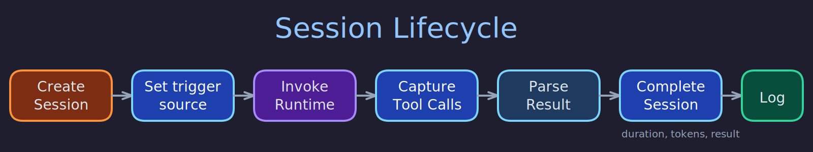

# Session Lifecycle

> **Purpose:** Describe how sessions are created, completed, and queried --- the append-only session log that records every LLM invocation.
> **Audience:** Developers working on session management, dashboard developers building session views, operators analyzing butler activity.
> **Prerequisites:** [Trigger Flow](../concepts/trigger-flow.md), [LLM CLI Spawner](spawner.md).

## Overview



A session represents one ephemeral LLM CLI invocation. The session log (`src/butlers/core/sessions.py`) is an append-only record: sessions are created when a trigger fires and completed when the runtime instance returns. After creation, the only permitted mutation is `session_complete()`, which fills in result fields and sets `completed_at`. This strict contract ensures that the session table is a reliable audit trail of all LLM activity.

## Session Creation

`session_create()` inserts a new row into the `sessions` table and returns a UUID. It is called by the spawner before invoking the runtime adapter. The row captures:

| Field | Source | Description |
| --- | --- | --- |
| `prompt` | Caller | The prompt text sent to the runtime (NUL bytes stripped) |
| `trigger_source` | Caller | What caused this session |
| `trace_id` | OTel | OpenTelemetry trace ID for distributed tracing |
| `model` | Model routing | The resolved model identifier |
| `request_id` | Ingestion/generated | UUIDv7 from the ingestion request context, or freshly generated |
| `ingestion_event_id` | Connector | UUID of the ingestion event (NULL for non-connector triggers) |
| `complexity` | Trigger/scheduler | Complexity tier used for model selection |
| `resolution_source` | Model routing | How the model was resolved (`"catalog"` or `"toml_fallback"`) |

The `trigger_source` field is validated against a fixed set: `tick`, `external`, `trigger`, `route`, `healing`, or `schedule:<task-name>`. The `request_id` parameter is required and must not be `None`.

## Session Completion

`session_complete()` is the only mutation allowed after creation. It fills in the result fields:

| Field | Type | Description |
| --- | --- | --- |
| `result` | text | Textual output from the runtime, or NULL on failure |
| `tool_calls` | jsonb | List of tool call records (merged parser + executed) |
| `duration_ms` | integer | Wall-clock duration in milliseconds |
| `success` | boolean | Whether the session completed successfully |
| `error` | text | Error message on failure, NULL on success |
| `cost` | jsonb | Token usage and cost breakdown |
| `input_tokens` | integer | Input tokens consumed |
| `output_tokens` | integer | Output tokens produced |
| `completed_at` | timestamptz | Set to `now()` by the UPDATE |

NUL characters are stripped from text fields before writing, because PostgreSQL text columns reject them. If `session_id` does not match an existing row, a `ValueError` is raised.

## Healing Fingerprint

After a session fails and the self-healing module computes an error fingerprint, `session_set_healing_fingerprint()` writes a 64-character hex SHA-256 fingerprint to the session row. This is a best-effort update that enables deduplication of healing attempts for identical failure patterns.

## Active Sessions

`sessions_active()` returns all sessions where `completed_at IS NULL`. This is the primary mechanism for the dashboard to detect running sessions and display real-time activity.

## Session Queries

The session log supports several query patterns:

- **`sessions_list(pool, limit, offset)`** --- Paginated listing ordered by `started_at DESC`.
- **`sessions_get(pool, session_id)`** --- Single session lookup by UUID.
- **`sessions_summary(pool, period)`** --- Aggregate statistics grouped by model for `today`, `7d`, or `30d`. Returns total sessions, total input/output tokens, and per-model token breakdowns.
- **`sessions_daily(pool, from_date, to_date)`** --- Per-day session counts and token usage with per-model breakdowns. Powers the dashboard usage chart.
- **`top_sessions(pool, limit)`** --- Highest-token completed sessions, ordered by total tokens descending.
- **`schedule_costs(pool)`** --- Joins `scheduled_tasks` with `sessions` via the `trigger_source` convention to compute per-schedule token usage, including estimated `runs_per_day` from the cron expression.

## JSONB Handling

JSONB columns (`tool_calls`, `cost`) are stored as JSON strings in PostgreSQL. The `_decode_row()` helper deserializes these when reading session records, ensuring callers always receive Python dicts/lists rather than raw JSON strings.

## Verification

To confirm the session lifecycle described here matches the running system:

```bash
# 1. Session row is created with expected creation fields
psql -h localhost -U butlers -d butlers -c \
  "SELECT id, trigger_source, model, complexity, resolution_source, started_at, completed_at
   FROM general.sessions ORDER BY started_at DESC LIMIT 3;"
# Expected: completed sessions show completed_at set; running sessions have completed_at NULL

# 2. Active sessions (running but not completed)
psql -h localhost -U butlers -d butlers -c \
  "SELECT id, trigger_source, started_at FROM general.sessions WHERE completed_at IS NULL;"
# Expected: empty when no sessions are running; rows appear during active LLM invocations

# 3. Session completion fields are populated
psql -h localhost -U butlers -d butlers -c \
  "SELECT id, success, input_tokens, output_tokens, duration_ms,
          (result IS NOT NULL) AS has_result, (tool_calls IS NOT NULL) AS has_tool_calls
   FROM general.sessions ORDER BY started_at DESC LIMIT 3;"
# Expected: success=true, token counts populated, result and tool_calls non-null

# 4. Trigger source conventions are followed
psql -h localhost -U butlers -d butlers -c \
  "SELECT DISTINCT trigger_source FROM general.sessions;"
# Expected: values from the set: tick, external, trigger, route, healing, schedule:<name>

# 5. Sessions API endpoint returns the same data
curl -s http://localhost:41200/api/butlers/general/sessions | python3 -m json.tool | head -50
# Expected: matches the SQL query results above
```

## Related Pages

- [LLM CLI Spawner](spawner.md) --- the component that creates and completes sessions
- [Tool Call Capture](tool-call-capture.md) --- how tool call records are collected for the `tool_calls` field
- [Model Routing](model-routing.md) --- how the `model`, `complexity`, and `resolution_source` fields are populated
- [Scheduler Execution](scheduler-execution.md) --- how `schedule:<name>` trigger sources originate
