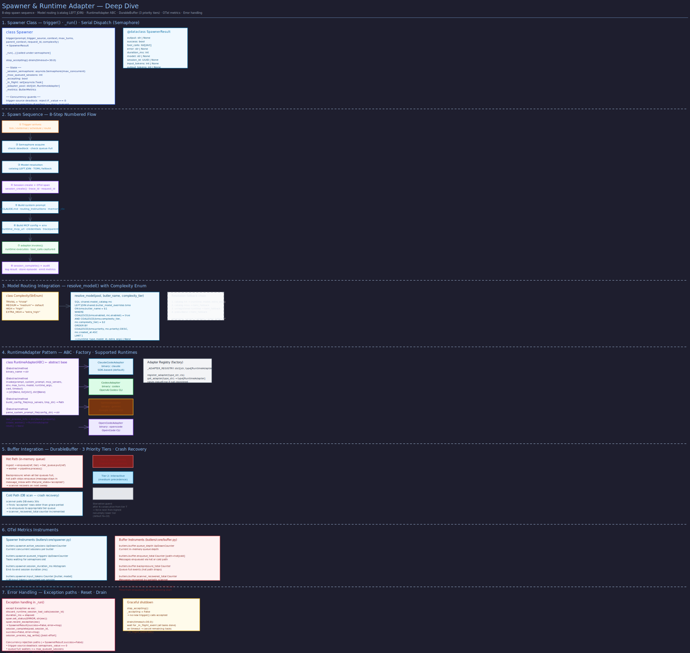

# Spawner

> **Purpose:** Document the LLM CLI spawner that invokes ephemeral runtime instances for butler sessions.
> **Audience:** Developers working on session dispatch, runtime adapters, or concurrency tuning.
> **Prerequisites:** [Trigger Flow](../concepts/trigger-flow.md), [MCP Model](../concepts/mcp-model.md).

## Overview



The Spawner (`src/butlers/core/spawner.py`) is the core component that invokes ephemeral AI runtime instances for a butler. Each butler has exactly one Spawner instance. When triggered, the Spawner acquires concurrency slots, resolves the model from the catalog, generates a locked-down MCP config, invokes the runtime via an adapter, captures tool calls, logs the session, and returns the result.

## Class Structure

The `Spawner` class is initialized with:

- **`config`** (`ButlerConfig`) --- the butler's parsed configuration
- **`config_dir`** (`Path`) --- path to the butler's config directory (containing `CLAUDE.md`)
- **`pool`** (`asyncpg.Pool`) --- database connection pool for session logging
- **`module_credentials_env`** --- mapping of module names to required env var names
- **`runtime`** (`RuntimeAdapter`) --- optional injected adapter (defaults to `ClaudeCodeAdapter`)
- **`credential_store`** (`CredentialStore`) --- optional DB-first credential resolver

## Trigger Method

The primary entry point is `trigger()`:

```python
async def trigger(
    self,
    prompt: str,
    trigger_source: str,
    context: str | None = None,
    max_turns: int = 20,
    parent_context: Context | None = None,
    request_id: str | None = None,
    complexity: Complexity = Complexity.MEDIUM,
    cwd: str | None = None,
    bypass_butler_semaphore: bool = False,
) -> SpawnerResult:
```

The method returns a `SpawnerResult` dataclass containing `output`, `success`, `tool_calls`, `error`, `duration_ms`, `model`, `session_id`, `input_tokens`, and `output_tokens`.

## Execution Pipeline

### 1. Concurrency Acquisition

Two semaphores must be acquired in order:

1. **Per-butler semaphore** --- `asyncio.Semaphore(max_concurrent_sessions)` from `butler.toml`. Default is 1 (serial dispatch). The Switchboard uses 3. Can be bypassed with `bypass_butler_semaphore=True` for internal dispatch.
2. **Global semaphore** --- Process-wide `asyncio.Semaphore` defaulting to 3, configurable via `BUTLERS_MAX_GLOBAL_SESSIONS`. Limits total concurrent sessions across all butlers in the process.

Metrics track queue depth at both levels (`butlers.spawner.queued_triggers` and `butlers.spawner.global_queue_depth`).

### 2. Model Resolution and Same-Tier Failover Setup

The spawner resolves the model dynamically via the catalog using `resolve_model_with_effective_tier()`:

1. Query `public.model_catalog` with optional `public.butler_model_overrides` for the butler's name and the requested complexity tier.
2. If the catalog returns a result: use that model's `runtime_type`, `model_id`, and `extra_args`. Pin the **effective tier** for the logical session — all same-tier failover candidates must match this tier.
3. If the catalog returns nothing: fall back to the hard-coded `_FALLBACK_MODEL_ID` (no same-tier failover in this path).

The resolution source (`"catalog"` or `"static_fallback"`) is recorded on the session row.

**Quota-skip loop:** After initial resolution, the spawner enters a quota-skip loop before invoking the adapter:

- Call `check_token_quota()` for the current candidate.
- If quota is exhausted: write a `quota_skip` row to `public.model_dispatch_attempts`, then call `next_same_tier_candidate()` to find the next eligible model in the same effective tier.
- If no next candidate exists: emit `butlers.spawner.failover_exhausted_total` metric and return failure.
- Repeat until a candidate with remaining quota is found.

All quota-skip rows share the same `logical_session_id` as later attempt rows (minted before the loop, non-null even for internal triggers without a `request_id`).

### 3. Session Creation

A session row is inserted into the `sessions` table with the prompt, trigger source, model, request ID, complexity tier, and resolution source. The returned session UUID is used for all subsequent correlation.

### 4. MCP Config Generation

The spawner generates a config declaring a single MCP server --- this butler's FastMCP instance. The URL includes a `runtime_session_id` query parameter for tool call correlation. Only declared credentials are included in the environment; undeclared env vars do not leak.

### 5. System Prompt Composition

The system prompt is composed from three layers (in stable order for token-cache efficiency):

1. **Base system prompt** --- read from the butler's `CLAUDE.md`
2. **Owner routing instructions** --- fetched from the `routing_instructions` table, sorted by priority
3. **Memory context** --- retrieved from the memory module based on the prompt content

### 6. Runtime Invocation and Same-Tier Failover Loop

The appropriate `RuntimeAdapter` is selected based on the resolved `runtime_type`. The adapter spawns the LLM CLI as a subprocess with the MCP config, system prompt, user prompt, environment, and model parameters. Trace context is propagated via the `TRACEPARENT` environment variable.

**Same-tier failover loop:** When an adapter raises an exception, the spawner enters the failover decision path before propagating the error:

1. **Collect evidence:** Consume any tool calls captured in the runtime session buffer (via `consume_runtime_session_tool_calls()`). These represent MCP side effects that have already occurred.

2. **Consult the classifier:** Call `classify_failover_eligibility(FailoverContext(exception=..., tool_calls=..., process_info=...))`. The classifier returns a `FailoverDecision(eligible, reason)`.

3. **Suppressed path** (`eligible=False`): Emit `butlers.spawner.failover_suppressed_total` metric. Write a `suppressed` row to `public.model_dispatch_attempts`. Re-raise the original exception — the session fails.

4. **Eligible path** (`eligible=True`):
   - Write a `runtime_failure` row to `public.model_dispatch_attempts` for the current candidate.
   - Append the current `catalog_entry_id` to `_attempted_ids`.
   - Call `next_same_tier_candidate(pool, butler_name, effective_tier, _attempted_ids)`.
   - If a next candidate exists: emit `butlers.spawner.failover_attempts_total`, swap `model`/`runtime_type`/`catalog_entry_id`, re-create the adapter, and loop back to **Runtime Invocation**.
   - If no candidate remains: emit `butlers.spawner.failover_exhausted_total`, re-raise the last exception.

5. **On success after failover:** Write a `success` row to `public.model_dispatch_attempts` for the winning candidate. Update the session row's `model` field to reflect the fallback model that actually ran.

A hard cap of 10 attempts prevents unbounded looping regardless of catalog size.

#### Classifier Inputs (adapter signals from bu-ojiij.5)

Every `RuntimeAdapter` populates `last_process_info` after each invocation attempt. Key fields:

- **`is_pre_tool_call`** — `True` when the failure happened before any MCP tool was executed. All adapters set this on non-zero exit or timeout.
- **`error_detail`** — Adapter-extracted error string (stderr, structured error code) for classifier pattern matching.

`MCPToolDiscoveryError` (raised by the Codex adapter after exhausting MCP-discovery retries) additionally exposes:

- **`is_pre_tool_call`** — always `True`.
- **`internal_retry_count`** — number of adapter-internal retries. The spawner treats the whole `MCPToolDiscoveryError` as ONE logical failover-eligible attempt regardless of this count.

#### Classifier Outcomes

| Decision | Trigger | Spawner Action |
|---|---|---|
| `eligible=True` | Systemic pre-tool-call error (rate-limit, auth, model-unavailable, timeout, MCP discovery) with no captured tool calls | Retry next same-tier candidate |
| `eligible=False` | Any captured tool call, guardrail termination, business/unknown error | No retry; propagate original error |

The classifier is **default-closed**: unknown exception classes always suppress failover.

#### Querying Provenance

Attempt provenance is written to `public.model_dispatch_attempts`. Each row records:

- `catalog_entry_id` — which model was attempted
- `butler` — which butler triggered the session
- `outcome` — `quota_skip`, `runtime_failure`, `suppressed`, `exhausted`, or `success`
- `failure_reason` — classifier decision string or quota detail
- `error_code` — exception class name
- `error_message` — truncated error string (max 4096 chars)
- `tool_call_count` — captured tool calls at time of decision
- `attempt_index` — 0-based position in the attempt sequence
- `logical_session_id` — shared across all rows for the same trigger

Use the API endpoint `GET /api/dispatch/attempts?session_id=<uuid>` to retrieve attempt provenance for a completed session.

### 7. Tool Call Capture and Merge

During the session, tool calls executed on the MCP server are captured in a thread-safe buffer keyed by `runtime_session_id`. After the runtime returns, the spawner merges parser-extracted tool calls (from the adapter's output parsing) with server-side executed tool calls. The merge uses signature matching (tool name + input payload) to reconcile records while preserving retry attempts.

### 8. Session Completion

The session row is updated with the output, merged tool calls, duration, token usage, cost, success status, and error (if any). Token usage is also recorded to the `public.token_usage_ledger` for quota tracking and reported to OpenTelemetry metrics.

### 9. Memory Episode Storage

If the memory module is enabled and the session produced output, the spawner stores the session as an episode for future retrieval.

## Self-Healing Integration

The spawner can be wired to a self-healing module via `wire_healing_module()`. When a session fails with a hard crash, the spawner's exception handler fires `dispatch_healing()` as a background task, which analyzes the failure and may attempt automatic recovery.

## Adapter Pool

The spawner maintains a cache of `RuntimeAdapter` instances keyed by `runtime_type`. The TOML-configured adapter is seeded at construction. When the model catalog resolves a different runtime type, a new adapter is lazily instantiated via the adapter registry (`get_adapter()`). Provider-specific configuration (e.g., Ollama base URL from `public.provider_config`) is forwarded to adapters that accept it.

## Verification

To confirm the spawner behavior described here matches the running system:

```bash
# 1. Session record shows model, trigger_source, and resolution_source
psql -h localhost -U butlers -d butlers -c \
  "SELECT id, model, trigger_source, resolution_source, complexity, success
   FROM general.sessions ORDER BY started_at DESC LIMIT 5;"
# Expected: model populated, resolution_source is "catalog" or "toml_fallback"

# 2. Dispatch attempt provenance is recorded
psql -h localhost -U butlers -d butlers -c \
  "SELECT catalog_entry_id, outcome, failure_reason, attempt_index
   FROM public.model_dispatch_attempts ORDER BY created_at DESC LIMIT 10;"
# Expected: rows with outcome "success" for sessions that completed normally;
# "quota_skip" or "runtime_failure" for any failover attempts

# 3. Tool calls are merged into the session record
curl -s http://localhost:41200/api/butlers/general/sessions | python3 -m json.tool
# Expected: tool_calls array on completed sessions with tool_name, module_name, outcome

# 4. Concurrency metrics are exported (if Prometheus is wired)
curl -s http://localhost:41101/metrics 2>/dev/null | grep butlers_spawner
# Expected: butlers.spawner.queued_triggers, global_queue_depth, failover_attempts_total

# 5. Failover: a missing runtime binary causes immediate failure without DB rows
# Temporarily rename the claude binary and trigger a session.
# Expected: session record with success=false, error containing "RuntimeBinaryNotFoundError"

# 6. Self-healing wiring: check if healing module is configured
curl -s http://localhost:41200/api/butlers/general/status | python3 -m json.tool | grep healing
# Expected: healing module present with status "active" if configured
```

## Related Pages

- [Trigger Flow](../concepts/trigger-flow.md) --- the two trigger sources that invoke the spawner
- [Session Lifecycle](session-lifecycle.md) --- session creation and completion details
- [Model Routing](model-routing.md) --- catalog structure, quota system, same-tier failover candidate selection, and adapter signal details
- [Tool Call Capture](tool-call-capture.md) --- how tool execution is tracked (feeds the side-effect gate)
- [Observability](../architecture/observability.md) --- trace context propagation through the spawner
