## Context

`cli-auth/codex` is a Tier 1, system-global credential.  The currently
merged authority work deliberately makes that shared/public row the only
eligible runtime source, and uses an in-process raw-value compare-and-set
(CAS) to keep a completed child from overwriting a newer dashboard
replacement.  It also deliberately treats a local `~/.codex/auth.json` found
after a process crash as non-authoritative: without a launch-bound baseline,
it restores the database value rather than guessing that the file is a valid
successor.  The canonical `core-credentials` specification names durable
cross-process rotation provenance as this follow-up.

That boundary is correct for a living process, but it cannot prove the lineage
of a local rotation after a restart or coordinate two daemons that share the
same Codex runtime volume.  The current local-file cache uses file metadata and
an in-memory content digest to recognize a process-local baseline.  Neither a
cache, a local file, a process ID, a timestamp, nor a content-derived value is
durable authority.  A fresh process must not turn any of them into one.

The affected topology is intentionally narrow:

| Concern | Existing owner | Required boundary after this change |
| --- | --- | --- |
| Canonical credential value | `public.butler_secrets`, selected system-global pool | The existing Tier 1 row remains the only raw-value store. |
| Authority lineage and current identity | Core credential infrastructure in `public` | Opaque DB-issued generation, never credential-derived. |
| Runtime and prewarm subprocesses | `CodexAdapter` / Spawner / direct dispatcher | One durable operation bound to one exact generation before child launch. |
| Dashboard owner replacement, revoke, and device auth | Dashboard API and CLI-auth persistence | Same serialized authority mutation boundary as runtime successors. |
| Local runtime files and sandbox stages | Runtime/deployment volume | Projections or disposable child state only; never an authority source. |
| API and dashboard evidence | Secrets and CLI-auth routes | Preserve the existing owner-only rotate raw-value-once response and display fingerprint; add no provenance identifier or new credential exposure. |

The design must preserve the doctrine that daemon control is deterministic and
that credentials have one authoritative Tier 1 location.  It also must preserve
the existing dashboard contract: a user-facing fingerprint is computed on read
for inventory display, but it is not persisted and must not become an
authority/provenance field.  This change therefore adds a server-internal,
opaque lineage boundary rather than a token hash, a file fingerprint, a new
credential store, or a public capability.

## Goals / Non-Goals

**Goals:**

- Bind every Codex subprocess-capable operation to exactly one current,
  opaque, durable authority generation before it can launch.
- Permit a runtime or device-auth result to create a successor only when its
  exact operation is still launched, unexpired, and attached to the current
  generation at the one database transaction that writes the successor.
- Make direct dashboard owner replacement and revoke serialize with runtime
  rotation, device auth, and health so old work cannot affect newer authority.
- Make local files, process lifetime, clock observations, and in-memory state
  non-authoritative after a crash or restart while preserving a safe database
  reconstruction path.
- Define bounded expiry and garbage collection for operation metadata without
  deleting the current authority or recording credential-derived material.
- Make malformed, missing, inconsistent, stale, duplicate, or otherwise
  unprovable evidence fail closed before a new Codex child, successor, or
  health attachment is accepted.
- Preserve least privilege, safe diagnostics, the existing owner-only Codex
  rotate `{fingerprint, value}` raw-value-once response, the inventory/detail
  display fingerprint, and the `butler_secrets` raw-value location.

**Non-Goals:**

- No new credential class, environment-variable fallback, external provider
  call, deployment action, migration execution, live auth replay, or change to
  another runtime provider.
- No cryptographic token fingerprint, content digest, token-derived ID,
  session ID, PID, filesystem metadata, wall-clock ordering, or capability is
  an authority proof.
- No raw credential, staged credential, local-file content, provider stderr,
  or secret-bearing exception is stored in a new table, log field, audit note,
  telemetry attribute, new API field, or plan fixture. The already-documented
  owner-only rotate response remains its sole existing raw-value-once API
  exception and gains no provenance fields.
- No public endpoint, dashboard field, audit-history entry, or browser payload
  exposes a generation ID, operation ID, operation state, or successor lineage.
- No attempt to resurrect a revoked/absent authority from a local runtime file,
  nor to retrospectively bless an orphaned child result after restart.
- No claim of a hostile-database-client boundary beyond the repository's
  existing shared-login plus `SET ROLE` model.  The migration nevertheless
  makes the reserved Codex path narrower than a Python convention.

## Decisions

### D1 — Use random opaque generation IDs, not values or monotonic process facts

The core migration creates one singleton `public.codex_auth_authority_state`
for the fixed key `cli-auth/codex`, one append-only
`public.codex_auth_generations` relation, and a nullable
`codex_auth_generation_id` column on the existing public `butler_secrets` row.
The generation relation has only the following durable facts:

| Field | Meaning | Not an authority substitute |
| --- | --- | --- |
| `generation_id UUID` | Database-generated random opaque identity of one accepted authority value | Not a token fingerprint, capability, or sequence inferred from time. |
| `predecessor_generation_id UUID NULL` | Opaque lineage link when a successor is accepted | Not a value comparison or recovery hint. |
| `source_kind` | Closed safe enum: `legacy_adoption`, `owner_replace`, `device_auth`, or `runtime_rotation` | No actor input, PID, endpoint payload, or provider detail. |
| `created_at`, `retired_at` | Database-clock audit/retention metadata | Never used to decide which authority wins. |
| `retired_reason` | Closed safe enum when superseded or revoked | Never a raw error string. |

`public.codex_auth_authority_state` contains the fixed authority key,
`current_generation_id NULL`, a guarded `has_ever_initialized` boolean, and
database-clock metadata. The boolean is not an ordering signal or a credential
identity: it records only whether the one explicitly absent first-device-auth
bootstrap route has permanently closed. The only valid current state is either:

1. a valid `public.butler_secrets` `cli-auth/codex` row whose
   `codex_auth_generation_id` equals the singleton's current generation and
   whose referenced generation exists; or
2. an explicitly absent state with no current generation and no eligible
   credential row. A `has_ever_initialized = false` state is eligible only for
   a single explicitly requested device-auth bootstrap; a revoked state keeps
   `has_ever_initialized = true` and is never eligible for bootstrap.

Every other combination is **unprovable**: a missing state row, duplicate
singleton, a secret row with a null/mismatched generation, a current generation
with no matching secret row, an invalid document, or a missing generation row.
It cannot launch a child, attach health, or promote a successor.  The existing
`secret_value` remains in the pre-existing Tier 1 row because that is the one
approved raw credential store; no new provenance relation copies it.

An opaque UUID is chosen over a monotonic integer because ordering is created
by locking the singleton current-state row, not by client clocks or by a
counter that readers might mistake for a public ordering API.  A successor is
identified only through the current pointer under that lock.  We retain the
predecessor UUID to diagnose internal lineage without retaining any material
that can identify or test a credential.

**Alternative rejected — hash or digest of the credential.**  A digest creates
a durable credential-derived identifier, enables equality/guessing correlation,
and would reintroduce authority-by-content.  It is forbidden.

**Alternative rejected — file stat, mtime, PID, session ID, or timestamp as a
generation.**  Those facts are not stable through volume sharing, restart, or
forking, and all are observational rather than authoritative.

### D2 — Make the existing raw credential row atomically bind to its generation

The guarded mutators update three things in one database transaction while
locking `codex_auth_authority_state` with `FOR UPDATE`:

1. the existing `public.butler_secrets` raw Tier 1 row;
2. that row's opaque `codex_auth_generation_id`; and
3. the singleton `current_generation_id` / guarded initialization state plus
   the generation/audit metadata.

A value-changing mutation resets the existing credential health columns in the
same transaction, exactly as the current value-CAS path does.  A health-only
mutation never changes either opaque generation pointer.  This binding is what
makes a raw row and a generation one authority rather than two mutable records
that a later reader has to reconcile by guesswork.

The migration reserves `cli-auth/codex` from generic direct DML, but the normal
migration login does not create or own this boundary. A privileged
`scripts/init-db.sql` step installs a fixed, bootstrap-owned, no-argument
installer/finalizer patterned after the `core_196` restore-drill boundary. The
normal migration first catalog-verifies that exact trusted installer and then
invokes it. The installer creates the protected relations and fixed-search-path
`SECURITY DEFINER` mutation surface; the finalizer assigns them to a NOLOGIN,
non-member `codex_auth_provenance_owner`, revokes `EXECUTE` from `PUBLIC`, and
grants only the role paths required by the dashboard shared-authority service
and designated Codex runtime callers. It also revokes installer/finalizer
access, owner membership, protected-schema `CREATE`, and direct relation DML
from the migration login.

A row trigger rejects or marks as unprovable direct mutations of the reserved
row that do not pass through that surface. It must use an
unforgeable-in-the-application transaction context established by the definer,
not a caller-controlled SQL setting. Runtime roles receive no direct write
grant to the state, generation, or operation tables. A runtime role permitted
to prepare normal operations is explicitly denied the separate device-auth
bootstrap function. The test suite must prove these effective-role boundaries
and upgraded-database bootstrap ordering with a real PostgreSQL connection; a
mock or migration-owner connection is not evidence.

The repository's shared database login can still assume several runtime roles,
so this is a least-privilege and correctness boundary, not a claim that an
arbitrary database administrator is unable to alter the underlying credential.
If that boundary is broken, the state becomes unprovable and fence-aware
launches fail closed rather than attempting local recovery.

**Alternative rejected — a separate binding table.**  A side table can drift
from the credential row under legacy generic writes.  Keeping the opaque
foreign key on the row that already owns the raw value makes the transaction's
invariant directly checkable.

### D3 — Represent launch provenance as a durable operation record, never a bearer capability

`public.codex_auth_operations` records a short-lived trusted operation:

| Field | Meaning |
| --- | --- |
| `operation_id UUID` | Random row identity; server-internal correlation only, never a bearer capability or API value. |
| `generation_id UUID NULL` | Exact generation selected before a normal child can launch. It is null only for the explicit never-initialized device-auth bootstrap operation. |
| `bootstrap_absent BOOLEAN` | Database-established proof that this one `device_auth` operation was prepared while the singleton was absent and had never initialized. It is not a capability and cannot be caller-selected. |
| `kind` | Closed enum: `runtime_invoke`, `runtime_prewarm`, `device_auth`, or `health_probe`. |
| `state` | `prepared`, `launched`, `completed_unchanged`, `completed_successor`, `discarded`, `superseded`, or `expired`. |
| `deadline_at` | Absolute operational deadline supplied by the caller and checked against database time; it is not authority. |
| `created_at`, `launched_at`, `terminal_at` | Database-clock diagnostics/retention facts only. |
| `successor_generation_id` | Opaque successor when exactly one conditional completion wins. |
| `terminal_reason` | Closed safe enum, never a provider error, file path, PID, raw output, or secret-bearing exception. |

The operation ID is deliberately not exposed to a browser, a dashboard session,
MCP tool, process command line, logs, telemetry, or a response.  Possession of
it authorizes nothing: the database operation also requires the correct trusted
role, expected normal `generation_id` or its recorded never-initialized
bootstrap state, valid state, non-expiry, and the current singleton pointer.
It is an internal row key, not a signed token, nonce, or capability.

The `CredentialStore` will expose typed internal methods roughly equivalent to
the following.  Their exact module-private implementation can be adjusted, but
their data flow and fail-closed results are contractually fixed:

```text
class CodexAuthLaunchDisposition(StrEnum):
    LAUNCHED = "launched"
    SUPERSEDED = "superseded"
    EXPIRED = "expired"
    UNAVAILABLE = "unavailable"

@dataclass(frozen=True)
class CodexAuthLaunchLease:
    operation_id: UUID = field(repr=False)
    generation_id: UUID = field(repr=False)
    authority_document: str = field(repr=False)
    deadline_at: datetime

@dataclass(frozen=True)
class CodexAuthBootstrapLease:
    operation_id: UUID = field(repr=False)
    deadline_at: datetime

@dataclass(frozen=True)
class CodexAuthProjectionBinding:
    generation_id: UUID = field(repr=False)
    authority_document: str = field(repr=False)

@dataclass(frozen=True)
class CodexAuthLaunchResult:
    disposition: CodexAuthLaunchDisposition

CredentialStore.prepare_codex_auth_operation(
    kind: CodexAuthOperationKind,
    deadline_at: datetime,
) -> CodexAuthLaunchLease | CodexAuthUnavailable

CredentialStore.prepare_codex_auth_device_bootstrap(
    deadline_at: datetime,
) -> CodexAuthBootstrapLease | CodexAuthUnavailable

CredentialStore.read_current_codex_auth_projection_binding(
) -> CodexAuthProjectionBinding | CodexAuthUnavailable

CredentialStore.mark_codex_auth_operation_launched(
    operation_id: UUID,
    expected_generation_id: UUID | None,
) -> CodexAuthLaunchResult

CredentialStore.complete_codex_auth_operation(
    operation_id: UUID,
    expected_generation_id: UUID | None,
    validated_successor_document: str | None,
    health: CodexAuthHealthOutcome | None,
) -> CodexAuthCompletion
```

The normal preparation method has no boolean, mode, or generic kind capable of
selecting bootstrap. It calls a normal prepare definer that requires a complete
current generation. `prepare_codex_auth_device_bootstrap` calls a distinct
definer granted only to the dashboard API's no-`SET ROLE` shared-authority
path, not any effective runtime role; that definer
derives `bootstrap_absent` from the locked never-initialized state and accepts
no caller-supplied proof. A role granted normal runtime/prewarm preparation
cannot execute the bootstrap definer even if it calls SQL directly.
`read_current_codex_auth_projection_binding` is a read-only validated snapshot
for startup compatibility projection; it creates no operation and authorizes
no child or completion.

`authority_document` and a validated successor are transient parameters to the
existing raw credential-store boundary.  They are `repr=False`, never logged,
and are not inserted into the new provenance tables.  A caller supplies a
closed `CodexAuthHealthOutcome` (for example `ok`, `auth_rejected`, `timeout`,
`transport_unavailable`, or `unknown`) rather than provider stderr or an
exception string.

### D4 — Linearize prepare, launch, completion, and replacement at the shared state row

The accepted state machine is:

```mermaid
stateDiagram-v2
    [*] --> prepared: valid current generation + operation row
    prepared --> launched: exact generation remains current
    prepared --> superseded: owner replacement/revoke wins first
    prepared --> expired: database deadline passes
    launched --> completed_unchanged: exact generation remains current; no successor
    launched --> completed_successor: exact generation remains current; successor commits
    launched --> superseded: replacement/revoke or another successor wins
    launched --> discarded: malformed/ambiguous output or safe failure
    launched --> expired: database deadline passes
```



Normal prepare obtains the singleton lock, validates the complete current binding,
creates a `prepared` operation, and returns the raw document only to the
existing trusted credential consumer. It does not examine a local file as a
predecessor and has no bootstrap selector. The separate dashboard-only
device-auth bootstrap definer obtains the same lock and, only when the singleton
is absent, `has_ever_initialized = false`, no generation exists, and no eligible
raw row exists, returns a
`CodexAuthBootstrapLease` whose operation records `bootstrap_absent = true`
and no generation. The database establishes that fact without accepting
`allow_bootstrap`, a session value, or any caller proof. That lease creates an
empty private stage, not a new authority document. A revoke or any owner mutation sets
`has_ever_initialized = true`, so a later absent state cannot acquire another
bootstrap lease.

For a normal lease, the caller writes a disposable private stage from the
returned document; for a bootstrap lease, it writes an empty disposable stage.
It validates containment, then calls `mark_*_launched`. That second
transaction requires `prepared`, exact normal generation or the exact recorded
never-initialized absent state, unexpired deadline, and the still-current
singleton pointer. If it loses any check, no subprocess is created and the
stage is discarded.

Completion locks the operation and singleton row and succeeds only when all of
the following are true:

- the operation is `launched` exactly once;
- for a normal operation, `generation_id` matches the operation and the
  singleton current pointer; for a bootstrap operation, the singleton remains
  absent with `has_ever_initialized = false` and no generation exists;
- the database clock is before `deadline_at`;
- any candidate has passed the existing strict provider-specific staged-output
  parser after the entire child/sandbox domain was terminated; and
- no earlier successor/replacement/revoke has made the operation stale.

For no rotation, a normal-generation operation attaches a safe health result
only under those conditions and marks `completed_unchanged`; a bootstrap
operation has no current credential to attach and terminalizes without a
write. For a valid candidate, it creates a new random generation, writes the
candidate only to the existing secret row, updates both generation pointers,
sets `has_ever_initialized = true`, clears prior health state, retires the old
generation when one exists, marks the operation `completed_successor`, and
commits atomically. The first valid completion wins. A duplicate completion, a
different candidate after a terminal state, a stale operation, or a mismatched
generation never retries or overwrites; it returns a safe non-commit result.

This gives a total order without treating the time at which a child happened to
exit as an authority proof.  Database timestamps only bound an operation and
record when a committed transition occurred; the singleton lock and exact
opaque pointer decide authority.

### D5 — Make the local auth file a projection and each child stage private

The runtime volume's `~/.codex/auth.json` is a convenience projection, not an
authority.  A fence-aware process must never flush an observed local rotation
before launch, use the `_AUTH_SYNC_CACHE` content digest as lineage, or infer
a successor from a local document on startup.  It obtains the current raw
document only through `prepare_codex_auth_operation`.

Every runtime invocation, prewarm, device-auth flow, and dashboard health probe
gets an operation-specific staged `HOME` containing a private copy of that
prepared authority.  Runtime children do not write the shared canonical file
and do not share a mutable stage.  After the sandbox/process tree has been
fully terminated, only the stage belonging to that operation is eligible for
strict parsing and conditional completion.  A stale or malicious local shared
file cannot be misattributed to an operation.

Dashboard device auth uses an explicit two-phase launch seam spanning
`cli_auth/persistence.py`, `CLIAuthSession`, the
`DashboardCLIAuthSandbox` protocol, and
`BubblewrapDashboardCLIAuthSandbox`. Persistence preparation returns one
redacted context containing the durable lease and its normal authority seed or
empty bootstrap seed. `CLIAuthSession` retains that context, asks the platform
sandbox to prepare but not start the exact private HOME, then conditionally
marks the same operation launched. Only a successful mark permits the prepared
sandbox handle to create its child; a stale/failed mark creates no process.
The handle retains the same stage through PID-namespace containment and returns
only its validated bytes to completion with the same lease. Cancellation,
timeout, mark failure, launch failure, containment failure, and callback failure
all terminalize safely and remove that stage. No stage or lease may be reused by
another session or child.

The old canonical file may remain as a DB-originated compatibility projection
for components that cannot yet consume a private stage.  Its write path holds
the cross-process file lock and writes atomically with mode `0600`.  A missing
or contended lock is no longer permission to proceed unlocked: a component
that requires that projection fails the associated operation before child
launch.  A fenced runtime child does not need to read or mutate that projection
at all.  The implementation removes the previous "flush completed local
rotation before launch" behavior at the same time that it introduces private
stages; retaining both would leave an authority bypass.

**Alternative rejected — continue symlinking every invocation to one mutable
canonical file.**  Two daemons can then overwrite each other's observed result
between parse and completion.  A database CAS would stop one DB write but could
not prove which child produced the shared file.

### D6 — Define owner replacement and revoke as stronger, serialized mutations

The precedence rule is a database serialization rule, not a client timestamp
rule:

1. A direct dashboard owner save/paste creates a fresh generation under the
   state lock and atomically replaces the existing raw row/binding.  It retires
   the prior generation and makes every nonterminal operation on it
   `superseded`.
2. A dashboard device-auth completion is a conditional successor of the exact
   generation prepared before its child launch.  It loses when a direct owner
   replacement, revoke, or another winning successor changes that pointer.
3. A runtime/prewarm/health operation uses the identical conditional rule.  A
   health result never creates a generation; a rotation does only when its
   operation still wins the current pointer.
4. A direct dashboard revoke atomically removes eligibility for the raw row,
   sets the singleton current generation to `NULL`, retains
   `has_ever_initialized = true`, retires the prior
   generation, and supersedes its nonterminal operations.  No runtime/device
   completion can recreate it.
5. Two direct owner replacements serialize by lock acquisition; the later
   committed intentional replacement becomes current.  Two conditional
   successors serialize similarly; exactly one can create the next generation.

The Codex dashboard API deliberately preserves its existing public contract:
owner rotate/paste returns `{fingerprint, value}` once, while inventory and
detail return the on-read display `fingerprint` and never return the raw value.
The fingerprint remains an unpersisted display aid, not provenance or
authority. This feature does not add another reveal path and no response gains
a generation, operation, lineage, reusable capability, or internal failure
reason. Backend API, TypeScript client, and PageCli tests cover Codex rotate,
inventory, and detail separately so an implementation cannot silently remove
the documented envelope or leak the new internal state through it.

### D7 — Restart, malformed evidence, and ambiguity fail closed

At daemon or dashboard startup, fence-aware restore reads the complete current
binding from the selected system-global pool.  It may construct a local
projection/stage only after that binding validates.  It never completes an
operation from a file left by a crashed parent and never treats an old process's
PID, a stage directory, file timestamp, or a matching-looking document as an
operation receipt.

An already-live process can complete its own operation after another daemon
restarts only when the durable operation is still `launched`, current, and
unexpired.  If the original parent actually crashed, there is no trusted caller
to submit its completion; a later process discards its local/stage output and
the operation eventually expires.  This distinction preserves safe completion
of a genuine live operation without giving a new process permission to guess
at an orphan.

The following outcomes are fail-closed before launch, successor write, or
health attachment:

| Evidence condition | Required result |
| --- | --- |
| selected system-global pool unavailable | no operation / no child; safe unavailable result |
| authority absent before any generation exists | only the explicit device-auth bootstrap may prepare an empty private stage |
| authority absent after revoke or any prior generation | no operation / no child; no automatic bootstrap or local recovery |
| malformed authority document | no operation / no child; leave local file non-authoritative |
| state/secret/generation mismatch or missing record | no operation / no child; do not repair from local file |
| staged output malformed, duplicate-keyed, unexpected, or not fully contained | mark/discard safe failure; no successor |
| operation missing, duplicate, wrong kind/state/generation, expired, or terminal | no completion or health write |
| stale dashboard/runtime/device operation | mark superseded; do not overwrite the winner |
| legacy direct write after activation | binding becomes unprovable; no fence-aware launch until explicit owner replacement |
| failed cleanup, stage, lock, pool, or DB transaction | no child if before launch; no successor if after launch |

Only a direct, explicit dashboard owner replacement can repair an unprovable
authority state. The device-auth bootstrap is narrower: it exists only for an
explicitly absent, never-initialized singleton and cannot repair a revoked or
inconsistent authority. Automated repair from a local file, retrying a
rejected completion, or a generic `CredentialStore.store()` fallback is
prohibited.

### D8 — Expire operations by their established absolute deadlines and GC only terminal metadata

An operation's `deadline_at` is supplied from its already-established boundary:
the effective runtime invocation deadline, the bounded prewarm/health deadline,
or the provider's configured device-auth timeout.  The caller supplies one
absolute deadline at prepare time; no child, retry, or cleanup path extends it.
PostgreSQL time checks expiry so a process-local clock cannot keep a stale
operation alive.  The deadline is a liveness bound only, never proof that an
authority is newer or valid.

A deterministic core cleanup operation does the following transactionally:

1. marks `prepared`/`launched` operations whose `deadline_at` has passed as
   `expired`, with a closed safe reason, without changing current authority;
2. deletes only terminal operation rows whose `terminal_at` is at least 90 days
   old, matching the established minimum retention for secret-probe evidence;
3. never deletes a current generation, a generation referenced by a retained
   operation, or the existing credential row; and
4. leaves generation rows append-only in this first version because their
   opaque, tiny lineage is the recovery evidence this feature adds.

The 90-day operation record is deliberately value-free and contains no error
body.  Generation compaction is deferred until a separate retention contract
can preserve current/ancestor/referenced lineage without weakening restart
proof.  This avoids inventing a destructive retention policy for the new
authority evidence.

### D9 — Roll out additively; never roll back to an unsafe legacy launch path

The implementation has five ordered additive stages:

1. **Privileged installer availability.** Run the cluster-superuser
   `scripts/init-db.sql` bootstrap before the normal migration on fresh and
   already-provisioned databases. It installs the fixed no-argument
   installer/finalizer and NOLOGIN owner, grants the normal migration login
   only temporary installer execution, and rejects partial or untrusted
   lookalike objects. It does not inspect or change a credential.
2. **Schema and compatibility guard.** The normal migration catalog-verifies
   and invokes that installer. The installer adds the relations, nullable
   binding column, narrow functions/ACLs, and reserved-row trigger without
   deleting or rewriting any existing secret; its finalizer removes migration
   ownership, membership, protected-schema CREATE/DML, and installer access.
   Migration-before-bootstrap fails closed. The migration itself does not parse
   or bless a legacy raw row.
3. **Fence-aware adoption.**  A new `CredentialStore` path strictly parses a
   pre-existing shared row under the state lock.  Only an uninitialized state
   can adopt that valid row once as `legacy_adoption`.  A malformed row remains
   unavailable.  After any generation has existed, a null/mismatched binding
   is unprovable rather than eligible for automatic adoption.
4. **All producer cutover.**  Route dashboard replacement/revoke, device auth,
   runtime invocation/prewarm, health probe, startup restore, model verify,
   direct dispatcher, and connector restoration through the new typed methods.
   Add a source-level completeness test so no Codex call site retains generic
   raw-value CAS or local-file successor flush.
5. **Activation verification.**  Enable normal launches only after every
   in-repository Codex mutation/launch call site is fence-aware and the
   migration/role/concurrency tests pass.  Any old image writing the reserved
   row makes the binding unprovable and stops new fence-aware launches rather
   than silently accepting mixed-version authority.

Routine rollback is a fail-closed operational mode in the fence-aware image:
it stops new Codex launches and successor promotion while preserving the
existing raw row and opaque provenance.  It does not re-enable pre-fence
local-file reconciliation or generic legacy writes.  A schema downgrade or
deployment of a pre-fence image requires an explicit, exclusive maintenance
decision after all Codex operations are terminal; it is not an automated
rollback path.  This preserves the single-authority invariant through a failed
rollout rather than trading it for availability.

### D10 — Keep all diagnostics and documentation value-free

New logs, audit notes, metrics, exception messages, operation terminal reasons,
and dashboard/API responses use a closed safe outcome vocabulary.  Examples
include `authority_unavailable`, `authority_unprovable`, `operation_superseded`,
`operation_expired`, `invalid_staged_output`, and `persistence_unavailable`.
They do not include a raw exception, credential parser detail, process path,
operation/generation UUID, token field, digest, or provider output.

The implementation updates the credential-store, CLI-runtime-auth,
daemon-lifecycle, and spawner documentation together with the capability
specifications.  Documentation describes the existing raw Tier 1 row only as
the authorized store and uses no credential-shaped examples.  It must also
state that dashboard fingerprints remain display-only and non-persistent.

## Risks / Trade-offs

- **[A legacy process writes the reserved row during a rolling deployment]** →
  The binding is deliberately unprovable and new fence-aware launch stops.
  This is an availability cost that prevents a stale raw write becoming a
  successor.  The rollout requires complete producer cutover before normal
  launch activation.
- **[Private per-operation stages add setup cost]** → The cost is bounded by
  the existing operation deadline and removes cross-daemon shared-file races.
  The implementation must measure and test the setup allowance separately from
  the catalog's provider execution timeout.
- **[A child remains alive after a parent crash]** → A new process does not
  use its output.  Its old operation can only complete through the surviving
  original trusted process before expiry; otherwise expiry/GC discards it.
- **[State corruption or an incomplete migration]** → Treat it as
  `authority_unprovable`, preserve local files without using them, and require
  explicit owner replacement rather than automatic repair.
- **[More DB locking around a high-frequency runtime]** → The singleton lock is
  held only for short prepare/launch/finalize transactions, never across a
  subprocess or network call.  Concurrent operations on the same generation
  remain possible; only their final state transition serializes.
- **[Generation records are retained indefinitely in v1]** → They are opaque,
  tiny, and contain no raw credential/derived identity.  Retaining them avoids
  a destructive compaction rule before lineage-retention requirements are
  separately specified.
- **[Existing shared-login role topology is not per-process authentication]**
  → The security spec and integration tests state this limitation plainly.  No
  process ID, timestamp, or operation identifier is misrepresented as a
  capability or independent principal.

## Migration Plan

1. Write PostgreSQL migration tests first for fresh, upgraded, core-only, and
   role-enforced databases. Prove migration-before-bootstrap fails closed,
   bootstrap-then-migration succeeds, a raw legacy row is untouched, an
   uninitialized valid row can be adopted once, and invalid or inconsistent
   data fails closed.
2. Extend the privileged bootstrap with the fixed installer/finalizer and
   NOLOGIN owner. Add the normal additive core migration that catalog-verifies
   and invokes it to create the nullable binding,
   singleton/generation/operation tables, indexes, constraints,
   security-definer functions, reserved-row guard, and least-privilege grants.
   Prove finalization leaves the migration login with no owner membership,
   protected-schema CREATE, direct DML, or installer/finalizer execution. Keep
   downgrade a separately authorized privileged-bootstrap operation and never
   copy a credential out of its existing row.
3. Implement the typed `CredentialStore` repository and replace Codex-only
   generic load/store/CAS/health calls.  Keep non-Codex `CredentialStore`
   behavior unchanged.
4. Convert staged device auth, runtime invocation, prewarm, health, connector
   restoration, model verification, and direct dispatcher paths to
   prepare/launch/complete. Convert startup restoration to the separate
   read-only complete-current-binding projection path so it does not create an
   operation it will never launch. Remove the local-file successor cache/flush
   route in the same commit.
5. Update specs and operator/developer docs, then run focused unit, real
   PostgreSQL migration/ACL/concurrency, adapter, API, lifecycle, and
   source-completeness tests before broader repository gates.
6. For an authorized deployment, use the additive stages in D9.  Verify only
   sanitized state and behavior; do not inspect, print, replay, or transport a
   credential for deployment evidence.

## Open Questions

None.  The approved Option-A shape supplies the material authority choice:
opaque DB-issued generation with exact-operation fencing.  The remaining
constants are already owned by existing operation boundaries (runtime effective
deadline, bounded prewarm/health deadline, and provider device-auth timeout),
and the 90-day operation-metadata retention follows the existing secret-probe
minimum.  No public API, credential location, or owner policy is being invented
by this packet.

## Composition Dependency

This packet follows the merged implementation change
`harden-runtime-auth-and-breaker-attention`. That predecessor's still-active
delta owns the initial `MODIFIED` replacement of `core-credentials` requirement
`Live Codex Device-Auth Reconciliation`. Before implementing this packet, land
and sync/archive that predecessor (or otherwise establish its exact canonical
wording), rebase, and validate composition. This packet supplies a full
`MODIFIED` replacement of the separate canonical `core-spawner` requirement
`Pre-Launch and Prewarm Codex Auth Synchronization`; it does not create a
parallel additive stage requirement or retain the old local-fallback scenarios.
