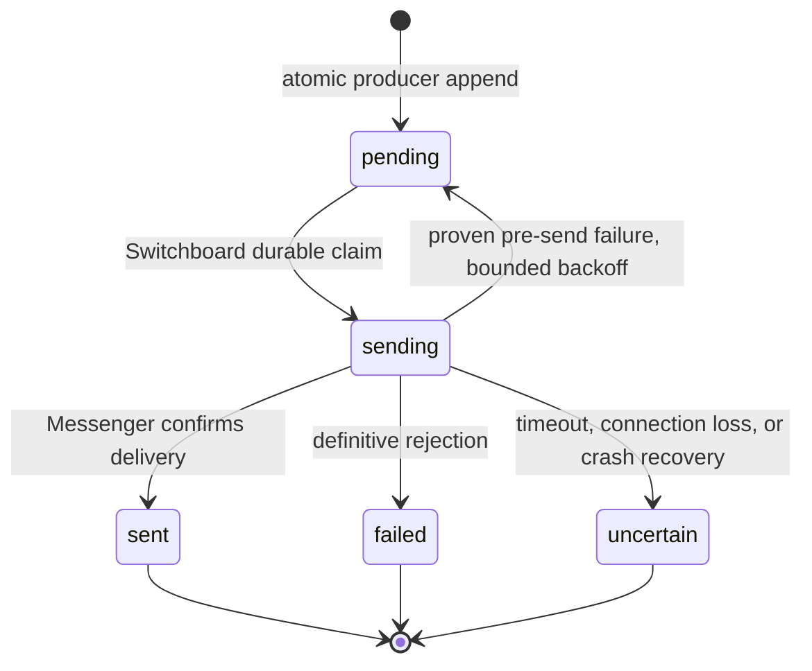

## Context

[Observed] The runtime has one shared `runtime_codex` filesystem volume while
each daemon restored `cli-auth/codex` with local-first credential lookup. A
stale schema-local document could therefore become the last startup writer and
replace the newer public credential. The dashboard used a separate filesystem,
so its direct adapter probe could pass while routed daemon dispatches failed.

[Observed] The breaker is derived from `public.model_dispatch_attempts`, but
the alert path independently checked an audit marker, sent a Telegram message,
then wrote its marker and attention ledger. Concurrent producers could all
pass that check. A Messenger send could also succeed before a routing-log ACL
error caused the caller to regard it as failed and retry.

[Observed] OpenCode Go rejected the provider-qualified catalog IDs involved in
this incident and suggested their bare provider-native IDs. No credential
content was inspected or exposed during diagnosis.

This design must preserve the system's binding boundaries: one authoritative
Tier-1 credential location (security model), deterministic daemon control
logic (Vision Rule 4 and RFC 0001), MCP/Switchboard ownership of inter-butler
delivery (Vision Rule 3 and RFC 0003), and best-effort attention-ledger
observability rather than delivery authority (RFC 0011 Amendment 1).

## Goals / Non-Goals

**Goals:**

- Ensure every CLI-auth restore and rotation uses one explicit shared authority
  in both schema-separated and flat topologies.
- Make a routed dispatch failure atomically create at most one attention
  episode for each closed-to-open breaker transition, including a failed
  half-open probe.
- Give Switchboard sole ownership of external operational-attention delivery,
  while preserving the existing least-privilege runtime roles.
- Favour no duplicate owner page over automatic replay of an ambiguous
  external send, and make the resulting state operable rather than silent.
- Test a catalog entry through the actual daemon runtime environment without
  misrepresenting that probe as a routed breaker recovery.
- Correct known bad OpenCode Go catalog IDs and prevent the same invalid prefix
  from being stored again.

**Non-Goals:**

- Deleting, copying, or revealing existing schema-local credential values.
- Treating a dashboard probe, manual model test, or verification cache update
  as a `model_dispatch_attempts.success` row or as a breaker reset.
- Turning all notifications or all historical direct delivery callers into the
  new outbox in this change. It introduces the reusable facility and migrates
  the two operational-attention producers with the demonstrated unsafe shape:
  model breaker and fleet halt.
- Retrying an ambiguous Telegram/Messenger request automatically, introducing
  a generic queue framework, or adding a new LLM session to send attention.
- Backfilling old open breakers into new alert episodes during rollout. The
  dashboard remains the truthful view of those existing incidents and an
  operator can explicitly issue a new page if needed.

## Decisions

### 1. CLI auth gets an explicit authority channel, not a special fallback order

`CredentialStore` will retain its existing local-first `load()`/`resolve()`
semantics for ordinary Tier-1 credentials. It will additionally expose an
explicit authoritative-system pool and strict read/write methods for
system-global values. In flat topology the authority pool may be the same
object as the local pool; it is still explicit and never treated as absent
because it is not a fallback.

`cli-auth/*` persistence, restore, live Codex reconciliation, dashboard device
auth, and connector startup will exclusively use those strict methods. An
authority lookup failure returns a safe unavailable result and never falls
back to a schema-local `cli-auth/*` row. Local CLI-auth metadata may be read
only to report an ignored-scope conflict without exposing values or token
fingerprints.

This is deliberately narrower than changing all `CredentialStore` resolution.
The security model already says each credential has exactly one authoritative
location; `cli-auth/*` is the system credential class that needs this stronger
form. It fixes the shared-volume overwrite without changing established
per-domain credential resolution.

### 2. Catalog identifiers are runtime/provider-native and probes run at the runtime boundary

`model_catalog.model_id` remains the adapter argument, but validation becomes
runtime-provider specific rather than imposing one global slash convention.
For the configured OpenCode Go profile, `opencode-go/<native-id>` is rejected
and the provider-native `<native-id>` form is persisted and passed to the CLI.
Other OpenCode provider forms are not blindly rewritten.

A guarded data migration changes only known affected OpenCode Go rows. Catalog
create/update validates the known-invalid prefix before persistence. The
catalog test and hourly verification move to a deterministic
Switchboard-owned runtime-probe coordinator that uses the same shared runtime
home, credential authority, adapter construction, model ID, and runtime args
as a normal daemon invocation. The coordinator has no domain MCP tools and
does not write dispatch provenance.

The dashboard calls this internal control-plane RPC and labels the result as a
**runtime probe**. A success updates verification evidence only; it cannot
close a breaker. A failed/absent runtime coordinator is shown as unavailable,
not as a failed model or a successful probe.

### 3. Record qualifying dispatch outcomes and breaker openings atomically

The spawner's qualifying `runtime_failure` and `success` provenance path will
use one core outcome recorder. It takes a transaction-scoped advisory lock per
`catalog_entry_id`, reads the breaker state before the insert, writes the
attempt with a deterministic timestamp/tie-break ordering, and reads the
resulting state before releasing the lock.

When and only when the state changes closed -> open, the same transaction
appends a `runtime-attention-outbox` record keyed by the triggering dispatch
attempt's immutable bigint ID. A concurrent sixth failure sees the already-open
prior state and cannot create another record. A failed half-open probe sees a
closed prior state and creates a new episode; a routed success closes the
derived breaker but does not create an alert.

The breaker remains evidence-derived for routing. The outbox is delivery
episode state, not a second source of truth for whether a model is selectable.
`model_dispatch_attempts` ordering gains a stable `id` tie-breaker so concurrent
transaction timestamps cannot make the transition nondeterministic.

An advisory lock was chosen over a `FOR UPDATE` lock on `model_catalog`: runtime
roles intentionally have no catalog-update authority. A unique audit marker
alone was rejected because it cannot identify the state edge and cannot make
external delivery atomic.

### 4. A durable public attention outbox is append-only for producers and Switchboard-owned for delivery

The core migration creates `public.runtime_attention_outbox` with a stable
episode ID, unique dedup key, source (`model_breaker` or `fleet_halt`),
immutable safe payload, delivery state, timestamps, safe error class/detail,
optional `switchboard.notifications` reference, and optional manual-reissue
lineage. It stores no secret value and no raw credential/error payload.

Runtime roles receive only the narrowly required append permission for rows
they produce; they do not read, claim, alter, or send outbox rows. Switchboard
has the read/update rights required to claim them, and the dashboard's
privileged operator read model exposes sanitized state. This is a public
coordination record analogous to dispatch provenance, not direct inter-butler
data access; the actual delivery crosses the Switchboard/Messenger boundary.

The deterministic Switchboard worker claims rows with `FOR UPDATE SKIP LOCKED`
and transitions them:

The state is committed as `sending` immediately before external transport.
Once external transport may have begun, a network timeout, process death, or
any other ambiguous outcome is terminal `uncertain` and is never replayed
automatically. A worker may return a claimed row to `pending` with bounded
backoff only when it can prove that it did not begin external transport. An
operator may explicitly create one fresh, auditable child episode after viewing
the uncertain state; it does not mutate the original record or reset the
breaker.

This is at-most-once **per episode**, not impossible exactly-once semantics
across Telegram and PostgreSQL. The owner accepted the intentional trade-off:
a rare missing page is safer than another duplicate deluge.

### 5. Delivery result is authoritative before observability bookkeeping

The Switchboard worker invokes the existing Messenger route using the
Switchboard pool. `route()` separates the external result from routing-log,
registry-last-seen, notification-log, audit, and attention-ledger work. Once
Messenger confirms a send, later telemetry errors are caught, logged with the
outbox ID, and cannot turn the response into a failure or trigger a retry.

The attention ledger and audit log are written after a durable outbox terminal
transition as best-effort observations. `uncertain` is represented honestly in
the ledger's existing failure vocabulary with a machine-readable uncertainty
reason; it is not silently marked delivered or deferred. Neither table is used
to deduplicate, claim, or retry delivery.

Fleet halt adopts the same producer and outbox path with its calendar-month
episode key. This removes the sibling audit-marker pattern without widening
the change to unrelated notification flows.

### 6. Operator UX reports independent facts and makes the one manual action deliberate

The Models page keeps verification, routing eligibility, breaker state, and
attention-delivery state visually and semantically distinct:

- a runtime probe reports the exact environment it checked and says explicitly
  that it does not clear an open breaker;
- an open breaker reports that only a subsequent routed success will recover
  routing eligibility;
- a pending/sent/failed/uncertain alert episode is visible with timestamp and
  safe reason;
- only an `uncertain` episode offers one explicit, confirmation-gated **Send a
  new alert** commit action. It is disabled while its request is in flight and
  reports the new episode ID/result immediately.

The existing Dispatch language applies: canonical status indicators, no
invented severity colors, concise operator copy, visible keyboard focus, and
no fake success toast. The Models page remains read-first and control-second;
it does not grow a generic alert administration surface.

## Risks / Trade-offs

- **An at-most-once claim can leave a page unconfirmed after a crash** -> mark
  the episode `uncertain`, expose it to the owner, and require an explicit,
  audited new send rather than guessing.
- **An advisory lock delays a hot failure path** -> lock only one catalog UUID,
  keep the transaction index-bound to the last five qualifying attempts, and
  preserve best-effort provenance behavior when the database itself is down.
- **A shared authority is unavailable at startup** -> fail closed for auth
  restore, log safe authority-unavailable context, and never resurrect stale
  schema-local CLI auth; existing CLI filesystem state is not deleted.
- **A catalog migration changes an intended non-Go OpenCode model** -> migrate
  only the exact configured `opencode-go/` invalid prefix and add a
  migration-test fixture for every changed row; do not normalize other
  provider syntax.
- **New public table grants widen a runtime role** -> producers get append-only
  permissions and cannot inspect other producers' payloads or transition
  state; Switchboard is the only delivery claimant.
- **The dashboard is disconnected from Switchboard during a probe** -> show a
  degraded coordinator state and preserve existing verification evidence rather
  than reporting a false model failure or success.
- **Old application code is rolled back after migration** -> preserve the
  outbox/history and document that a rollback to the legacy direct-alert binary
  reintroduces its historical duplicate risk; prefer forward remediation over
  deleting evidence or schema.

## Migration Plan

1. Add the core outbox table, constraints, indexes, targeted grants, and
   guarded OpenCode Go ID data migration. Do not delete local CLI-auth rows,
   historical dispatch attempts, notifications, audit markers, or ledger rows.
2. Deploy authority-aware credential code. Every daemon and connector restores
   only from the public/shared authority; repeated writers to a shared volume
   now write the same canonical document atomically.
3. Deploy the atomic outcome recorder and Switchboard worker. New breaker
   episodes use the outbox immediately; existing open breaker history is not
   backfilled or re-paged.
4. Move fleet halt to the outbox and split post-send delivery success from
   bookkeeping failures. Add safe transition logs, metrics, and Models API/UI
   state before enabling manual reissue.
5. Replace dashboard-local model verification with the Switchboard runtime
   probe, then validate recovery with a real routed session rather than
   treating the probe as a reset.

Rollback stops new producers/workers before removing consumers and leaves
outbox rows readable for operator diagnosis. It never deletes evidence or
secret rows. A migration downgrade is limited to the new table/grants only
when no deployed consumer depends on it; otherwise forward remediation is the
safe rollback path.

## Open Questions

None. The documented at-most-once policy is the explicit owner decision for
ambiguous transport outcomes.
