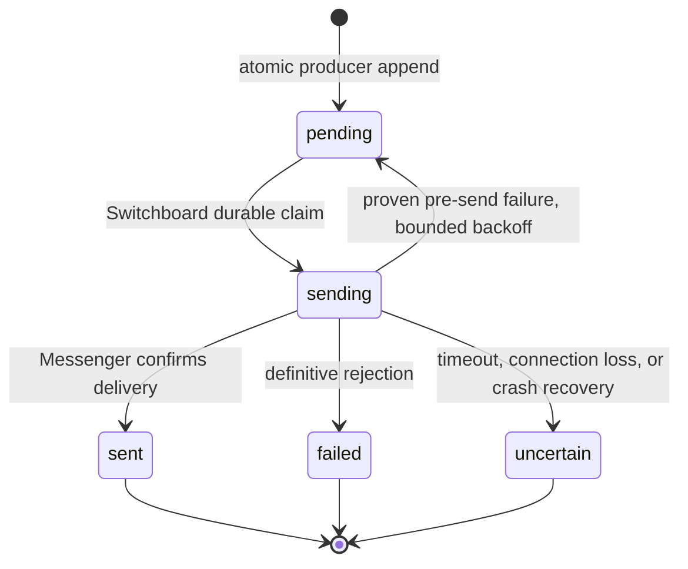

## Context

[Observed] The runtime has one shared `runtime_codex` filesystem volume while
each daemon restored `cli-auth/codex` with local-first credential lookup. A
stale schema-local document could therefore become the last startup writer and
replace the newer public credential. The dashboard used a separate filesystem,
so its direct adapter probe could pass while routed daemon dispatches failed.

[Observed] The breaker is derived from `public.model_dispatch_attempts`, but
the alert path independently checked an audit marker, sent a Telegram message,
then wrote its marker and attention ledger. Concurrent producers could all
pass that check. A Messenger send could also succeed before a routing-log ACL
error caused the caller to regard it as failed and retry.

[Observed] daemon OpenCode invocations rejected the provider-qualified catalog
IDs involved in this incident and suggested bare provider-native IDs, while the
catalog, pricing, spend rules, history, and provider discovery use those
provider-qualified IDs as canonical identity. No credential content was
inspected or exposed during diagnosis.

This design must preserve the system's binding boundaries: one authoritative
Tier-1 credential location (security model), deterministic daemon control
logic (Vision Rule 4 and RFC 0001), MCP/Switchboard ownership of inter-butler
delivery (Vision Rule 3 and RFC 0003), and best-effort attention-ledger
observability rather than delivery authority (RFC 0011 Amendment 1).

## Goals / Non-Goals

**Goals:**

- Ensure every Codex CLI-auth restore and rotation uses one explicit shared
  authority in both schema-separated and flat topologies.
- Make a routed dispatch failure atomically create at most one attention
  episode for each closed-to-open breaker transition, including a failed
  half-open probe.
- Give Switchboard sole ownership of external operational-attention delivery,
  while preserving the existing least-privilege runtime roles.
- Favour no duplicate owner page over automatic replay of an ambiguous
  external send, and make the resulting state operable rather than silent.
- Test a catalog entry through the actual daemon runtime environment without
  misrepresenting that probe as a routed breaker recovery.
- Preserve canonical OpenCode Go catalog identity while translating it to the
  provider-native CLI argument at the one execution boundary that requires it.

**Non-Goals:**

- Deleting, copying, or revealing existing schema-local credential values.
- Treating a dashboard probe, manual model test, or verification cache update
  as a `model_dispatch_attempts.success` row or as a breaker reset.
- Turning all notifications or all historical direct-delivery callers into the
  new outbox in this change. It introduces the reusable facility and migrates
  only the two operational-attention producers with the demonstrated unsafe
  shape: model breaker and fleet halt.
- Retrying an ambiguous Telegram/Messenger request automatically, introducing
  a generic queue framework, or adding a new LLM session to send attention.
- Backfilling old open breakers into new alert episodes during rollout. The
  dashboard remains the truthful view of those existing incidents and an
  operator can explicitly issue a new page if needed.

## Decisions

### 1. CLI auth gets an explicit authority channel, not a special fallback order

`CredentialStore` will retain its existing local-first `load()`/`resolve()`
semantics for ordinary Tier-1 credentials. It will additionally expose an
explicit authoritative-system pool and strict read/write methods for
system-global values. In flat topology the authority pool may be the same
object as the local pool; it is still explicit and never treated as absent
because it is not a fallback.

`cli-auth/codex` persistence, restore, live Codex reconciliation, dashboard
device auth, Codex runtime probes, and Codex-dependent connector startup will
exclusively use those strict methods. An authority lookup failure returns a safe
unavailable result and never falls back to a schema-local `cli-auth/codex` row.
Local Codex CLI-auth metadata may be read only to report an ignored-scope
conflict without exposing values or token fingerprints. Existing persistence
and authority behavior for other CLI providers, including OpenCode, remains
unchanged in this change.

This is deliberately narrower than changing all `CredentialStore` resolution.
The security model already says each credential has exactly one authoritative
location; `cli-auth/codex` is the demonstrated shared-runtime system credential
that needs this stronger form. It fixes the shared-volume overwrite without
changing established per-domain or other-provider credential resolution.

### 2. Catalog identity is canonical; provider-native OpenCode syntax is an execution-boundary concern

`model_catalog.model_id` remains the canonical provider-qualified identity
used by catalog discovery, pricing, spend rules, token-ledger history, and
routing. In particular, `opencode-go/<native-id>` remains persisted and is not
migrated to a bare ID. No catalog API, migration, or historical-record rewrite
may silently strip that provider namespace.

`OpenCodeAdapter` owns a named, pure canonical-to-execution translation. When
the resolved canonical OpenCode model begins `opencode-go/`, it invokes the
configured CLI with the suffix `<native-id>` after `--model`; it retains the
canonical value for all caller-visible provenance, pricing, spend, and history.
Other qualified providers and unrelated runtimes pass their model identifiers
unchanged. Existing bare values, if any, retain their existing execution
behavior rather than being broadly normalized.

The catalog test and hourly verification move to a deterministic
Switchboard-owned runtime-probe coordinator that uses the same shared runtime
home, applicable credential authority, adapter construction,
canonical-to-execution mapping, generated OpenCode configuration, and runtime
args as a normal daemon invocation. The separate OpenCode CLI-auth health check
uses the same pure execution mapper but remains an auth-specific check: it does
not create catalog verification or routed dispatch provenance. The coordinator
has no domain MCP tools and does not write dispatch provenance.

The dashboard calls a private authenticated control-plane command, not a
generic Switchboard MCP tool. It is absent from model-visible tool discovery
and accepts only a catalog entry ID: no credential material, model override,
runtime arguments, or arbitrary prompt crosses from the dashboard. The
dashboard API enforces owner authorization; the control command enforces a
bounded timeout, per-entry de-duplication, and a small global concurrency cap.
A success is labelled **runtime probe**, updates verification evidence only,
and cannot close a breaker. A failed, rate-limited, or absent coordinator is
shown as unavailable/degraded, not as a failed model or a successful probe.

### 3. Record qualifying dispatch outcomes and breaker openings atomically

The spawner's qualifying `runtime_failure` and `success` provenance path will
use one core outcome recorder. It takes a transaction-scoped advisory lock per
`catalog_entry_id`, reads the breaker state before the insert, writes the
attempt with a deterministic timestamp/tie-break ordering, and reads the
resulting state before releasing the lock.

When and only when the state changes closed -> open, the same transaction
appends a `runtime-attention-outbox` record keyed by the triggering dispatch
attempt's immutable bigint ID. A concurrent sixth failure sees the already-open
prior state and cannot create another record. If multiple independently
resolved half-open probes fail concurrently, the serialized first reopening
creates exactly one new episode and every later failure sees the reopened state.
A routed success closes the derived breaker but does not create an alert.

The breaker remains evidence-derived for routing. The outbox is delivery
episode state, not a second source of truth for whether a model is selectable.
`model_dispatch_attempts` ordering gains a stable `id` tie-breaker so concurrent
transaction timestamps cannot make the transition nondeterministic.

An advisory lock was chosen over a `FOR UPDATE` lock on `model_catalog`: runtime
roles intentionally have no catalog-update authority. A unique audit marker
alone was rejected because it cannot identify the state edge and cannot make
external delivery atomic. If the outcome-and-outbox transaction cannot commit,
the spawner preserves the original dispatch failure and normal failover posture,
does not make a direct external delivery attempt, writes neither partial outcome
nor episode, and emits safe degraded-provenance evidence for an operator.

### 4. A durable public attention outbox is append-only for producers and Switchboard-owned for delivery

The core migration creates `public.runtime_attention_outbox` with a stable
episode ID, unique triggering-edge key, source (`model_breaker` or
`fleet_halt`), immutable safe payload, delivery state, timestamps, safe error
class/detail, optional `switchboard.notifications` reference, optional
manual-reissue lineage, and a fenced delivery claim (`claim_token`, monotonic
claim epoch, claimer instance, and claim timestamp). It stores no secret value
and no raw credential/error payload. Partial unique constraints cover each
`model_breaker` triggering dispatch-attempt ID and each `fleet_halt`
calendar-month breach key; another partial unique constraint on
`manual_reissue_of` permits at most one direct successor per original episode.
An atomic `INSERT ... ON CONFLICT` operation returns that same successor to
concurrent requests.

Producers receive no raw outbox `INSERT` privilege. A narrow fixed-search-path
`SECURITY DEFINER` core producer operation is the only append path: it derives
the deduplication key and safe payload from the just-recorded dispatch attempt
or verified fleet-halt evidence, checks the calling runtime role against that
evidence, and establishes the state edge and episode in one transaction. It
accepts no caller-controlled delivery state, recipient, payload, or arbitrary
deduplication key. Switchboard alone receives row read/update authority.

The outbox retains an immutable source snapshot and is deliberately not deleted
through `model_catalog` or `model_dispatch_attempts` cascades. A catalog entry
or its dispatch attempts may later be removed under existing policy, while the
episode retains its original attempt/edge identifier and sanitized model/alias
snapshot for operator/audit retention.

Runtime roles receive only permission to invoke the narrowly scoped producer
operation for rows they produce; they do not read, insert directly, claim,
alter, or send outbox rows. Switchboard has the read/update rights required to
claim them, and the dashboard's privileged operator read model exposes
sanitized state. This is a public coordination record analogous to dispatch
provenance, not direct inter-butler data access; the actual delivery crosses the
Switchboard/Messenger boundary.

The deterministic Switchboard worker first owns one Switchboard delivery-service
lease, then claims rows with `FOR UPDATE SKIP LOCKED`, records a fresh fenced
claim token/epoch, and transitions them:

The state and claim are committed as `sending` immediately before external
transport. The worker verifies its delivery-service lease and claim token
immediately before invoking transport; every pending, sent, failed, or
uncertain transition is conditional on that same token. A recovery worker never
reclaims a `sending` row for another send. Only after it owns the delivery
service lease and fences the prior claim may it transition an orphaned sending
row to `uncertain`; a still-live claimant prevents that recovery and reissue
remains unavailable while the row is `sending`.

Once external transport may have begun, a network timeout, process death, or
any other ambiguous outcome is terminal `uncertain` and is never replayed
automatically. A worker may return a claimed row to `pending` with bounded
backoff only when it can prove that it did not begin external transport. A
fenced stale worker must not invoke transport or mutate state. An operator may
explicitly create one fresh, auditable child episode after viewing the uncertain
state; it does not mutate the original record or reset the breaker. Such a
manual child is deliberately a new owner-visible attempt: `uncertain` remains
honest that the original may have been delivered or may still have been in
flight when its claimant died.

This is at-most-once **per episode**, not impossible exactly-once semantics
across Telegram and PostgreSQL. The owner accepted the intentional trade-off:
a rare missing page is safer than another duplicate deluge.

### 5. Delivery result is authoritative before observability bookkeeping

The Switchboard worker invokes the existing Messenger route using the
Switchboard pool. `route()` separates the external result from routing-log,
registry-last-seen, notification-log, audit, and attention-ledger work. Once
Messenger confirms a send, later telemetry errors are caught, logged with the
outbox ID, and cannot turn the response into a failure or trigger a retry.

The attention ledger and audit log are written after a durable outbox terminal
transition as best-effort observations. `uncertain` is represented honestly in
the ledger's existing failure vocabulary with a machine-readable uncertainty
reason; it is not silently marked delivered or deferred. Neither table is used
to deduplicate, claim, or retry delivery.

Fleet halt adopts the same producer and outbox path with its calendar-month
episode key. This removes the sibling audit-marker pattern without widening
the change to unrelated notification flows.

### 6. Operator UX reports independent facts and makes the one manual action deliberate

The Models page keeps verification, routing eligibility, breaker state, and
attention-delivery state visually and semantically distinct:

- a runtime probe reports the exact environment it checked and says explicitly
  that it does not clear an open breaker;
- an open breaker reports that only a subsequent routed success will recover
  routing eligibility;
- a pending/sent/failed/uncertain alert episode is visible with timestamp and
  safe reason;
- only an `uncertain` episode offers one explicit, confirmation-gated **Send a
  new alert** commit action. It is disabled while its request is in flight and
  reports the new episode ID/result immediately.

The existing Dispatch language applies: canonical status indicators, no
invented severity colors, concise operator copy, visible keyboard focus, and
no fake success toast. The Models page remains read-first and control-second;
it does not grow a generic alert administration surface.

## Risks / Trade-offs

- **An at-most-once claim can leave a page unconfirmed after a crash** -> mark
  the episode `uncertain`, expose it to the owner, and require an explicit,
  audited new send rather than guessing.
- **An advisory lock delays a hot failure path** -> lock only one catalog UUID,
  keep the transaction index-bound to the last five qualifying attempts, and
  preserve best-effort provenance behavior when the database itself is down.
- **A shared authority is unavailable at startup** -> fail closed for auth
  restore, log safe authority-unavailable context, and never resurrect stale
  schema-local CLI auth; existing CLI filesystem state is not deleted.
- **The CLI's execution syntax diverges from catalog discovery** -> retain the
  canonical provider-qualified catalog key and test the narrow OpenCode adapter
  translation with the exact observed Minimax and Mimo aliases, qualified
  non-Go controls, pricing lookup, and the generated runtime configuration.
- **New public table grants widen a runtime role** -> producers get append-only
  permissions and cannot inspect other producers' payloads or transition
  state; Switchboard is the only delivery claimant.
- **The dashboard is disconnected from Switchboard during a probe** -> show a
  degraded coordinator state and preserve existing verification evidence rather
  than reporting a false model failure or success.
- **Old application code is rolled back after migration** -> preserve the
  outbox/history and document that a rollback to the legacy direct-alert binary
  reintroduces its historical duplicate risk; prefer forward remediation over
  deleting evidence or schema.

## Migration Plan

1. Add the core outbox table, claim/reissue constraints, indexes, and targeted
   grants. Do not delete local CLI-auth rows, historical dispatch attempts,
   notifications, audit markers, or ledger rows; do not rewrite catalog model
   identifiers or pricing/history identity.
2. Deploy authority-aware Codex credential code. Every Codex daemon and
   connector restores only from the public/shared Codex authority; repeated
   writers to a shared volume now write the same canonical document atomically.
3. Deploy the atomic outcome recorder and Switchboard worker. New breaker
   episodes use the outbox immediately; existing open breaker history is not
   backfilled or re-paged.
4. Move fleet halt to the outbox and split post-send delivery success from
   bookkeeping failures. Add safe transition logs, metrics, and Models API/UI
   state before enabling manual reissue.
5. Replace dashboard-local model verification with the Switchboard runtime
   probe, using the same canonical-to-execution OpenCode mapping as daemon
   dispatch, then validate recovery with a real routed session rather than
   treating the probe as a reset.

Rollback stops new producers/workers before removing consumers and leaves
outbox rows readable for operator diagnosis. It never deletes evidence or
secret rows. A migration downgrade is limited to the new table/grants only
when no deployed consumer depends on it; otherwise forward remediation is the
safe rollback path.

## Open Questions

None. The documented at-most-once policy is the explicit owner decision for
ambiguous transport outcomes.
